# [dbt™ (Data Build Tool) ](https://www.getdbt.com/)
---

1. [Introduction](#introduction)  
2. [Modern data Stack in the AI Era](modern-data-stack-in-the-ai-era)  
3. [slowly changing dimensions SCD]()  
4. [dbt™ Overview]()
5. [PROJECT OVERVIEW (Analytics Engineering with Airbnb)]()
   1. [resources]()
   2. [snowflake]()
   3. [dbt setup]()
   4. [VSC extension]() : `vscode-dbt-power-user`

---
### Introduction

OBJECTIVES  
* Data-maturity model
* dbt and data architectures
* Data warehouses, data lakes, and lakehouses
* ETL and ELT procedures
* dbt fundamentals
* Analytics Engineering
  


**ETL**
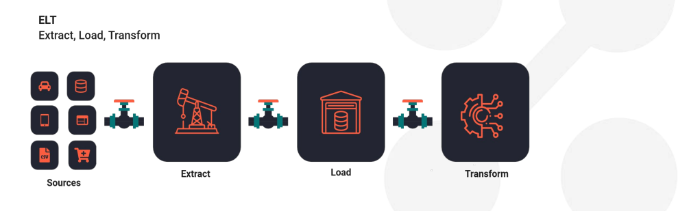

**ELT**
So the world has changed, as you know, of storage costs like two cents these days for every one GB of data. So it was logical to reorganize the traditional ETL workflow.
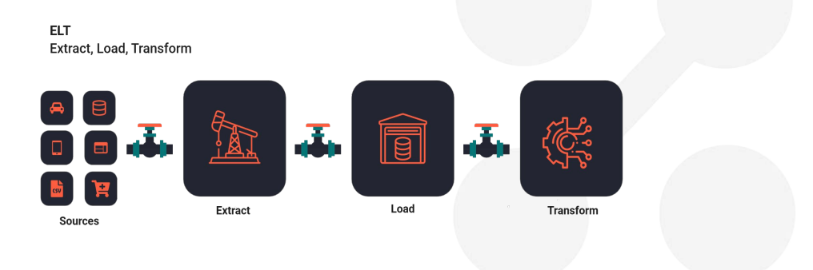
Data warehouses like Snowflake Redshift and BigQuery are extremely scalable and performant, so it makes sense to do two transformations inside the database rather than external processing layer.

**Data Warehouse**
storing structured data
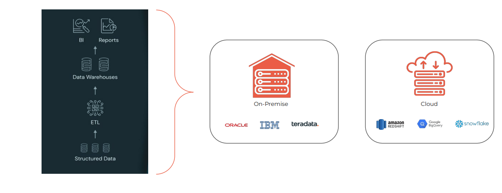
Typically, you interact with the data warehouse by executing SQL against it. So data warehouses is nothing more than a performance engine that lets us do analytics workloads on our data using sequel. 

**External Tables**
First of all, you pay for the compute nodes, whether they are used or they are not used. And we are not talking about lethal amounts here. In case you have large datasets, that's very pricey. Even if you're a data warehouse. Storage is underutilized as you have small amounts of data, but it requires high analytical workloads.

Second, you can set up auto scaling, but it does that does not necessarily mean you can scale to meet your peak workloads.

There is this concept called external tables.
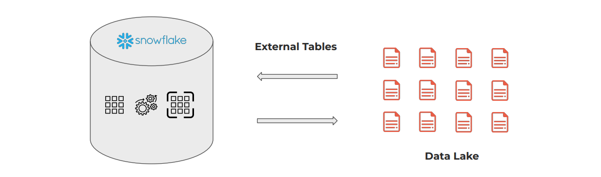
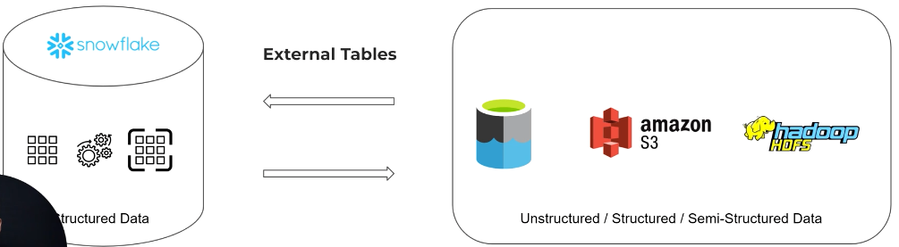
We have the option to store large files outside of the data warehouse in, for example, Amazon S3 or blob storage. So we can decouple the compute component from the storage component. At this point, we can scale the compute and the storage independently from the data that warehousing the istances.

So now we handle the storage and compute for structured data, but what do we do in case we have unstructured data like images and video videos or text files? Data Lake.

**Data Lake**
unstructured or send structured
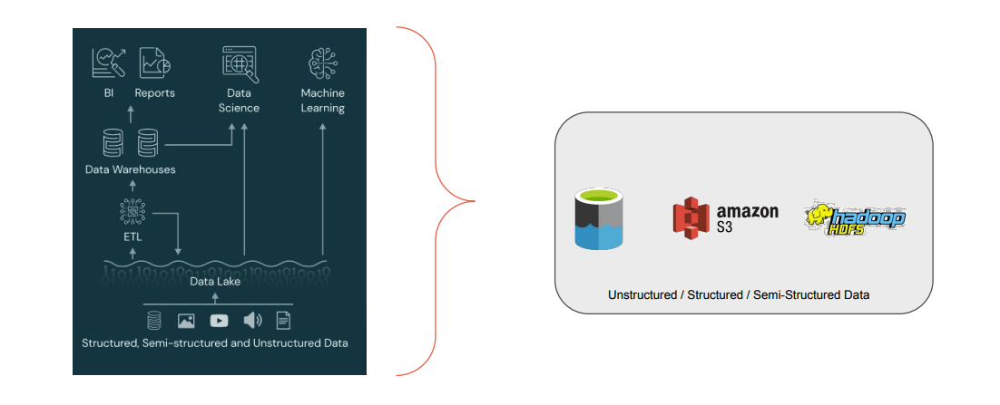
You can think of a data lake as a repository where you can put all kinds of data ranging from Rome cleanest, unstructured, semi-structured and so on. It is like a very scalable fire system on premise, this will be called GFS or Hadoop distributed file system, but for cloud. There are others like Amazon S3 or Asia. Is your data lake storage Gen2 a.k.a. address to. 

The point of the data lake is to store files so they have no computer integrated. This means that if you're analytical, workloads increase. You can scale your compute instances independently from storage and your cloud provider will take care of handling external tables itself. If you use `Databricks` or `Snowflake`, these providers will store your data in the data lake by default. And they will only provide you with analytical clusters that you can set up the way you want.

**Data Lakehouse**

Emerged due to the limitations of data lakes. 
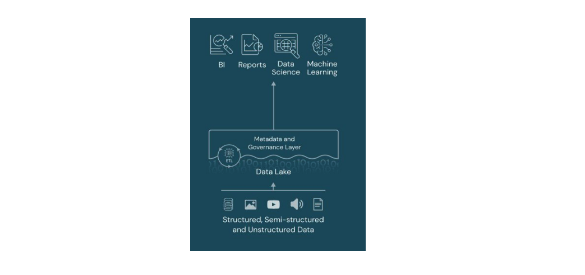
It essentially combines the best features of data lakes and data warehouses. In the case of a lake house, we have very similar data structure and data management features that we have in our data warehouse. However, it sits on top of a low cost cloud storage.  What's great in a lake houses is the cost efficient storage provided by your cloud provider. Also, the acid transactional support so you can ensure consistency and that the scheme of the data is stored in a Lake House metal store. Additionally, you can evolve the schema of your tables without having to make a copy of the dataset. As for governance, you can control and authorize access to your data, and we'll get an interface with which you can connect to visitors to the Lake House. 

**ETL process**
The transformations and normalization typically happened in the staging area before the load of the application of the data or the cleansing of the data were performed. As storage prices were high.
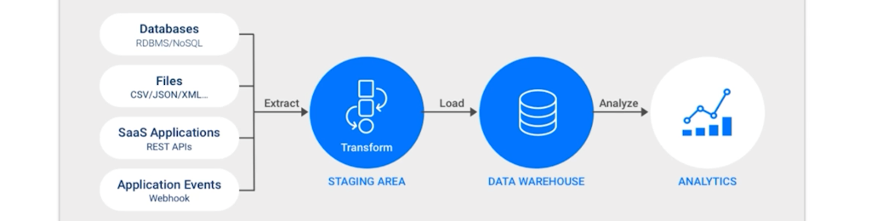


**ELT process**
We are now able to shift away from the ETL, extract, transform load data integration, transition of processes to extract loads, transform for easy,
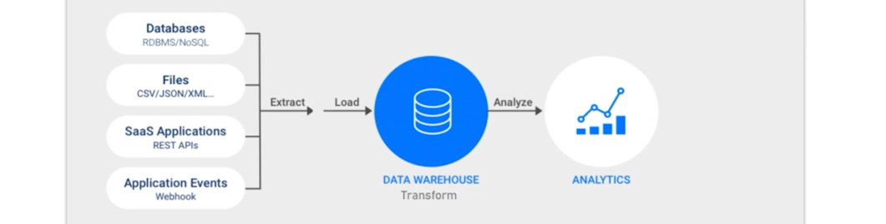

### Modern data Stack in the AI Era
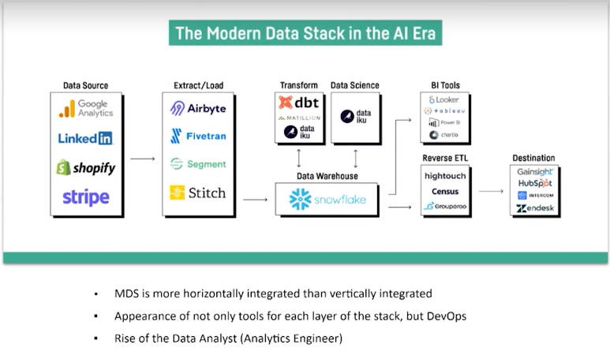
Fivetran and Stitch are one of the most popular extracts and those tools that we have available today. The transformation layer sits on top of a cloud data warehouse and it uses DVT. You have Looker as a BI tool, for example, and sensors for reverse ETL. 

Now, the modern data stack is structured differently than traditional legacy tools. For example, in a traditional data stack, your BI tool would not only handle visualizations but also act as a data warehouse with integrated storage. So, you would have done everything within your BI tool. These tools were massive and complicated. They were vertically integrated since they included storage within the data warehouse, and you performed visualizations in them as well. However, the modern data stack really flattens this out. It is a horizontally integrated set of tools that are fully managed, cloud-based, and both cheap and easy to use. Because corporations realize that data is a product in itself, we now see that DevOps tools are evolving. Not just tools but also practices are becoming part of this modern data stack space and are gaining a lot of popularity. Today, we perform data engineering and analytics engineering, which follow software engineering and DevOps best practices.

The modern data stack is essentially the productionization of the different layers of the data integration flow. DBT (Data Build Tool) plays a key role in this by enabling teams to perform data transformations inside the data warehouse. The creators of DBT developed it as a tool to streamline and standardize the transformation process, making it more efficient and integrated within the data workflow.

### slowly changing dimensions SCD

Think of these as particular data, but it changes rarely and unpredictably, requiring a specific approach to handle referential integrity. when data is changing the source database How that change is reflected in the corresponding data warehouse table decides what data is maintained for further accessibility by the business.
In some cases, storing history data might not be worthwhile, as it might have become obsolete or entirely useless. But for some businesses, historic facts might remain relevant in the future. For example, for historical analyses has simply erasing it would cause the loss of valuable data. There are a number of approaches to considering the data management and data warehousing of seeds called the seed types. Some acid types are used more frequently than others, and there is a reason for that. In the following steps, we will walk through SCD type zero to three and look at some benefits and drawbacks.

> **SCD Type 0**: We want to implement it if some detail may not become worthwhile to maintain anymore for the business.The dimension change is only applied to the source stable and is not transferred to the data warehouse stable.
> 
> * For Airbnb, think of a scenario when a property owner changes his specs, no, he was provided to Airbnb when he first joined the platform.
> Back in 2008, when Airbnb launched businesses, they still used tax numbers to some extent as Airbnb gathered these facts numbers of its clients. By 2010's faxing went entirely out of fashion. Hence, there is no point for Airbnb to apply changes to facts data in its data warehouses anymore. In this case, Airbnb will use seed type zero and simply keep updating the facts data column in the data warehouse table.
>

> **SCD Type 1** : In some cases, when a dying engine changes, only the new value could be important. The reason for the change could be that the original data has become obsolete. In this case, we want to make sure that the new value is transferred to the data warehouse. While there is no point in maintaining historical data. In these scenarios, SCD Type 1 will be our choice, which consists of applying the same dimension change to the corresponding record in a data warehouse as the change that was applied to the record in teh sourde table.
> 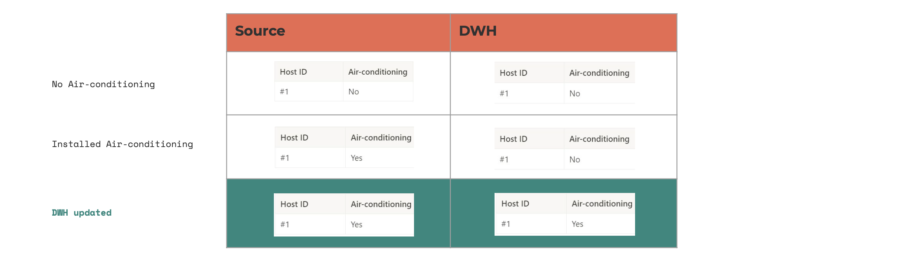
> * When looking for accommodation on Airbnb, you can filter for accommodation with air conditioning, and property owners can provide whether they have air conditioning installed at their place. Now, imagine a situation when a property owner started marketing his flat on Airbnb a while ago, when his flat didn't have air conditioning. But since then he's stalled or decided to install air conditioning at his place to please customers, and therefore he updated his information of its listing to show that his base now has air conditioning installed.
> * For Airbnb, it is no longer relevant that the property did not used to have air conditioning.It only matters that it does now. And so Airbnb will use SCD Type 1 and apply the same data change to their records in the source and the data warehouse staple.

> **SCD Type 2** : There are also situations when both the current and the history data might be important for our business. Besides the current value, history data might also be used for reporting or could be necessary to maintain for future validation. The first approach revealed look at two tackling such a situation is SCD Type 2, when a dimension change leads to an additional rule being added to the data warehouse table four for the new data. But the original or previous data is maintained, so we have a whole overview of what happened. The benefit of actually type two is that all historical historical data is saved after each change, so all historic data remains recoverable from the data warehouse.
> 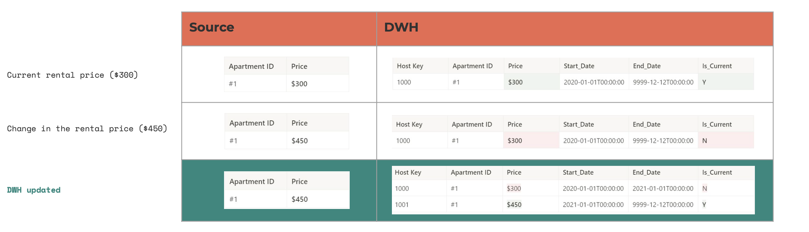
> * Additional columns are added to each, according to data warehouse stable, to indicate the time range of validity of the data and to show whether the record contains the current data.
> * Consider rental pricing data for Airbnb property owners may increase or decrease their rental prices whenever they wish. Airbnb wants to perform detailed analysts on changes in the rental prices to understand the market, and so they must maintain all historical data on rental prices.
> * If a property owner changes the rental price of their flat on Airbnb, Airbnb will store both the current and historic rental price. In this case, using gas, the SCD Type 2 can be a good choice for Airbnb as it will transfer the current data to the data warehouse while also making sure historic data is maintained from SCD Type 2.
> * It becomes less obvious which day to use, so we will have to dive deeper into understanding versus best the purpose of what we are trying to achieve.
> * The benefit of SCD type two is that all historic data is maintained, and that is and that it remains easily accessible. But it also increases the amount of data stored. In cases where the number of records is very high to begin with, using SCD Type 2 might not be viable as it might make processing speed unreasonably high.
 

> **SCD Type 3** : 
> There can be scenarios been keeping some history data sufficient. For example, if processing speed is a concern. In these cases, we can decide to do a trade off between not maintaining or history data for the sake of keeping the number of records in our data warehouse stable lower. 
> In case of silly type three, Collins new set of additional rules are used for recording the dimension changes, this type will not maintain historic values other than the original and the current values. So if a dimension changes or it happens more than once, all in the original and the current values will be recoverable from the date of our house. 
> 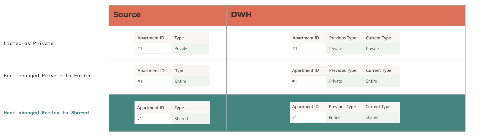
> * When looking for accommodation on Airbnb, you can choose between three different types of places: shared rooms, private rooms, and entire places. Now, imagine a property owner started renting a room as a private room. Let's say, some years later, they decide to move out and market their flat as an entire place. Airbnb may want to analyze how properties have had their type changed since joining the platform, but they don't really care about changes that are no longer valid. So, let's say this person who now rents out their entire place decides to move back and lease it as a shared room.
> * In this case, Airbnb no longer keeps the history of the private room, the way the place was listed originally. They only care about the room type that came right before the current one. So, in this case, you care about the fact that the entire place was listed. Therefore, Airbnb can decide to use SCD Type 3, adding additional columns to the data warehouse table to store both the original and the current type of the property. The benefit of Type 3 is that it keeps the number of records lower in the data warehouse table, which allows for more efficient processing.
> * On the other hand, it does not allow for maintaining all historical data and can make the data more difficult to comprehend, as it has to be specified which column contains the original and the current value.

### dbt™ Overview

In short **dbt** is the `T` in

**dbt** doesn't or extract like [fivetran](https://www.fivetran.com/pricing) or [Stitch](https://www.stitchdata.com/), but it transforms data that's loaded in the data warehouse with SQL, select statements.

Let's say we are in a dark room, and your goal is to see what's happening in that room. On the one hand, you can light a candle, but it won't provide enough light to see the entire room. If there are others in the room with you, it will be rather hard for them to see. Once the candle burns out, you are back in the dark. This is a bit like executing a SQL statement: once it's done, it's done.

On the other hand, we now have the possibility to use something much stronger than a candle, like a spotlight, a softbox, or reflectors. These provide more than enough light to illuminate the entire room, allowing everyone to see what's going on. With this powerful lighting, we won't miss a single detail. We will have absolute visibility over every single corner. A spotlight is portable and can easily be moved or carried, and others can use it as well. Multiple people can work simultaneously in a fully illuminated room.

This is the kind of difference I personally feel when working on a **dbt** project. Using **dbt** is like using a spotlight: once you start using it, you'll think, "Wow, how did I not use this before?" DBT allows you to deploy your analytics while following software engineering best practices such as `modularity, portability, CI/CD testing, and documentation`.
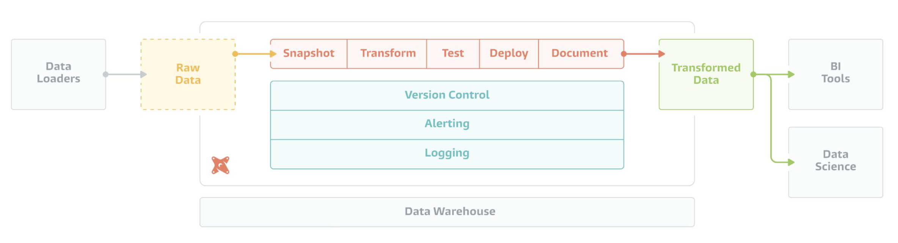
To bring it home: With DBT, you will build production-grade data pipelines. What makes it great is that you write your code, compile it to SQL, and execute your data transformations on Snowflake or another data warehouse. Your transformations are version-controlled, easily tested, and, on top of that, you are equipped with automatically built DAGs (Directed Acyclic Graphs) of all your models in your DBT project.

Since DBT interpolates the locations of all the models it generates, it allows you to create different environments like development or production, and you can effortlessly switch between the two. In terms of performance, DBT will take your models (i.e., SQL SELECT statements), understand the dependencies between them, craft a dependency order, and parallelize the way your models are built. And it will run arbitrary subgraph.

## PROJECT OVERVIEW (Analytics Engineering with Airbnb)

You will act as if you were an analytics engineer at Airbnb. You’re responsible for all the data flow in Berlin, Germany. This role comes with a lot of responsibilities, so you will need to import your data into a data warehouse and then make this data available for tools like DBT. Then, you will need to clean the data, perform several transformations on it, and export it to BI tools. 

* Simulating the life of an Analytics Engineer in Airbnb. 
* Loading, Cleansing, Exposing data
* Writing test, automations and documentation
* Data source: Inside Airbnb: Berlin

The data we work with here is reliable data, and the data itself comes from the [Inside Airbnb page](https://insideairbnb.com/berlin/)

**Tech Stack**

* [dbt](https://www.getdbt.com/)
* [snowflake](https://www.snowflake.com/en/data-cloud/pricing-options/)
* [preset](https://preset.io/pricing/)

As you start as an analytics engineer in a company, there are several requirements you need to take care of:

**requirements**
>* Modeling changes are easy to follow and revert
>* Explicit dependencies between models
>* Explore dependencies between models
>* Data quality tests
>* Error reporting
>* Incremental load of fact tables
>* Track history of dimension tables
>* Easy-to-access documentation

You want to work in a system where monitoring changes are easy to follow and easy to revert.

* If you can make your model code, it helps a lot because you can version control it. You can track all the changes, collaborate, and revert if needed.
* As you have many steps in your data pipeline, with many views and features feeding and depending on each other, you want to ensure that these dependencies are explicit.
* The framework should know the order in which to execute different steps in your pipeline to achieve a well-transformed result and a good dataset ready for analytics.

Additionally, you want to ensure that these dependencies are not only explicit but also easy to overview.

* It should be easy to explore and understand these dependencies.
* When you build your pipeline, the tool should be able to expose these dependencies in an accessible way.

You also need to make sure that when your pipeline is running, you can test for data quality.

* Ensure your pipeline works as expected.
* If there are any errors, you want to get alerted somehow.

These are probably the basic requirements. As you progress in building out your business logic, you will have a few extra requirements.

* For example, you will have tables that are incremental. New events might come in, and you don't want to rebuild the entire dataset but only add new records at the end of the table.
* In some cases, you want to manage slowly changing dimensions, keeping the history of any changes so you can go back in time.

These are some of the main requirements of a data analytics tool, and DBT is great for managing these.
 
### resources

* [single markdown file](https://github.com/nordquant/complete-dbt-bootcamp-zero-to-hero/blob/main/_course_resources/course-resources.md)
* [dbt project's GitHub page](https://github.com/nordquant/complete-dbt-bootcamp-zero-to-hero)


### snowflake 👉🏻 [link](https://signup.snowflake.com/?utm_cta=trial-en-www-homepage-top-right-nav-ss-evg&_ga=2.74406678.547897382.1657561304-1006975775.1656432605&_gac=1.254279162.1656541671.Cj0KCQjw8O-VBhCpARIsACMvVLPE7vSFoPt6gqlowxPDlHT6waZ2_Kd3-4926XLVs0QvlzvTvIKg7pgaAqd2EALw_wcB)

* SnoeFow edition : Standard
* Provider : AWS Web Service
* Place : Ohio

Send you a link: https://boryss-qp53113.snowflakecomputing.com/console/login?activationToken=

Here we are at the Snowflake master user registration page. You see, this is the one which is some random string and the US is to dot IWC. `borysxs-qp53113.`

**Set up dbt's permissions in Snowflake and import our datasets**

Snowflake :
* `+ create : SQL WorkSheet`

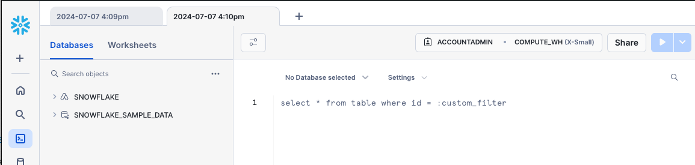

#### Snowflake user creation

Copy these SQL statements into a Snowflake Worksheet, select all and execute them (i.e. pressing the play button).

If you see a Grant partially executed: privileges [REFERENCE_USAGE] not granted. message when you execute GRANT ALL ON DATABASE AIRBNB to ROLE transform, that's just an info message and you can ignore it.


```SQL
-- Use an admin role
USE ROLE ACCOUNTADMIN;

-- Create the `transform` role
CREATE ROLE IF NOT EXISTS TRANSFORM;
GRANT ROLE TRANSFORM TO ROLE ACCOUNTADMIN;

-- Create the default warehouse if necessary
CREATE WAREHOUSE IF NOT EXISTS COMPUTE_WH;
GRANT OPERATE ON WAREHOUSE COMPUTE_WH TO ROLE TRANSFORM;

-- Create the `dbt` user and assign to role
CREATE USER IF NOT EXISTS dbt
  PASSWORD='dbtPassword123'
  LOGIN_NAME='dbt'
  MUST_CHANGE_PASSWORD=FALSE
  DEFAULT_WAREHOUSE='COMPUTE_WH'
  DEFAULT_ROLE=TRANSFORM
  DEFAULT_NAMESPACE='AIRBNB.RAW'
  COMMENT='DBT user used for data transformation';
GRANT ROLE TRANSFORM to USER dbt;

-- Create our database and schemas
CREATE DATABASE IF NOT EXISTS AIRBNB;
CREATE SCHEMA IF NOT EXISTS AIRBNB.RAW;

-- Set up permissions to role `transform`
GRANT ALL ON WAREHOUSE COMPUTE_WH TO ROLE TRANSFORM; 
GRANT ALL ON DATABASE AIRBNB to ROLE TRANSFORM;
GRANT ALL ON ALL SCHEMAS IN DATABASE AIRBNB to ROLE TRANSFORM;
GRANT ALL ON FUTURE SCHEMAS IN DATABASE AIRBNB to ROLE TRANSFORM;
GRANT ALL ON ALL TABLES IN SCHEMA AIRBNB.RAW to ROLE TRANSFORM;
GRANT ALL ON FUTURE TABLES IN SCHEMA AIRBNB.RAW to ROLE TRANSFORM;
```

Select all and press the play button or pest control, enter.

#### Snowflake data import

Copy these SQL statements into a Snowflake Worksheet, select all and execute them (i.e. pressing the play button).


```SQL
-- Set up the defaults
USE WAREHOUSE COMPUTE_WH;
USE DATABASE airbnb;
USE SCHEMA RAW;

-- Create our three tables and import the data from S3
CREATE OR REPLACE TABLE raw_listings
                    (id integer,
                     listing_url string,
                     name string,
                     room_type string,
                     minimum_nights integer,
                     host_id integer,
                     price string,
                     created_at datetime,
                     updated_at datetime);
                    
COPY INTO raw_listings (id,
                        listing_url,
                        name,
                        room_type,
                        minimum_nights,
                        host_id,
                        price,
                        created_at,
                        updated_at)
                   from 's3://dbtlearn/listings.csv'
                    FILE_FORMAT = (type = 'CSV' skip_header = 1
                    FIELD_OPTIONALLY_ENCLOSED_BY = '"');
                    

CREATE OR REPLACE TABLE raw_reviews
                    (listing_id integer,
                     date datetime,
                     reviewer_name string,
                     comments string,
                     sentiment string);
                    
COPY INTO raw_reviews (listing_id, date, reviewer_name, comments, sentiment)
                   from 's3://dbtlearn/reviews.csv'
                    FILE_FORMAT = (type = 'CSV' skip_header = 1
                    FIELD_OPTIONALLY_ENCLOSED_BY = '"');
                    

CREATE OR REPLACE TABLE raw_hosts
                    (id integer,
                     name string,
                     is_superhost string,
                     created_at datetime,
                     updated_at datetime);
                    
COPY INTO raw_hosts (id, name, is_superhost, created_at, updated_at)
                   from 's3://dbtlearn/hosts.csv'
                    FILE_FORMAT = (type = 'CSV' skip_header = 1
                    FIELD_OPTIONALLY_ENCLOSED_BY = '"');
```

this is a public bucket on a street `from 's3://dbtlearn/listings.csv'` from Airbnb and modified a little bit.

Refesh the page:

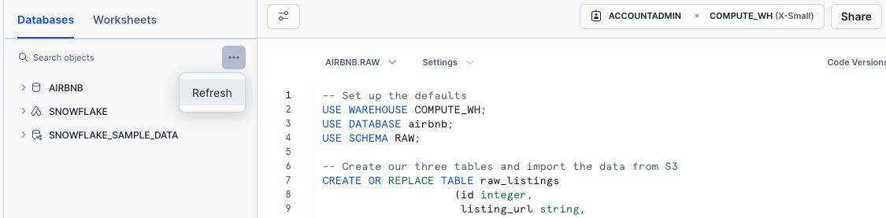

And you ca see the news tables. Database and be in a schema called RAW

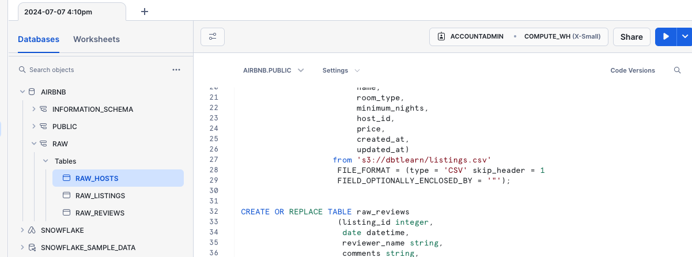

**Setup instructions and Prerequisites**

* PYTHON VERSION : At the time (May 2023), dbt is compatible with Python 3.7, 3.8, 3.9, 3.10, and 3.11, but the supported Python version depends both on the dbt version and on the dbt-snowflake version you install. So make sure to install Python 3.11. DO NOT USE Python 3.12 as dbt doesn't support it.

* GIT : Git needs to be installed on your computer to avoid a (harmless) error message. 

* COPY-PASTING THE SNOWFLAKE PASSWORD : When you set up your dbt project, and it asks for your Snowflake password, type in the password instead of copy-pasting it.

* CREATE YOUR DBT FOLDER MANUALLY (DO THIS OTHERWISE DBT WILL FAIL TO CREATE A NEW PROJECT)

  * Windows: 
    * Make sure to execute mkdir %userprofile%\.dbt in a cmd window to ensure you can create a dbt project (you are instructed to do this in the dbt setup lecture). 
    * If you already have Python, pip, and virtualenv installed, feel free to create a folder for the course (I'm using Desktop/course), create a virtualenv called venv and skip the following two videos about Python setup and Virtualenv.   
  * Mac users: 
    * If you are on a Mac and you don't have a working Python 3.11 installation, we suggest that you install it through brew install `python@3.11 virtualenv`. We have added an optional video to cover the Mac Python installation process.
    * Make sure to execute `mkdir ~/.dbt` in a terminal now to ensure you can create a dbt project as the course progresses (you are instructed to do this in the dbt setup lecture).
  * Linux users:
    * If you use Linux, install a Python 3.11 virtualenv (like apt install python3.11-venv on Ubuntu) and follow the Mac instructions.
  * Using dbt Cloud
    * Currently, we can't support dbt Cloud-based setups. So feel free to give dbt Cloud a shot, but remember that we can only provide you with limited support. Any feedback about your dbt Cloud course experience is very welcome!

```sh
➜  DataEngineer_dbt_Bootcamp git:(main) ✗ python3 --version
Python 3.11.6
➜  DataEngineer_dbt_Bootcamp git:(main) ✗ python3 -m venv dbt_env
➜  DataEngineer_dbt_Bootcamp git:(main) ✗ source dbt_env/bin/activate
(dbt_env) ➜  DataEngineer_dbt_Bootcamp git:(main) ✗ 
(dbt_env) ➜  DataEngineer_dbt_Bootcamp git:(main) ✗ pip install dbt-snowflake==1.7.1
```

### dbt setup

First, you will need to create a DBT configuration folder. The idea is that you got to have a dot DB folder in your home folder.


You have the information here:


```sql
-- Create the `dbt` user and assign to role
CREATE USER IF NOT EXISTS dbt
  PASSWORD='dbtPassword123'
  LOGIN_NAME='dbt'
  MUST_CHANGE_PASSWORD=FALSE
  DEFAULT_WAREHOUSE='COMPUTE_WH'
  DEFAULT_ROLE=TRANSFORM
  DEFAULT_NAMESPACE='AIRBNB.RAW'
  COMMENT='DBT user used for data transformation';
GRANT ROLE TRANSFORM to USER dbt;

-- Create our database and schemas
CREATE DATABASE IF NOT EXISTS AIRBNB;
CREATE SCHEMA IF NOT EXISTS AIRBNB.RAW;
```
`dbt_learn` is the name of my project.

```sh
(dbt_env) ➜  DataEngineer_dbt_Bootcamp git:(main) ✗ mkdir ~/.dbt
(dbt_env) ➜  DataEngineer_dbt_Bootcamp git:(main) ✗ dbt init dbt_learn
      17:19:41  Running with dbt=1.7.17
      17:19:41  
      Your new dbt project "dbt_learn" was created!

      For more information on how to configure the profiles.yml file,
      please consult the dbt documentation here:
        https://docs.getdbt.com/docs/configure-your-profile

      One more thing:
      Need help? Don't hesitate to reach out to us via GitHub issues or on Slack:
        https://community.getdbt.com/

      Happy modeling!

      17:19:41  Setting up your profile.
      Which database would you like to use?
      [1] snowflake
      (Don't see the one you want? https://docs.getdbt.com/docs/available-adapters)

      Enter a number: 1
      account (https://<this_value>.snowflakecomputing.com): borysxs-qp53113
      user (dev username): dbt
      [1] password
      [2] keypair
      [3] sso
      Desired authentication type option (enter a number): 1
      password (dev password): 
      role (dev role): transform
      warehouse (warehouse name): COMPUTE_WH
      database (default database that dbt will build objects in): AIRBNB
      schema (default schema that dbt will build objects in): DEV
      threads (1 or more) [1]: 
      17:28:22  Profile dbt_learn written to /Users/alex/.dbt/profiles.yml using target's profile_template.yml and your supplied values. Run 'dbt debug' to validate the connection.
```

`threads (1 or more) [1]:` This means that when you execute DB and there are multiple parallel transformations that DB can run, how many DB should use in parallel? It might matter for larger projects when you need to decide how much you want to overload your data wharehouse.

As you see here, it says we have now a DBT profiles YAML created and this stores `.dbt/profiles.yml`.

```sh
(dbt_env) ➜  DataEngineer_dbt_Bootcamp git:(main) ✗ ls -la
total 56
drwxr-xr-x@  9 alex  staff    288 Jul  8 19:19 .
drwx------@ 28 alex  staff    896 Jul  8 18:42 ..
drwxr-xr-x  12 alex  staff    384 Jul  7 10:41 .git
-rw-r--r--   1 alex  staff    150 Jul  8 19:20 .gitignore
-rw-r--r--   1 alex  staff  23479 Jul  8 18:35 README.md
drwxr-xr-x   6 alex  staff    192 Jul  8 18:57 dbt_env
drwxr-xr-x  11 alex  staff    352 Jul  8 19:14 dbt_learn
drwxr-xr-x  21 alex  staff    672 Jul  8 18:47 img
drwxr-xr-x   3 alex  staff     96 Jul  8 19:15 logs
```

`dbt debug` Makes a connection to your database, and it also checks some of the configuration files and it just, so let's execute DB to debug.

```sh
(dbt_env) ➜  dbt_learn git:(main) ✗ dbt debug
      17:34:25  Running with dbt=1.7.17
      17:34:25  dbt version: 1.7.17
      17:34:25  python version: 3.11.6
      17:34:25  python path: /Users/alex/Desktop/DataEngineer_dbt_Bootcamp/dbt_env/bin/python3.11
      17:34:25  os info: macOS-14.3.1-x86_64-i386-64bit
      17:34:26  Using profiles dir at /Users/alex/.dbt
      17:34:26  Using profiles.yml file at /Users/alex/.dbt/profiles.yml
      17:34:26  Using dbt_project.yml file at /Users/alex/Desktop/DataEngineer_dbt_Bootcamp/dbt_learn/dbt_project.yml
      17:34:26  adapter type: snowflake
      17:34:26  adapter version: 1.7.1
      17:34:26  Configuration:
      17:34:26    profiles.yml file [OK found and valid]
      17:34:26    dbt_project.yml file [OK found and valid]
      17:34:26  Required dependencies:
      17:34:26   - git [OK found]

      17:34:26  Connection:
      17:34:26    account: borysxs-qp53113
      17:34:26    user: dbt
      17:34:26    database: AIRBNB
      17:34:26    warehouse: COMPUTE_WH
      17:34:26    role: transform
      17:34:26    schema: DEV
      17:34:26    authenticator: None
      17:34:26    private_key_path: None
      17:34:26    token: None
      17:34:26    oauth_client_id: None
      17:34:26    query_tag: None
      17:34:26    client_session_keep_alive: False
      17:34:26    host: None
      17:34:26    port: None
      17:34:26    proxy_host: None
      17:34:26    proxy_port: None
      17:34:26    protocol: None
      17:34:26    connect_retries: 1
      17:34:26    connect_timeout: None
      17:34:26    retry_on_database_errors: False
      17:34:26    retry_all: False
      17:34:26    insecure_mode: False
      17:34:26    reuse_connections: None
      17:34:26  Registered adapter: snowflake=1.7.1
      17:34:28    Connection test: [OK connection ok]

      17:34:28  All checks passed!
```
And here you will see that we have several fathers and also five in your beautiful daughter, which is quite a DBT project.

```sh
(dbt_env) ➜  dbt_learn git:(main) ✗ ls -la
total 24
drwxr-xr-x  12 alex  staff   384 Jul  8 19:34 .
drwxr-xr-x@  9 alex  staff   288 Jul  8 19:19 ..
-rw-r--r--   1 alex  staff    29 Jul  8 19:14 .gitignore
-rw-r--r--   1 alex  staff   571 Jul  8 19:14 README.md
drwxr-xr-x   3 alex  staff    96 Jul  8 19:14 analyses
-rw-r--r--   1 alex  staff  1241 Jul  8 19:19 dbt_project.yml
drwxr-xr-x   3 alex  staff    96 Jul  8 19:34 logs
drwxr-xr-x   3 alex  staff    96 Jul  8 19:14 macros
drwxr-xr-x   3 alex  staff    96 Jul  8 19:14 models
drwxr-xr-x   3 alex  staff    96 Jul  8 19:14 seeds
drwxr-xr-x   3 alex  staff    96 Jul  8 19:14 snapshots
drwxr-xr-x   3 alex  staff    96 Jul  8 19:14 tests
```

``dbt_project.yml` is our global configuration for this project. So these are standard project level configurations and here are our model level configuration.

```sh
(dbt_env) ➜  dbt_learn git:(main) ✗ cat dbt_project.yml 

# Name your project! Project names should contain only lowercase characters
# and underscores. A good package name should reflect your organization's
# name or the intended use of these models
name: 'dbt_learn'
version: '1.0.0'

# This setting configures which "profile" dbt uses for this project.
profile: 'dbt_learn'

# These configurations specify where dbt should look for different types of files.
# The `model-paths` config, for example, states that models in this project can be
# found in the "models/" directory. You probably won't need to change these!
model-paths: ["models"]
analysis-paths: ["analyses"]
test-paths: ["tests"]
seed-paths: ["seeds"]
macro-paths: ["macros"]
snapshot-paths: ["snapshots"]

clean-targets:         # directories to be removed by `dbt clean`
  - "target"
  - "dbt_packages"


# Configuring models
# Full documentation: https://docs.getdbt.com/docs/configuring-models

# In this example config, we tell dbt to build all models in the example/
# directory as views. These settings can be overridden in the individual model
# files using the `{{ config(...) }}` macro.
models:
  dbt_learn:
    # Config indicated by + and applies to all files under models/example/
    example:
      +materialized: view
```

delete these lines

```sh
    # Config indicated by + and applies to all files under models/example/
    example:
      +materialized: view
```

If you take a more if you take a look at the model, you see we have some example in water set up here by default. So we like to ask you to delete the example for to just get in the folder itself.

```sh
(dbt_env) ➜  dbt_learn git:(main) ✗ ls -la models
total 0
drwxr-xr-x   3 alex  staff   96 Jul  8 19:14 .
drwxr-xr-x  12 alex  staff  384 Jul  8 19:34 ..
drwxr-xr-x   5 alex  staff  160 Jul  8 19:14 example
```

```sh
my_new_project/
├── analysis/
├── seeds/
├── dbt_packages/
├── macros/
├── models/
│   ├── example/
│   └── README.md
├── snapshots/
├── tests/
├── .gitignore
├── dbt_project.yml
├── packages.yml
└── README.md
```

```
(dbt_env) ➜  dbt_learn git:(main) ✗ rm -r models/example
```

### VSC extension : [vscode-dbt-power-user](https://marketplace.visualstudio.com/items?itemName=innoverio.vscode-dbt-power-user)

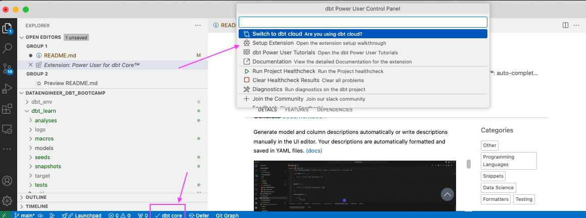

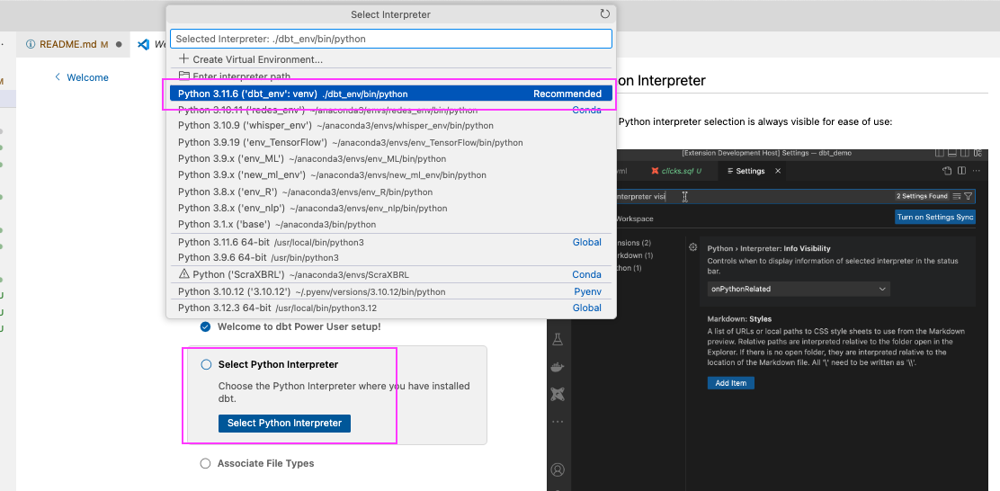

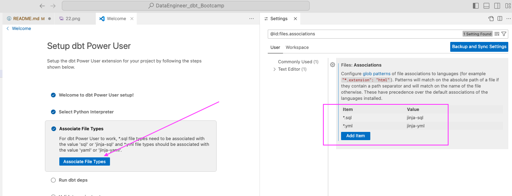

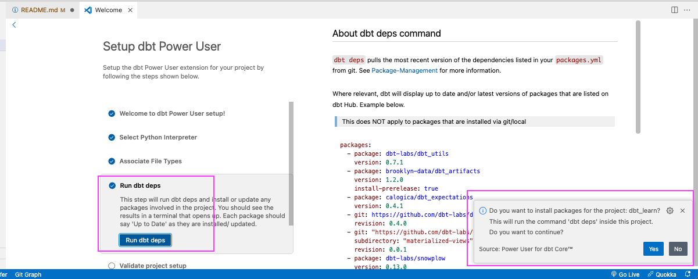

When you are creating a new dbt project and you don't have a `packages.yml `file nor know what dependencies you might need, you can start with an empty packages.yml file. Then, as you develop your project and discover which additional packages might be useful, you can add those dependencies to the file.

```sh
(dbt_env) ➜  dbt_learn git:(main) ✗ cat packages.yml
packages:
  - package: dbt-labs/dbt_utils
    version: 1.2.0
```

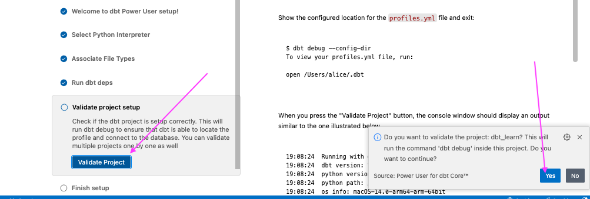


#### Data Flow - Overview

INPUT DATA MODEL

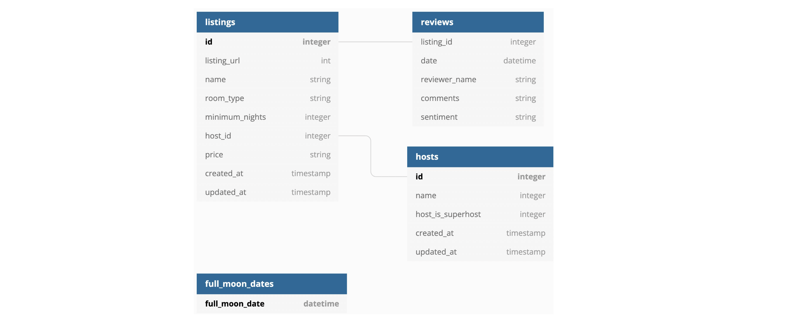

Three of these are directly connected to Airbnb. First, the `listing`. Then, the Airbnb `reviews`, which are linked to the `listings` through the `listing ID`. Additionally, there are the Airbnb `hosts`, who are also connected to the listings table via the `host ID`. We also have an additional table, which we will upload, called `full_moon_dates`. With the help of this table, you will have the opportunity to examine how full moon phases affect Airbnb reviews.

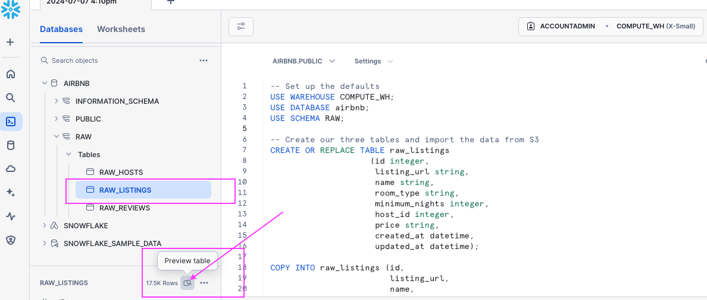

raw listing

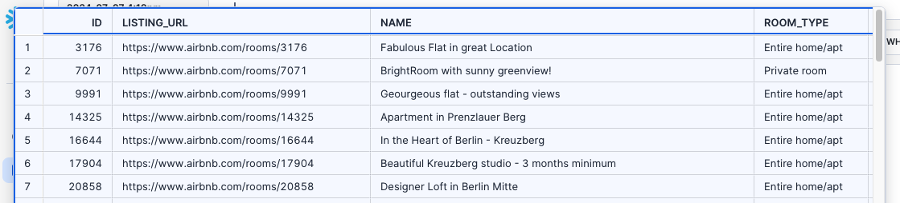

raw host

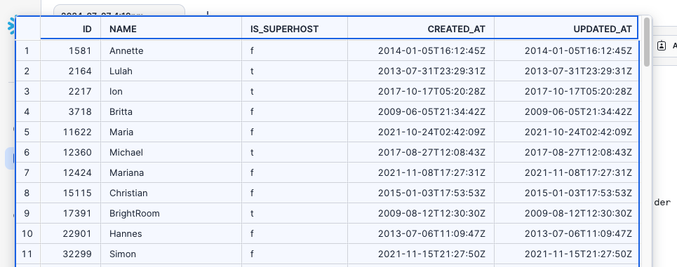

raw reviews

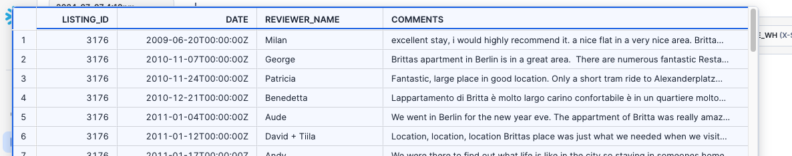


**Data flow overview**

So here is the data flow we are going to build. As you see in green, we have three input tables: `Costs, listings, and reviews`. We will import these input tables and make minor modifications in our first layer, the `src (source)` layer. We will then clean these tables and create our dimension tables `dim` and the `fct_reviews` fact table. Additionally, we will use an external table and send data to Snowflake via dbt. With the help of dbt, we will create a few so-called `mart_fullmoon_reviews` tables, which will be used by an executive dashboard. As we do this, we will also create a set of tests, which you can see here in the square.
 
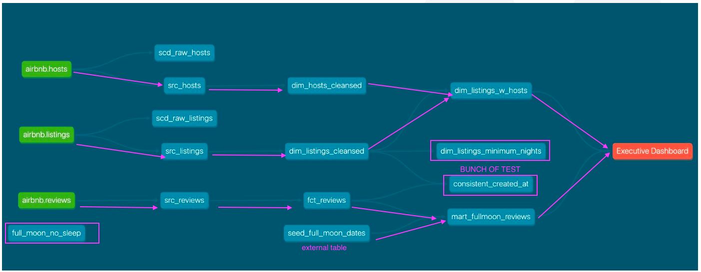

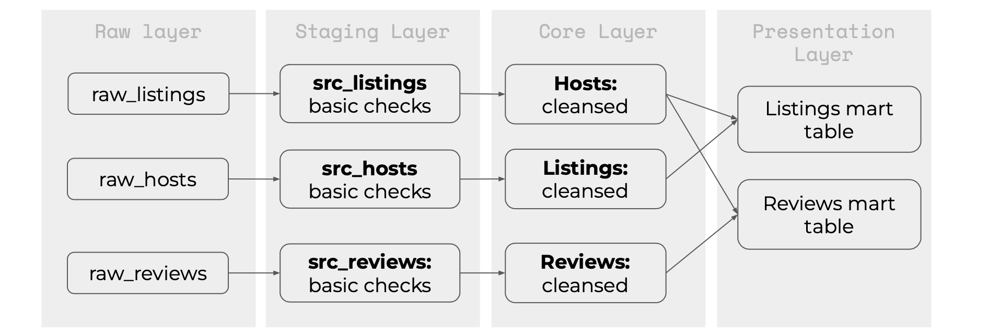


And let's go and start building our first three mortars, SSD hosts, associate listings and SSD reviews.

### MODELS

* Understand the data flow of our project
* Understand the concept of Models in dbt
* Create three basic models:
  * src_listings
  * src_reviews: guided exercises
  * src_hosts: individual lab

**Models Overview**


* Models are the basic building block of your business logic
*  Materialized as tables, views, etc...
*  They live in SQL files in the `models` folder
*  Models can reference each other and use templates and macros
  
Models are the basic building blocks of your business logic and the foundational elements of a dbt project. You can think of models as SQL queries that materialize as tables or views, but there is much more to them. For now, what you need to know about models is that they are stored as SQL files in the models folder. They are not just simple SQL SELECT statements; they can include additional features. For example, a model can reference other models, allowing dbt to understand the semantic dependencies between them. You can also use different scripts and macros within your models. Now, let's see how they work in action.

#### Common Table Expression (CTE)

CTEs help us write readable and maintainable SQL code. By definition, they are temporary, named result sets that exist only for the duration of a single query. CTEs are great because the result remains in memory during the execution of the query (e.g., SELECT, INSERT, UPDATE, DELETE, or MERGE). The syntax of a CTE looks something like this:

```SQL
# Syntax
WITH name_of_the_result_set (column_names) AS (
    cte_query
)
<reference_the_CTE>
```

The column names are optional and used to set up aliases for the column names that come out of the CTE. A CTE is a SELECT statement, and in reality, it is a temporary result set that can be referenced within the FROM clause of a query, just like any other table. The reference to the CTE is where we execute and use our common table expression.

Let's say we extracted raw data from the source systems via Airbnb. The data is 100% uncleaned, and we want to perform transformations on it. In step one, we create a CTE named `raw_listings`. Then in step two, we have an inner query that selects all columns from the source `listings` table. Finally, in step three, which is an outer query, we reference the CTE `raw_listings`.

In this outer query, we select specific columns from the source, performing simple transformations such as renaming the `id` column to `listing_id` to make it more descriptive.

SQL
Copy code

```SQL
# exemple
-- STEP 1
WITH raw_listings AS (

    -- STEP 2
    SELECT * FROM [source].[listings]
)

-- STEP 3
SELECT
    id AS listing_id,
    listing_url,
    name AS listing_name,
    room_type,
    minimum_nights,
    host_id,
    price AS price_str,
    created_at,
    updated_at
FROM raw_listings;
```

Although a CTE has similar functionality to a view, CTEs are not stored in metadata. We prefer CTEs because they are extremely readable, easy to maintain, and make complex queries more understandable. Furthermore, a query can be divided into separate, simple, logical building blocks, which can then be used to build more complex queries.

Lastly, CTEs can also be defined in functions, stored procedures, triggers, or even views. You will use CTEs many times throughout the course, so you will see plenty of examples soon.

#### Creating our first model: Airbnb listings

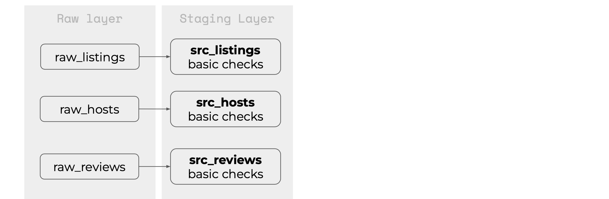

As you can see in our raw layer, we have three input tables: `raw_listings`, `raw_hosts`, and `raw_reviews`. Now, it's time to create our first staging layer. In this layer, we will prefix every staging table or view with the `src` tag. Our goal here is to build three models: one for listings, one for hosts, and one for reviews. These models will be views built on top of the raw data in the `raw_listings`, `raw_hosts`, and `raw_reviews` tables. 

We will make some minor changes to these tables, such as renaming columns, as a first step in cleansing our data. In this section, we will implement the src_listings model together. Then, you will have the chance to implement the necessary src_reviews model through a guided lab and assess the src_hosts model as an individual task

---
Creating a new model in the `models/src/` folder called `src_rlisting.sql`:


So let's implement our first select statement where we are changing these column names. And it's a standard practice in the analytics community to use CTE common table expressions For all of our input sources. I will create a comfortable expression which points to the role listing stable.

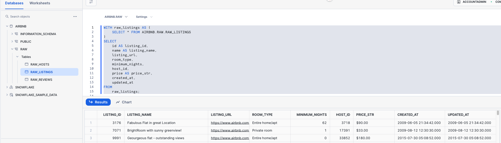

So now it's time to integrate Discovery into DBT. And let's create our first one.

Similar live here in the models folder and you can organize your models into subfolders or you can just keep them at the top level. It really depends on how you like to organize your structure. I would suggest you to organize it into subfolders layer by layer. So let's create our first layer. 

```sh
(dbt_env) ➜  dbt_learn git:(main) ✗ mkdir -p models/src
(dbt_env) ➜  dbt_learn git:(main) ✗ touch models/src/src_listings.sql     # Create src_listings.sql
```

```sh
├── macros
├── models
│   └── src
│       └── src_listings.sql
```

```sh
(dbt_env) ➜  dbt_learn git:(main) ✗ nano models/src/src_listings.sql
(dbt_env) ➜  dbt_learn git:(main) ✗ cat models/src/src_listings.sql 

  WITH raw_listings AS (
      SELECT * FROM AIRBNB.RAW.RAW_LISTINGS
  )
  SELECT
      id AS listing_id,
      name AS listing_name,
      listing_url,
      room_type,
      minimum_nights,
      host_id,
      price AS price_str,
      created_at,
      updated_at
  FROM
      raw_listings
```

So now Dbt knows that I want to have a view created called src_listings. And this is the definition of the view. So this is my first term placeholder and we will discuss later how you can manage this to be a table. But by default, all our models are going to be views. Save it´s and now let's execute DVT.

dbt run  

```sh
(dbt_env) ➜  dbt_learn git:(main) ✗ dbt run  
  18:31:52  Running with dbt=1.7.17
  18:31:53  Registered adapter: snowflake=1.7.1
  18:31:53  [WARNING]: Configuration paths exist in your dbt_project.yml file which do not apply to any resources.
  There are 1 unused configuration paths:
  - models.dbt_learn.example
  18:31:53  Found 1 model, 0 sources, 0 exposures, 0 metrics, 546 macros, 0 groups, 0 semantic models
  18:31:53  
  18:31:59  Concurrency: 1 threads (target='dev')
  18:31:59  
  18:31:59  1 of 1 START sql view model DEV.src_listings ................................... [RUN]
  18:32:00  1 of 1 OK created sql view model DEV.src_listings .............................. [SUCCESS 1 in 1.76s]
  18:32:00  
  18:32:00  Finished running 1 view model in 0 hours 0 minutes and 7.52 seconds (7.52s).
  18:32:00  
  18:32:00  Completed successfully
  18:32:00  
  18:32:00  Done. PASS=1 WARN=0 ERROR=0 SKIP=0 TOTAL=1
```

[WARNING]: Eliminate the folfer `examples` from `dbt_project.yml `

```sh
(dbt_env) ➜  dbt_learn git:(main) ✗ nano dbt_project.yml 
(dbt_env) ➜  dbt_learn git:(main) ✗ dbt run              
  18:35:45  Running with dbt=1.7.17
  18:35:45  Registered adapter: snowflake=1.7.1
  18:35:45  Found 1 model, 0 sources, 0 exposures, 0 metrics, 546 macros, 0 groups, 0 semantic models
  18:35:45  
  18:35:48  Concurrency: 1 threads (target='dev')
  18:35:48  
  18:35:48  1 of 1 START sql view model DEV.src_listings ................................... [RUN]
  18:35:49  1 of 1 OK created sql view model DEV.src_listings .............................. [SUCCESS 1 in 1.57s]
  18:35:49  
  18:35:49  Finished running 1 view model in 0 hours 0 minutes and 4.18 seconds (4.18s).
  18:35:49  
  18:35:49  Completed successfully
  18:35:49  
  18:35:49  Done. PASS=1 WARN=0 ERROR=0 SKIP=0 TOTAL=1
```

Let's take a look in Snowflake. Refresh and look the view

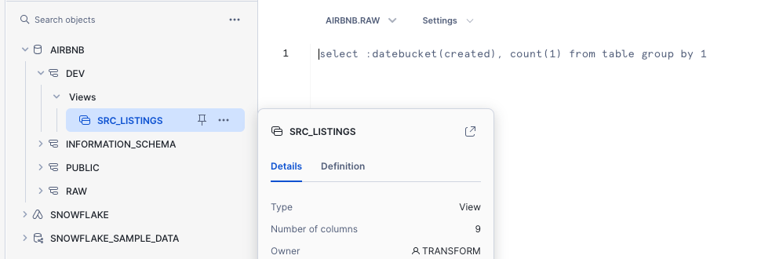


---
Creating a new model in the `models/src/` folder called `src_reviews.sql`:
* Use a CTE to reference the AIRBNB.RAW.RAW_REVIEWS table
* SELECT every column and every record, and rename the following columns:
  * date to review_date
  * comments to review_text
  * sentiment to review_sentiment
* Execute `dbt run` and verify that your model has been created

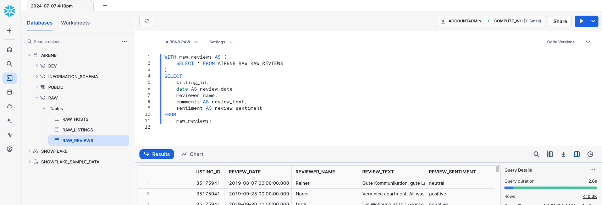

```sh
(dbt_env) ➜  DataEngineer_dbt_Bootcamp git:(main) ✗ touch dbt_learn/models/src/src_reviews.sql
(dbt_env) ➜  DataEngineer_dbt_Bootcamp git:(main) ✗ nano dbt_learn/models/src/src_reviews.sql 
(dbt_env) ➜  DataEngineer_dbt_Bootcamp git:(main) ✗ cat dbt_learn/models/src/src_reviews.sql

  WITH raw_reviews AS (
      SELECT * FROM AIRBNB.RAW.RAW_REVIEWS
  )
  SELECT
      listing_id,
      date AS review_date,
      reviewer_name,
      comments AS review_text,
      sentiment AS review_sentiment
  FROM
      raw_reviews
```

dbt run  

```sh
(dbt_env) ➜  DataEngineer_dbt_Bootcamp git:(main) ✗ cd dbt_learn 
(dbt_env) ➜  dbt_learn git:(main) ✗ dbt run     
  04:43:21  Running with dbt=1.7.17
  04:43:21  Registered adapter: snowflake=1.7.1
  04:43:21  Found 2 models, 0 sources, 0 exposures, 0 metrics, 546 macros, 0 groups, 0 semantic models
  04:43:21  
  04:43:24  Concurrency: 1 threads (target='dev')
  04:43:24  
  04:43:24  1 of 2 START sql view model DEV.src_listings ................................... [RUN]
  04:43:25  1 of 2 OK created sql view model DEV.src_listings .............................. [SUCCESS 1 in 1.32s]
  04:43:25  2 of 2 START sql view model DEV.src_reviews .................................... [RUN]
  04:43:26  2 of 2 OK created sql view model DEV.src_reviews ............................... [SUCCESS 1 in 1.27s]
  04:43:26  
  04:43:26  Finished running 2 view models in 0 hours 0 minutes and 5.23 seconds (5.23s).
  04:43:26  
  04:43:26  Completed successfully
  04:43:26  
  04:43:26  Done. PASS=2 WARN=0 ERROR=0 SKIP=0 TOTAL=2
```

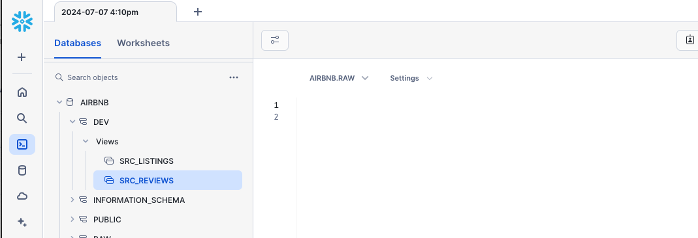

---
Creating a new model in the `models/src/` folder called `src_hosts.sql`:
* Use a CTE to reference the AIRBNB.RAW.RAW_HOSTS table
* SELECT every column and every record, and rename the following columns:
    * id AS host_id,
    * NAME AS host_name,
* Execute `dbt run` and verify that your model has been created

```sh
(dbt_env) ➜  dbt_learn git:(main) ✗ touch models/src/src_hosts.sql            
(dbt_env) ➜  dbt_learn git:(main) ✗ nano models/src/src_hosts.sql 
(dbt_env) ➜  dbt_learn git:(main) ✗ cat models/src/src_hosts.sql
  WITH raw_hosts AS (
      SELECT * FROM AIRBNB.RAW.RAW_HOSTS
  )
  SELECT
      id AS host_id,
      NAME AS host_name,
      is_superhost,
      created_at,
      updated_at
  FROM
      raw_hosts
```

```sh
(dbt_env) ➜  dbt_learn git:(main) ✗ dbt run
  05:13:40  Running with dbt=1.7.17
  05:13:40  Registered adapter: snowflake=1.7.1
  05:13:41  Found 3 models, 0 sources, 0 exposures, 0 metrics, 546 macros, 0 groups, 0 semantic models
  05:13:41  
  05:13:43  Concurrency: 1 threads (target='dev')
  05:13:43  
  05:13:43  1 of 3 START sql view model DEV.src_hosts ...................................... [RUN]
  05:13:44  1 of 3 OK created sql view model DEV.src_hosts ................................. [SUCCESS 1 in 1.37s]
  05:13:44  2 of 3 START sql view model DEV.src_listings ................................... [RUN]
  05:13:46  2 of 3 OK created sql view model DEV.src_listings .............................. [SUCCESS 1 in 1.31s]
  05:13:46  3 of 3 START sql view model DEV.src_reviews .................................... [RUN]
  05:13:47  3 of 3 OK created sql view model DEV.src_reviews ............................... [SUCCESS 1 in 1.26s]
  05:13:47  
  05:13:47  Finished running 3 view models in 0 hours 0 minutes and 6.49 seconds (6.49s).
  05:13:47  
  05:13:47  Completed successfully
  05:13:47  
  05:13:47  Done. PASS=3 WARN=0 ERROR=0 SKIP=0 TOTAL=3
```


---
video 41

---

### Materializations

* Understand how models can be connected
* Understand the four built-in materializations
* Understand how materializations can be configured on the file and project level
* Use dbt run with extra parameters
  
Materializations are different race, how your models can be stored and managed in the data warehouse. There are 4th materializations


* A view is the default materialization in dbt. When you select the "view" materialization, dbt will create a database view for your model. Views are virtual tables that display the results of a stored query. They are lightweight because they don’t store data themselves but instead fetch data dynamically whenever queried.
* Choosing "table" as your materialization will make dbt create a physical table in your database. Every time you run dbt run, this table will be recreated from scratch. This is useful for models that you query frequently and where performance is important, but it is not ideal for models that are updated incrementally or are only used once.
* The "incremental" materialization is designed for scenarios where you need to add new rows to a table without recreating it from scratch every time. This is particularly useful for event data or other types of fact tables where data is continuously appended. However, it is not suitable for updating existing records.
* An "ephemeral" model in dbt is not materialized into a physical table or view. Instead, it exists only within the context of a dbt run and is used as a Common Table Expression (CTE) in the downstream models. This means that the data is never stored in the database but is used to streamline complex queries within dbt. This is useful for intermediate calculations or transformations that don’t need to be stored permanently.


With a `view`, you want to use it when you need a lightweight representation of your data and don’t need to recreate a table at every execution. However, avoid using views if you need to read from the same `view` multiple times in quick succession, as each access will require the underlying query to be executed, potentially impacting performance.

For efficient repeated access, consider using the `table` materialization. The downside is that it needs to be recreated every time you run your pipeline, which can take extra time. However, once created, the data is readily available, making subsequent reads fast.

For data that is `incrementally` updated, such as event data (e.g., orders in an e-commerce system or reviews), the incremental materialization is ideal. This method allows you to append new data without recreating the entire table, optimizing performance and storage.

Finally, if you need an intermediate step between models without publishing it to the data warehouse, the `ephemeral` materialization is useful. Ephemeral models exist only within the context of a dbt run as Common Table Expressions (CTEs) and do not create physical tables or views in your database, making them ideal for temporary calculations and transformations.

| Materialization | Use it when...                                               | Don’t use it when...                                             | Explanation                                                                                         |
|-----------------|--------------------------------------------------------------|------------------------------------------------------------------|-----------------------------------------------------------------------------------------------------|
| **View**        | You want a lightweight representation and don’t reuse data often | You need to read from the same model several times                | A view creates a virtual table that fetches data dynamically whenever queried.                      |
| **Table**       | You read from this model repeatedly                           | Building single-use models or your model is populated incrementally | A table creates a physical table that is recreated from scratch every time `dbt run` is executed.   |
| **Incremental** | Fact tables or appending to tables                           | You want to update historical records                             | An incremental table adds new rows without recreating the entire table, ideal for event/fact data.  |
| **Ephemeral**   | You need an alias to your data                               | You need to read from the same model several times                | An ephemeral model exists only during a dbt run as a CTE, not materialized in the database.         |


So we will see an example to all of those in the upcoming lessons.

#### Model Dependencies and dbt's ref tag

We are going to build out a new layer, the core layer, core layer comes with a bunch of chambers. From `src_listing` we are going to create `dim_lisitng_cleansed`, etc

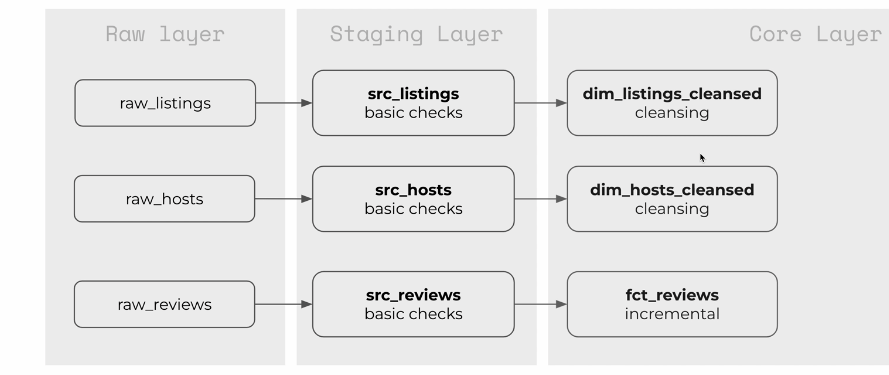

And you're going to create our final dimension table by joining these two tables together.

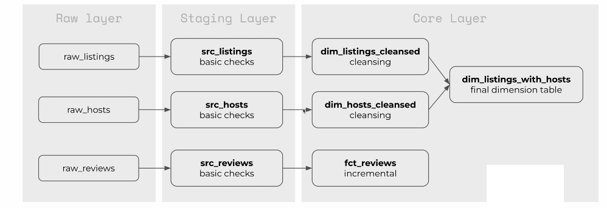

you will see how we can define dependencies between models and how we can create different materializations and apply them in snowflake.

IN snowflakw look you and make sure that you have de views `SRC_HOST`, `SRC_LISTINGS` AND `SRC_REVIEWS`.

---

For `dimension` tables we are to create a new folder in models 

```sh
(dbt_env) ➜  dbt_learn git:(main) ✗ mkdir -p models/dim                       
(dbt_env) ➜  dbt_learn git:(main) ✗ touch models/dim/dim_listings_cleansed.sql
```

Here, I want to build on top of the SLC listings there and the additional dim_listings_clear . 

I have created this file above VSCode app with de extension dbt and jinja configuration.

```SQL
WITH src_liting AS (
    SELECT * FROM {{ ref('src_listings') }}
)

SELECT ...
```

`ref('src_listing')` This is a bdt specific template tag in SQL, which does dbt to substitute this template with the name sql_listing.sql, Technically speaking, it is a [jinja template](https://palletsprojects.com/p/jinja/) tag. The main idea behind Jinjr is that you can define these templates where I have us and also some control structures like loops and conditional statements and ginger passes for you, DVT heavily relies on jinjar.

If you look at the preview of the SRC_LISTINGS Snowflake table, you will notice that several instances in the MINIMUM_NIGHTS column contain zeros. And this is a problem i the data, thre is the minimun of nigths is 1 night that needs to bo booked in order to reserve this Airbnb. And also the price now gold price SDR. It is in a string format, So let's just pass this into our numeric form.


I have created this file above VSCode app with de extension dbt and jinja configuration.

```sh
(dbt_env) ➜  dbt_learn git:(main) ✗ cat models/dim/dim_listings_cleansed.sql 

  WITH src_liting AS (
      SELECT * FROM {{ ref('src_listings') }}
  )
  SELECT
    listing_id,
    listing_name,
    room_type,
    CASE
      WHEN minimum_nights = 0 THEN 1
      ELSE minimum_nights
    END AS minimum_nights,
    host_id,
    REPLACE(
      price_str,
      '$'
    ) :: NUMBER(
      10,
      2
    ) AS price,
    created_at,
    updated_at
  FROM
    src_listings
```

dbt run

```sh
(dbt_env) ➜  dbt_learn git:(main) ✗ dbt run
  07:41:12  Running with dbt=1.7.17
  07:41:12  Registered adapter: snowflake=1.7.1
  07:41:13  Found 4 models, 0 sources, 0 exposures, 0 metrics, 546 macros, 0 groups, 0 semantic models
  07:41:13  
  07:41:18  Concurrency: 1 threads (target='dev')
  07:41:18  
  07:41:18  1 of 4 START sql view model DEV.src_hosts ...................................... [RUN]
  07:41:20  1 of 4 OK created sql view model DEV.src_hosts ................................. [SUCCESS 1 in 1.37s]
  07:41:20  2 of 4 START sql view model DEV.src_listings ................................... [RUN]
  07:41:21  2 of 4 OK created sql view model DEV.src_listings .............................. [SUCCESS 1 in 1.31s]
  07:41:21  3 of 4 START sql view model DEV.src_reviews .................................... [RUN]
  07:41:22  3 of 4 OK created sql view model DEV.src_reviews ............................... [SUCCESS 1 in 1.22s]
  07:41:22  4 of 4 START sql view model DEV.dim_listings_cleansed .......................... [RUN]
  07:41:24  4 of 4 OK created sql view model DEV.dim_listings_cleansed ..................... [SUCCESS 1 in 1.30s]
  07:41:24  
  07:41:24  Finished running 4 view models in 0 hours 0 minutes and 11.11 seconds (11.11s).
  07:41:24  
  07:41:24  Completed successfully
  07:41:24  
  07:41:24  Done. PASS=4 WARN=0 ERROR=0 SKIP=0 TOTAL=4
```


---

Create a new model in the `models/dim/` folder called `dim_hosts_cleansed.sql`.
* Use a CTE to reference the `src_hosts` model
* SELECT every column and every record, and add a cleansing step to
host_name:
  * If host_name is not null, keep the original value
  * If host_name is null, replace it with the value ‘Anonymous’
  * Use the NVL(column_name, default_null_value) function
* Execute `dbt run` and verify that your model has been created

```sh
(dbt_env) ➜  dbt_learn git:(main) ✗ cat models/dim/dim_hosts_cleansed.sql
-- models/dim/dim_hosts_cleansed.sql

WITH src_hosts AS (
    SELECT * FROM {{ ref('src_hosts') }}
)
SELECT 
    host_id,
    NVL(host_name, 'Anonymous') AS host_name,
    is_superhost,
    created_at,
    updated_at
FROM
    src_hosts
```

Explanation:
* CTE (Common Table Expression): defined `src_hosts` to reference the model.
* Cleansing Step: The `host_name` column is cleansed by using the NVL function to replace NULL values with 'Anonymous'.
* Columns Selection: Every column from the `src_hosts` table is selected with the host_name column being modified for cleansing.

```sh
(dbt_env) ➜  dbt_learn git:(main) ✗ dbt run
  10:47:32  Running with dbt=1.7.17
  10:47:32  Registered adapter: snowflake=1.7.1
  10:47:32  Found 5 models, 0 sources, 0 exposures, 0 metrics, 546 macros, 0 groups, 0 semantic models
  10:47:32  
  10:47:36  Concurrency: 1 threads (target='dev')
  10:47:36  
  10:47:36  1 of 5 START sql view model DEV.src_hosts ...................................... [RUN]
  10:47:38  1 of 5 OK created sql view model DEV.src_hosts ................................. [SUCCESS 1 in 1.39s]
  10:47:38  2 of 5 START sql view model DEV.src_listings ................................... [RUN]
  10:47:39  2 of 5 OK created sql view model DEV.src_listings .............................. [SUCCESS 1 in 1.36s]
  10:47:39  3 of 5 START sql view model DEV.src_reviews .................................... [RUN]
  10:47:40  3 of 5 OK created sql view model DEV.src_reviews ............................... [SUCCESS 1 in 1.23s]
  10:47:40  4 of 5 START sql view model DEV.dim_hosts_cleansed ............................. [RUN]
  10:47:42  4 of 5 OK created sql view model DEV.dim_hosts_cleansed ........................ [SUCCESS 1 in 1.29s]
  10:47:42  5 of 5 START sql view model DEV.dim_listings_cleansed .......................... [RUN]
  10:47:43  5 of 5 OK created sql view model DEV.dim_listings_cleansed ..................... [SUCCESS 1 in 1.34s]
  10:47:43  
  10:47:43  Finished running 5 view models in 0 hours 0 minutes and 10.55 seconds (10.55s).
  10:47:43  
  10:47:43  Completed successfully
  10:47:43  
  10:47:43  Done. PASS=5 WARN=0 ERROR=0 SKIP=0 TOTAL=5
```

---

#### Table type materialization & Project-level Materialization config


So far, the only materialization we used is the view materialization, so the default. So we have now these five views in Snowflake.  So we have now these five views in Snowflake 
* `DIM_HOSTS_CLEANSED`, 
* `DIM_LISTINGS_CLEANSED`, 
* `SRC_HOSTS`, 
* `RC_LISTINGS`, 
* `SRC_REVIEWS`

But first of all, let's be explicit about our default militarization. So what I'd like to  to open how the Dbt project YAML file and come to the end. The DBT project is the file where you can set subfolder and global configurations. I want to specify that my militarization is for you I can add the new line and just saying `+materialized: view` in `dbt_project.yml`

```sh
(dbt_env) ➜  dbt_learn git:(main) ✗ nano dbt_project.yml 

# this lines
models:
  dbt_learn:
        +materialized: view # add this line
```

* `dbt_learn:` This specifies a sub-section within the models configuration. The dbt_learn key corresponds to a specific directory or group of models within your project. In this case, it refers to models located in the dbt_learn directory.
* `+materialized: view` : This line is an added configuration setting for the models in the dbt_learn directory. +materialized is a dbt directive that specifies the materialization strategy for these models. 
* `view` means that dbt will create a database view for each model in the dbt_learn directory. Views are virtual tables that are defined by a query but do not store data physically.

In this case, you would want the sources `src_hosts`, `src_listings`, and `src_reviews` to be materialized as views because they involve very lightweight transformations and probably won't be accessed directly very often. However, for `dim_hosts_cleansed` and `dim_listings_cleanset`, which are already cleansed and stable, they will be accessed quite often. Therefore, it makes sense for these to be materialized differently, possibly as tables, to optimize performance for frequent queries.

```sh
├── models
│   ├── dim
│   │   ├── dim_hosts_cleansed.sql
│   │   └── dim_listings_cleansed.sql
│   └── src
│       ├── src_hosts.sql
│       ├── src_listings.sql
│       └── src_reviews.sql
```

So I want to make sure that these configurations align with our performance estimates. So will come now and define it as:

```sh
(dbt_env) ➜  dbt_learn git:(main) ✗ nano dbt_project.yml 

# this lines
models:
  dbt_learn:
        +materialized: view 
        dim: # add this line
          +materialized: table # add this line
```

By adding these lines, you are differentiating the materialization between different types of models in your project:

Views for Lightweight Models (src): The src_hosts, src_listings, and src_reviews models are materialized as views because they involve very lightweight transformations and probably won't be accessed directly very often.

Tables for Cleansed Models (dim): The dim_hosts_cleansed and dim_listings_cleansed models, which are already cleansed and stable, will be materialized as tables because they will be accessed frequently. Materializing them as tables optimizes the performance of frequent queries.

* `dim` : Specifies another subsection within dbt_learn. The key dim corresponds to specific models within the dim subdirectory in dbt_learn.

* `+materialized: table` : This line is an added configuration for the models in the dim subdirectory within the dbt_learn directory.
table means that dbt will create a physical table for each model in the dim subdirectory. Tables store data physically, which generally improves the performance of frequent queries.

```sh
(dbt_env) ➜  dbt_learn git:(main) ✗ dbt run
  15:42:07  Running with dbt=1.7.17
  15:42:08  Registered adapter: snowflake=1.7.1
  15:42:08  Found 5 models, 0 sources, 0 exposures, 0 metrics, 546 macros, 0 groups, 0 semantic models
  15:42:08  
  15:42:15  Concurrency: 1 threads (target='dev')
  15:42:15  
  15:42:15  1 of 5 START sql view model DEV.src_hosts ...................................... [RUN]
  15:42:16  1 of 5 OK created sql view model DEV.src_hosts ................................. [SUCCESS 1 in 1.52s]
  15:42:16  2 of 5 START sql view model DEV.src_listings ................................... [RUN]
  15:42:18  2 of 5 OK created sql view model DEV.src_listings .............................. [SUCCESS 1 in 1.52s]
  15:42:18  3 of 5 START sql view model DEV.src_reviews .................................... [RUN]
  15:42:19  3 of 5 OK created sql view model DEV.src_reviews ............................... [SUCCESS 1 in 1.28s]
  15:42:19  4 of 5 START sql table model DEV.dim_hosts_cleansed ............................ [RUN]
  15:42:22  4 of 5 OK created sql table model DEV.dim_hosts_cleansed ....................... [SUCCESS 1 in 2.92s]
  15:42:22  5 of 5 START sql table model DEV.dim_listings_cleansed ......................... [RUN]
  15:42:24  5 of 5 OK created sql table model DEV.dim_listings_cleansed .................... [SUCCESS 1 in 2.37s]
  15:42:24  
  15:42:24  Finished running 3 view models, 2 table models in 0 hours 0 minutes and 15.78 seconds (15.78s).
  15:42:24  
  15:42:24  Completed successfully
  15:42:24  
  15:42:24  Done. PASS=5 WARN=0 ERROR=0 SKIP=0 TOTAL=5
```
and look in the snowflake:


#### Incremental materialization

Here we have associate reviews, which you are already familiar with, which has a listing idea, review  dates, reviewer name, reviewer tests and also the sentiment.


Now we are performing our two steps in the following order:
* Cleansing: We ensure that only reviews containing actual text are included in our effective table.
* Incremental Updates: We make sure that these reviews are updated incrementally rather than being recreated during each dbt run.


```sh
(dbt_env) ➜  dbt_learn git:(main) ✗ mkdir -p models/fct
(dbt_env) ➜  dbt_learn git:(main) ✗ touch models/fct/fct_reviews.sql
```

OK, so first, let's create a standard table without any increment.

```sh
(dbt_env) ➜  dbt_learn git:(main) ✗ cat models/fct/fct_reviews.sql

WITH src_reviews AS (
    SELECT * FROM {{ ref("src_reviews") }}
)
SELECT * FROM src_reviews
WHERE review_text is not null%  
```
Now, we want to change this to use incremental materialization. To do this, we will use Jinja syntax in dbt to configure our model for incremental updates. Here is the configuration:

```sh
{{
    config(
    materialized = 'incremental',
    on_schema_change='fail'
    )
}}
WITH src_reviews AS (
    SELECT * FROM {{ ref("src_reviews") }}
)
SELECT * FROM src_reviews
WHERE review_text is not null
```

`Config`uration Block:
* `materialized = 'incremental'`: This setting configures the model to use incremental materialization. In dbt, incremental models only process and add new or updated data since the last run, rather than rebuilding the entire table. This is useful for large datasets where full refreshes are time-consuming and resource-intensive.
* `on_schema_change='fail'`: This setting specifies the action dbt should take if there is a change in the schema of the source table. Setting this to 'fail' means that the incremental model will fail if there is a schema change detected in the source data. This is a safety measure to prevent unexpected issues caused by schema changes.

Up until now, all views and tables were recreated every time we executed `dbt run`. However, with incremental materialization, we maintain a stable table (fct_reviews) that is updated incrementally. If there is a schema change upstream, we need to be aware of it and react accordingly. By setting on_schema_change to 'fail', we ensure that any unexpected schema changes will cause the model to fail, prompting us to address the issue before proceeding.

But I also need to tell DVT how to increment. I need to tell DVT, what are the new records right? How it knows from record that it's new are not.  And here I can go and simply create a jinjar if statements for this. 

```SQL

  AND review_date > (select max(review_date) from {{ this }})

```
* This section uses Jinja templating to add conditional logic to the query. The `is_incremental()` function checks if the model is running in incremental mode. 
* If the model is running incrementally, the condition `AND review_date > (select max(review_date) from {{ this }})` is added to the WHERE clause. 
  * `review_date > (select max(review_date) from {{ this }}):` This ensures that only new records with a review_date greater than the maximum review_date already present in the target table (represented by {{ this }}) are included in the incremental run.

Now, notice for a second how much freedom this leaves you because. Here, if you want to have some more sophisticated logic, like working on an updated feared or anything doing with IDs, whatever. You're free to express it here in SQL.

```SQL
(dbt_env) ➜  dbt_learn git:(main) ✗ cat models/fct/fct_reviews.sql
  {{
      config(
      materialized = 'incremental',
      on_schema_change='fail'
      )
  }}
  WITH src_reviews AS (
      SELECT * FROM {{ ref("src_reviews") }}
  )
  SELECT * FROM src_reviews
  WHERE review_text is not null
  
    AND review_date > (select max(review_date) from {{ this }})
  
```

```sh
(dbt_env) ➜  dbt_learn git:(main) ✗ dbt run
16:27:01  Running with dbt=1.7.17
16:27:02  Registered adapter: snowflake=1.7.1
16:27:02  Found 6 models, 0 sources, 0 exposures, 0 metrics, 546 macros, 0 groups, 0 semantic models
16:27:02  
16:27:05  Concurrency: 1 threads (target='dev')
16:27:05  
16:27:05  1 of 6 START sql view model DEV.src_hosts ...................................... [RUN]
16:27:06  1 of 6 OK created sql view model DEV.src_hosts ................................. [SUCCESS 1 in 1.57s]
16:27:06  2 of 6 START sql view model DEV.src_listings ................................... [RUN]
16:27:08  2 of 6 OK created sql view model DEV.src_listings .............................. [SUCCESS 1 in 1.42s]
16:27:08  3 of 6 START sql view model DEV.src_reviews .................................... [RUN]
16:27:09  3 of 6 OK created sql view model DEV.src_reviews ............................... [SUCCESS 1 in 1.41s]
16:27:09  4 of 6 START sql table model DEV.dim_hosts_cleansed ............................ [RUN]
16:27:12  4 of 6 OK created sql table model DEV.dim_hosts_cleansed ....................... [SUCCESS 1 in 2.65s]
16:27:12  5 of 6 START sql table model DEV.dim_listings_cleansed ......................... [RUN]
16:27:14  5 of 6 OK created sql table model DEV.dim_listings_cleansed .................... [SUCCESS 1 in 2.12s]
16:27:14  6 of 6 START sql incremental model DEV.fct_reviews ............................. [RUN]
16:27:19  6 of 6 OK created sql incremental model DEV.fct_reviews ........................ [SUCCESS 1 in 5.60s]
16:27:19  
16:27:19  Finished running 3 view models, 2 table models, 1 incremental model in 0 hours 0 minutes and 17.56 seconds (17.56s).
16:27:19  
16:27:19  Completed successfully
16:27:19  
16:27:19  Done. PASS=6 WARN=0 ERROR=0 SKIP=0 TOTAL=6
```


Let's create an incremental load now. For an incremental load, we need some incremental data, right? First of all, let's take a look at the reviews for listing ID 3176.


We have a bunch of reviews here, so let's execute a command to add new reviews.

```SQL
INSERT INTO AIRBNB.RAW.RAW_REVIEWS VALUES (3176, CURRENT_TIMESTAMP(),
'Zoltan','excallent stay!', 'positive');
```

This INSERT command adds a new review to the RAW_REVIEWS table in the RAW schema of the AIRBNB database. It includes the listing ID 3176, the current timestamp as the review date, "Zoltan" as the reviewer's name, "Excellent stay!" as the review text, and "positive" as the sentiment.


And now with dbt run, we pick up and recreate the first reviews and and the two dimensional tables and execute an incremental load on the six model, the fact reviews.

```sh
(dbt_env) ➜  dbt_learn git:(main) ✗ dbt run
    16:39:49  Running with dbt=1.7.17
    16:39:50  Registered adapter: snowflake=1.7.1
    16:39:50  Found 6 models, 0 sources, 0 exposures, 0 metrics, 546 macros, 0 groups, 0 semantic models
    16:39:50  
    16:39:53  Concurrency: 1 threads (target='dev')
    16:39:53  
    16:39:53  1 of 6 START sql view model DEV.src_hosts ...................................... [RUN]
    16:39:54  1 of 6 OK created sql view model DEV.src_hosts ................................. [SUCCESS 1 in 1.43s]
    16:39:54  2 of 6 START sql view model DEV.src_listings ................................... [RUN]
    16:39:55  2 of 6 OK created sql view model DEV.src_listings .............................. [SUCCESS 1 in 1.40s]
    16:39:55  3 of 6 START sql view model DEV.src_reviews .................................... [RUN]
    16:39:57  3 of 6 OK created sql view model DEV.src_reviews ............................... [SUCCESS 1 in 1.21s]
    16:39:57  4 of 6 START sql table model DEV.dim_hosts_cleansed ............................ [RUN]
    16:39:58  4 of 6 OK created sql table model DEV.dim_hosts_cleansed ....................... [SUCCESS 1 in 1.83s]
    16:39:58  5 of 6 START sql table model DEV.dim_listings_cleansed ......................... [RUN]
    16:40:01  5 of 6 OK created sql table model DEV.dim_listings_cleansed .................... [SUCCESS 1 in 2.20s]
    16:40:01  6 of 6 START sql incremental model DEV.fct_reviews ............................. [RUN]
    16:40:05  6 of 6 OK created sql incremental model DEV.fct_reviews ........................ [SUCCESS 1 in 4.01s]
    16:40:05  
    16:40:05  Finished running 3 view models, 2 table models, 1 incremental model in 0 hours 0 minutes and 14.74 seconds (14.74s).
    16:40:05  
    16:40:05  Completed successfully
    16:40:05  
    16:40:05  Done. PASS=6 WARN=0 ERROR=0 SKIP=0 TOTAL=6
```

OK, so it says that it's incremental the one motor.

```SQL
SELECT * FROM AIRBNB.DEV.FCT_REVIEWS WHERE listing_id=3176;
```


Now, just one more trick before we go to our next session: what happens if you want to rebuild the entire table? You can do this by running the command `dbt run --full-refresh`.

```sh
(dbt_env) ➜  dbt_learn git:(main) ✗ dbt run --full-refresh
  16:49:59  Running with dbt=1.7.17
  16:50:00  Registered adapter: snowflake=1.7.1
  16:50:00  Found 6 models, 0 sources, 0 exposures, 0 metrics, 546 macros, 0 groups, 0 semantic models
  16:50:00  
  16:50:03  Concurrency: 1 threads (target='dev')
  16:50:03  
  16:50:03  1 of 6 START sql view model DEV.src_hosts ...................................... [RUN]
  16:50:04  1 of 6 OK created sql view model DEV.src_hosts ................................. [SUCCESS 1 in 1.51s]
  16:50:04  2 of 6 START sql view model DEV.src_listings ................................... [RUN]
  16:50:06  2 of 6 OK created sql view model DEV.src_listings .............................. [SUCCESS 1 in 1.38s]
  16:50:06  3 of 6 START sql view model DEV.src_reviews .................................... [RUN]
  16:50:07  3 of 6 OK created sql view model DEV.src_reviews ............................... [SUCCESS 1 in 1.40s]
  16:50:07  4 of 6 START sql table model DEV.dim_hosts_cleansed ............................ [RUN]
  16:50:09  4 of 6 OK created sql table model DEV.dim_hosts_cleansed ....................... [SUCCESS 1 in 2.17s]
  16:50:09  5 of 6 START sql table model DEV.dim_listings_cleansed ......................... [RUN]
  16:50:11  5 of 6 OK created sql table model DEV.dim_listings_cleansed .................... [SUCCESS 1 in 2.05s]
  16:50:11  6 of 6 START sql incremental model DEV.fct_reviews ............................. [RUN]
  16:50:16  6 of 6 OK created sql incremental model DEV.fct_reviews ........................ [SUCCESS 1 in 5.10s]
  16:50:16  
  16:50:16  Finished running 3 view models, 2 table models, 1 incremental model in 0 hours 0 minutes and 16.42 seconds (16.42s).
  16:50:16  
  16:50:16  Completed successfully
  16:50:16  
  16:50:16  Done. PASS=6 WARN=0 ERROR=0 SKIP=0 TOTAL=6
```

Now Every incremental table has been rebuilt.

Now, I won't see any change here, of course, because this will bring me to the same state. However, if you ever change the schema of a source file or table, performing a full refresh will recreate the incremental or table models from scratch. This ensures that all schema changes are properly reflected in your models.


#### Ephemeral materialization


The type of materialization for all of the tables we've created so far is shown in the diagram. We still need to create the dim_listings_with_hosts, which will be our final dimension table, so we will do that now.


If you think about it, as an Airbnb analytics engineer, once we are done with processing, we end up with two main tables: fct_reviews and dim_listings_with_hosts. These tables combine all the necessary data, such as listings joined with host information and review details.

Since these tables are our final, stable tables that we frequently access for analytics, we can keep them stable by materializing them as tables or views. This means, for example, if we have dim_listings_cleansed and dim_hosts_cleansed materialized as views, we don't need to create additional tables out of them because we will only read from these views.

By using views for dim_listings_cleansed and dim_hosts_cleansed, we can simplify our data processing pipeline and ensure that we have up-to-date data without the need for redundant table creation.

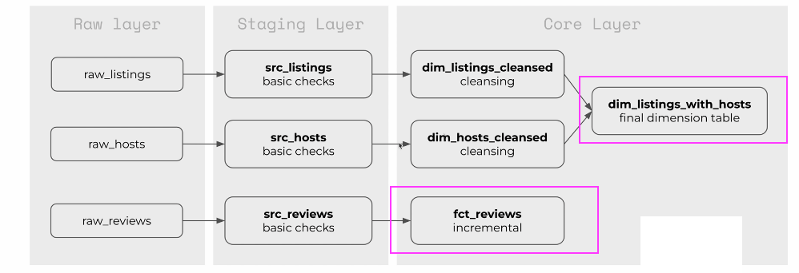

* `Ephemeral Materialization`: This refers to the practice of using temporary tables or views that do not persistently store data but are instead generated dynamically when needed.
* `Stable Tables`: The fct_reviews and dim_listings_with_hosts are considered stable because they combine all necessary data and are accessed frequently for analytics.
* `Using Views`: By materializing dim_listings_cleansed and dim_hosts_cleansed as views, we avoid creating unnecessary tables and keep our data processing pipeline efficient.
  

We still need to create the dimension table `dim_listings_with_hosts`, which will be our final dimension table. So, we will do that. If you think about it from the perspective of an Airbnb analytics engineer, after we are done with the cleansed listings and hosts, we will have two main tables here:

1. `fct_reviews`
2. `dim_listings_with_hosts`

These two tables will be our final tables in the core layer, which we will use repeatedly for analytics. Since `dim_listings_cleansed` and `dim_hosts_cleansed` are intermediate views needed only for reading and processing, there is no need to convert them into permanent tables. These views are used only during the creation of our final table `dim_listings_with_hosts`.

In summary, we will keep `dim_listings_with_hosts` and `fct_reviews` as our final tables and we don't need to create additional tables for `dim_listings_cleansed` and `dim_hosts_cleansed`. These can remain as views that get converted into CTEs (Common Table Expressions) during integration into the final tables.

So, this is what we will do: we will create the final table `dim_listings_with_hosts`.


```sh
(dbt_env) ➜  dbt_learn git:(main) touch models/dim/dim_listings_w_hosts.sql
(dbt_env) ➜  dbt_learn git:(main) ✗ nano models/dim/dim_listings_w_hosts.sql
(dbt_env) ➜  dbt_learn git:(main) ✗ cat models/dim/dim_listings_w_hosts.sql
  WITH
  l AS (
      SELECT
          *
      FROM
          {{ ref('dim_listings_cleansed') }}
  ),
  h AS (
      SELECT * 
      FROM {{ ref('dim_hosts_cleansed') }}
  )

  SELECT 
      l.listing_id,
      l.listing_name,
      l.room_type,
      l.minimum_nights,
      l.price,
      l.host_id,
      h.host_name,
      h.is_superhost as host_is_superhost,
      l.created_at,
      GREATEST(l.updated_at, h.updated_at) as updated_at
  FROM l
  LEFT JOIN h ON (h.host_id = l.host_id)
```

This script creates a CTE (Common Table Expression) for our listings and hosts.
* We reference the cleansed listings and hosts tables (`dim_listings_cleansed` and `dim_hosts_cleansed`) and read every column from these two tables.
* We also rename the column `is_superhost` to `host_is_superhost`.
* For the `updated_at` field, we ensure we keep the most recent update from either the listing or the host.

This is a simple and effective way to combine the listings and hosts into our final dimension table `dim_listings_with_hosts`.

```sh
(dbt_env) ➜  dbt_learn git:(main) ✗ dbt run
  17:08:06  Running with dbt=1.7.17
  17:08:06  Registered adapter: snowflake=1.7.1
  17:08:06  Found 7 models, 0 sources, 0 exposures, 0 metrics, 546 macros, 0 groups, 0 semantic models
  17:08:06  
  17:08:17  Concurrency: 1 threads (target='dev')
  17:08:17  
  17:08:17  1 of 7 START sql view model DEV.src_hosts ...................................... [RUN]
  17:08:18  1 of 7 OK created sql view model DEV.src_hosts ................................. [SUCCESS 1 in 1.77s]
  17:08:18  2 of 7 START sql view model DEV.src_listings ................................... [RUN]
  17:08:20  2 of 7 OK created sql view model DEV.src_listings .............................. [SUCCESS 1 in 1.40s]
  17:08:20  3 of 7 START sql view model DEV.src_reviews .................................... [RUN]
  17:08:21  3 of 7 OK created sql view model DEV.src_reviews ............................... [SUCCESS 1 in 1.63s]
  17:08:21  4 of 7 START sql table model DEV.dim_hosts_cleansed ............................ [RUN]
  17:08:24  4 of 7 OK created sql table model DEV.dim_hosts_cleansed ....................... [SUCCESS 1 in 2.97s]
  17:08:24  5 of 7 START sql table model DEV.dim_listings_cleansed ......................... [RUN]
  17:08:27  5 of 7 OK created sql table model DEV.dim_listings_cleansed .................... [SUCCESS 1 in 2.39s]
  17:08:27  6 of 7 START sql incremental model DEV.fct_reviews ............................. [RUN]
  17:08:31  6 of 7 OK created sql incremental model DEV.fct_reviews ........................ [SUCCESS 0 in 4.11s]
  17:08:31  7 of 7 START sql table model DEV.dim_listings_w_hosts .......................... [RUN]
  17:08:33  7 of 7 OK created sql table model DEV.dim_listings_w_hosts ..................... [SUCCESS 1 in 1.98s]
  17:08:33  
  17:08:33  Finished running 3 view models, 3 table models, 1 incremental model in 0 hours 0 minutes and 26.77 seconds (26.77s).
  17:08:33  
  17:08:33  Completed successfully
  17:08:33  
  17:08:33  Done. PASS=7 WARN=0 ERROR=0 SKIP=0 TOTAL=7
```


Now that we are done with our basic modeling, let's clean up the materialization settings.

First, we will fix the project-level materialization. In the source layer, as discussed, we don't need any tables to be materialized permanently. Therefore, we will set the materialization to `ephemeral` for the source layer.

Here are the materialization settings in the `dbt_project.yml` file:

```yaml
models:
  dbt_learn:
    +materialized: view
    dim:
      +materialized: table
    src:
      +materialized: ephemeral
```

When I execute `dbt run` now, every model in the source layer will be converted to CTEs and won't be recreated as views. Here you can see the process:

- The development models and the dimension tables will be recreated.
- No materialization changes will occur for the source models, even though they are still part of the project.

Here is an example output of running `dbt run`:

```sh
(dbt_env) ➜  dbt_learn git:(main) ✗ dbt run                      
  06:59:46  Running with dbt=1.7.17
  06:59:46  Registered adapter: snowflake=1.7.1
  06:59:47  Found 7 models, 0 sources, 0 exposures, 0 metrics, 546 macros, 0 groups, 0 semantic models
  06:59:47  
  06:59:52  Concurrency: 1 threads (target='dev')
  06:59:52  
  06:59:52  1 of 4 START sql table model DEV.dim_hosts_cleansed ............................ [RUN]
  06:59:55  1 of 4 OK created sql table model DEV.dim_hosts_cleansed ....................... [SUCCESS 1 in 2.63s]
  06:59:55  2 of 4 START sql table model DEV.dim_listings_cleansed ......................... [RUN]
  06:59:57  2 of 4 OK created sql table model DEV.dim_listings_cleansed .................... [SUCCESS 1 in 2.31s]
  06:59:57  3 of 4 START sql incremental model DEV.fct_reviews ............................. [RUN]
  07:00:01  3 of 4 OK created sql incremental model DEV.fct_reviews ........................ [SUCCESS 0 in 3.71s]
  07:00:01  4 of 4 START sql table model DEV.dim_listings_w_hosts .......................... [RUN]
  07:00:03  4 of 4 OK created sql table model DEV.dim_listings_w_hosts ..................... [SUCCESS 1 in 2.32s]
  07:00:03  
  07:00:03  Finished running 3 table models, 1 incremental model in 0 hours 0 minutes and 16.83 seconds (16.83s).
  07:00:03  
  07:00:03  Completed successfully
  07:00:03  
  07:00:03  Done. PASS=4 WARN=0 ERROR=0 SKIP=0 TOTAL=4
```

You can see, when I executed dbt run:
```sh
1 of 4 START sql table model DEV.dim_hosts_cleansed
1 of 4 OK created sql table model DEV.dim_hosts_cleansed
2 of 4 START sql table model DEV.dim_listings_cleansed
2 of 4 OK created sql table model DEV.dim_listings_cleansed
3 of 4 START sql incremental model DEV.fct_reviews
3 of 4 OK created sql incremental model DEV.fct_reviews
4 of 4 START sql table model DEV.dim_listings_w_hosts
4 of 4 OK created sql table model DEV.dim_listings_w_hosts
```

Then every model in the source layer will be converted to CTEs and won't be recreated as views. The development models and the dimension tables will be recreated, right? And that's very much it. No materialization changes will occur for the source models, even though they are still part of the project.

If you want to see what happens: Well, first of all, you can go into Snowflake and take a look at the views. So if I refresh, And go to views: I will see that, hey, I still have these views, even though now they should be materialized as ephemeral models. 


The reason for this is that dbt will not automatically drop views or tables in these cases. So you need to do it yourself. Let's go ahead and drop these views. Here we go. Now, these views are dropped. So if I come back and execute dbt run again, we will see that these views will not be recreated.


So here we go. Refresh, no views, right?

So that's it now. These are ephemeral models, right?


```sh
(dbt_env) ➜  dbt_learn git:(main) ✗ dbt run
07:27:43  Running with dbt=1.7.17
07:27:43  Registered adapter: snowflake=1.7.1
07:27:43  Found 7 models, 0 sources, 0 exposures, 0 metrics, 546 macros, 0 groups, 0 semantic models
07:27:43  
07:27:46  Concurrency: 1 threads (target='dev')
07:27:46  
07:27:46  1 of 4 START sql table model DEV.dim_hosts_cleansed ............................ [RUN]
07:27:48  1 of 4 OK created sql table model DEV.dim_hosts_cleansed ....................... [SUCCESS 1 in 1.96s]
07:27:48  2 of 4 START sql table model DEV.dim_listings_cleansed ......................... [RUN]
07:27:49  2 of 4 ERROR creating sql table model DEV.dim_listings_cleansed ................ [ERROR in 1.15s]
07:27:49  3 of 4 START sql incremental model DEV.fct_reviews ............................. [RUN]
07:27:52  3 of 4 OK created sql incremental model DEV.fct_reviews ........................ [SUCCESS 0 in 3.36s]
07:27:52  4 of 4 SKIP relation DEV.dim_listings_w_hosts .................................. [SKIP]
07:27:52  
07:27:52  Finished running 3 table models, 1 incremental model in 0 hours 0 minutes and 9.20 seconds (9.20s).
07:27:52  
07:27:52  Completed with 1 error and 0 warnings:
07:27:52  
07:27:52    Database Error in model dim_listings_cleansed (models/dim/dim_listings_cleansed.sql)
  002003 (42S02): SQL compilation error:
  Object 'SRC_LISTINGS' does not exist or not authorized.
  compiled Code at target/run/dbt_learn/models/dim/dim_listings_cleansed.sql
07:27:52  
07:27:52  Done. PASS=2 WARN=0 ERROR=1 SKIP=1 TOTAL=4

```