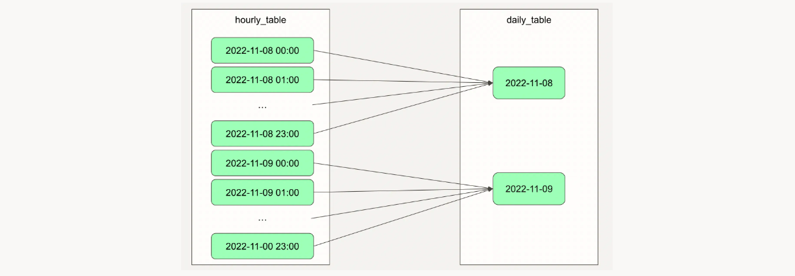
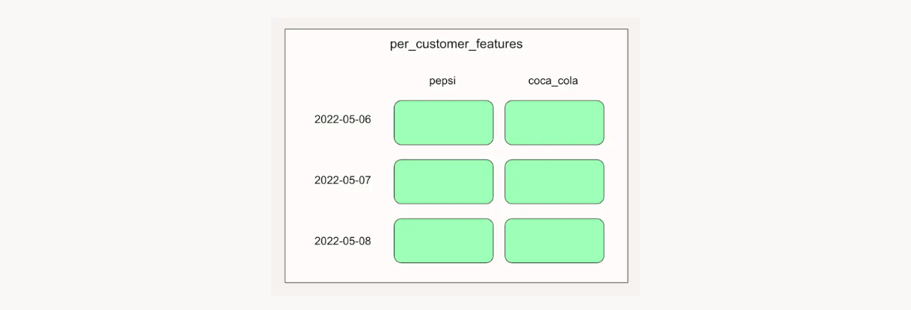

**Analytics Engineering with Airbnb - [ [dbt](https://www.getdbt.com/) ~ Data Build Tool ]**

- [Introduction](#introduction)
  - [Modern data Stack in the AI Era](#modern-data-stack-in-the-ai-era)
  - [slowly changing dimensions SCD](#slowly-changing-dimensions-scd)
  - [dbt™ Overview](#dbt-overview)
- [Project Overview (Analytics Engineering with Airbnb)](#project-overview-analytics-engineering-with-airbnb)
  - [resources](#resources)
  - [snowflake](#snowflake)
  - [Snowflake user creation](#snowflake-user-creation)
  - [Snowflake data import](#snowflake-data-import)
  - [dbt setup](#dbt-setup)
    - [VSC extension : vscode-dbt-power-user](#vsc-extension--vscode-dbt-power-user)
- [Data Flow - Overview](#data-flow---overview)
  - [Models](#models)
    - [Common Table Expression (CTE)](#common-table-expression-cte)
    - [Creating our first model: Airbnb listings](#creating-our-first-model-airbnb-listings)
  - [Materializations](#materializations)
    - [Model Dependencies and dbt's ref tag](#model-dependencies-and-dbts-ref-tag)
    - [Table type materialization \& Project-level Materialization config](#table-type-materialization--project-level-materialization-config)
    - [Incremental materialization](#incremental-materialization)
    - [Ephemeral materialization](#ephemeral-materialization)
  - [Seeds and Sources](#seeds-and-sources)
    - [Seeds](#seeds)
    - [Sources](#sources)
    - [Sources Freshness](#sources-freshness)
  - [Snapshots](#snapshots)
    - [Creating a Snapshot](#creating-a-snapshot)
  - [Tests](#tests)
    - [Implementing Generic Tests in `dim_Listings_Cleaned.sql`](#implementing-generic-tests-in-dim_listings_cleanedsql)
    - [Singular Tests](#singular-tests)
  - [Macros, custom tests and packages](#macros-custom-tests-and-packages)
    - [Installing Third-Party Packages](#installing-third-party-packages)
  - [Documentation](#documentation)
    - [Writing and Exploring Basic Documentation](#writing-and-exploring-basic-documentation)
    - [Markdown-based Docs, Custom Overview Page and Assets](#markdown-based-docs-custom-overview-page-and-assets)
    - [The Linage Graph (Data Flow DAG)](#the-linage-graph-data-flow-dag)
    - [dbt Power User - Lineage and Documentation (optional)](#dbt-power-user---lineage-and-documentation-optional)
  - [Analyses, Hooks and Exposures](#analyses-hooks-and-exposures)
    - [Analyses](#analyses)
    - [Hooks](#hooks)
    - [Setting up a BI Dashboard in Snowflake and Preset](#setting-up-a-bi-dashboard-in-snowflake-and-preset)
      - [Readme](#readme)
    - [Exposures](#exposures)
- [Hero](#hero)
  - [Debugging Tests and Testing with dbt-Great Expectations](#debugging-tests-and-testing-with-dbt-great-expectations)
    - [Great Expectations Overview](#great-expectations-overview)
    - [Comparing row counts between models](#comparing-row-counts-between-models)
    - [Looking for outliers in your data](#looking-for-outliers-in-your-data)
    - [Implementing test warnings for extremal items](#implementing-test-warnings-for-extremal-items)
    - [Validating column types](#validating-column-types)
    - [Monitoring categoriacl variables in the source data](#monitoring-categoriacl-variables-in-the-source-data)
    - [Debugging dbt tests and Working with regular expressions](#debugging-dbt-tests-and-working-with-regular-expressions)
  - [Debugging with Logging](#debugging-with-logging)
    - [Logging to the dbtLog file](#logging-to-the-dbtlog-file)
    - [Disabling Log Messages](#disabling-log-messages)
  - [Using variables](#using-variables)
    - [Working with Jinja Variables](#working-with-jinja-variables)
    - [Working with dbt Variables](#working-with-dbt-variables)
    - [Setting Default Values](#setting-default-values)
    - [Using Date Ranges to Make Incremental Models Production-Ready](#using-date-ranges-to-make-incremental-models-production-ready)
  - [Orchestating dbt with Dagster](#orchestating-dbt-with-dagster)
    - [Overview of the Popular dbt Orchestration Tools and how to Choose the Right Tool](#overview-of-the-popular-dbt-orchestration-tools-and-how-to-choose-the-right-tool)
        - [Airflow](#airflow)
        - [Prefect](#prefect)
        - [Azure Data Factory](#azure-data-factory)
        - [DBT Cloud](#dbt-cloud)
        - [Dagster](#dagster)
    - [Dagster Installation (All Platforms plus Github Codespace)](#dagster-installation-all-platforms-plus-github-codespace)
    - [Deep Dive into the Python Files of our Dagster-dbt Project](#deep-dive-into-the-python-files-of-our-dagster-dbt-project)
    - [Manage, Orchestrate and Debug your dbt Project with Dagster](#manage-orchestrate-and-debug-your-dbt-project-with-dagster)
    - [I suggest you](#i-suggest-you)
    - [Advanced Dagster: Using Partitions with Incremental Models](#advanced-dagster-using-partitions-with-incremental-models)
    - [Advanced Dagster: Using Partitions with Incremental Models](#advanced-dagster-using-partitions-with-incremental-models-1)

---
## Introduction

OBJECTIVES  
* Data-maturity model
* dbt and data architectures
* Data warehouses, data lakes, and lakehouses
* ETL and ELT procedures
* dbt fundamentals
* Analytics Engineering
  


**ETL**


**ELT**
So the world has changed, as you know, of storage costs like two cents these days for every one GB of data. So it was logical to reorganize the traditional ETL workflow.

Data warehouses like Snowflake Redshift and BigQuery are extremely scalable and performant, so it makes sense to do two transformations inside the database rather than external processing layer.

**Data Warehouse**
storing structured data

Typically, you interact with the data warehouse by executing SQL against it. So data warehouses is nothing more than a performance engine that lets us do analytics workloads on our data using sequel. 

**External Tables**
First of all, you pay for the compute nodes, whether they are used or they are not used. And we are not talking about lethal amounts here. In case you have large datasets, that's very pricey. Even if you're a data warehouse. Storage is underutilized as you have small amounts of data, but it requires high analytical workloads.

Second, you can set up auto scaling, but it does that does not necessarily mean you can scale to meet your peak workloads.

There is this concept called external tables.


We have the option to store large files outside of the data warehouse in, for example, Amazon S3 or blob storage. So we can decouple the compute component from the storage component. At this point, we can scale the compute and the storage independently from the data that warehousing the istances.

So now we handle the storage and compute for structured data, but what do we do in case we have unstructured data like images and video videos or text files? Data Lake.

**Data Lake**
unstructured or send structured

You can think of a data lake as a repository where you can put all kinds of data ranging from Rome cleanest, unstructured, semi-structured and so on. It is like a very scalable fire system on premise, this will be called GFS or Hadoop distributed file system, but for cloud. There are others like Amazon S3 or Asia. Is your data lake storage Gen2 a.k.a. address to. 

The point of the data lake is to store files so they have no computer integrated. This means that if you're analytical, workloads increase. You can scale your compute instances independently from storage and your cloud provider will take care of handling external tables itself. If you use `Databricks` or `Snowflake`, these providers will store your data in the data lake by default. And they will only provide you with analytical clusters that you can set up the way you want.

**Data Lakehouse**

Emerged due to the limitations of data lakes. 

It essentially combines the best features of data lakes and data warehouses. In the case of a lake house, we have very similar data structure and data management features that we have in our data warehouse. However, it sits on top of a low cost cloud storage.  What's great in a lake houses is the cost efficient storage provided by your cloud provider. Also, the acid transactional support so you can ensure consistency and that the scheme of the data is stored in a Lake House metal store. Additionally, you can evolve the schema of your tables without having to make a copy of the dataset. As for governance, you can control and authorize access to your data, and we'll get an interface with which you can connect to visitors to the Lake House. 

**ETL process**
The transformations and normalization typically happened in the staging area before the load of the application of the data or the cleansing of the data were performed. As storage prices were high.


**ELT process**
We are now able to shift away from the ETL, extract, transform load data integration, transition of processes to extract loads, transform for easy,


### Modern data Stack in the AI Era

Fivetran and Stitch are one of the most popular extracts and those tools that we have available today. The transformation layer sits on top of a cloud data warehouse and it uses DVT. You have Looker as a BI tool, for example, and sensors for reverse ETL. 

Now, the modern data stack is structured differently than traditional legacy tools. For example, in a traditional data stack, your BI tool would not only handle visualizations but also act as a data warehouse with integrated storage. So, you would have done everything within your BI tool. These tools were massive and complicated. They were vertically integrated since they included storage within the data warehouse, and you performed visualizations in them as well. However, the modern data stack really flattens this out. It is a horizontally integrated set of tools that are fully managed, cloud-based, and both cheap and easy to use. Because corporations realize that data is a product in itself, we now see that DevOps tools are evolving. Not just tools but also practices are becoming part of this modern data stack space and are gaining a lot of popularity. Today, we perform data engineering and analytics engineering, which follow software engineering and DevOps best practices.

The modern data stack is essentially the productionization of the different layers of the data integration flow. DBT (Data Build Tool) plays a key role in this by enabling teams to perform data transformations inside the data warehouse. The creators of DBT developed it as a tool to streamline and standardize the transformation process, making it more efficient and integrated within the data workflow.

### slowly changing dimensions SCD

Think of these as particular data, but it changes rarely and unpredictably, requiring a specific approach to handle referential integrity. when data is changing the source database How that change is reflected in the corresponding data warehouse table decides what data is maintained for further accessibility by the business.
In some cases, storing history data might not be worthwhile, as it might have become obsolete or entirely useless. But for some businesses, historic facts might remain relevant in the future. For example, for historical analyses has simply erasing it would cause the loss of valuable data. There are a number of approaches to considering the data management and data warehousing of seeds called the seed types. Some acid types are used more frequently than others, and there is a reason for that. In the following steps, we will walk through SCD type zero to three and look at some benefits and drawbacks.

> **SCD Type 0**: We want to implement it if some detail may not become worthwhile to maintain anymore for the business.The dimension change is only applied to the source stable and is not transferred to the data warehouse stable.
> 
> * For Airbnb, think of a scenario when a property owner changes his specs, no, he was provided to Airbnb when he first joined the platform.
> Back in 2008, when Airbnb launched businesses, they still used tax numbers to some extent as Airbnb gathered these facts numbers of its clients. By 2010's faxing went entirely out of fashion. Hence, there is no point for Airbnb to apply changes to facts data in its data warehouses anymore. In this case, Airbnb will use seed type zero and simply keep updating the facts data column in the data warehouse table.
>

> **SCD Type 1** : In some cases, when a dying engine changes, only the new value could be important. The reason for the change could be that the original data has become obsolete. In this case, we want to make sure that the new value is transferred to the data warehouse. While there is no point in maintaining historical data. In these scenarios, SCD Type 1 will be our choice, which consists of applying the same dimension change to the corresponding record in a data warehouse as the change that was applied to the record in teh sourde table.
> 
> * When looking for accommodation on Airbnb, you can filter for accommodation with air conditioning, and property owners can provide whether they have air conditioning installed at their place. Now, imagine a situation when a property owner started marketing his flat on Airbnb a while ago, when his flat didn't have air conditioning. But since then he's stalled or decided to install air conditioning at his place to please customers, and therefore he updated his information of its listing to show that his base now has air conditioning installed.
> * For Airbnb, it is no longer relevant that the property did not used to have air conditioning.It only matters that it does now. And so Airbnb will use SCD Type 1 and apply the same data change to their records in the source and the data warehouse staple.

> **SCD Type 2** : There are also situations when both the current and the history data might be important for our business. Besides the current value, history data might also be used for reporting or could be necessary to maintain for future validation. The first approach revealed look at two tackling such a situation is SCD Type 2, when a dimension change leads to an additional rule being added to the data warehouse table four for the new data. But the original or previous data is maintained, so we have a whole overview of what happened. The benefit of actually type two is that all historical historical data is saved after each change, so all historic data remains recoverable from the data warehouse.
> 
> * Additional columns are added to each, according to data warehouse stable, to indicate the time range of validity of the data and to show whether the record contains the current data.
> * Consider rental pricing data for Airbnb property owners may increase or decrease their rental prices whenever they wish. Airbnb wants to perform detailed analysts on changes in the rental prices to understand the market, and so they must maintain all historical data on rental prices.
> * If a property owner changes the rental price of their flat on Airbnb, Airbnb will store both the current and historic rental price. In this case, using gas, the SCD Type 2 can be a good choice for Airbnb as it will transfer the current data to the data warehouse while also making sure historic data is maintained from SCD Type 2.
> * It becomes less obvious which day to use, so we will have to dive deeper into understanding versus best the purpose of what we are trying to achieve.
> * The benefit of SCD type two is that all historic data is maintained, and that is and that it remains easily accessible. But it also increases the amount of data stored. In cases where the number of records is very high to begin with, using SCD Type 2 might not be viable as it might make processing speed unreasonably high.
 

> **SCD Type 3** : 
> There can be scenarios been keeping some history data sufficient. For example, if processing speed is a concern. In these cases, we can decide to do a trade off between not maintaining or history data for the sake of keeping the number of records in our data warehouse stable lower. 
> In case of silly type three, Collins new set of additional rules are used for recording the dimension changes, this type will not maintain historic values other than the original and the current values. So if a dimension changes or it happens more than once, all in the original and the current values will be recoverable from the date of our house. 
> 
> * When looking for accommodation on Airbnb, you can choose between three different types of places: shared rooms, private rooms, and entire places. Now, imagine a property owner started renting a room as a private room. Let's say, some years later, they decide to move out and market their flat as an entire place. Airbnb may want to analyze how properties have had their type changed since joining the platform, but they don't really care about changes that are no longer valid. So, let's say this person who now rents out their entire place decides to move back and lease it as a shared room.
> * In this case, Airbnb no longer keeps the history of the private room, the way the place was listed originally. They only care about the room type that came right before the current one. So, in this case, you care about the fact that the entire place was listed. Therefore, Airbnb can decide to use SCD Type 3, adding additional columns to the data warehouse table to store both the original and the current type of the property. The benefit of Type 3 is that it keeps the number of records lower in the data warehouse table, which allows for more efficient processing.
> * On the other hand, it does not allow for maintaining all historical data and can make the data more difficult to comprehend, as it has to be specified which column contains the original and the current value.

### dbt™ Overview

In short **dbt** is the `T` in

**dbt** doesn't or extract like [fivetran](https://www.fivetran.com/pricing) or [Stitch](https://www.stitchdata.com/), but it transforms data that's loaded in the data warehouse with SQL, select statements.

Let's say we are in a dark room, and your goal is to see what's happening in that room. On the one hand, you can light a candle, but it won't provide enough light to see the entire room. If there are others in the room with you, it will be rather hard for them to see. Once the candle burns out, you are back in the dark. This is a bit like executing a SQL statement: once it's done, it's done.

On the other hand, we now have the possibility to use something much stronger than a candle, like a spotlight, a softbox, or reflectors. These provide more than enough light to illuminate the entire room, allowing everyone to see what's going on. With this powerful lighting, we won't miss a single detail. We will have absolute visibility over every single corner. A spotlight is portable and can easily be moved or carried, and others can use it as well. Multiple people can work simultaneously in a fully illuminated room.

This is the kind of difference I personally feel when working on a **dbt** project. Using **dbt** is like using a spotlight: once you start using it, you'll think, "Wow, how did I not use this before?" DBT allows you to deploy your analytics while following software engineering best practices such as `modularity, portability, CI/CD testing, and documentation`.

To bring it home: With DBT, you will build production-grade data pipelines. What makes it great is that you write your code, compile it to SQL, and execute your data transformations on Snowflake or another data warehouse. Your transformations are version-controlled, easily tested, and, on top of that, you are equipped with automatically built DAGs (Directed Acyclic Graphs) of all your models in your DBT project.

Since DBT interpolates the locations of all the models it generates, it allows you to create different environments like development or production, and you can effortlessly switch between the two. In terms of performance, DBT will take your models (i.e., SQL SELECT statements), understand the dependencies between them, craft a dependency order, and parallelize the way your models are built. And it will run arbitrary subgraph.

## Project Overview (Analytics Engineering with Airbnb)

You will act as if you were an analytics engineer at Airbnb. You’re responsible for all the data flow in Berlin, Germany. This role comes with a lot of responsibilities, so you will need to import your data into a data warehouse and then make this data available for tools like DBT. Then, you will need to clean the data, perform several transformations on it, and export it to BI tools. 

* Simulating the life of an Analytics Engineer in Airbnb. 
* Loading, Cleansing, Exposing data
* Writing test, automations and documentation
* Data source: Inside Airbnb: Berlin

The data we work with here is reliable data, and the data itself comes from the [Inside Airbnb page](https://insideairbnb.com/berlin/)

**Tech Stack**

* [dbt](https://www.getdbt.com/)
* [snowflake](https://www.snowflake.com/en/data-cloud/pricing-options/)
* [preset](https://preset.io/pricing/)

As you start as an analytics engineer in a company, there are several requirements you need to take care of:

**requirements**
>* Modeling changes are easy to follow and revert
>* Explicit dependencies between models
>* Explore dependencies between models
>* Data quality tests
>* Error reporting
>* Incremental load of fact tables
>* Track history of dimension tables
>* Easy-to-access documentation

You want to work in a system where monitoring changes are easy to follow and easy to revert.

* If you can make your model code, it helps a lot because you can version control it. You can track all the changes, collaborate, and revert if needed.
* As you have many steps in your data pipeline, with many views and features feeding and depending on each other, you want to ensure that these dependencies are explicit.
* The framework should know the order in which to execute different steps in your pipeline to achieve a well-transformed result and a good dataset ready for analytics.

Additionally, you want to ensure that these dependencies are not only explicit but also easy to overview.

* It should be easy to explore and understand these dependencies.
* When you build your pipeline, the tool should be able to expose these dependencies in an accessible way.

You also need to make sure that when your pipeline is running, you can test for data quality.

* Ensure your pipeline works as expected.
* If there are any errors, you want to get alerted somehow.

These are probably the basic requirements. As you progress in building out your business logic, you will have a few extra requirements.

* For example, you will have tables that are incremental. New events might come in, and you don't want to rebuild the entire dataset but only add new records at the end of the table.
* In some cases, you want to manage slowly changing dimensions, keeping the history of any changes so you can go back in time.

These are some of the main requirements of a data analytics tool, and DBT is great for managing these.
 
### resources

* [single markdown file](https://github.com/nordquant/complete-dbt-bootcamp-zero-to-hero/blob/main/_course_resources/course-resources.md)
* [dbt project's GitHub page](https://github.com/nordquant/complete-dbt-bootcamp-zero-to-hero)

### snowflake 


* snowflake [link](https://signup.snowflake.com/?utm_cta=trial-en-www-homepage-top-right-nav-ss-evg&_ga=2.74406678.547897382.1657561304-1006975775.1656432605&_gac=1.254279162.1656541671.Cj0KCQjw8O-VBhCpARIsACMvVLPE7vSFoPt6gqlowxPDlHT6waZ2_Kd3-4926XLVs0QvlzvTvIKg7pgaAqd2EALw_wcB)  
* snowflake edition : Standard  
* Provider : AWS Web Service  
* Place : Ohio  


Send you a link: https://boryss-qp53113.snowflakecomputing.com/console/login?activationToken=

Here we are at the Snowflake master user registration page. You see, this is the one which is some random string and the US is to dot IWC. `borysxs-qp53113.`

**Set up dbt's permissions in Snowflake and import our datasets**

Snowflake :
* `+ create : SQL WorkSheet`


### Snowflake user creation

Copy these SQL statements into a Snowflake Worksheet, select all and execute them (i.e. pressing the play button).

If you see a Grant partially executed: privileges [REFERENCE_USAGE] not granted. message when you execute GRANT ALL ON DATABASE AIRBNB to ROLE transform, that's just an info message and you can ignore it.


```SQL
-- Use an admin role
USE ROLE ACCOUNTADMIN;

-- Create the `transform` role
CREATE ROLE IF NOT EXISTS TRANSFORM;
GRANT ROLE TRANSFORM TO ROLE ACCOUNTADMIN;

-- Create the default warehouse if necessary
CREATE WAREHOUSE IF NOT EXISTS COMPUTE_WH;
GRANT OPERATE ON WAREHOUSE COMPUTE_WH TO ROLE TRANSFORM;

-- Create the `dbt` user and assign to role
CREATE USER IF NOT EXISTS dbt
  PASSWORD='dbtPassword123'
  LOGIN_NAME='dbt'
  MUST_CHANGE_PASSWORD=FALSE
  DEFAULT_WAREHOUSE='COMPUTE_WH'
  DEFAULT_ROLE=TRANSFORM
  DEFAULT_NAMESPACE='AIRBNB.RAW'
  COMMENT='DBT user used for data transformation';
GRANT ROLE TRANSFORM to USER dbt;

-- Create our database and schemas
CREATE DATABASE IF NOT EXISTS AIRBNB;
CREATE SCHEMA IF NOT EXISTS AIRBNB.RAW;

-- Set up permissions to role `transform`
GRANT ALL ON WAREHOUSE COMPUTE_WH TO ROLE TRANSFORM; 
GRANT ALL ON DATABASE AIRBNB to ROLE TRANSFORM;
GRANT ALL ON ALL SCHEMAS IN DATABASE AIRBNB to ROLE TRANSFORM;
GRANT ALL ON FUTURE SCHEMAS IN DATABASE AIRBNB to ROLE TRANSFORM;
GRANT ALL ON ALL TABLES IN SCHEMA AIRBNB.RAW to ROLE TRANSFORM;
GRANT ALL ON FUTURE TABLES IN SCHEMA AIRBNB.RAW to ROLE TRANSFORM;
```

Select all and press the play button or pest control, enter.

### Snowflake data import

Copy these SQL statements into a Snowflake Worksheet, select all and execute them (i.e. pressing the play button).


```SQL
-- Set up the defaults
USE WAREHOUSE COMPUTE_WH;
USE DATABASE airbnb;
USE SCHEMA RAW;

-- Create our three tables and import the data from S3
CREATE OR REPLACE TABLE raw_listings
                    (id integer,
                     listing_url string,
                     name string,
                     room_type string,
                     minimum_nights integer,
                     host_id integer,
                     price string,
                     created_at datetime,
                     updated_at datetime);
                    
COPY INTO raw_listings (id,
                        listing_url,
                        name,
                        room_type,
                        minimum_nights,
                        host_id,
                        price,
                        created_at,
                        updated_at)
                   from 's3://dbtlearn/listings.csv'
                    FILE_FORMAT = (type = 'CSV' skip_header = 1
                    FIELD_OPTIONALLY_ENCLOSED_BY = '"');
                    

CREATE OR REPLACE TABLE raw_reviews
                    (listing_id integer,
                     date datetime,
                     reviewer_name string,
                     comments string,
                     sentiment string);
                    
COPY INTO raw_reviews (listing_id, date, reviewer_name, comments, sentiment)
                   from 's3://dbtlearn/reviews.csv'
                    FILE_FORMAT = (type = 'CSV' skip_header = 1
                    FIELD_OPTIONALLY_ENCLOSED_BY = '"');
                    

CREATE OR REPLACE TABLE raw_hosts
                    (id integer,
                     name string,
                     is_superhost string,
                     created_at datetime,
                     updated_at datetime);
                    
COPY INTO raw_hosts (id, name, is_superhost, created_at, updated_at)
                   from 's3://dbtlearn/hosts.csv'
                    FILE_FORMAT = (type = 'CSV' skip_header = 1
                    FIELD_OPTIONALLY_ENCLOSED_BY = '"');
```

this is a public bucket on a street `from 's3://dbtlearn/listings.csv'` from Airbnb and modified a little bit.

Refesh the page:


And you ca see the news tables. Database and be in a schema called RAW


**Setup instructions and Prerequisites**

* PYTHON VERSION : At the time (May 2023), dbt is compatible with Python 3.7, 3.8, 3.9, 3.10, and 3.11, but the supported Python version depends both on the dbt version and on the dbt-snowflake version you install. So make sure to install Python 3.11. DO NOT USE Python 3.12 as dbt doesn't support it.

* GIT : Git needs to be installed on your computer to avoid a (harmless) error message. 

* COPY-PASTING THE SNOWFLAKE PASSWORD : When you set up your dbt project, and it asks for your Snowflake password, type in the password instead of copy-pasting it.

* CREATE YOUR DBT FOLDER MANUALLY (DO THIS OTHERWISE DBT WILL FAIL TO CREATE A NEW PROJECT)

  * Windows: 
    * Make sure to execute mkdir %userprofile%\.dbt in a cmd window to ensure you can create a dbt project (you are instructed to do this in the dbt setup lecture). 
    * If you already have Python, pip, and virtualenv installed, feel free to create a folder for the course (I'm using Desktop/course), create a virtualenv called venv and skip the following two videos about Python setup and Virtualenv.   
  * Mac users: 
    * If you are on a Mac and you don't have a working Python 3.11 installation, we suggest that you install it through brew install `python@3.11 virtualenv`. We have added an optional video to cover the Mac Python installation process.
    * Make sure to execute `mkdir ~/.dbt` in a terminal now to ensure you can create a dbt project as the course progresses (you are instructed to do this in the dbt setup lecture).
  * Linux users:
    * If you use Linux, install a Python 3.11 virtualenv (like apt install python3.11-venv on Ubuntu) and follow the Mac instructions.
  * Using dbt Cloud
    * Currently, we can't support dbt Cloud-based setups. So feel free to give dbt Cloud a shot, but remember that we can only provide you with limited support. Any feedback about your dbt Cloud course experience is very welcome!

```sh
➜  DataEngineer_dbt_Bootcamp git:(main) ✗ python3 --version
Python 3.11.6
➜  DataEngineer_dbt_Bootcamp git:(main) ✗ python3 -m venv dbt_env
➜  DataEngineer_dbt_Bootcamp git:(main) ✗ source dbt_env/bin/activate
(dbt_env) ➜  DataEngineer_dbt_Bootcamp git:(main) ✗ 
(dbt_env) ➜  DataEngineer_dbt_Bootcamp git:(main) ✗ pip install dbt-snowflake==1.7.1
```

### dbt setup

First, you will need to create a DBT configuration folder. The idea is that you got to have a dot DB folder in your home folder.


You have the information here:


```sql
-- -- Create the `dbt` user and assign to role
-- CREATE USER IF NOT EXISTS dbt
--   PASSWORD='dbtPassword123'
--   LOGIN_NAME='dbt'
--   MUST_CHANGE_PASSWORD=FALSE
--   DEFAULT_WAREHOUSE='COMPUTE_WH'
--   DEFAULT_ROLE=TRANSFORM
--   DEFAULT_NAMESPACE='AIRBNB.RAW'
--   COMMENT='DBT user used for data transformation';
-- GRANT ROLE TRANSFORM to USER dbt;

-- -- Create our database and schemas
-- CREATE DATABASE IF NOT EXISTS AIRBNB;
-- CREATE SCHEMA IF NOT EXISTS AIRBNB.RAW;
```
`dbt_learn` is the name of my project.

```sh
(dbt_env) ➜  DataEngineer_dbt_Bootcamp git:(main) ✗ mkdir ~/.dbt
(dbt_env) ➜  DataEngineer_dbt_Bootcamp git:(main) ✗ dbt init dbt_learn
      17:19:41  Running with dbt=1.7.17
      17:19:41  
      Your new dbt project "dbt_learn" was created!

      For more information on how to configure the profiles.yml file,
      please consult the dbt documentation here:
        https://docs.getdbt.com/docs/configure-your-profile

      One more thing:
      Need help? Don't hesitate to reach out to us via GitHub issues or on Slack:
        https://community.getdbt.com/

      Happy modeling!

      17:19:41  Setting up your profile.
      Which database would you like to use?
      [1] snowflake
      (Don't see the one you want? https://docs.getdbt.com/docs/available-adapters)

      Enter a number: 1
      account (https://<this_value>.snowflakecomputing.com): borysxs-qp53113
      user (dev username): dbt
      [1] password
      [2] keypair
      [3] sso
      Desired authentication type option (enter a number): 1
      password (dev password): 
      role (dev role): transform
      warehouse (warehouse name): COMPUTE_WH
      database (default database that dbt will build objects in): AIRBNB
      schema (default schema that dbt will build objects in): DEV
      threads (1 or more) [1]: 
      17:28:22  Profile dbt_learn written to /Users/alex/.dbt/profiles.yml using target's profile_template.yml and your supplied values. Run 'dbt debug' to validate the connection.
```

`threads (1 or more) [1]:` This means that when you execute DB and there are multiple parallel transformations that DB can run, how many DB should use in parallel? It might matter for larger projects when you need to decide how much you want to overload your data wharehouse.

As you see here, it says we have now a DBT profiles YAML created and this stores `.dbt/profiles.yml`.

```sh
(dbt_env) ➜  DataEngineer_dbt_Bootcamp git:(main) tree -L 1
.
├── README.md
├── dbt_env
├── dbt_learn
├── img
└── logs
```

`dbt debug` Makes a connection to your database, and it also checks some of the configuration files and it just, so let's execute DB to debug.

```sh
(dbt_env) ➜  DataEngineer_dbt_Bootcamp git:(main) cd dbt_learn
(dbt_env) ➜  dbt_learn git:(main) ✗ dbt debug
      17:34:25  Running with dbt=1.7.17
      17:34:25  dbt version: 1.7.17
      17:34:25  python version: 3.11.6
      17:34:25  python path: /Users/alex/Desktop/DataEngineer_dbt_Bootcamp/dbt_env/bin/python3.11
      17:34:25  os info: macOS-14.3.1-x86_64-i386-64bit
      17:34:26  Using profiles dir at /Users/alex/.dbt
      17:34:26  Using profiles.yml file at /Users/alex/.dbt/profiles.yml
      17:34:26  Using dbt_project.yml file at /Users/alex/Desktop/DataEngineer_dbt_Bootcamp/dbt_learn/dbt_project.yml
      17:34:26  adapter type: snowflake
      17:34:26  adapter version: 1.7.1
      17:34:26  Configuration:
      17:34:26    profiles.yml file [OK found and valid]
      17:34:26    dbt_project.yml file [OK found and valid]
      17:34:26  Required dependencies:
      17:34:26   - git [OK found]

      17:34:26  Connection:
      17:34:26    account: borysxs-qp53113
      17:34:26    user: dbt
      17:34:26    database: AIRBNB
      17:34:26    warehouse: COMPUTE_WH
      17:34:26    role: transform
      17:34:26    schema: DEV
      17:34:26    authenticator: None
      17:34:26    private_key_path: None
      17:34:26    token: None
      17:34:26    oauth_client_id: None
      17:34:26    query_tag: None
      17:34:26    client_session_keep_alive: False
      17:34:26    host: None
      17:34:26    port: None
      17:34:26    proxy_host: None
      17:34:26    proxy_port: None
      17:34:26    protocol: None
      17:34:26    connect_retries: 1
      17:34:26    connect_timeout: None
      17:34:26    retry_on_database_errors: False
      17:34:26    retry_all: False
      17:34:26    insecure_mode: False
      17:34:26    reuse_connections: None
      17:34:26  Registered adapter: snowflake=1.7.1
      17:34:28    Connection test: [OK connection ok]

      17:34:28  All checks passed!
```
And here you will see that we have several fathers and also five in your beautiful daughter, which is quite a DBT project.

```sh
(dbt_env) ➜  dbt_learn git:(main) tree -L 1   
.
├── README.md
├── analyses
├── dbt_project.yml
├── logs
├── macros
├── models
├── seeds
├── snapshots
└── tests
```

`dbt_project.yml` is our global configuration for this project. So these are standard project level configurations and here are our model level configuration.

```sh
(dbt_env) ➜  dbt_learn git:(main) ✗ cat dbt_project.yml 

# Name your project! Project names should contain only lowercase characters
# and underscores. A good package name should reflect your organization's
# name or the intended use of these models
name: 'dbt_learn'
version: '1.0.0'

# This setting configures which "profile" dbt uses for this project.
profile: 'dbt_learn'

# These configurations specify where dbt should look for different types of files.
# The `model-paths` config, for example, states that models in this project can be
# found in the "models/" directory. You probably won't need to change these!
model-paths: ["models"]
analysis-paths: ["analyses"]
test-paths: ["tests"]
seed-paths: ["seeds"]
macro-paths: ["macros"]
snapshot-paths: ["snapshots"]

clean-targets:         # directories to be removed by `dbt clean`
  - "target"
  - "dbt_packages"


# Configuring models
# Full documentation: https://docs.getdbt.com/docs/configuring-models

# In this example config, we tell dbt to build all models in the example/
# directory as views. These settings can be overridden in the individual model
# files using the `{{ config(...) }}` macro.
models:
  dbt_learn:
    # Config indicated by + and applies to all files under models/example/
    example:
      +materialized: view
```

delete these lines

```sh
    # Config indicated by + and applies to all files under models/example/
    example:
      +materialized: view
```

If you take a look at the model, you see we have some example in water set up here by default. So we like to ask you to delete the example for to just get in the folder itself.

```sh
(dbt_env) ➜  dbt_learn git:(main) ✗ ls -la models
total 0
drwxr-xr-x   3 alex  staff   96 Jul  8 19:14 .
drwxr-xr-x  12 alex  staff  384 Jul  8 19:34 ..
drwxr-xr-x   5 alex  staff  160 Jul  8 19:14 example
```

```sh
my_new_project/
├── analysis/
├── seeds/
├── dbt_packages/
├── macros/
├── models/
│   ├── example/
│   └── README.md
├── snapshots/
├── tests/
├── .gitignore
├── dbt_project.yml
├── packages.yml
└── README.md
```

```
(dbt_env) ➜  dbt_learn git:(main) ✗ rm -r models/example
```

#### VSC extension : [vscode-dbt-power-user](https://marketplace.visualstudio.com/items?itemName=innoverio.vscode-dbt-power-user)


When you are creating a new dbt project and you don't have a `packages.yml `file nor know what dependencies you might need, you can start with an empty packages.yml file. Then, as you develop your project and discover which additional packages might be useful, you can add those dependencies to the file.

```sh
(dbt_env) ➜  dbt_learn git:(main) ✗ cat packages.yml
packages:
  - package: dbt-labs/dbt_utils
    version: 1.2.0
```


```sh
(dbt_env) ➜  dbt_learn git:(main) tree -L 1                   
.
├── README.md
├── analyses
├── dbt_packages
├── dbt_project.yml
├── logs
├── macros
├── models
├── package-lock.yml
├── packages.yml
├── seeds
├── snapshots
├── target
└── tests
```

## Data Flow - Overview

So here is the data flow we are going to build. 

As you see in green, we have three input tables: `Costs, listings, and reviews`.   
* We will import these input tables and make minor modifications in our first layer, the `src (source)` layer.  
* We will then clean these tables and create our dimension tables `dim` and the `fct_reviews` fact table. 
* Additionally, we will use an external table and send data to Snowflake via dbt. 
* With the help of dbt, we will create a few so-called `mart_fullmoon_reviews` tables, which will be used by an executive dashboard. As we do this, we will also create a set of tests, which you can see here in the square.


And let's go and start building our first three mortars, SSD hosts, associate listings and SSD reviews.

INPUT DATA MODEL


Three of these are directly connected to Airbnb. 
* First, the `listing`. 
* Then, the Airbnb `reviews`, which are linked to the `listings` through the `listing ID`.
* Additionally, there are the Airbnb `hosts`, who are also connected to the listings table via the `host ID`. 
* We also have an additional table, which we will upload, called `full_moon_dates`. With the help of this table, you will have the opportunity to examine how full moon phases affect Airbnb reviews.

Previously, we have created [these tables](#snowflake-data-import)


raw listing


raw host


raw reviews


### Models

Objectives:  
* Understand the data flow of our project
* Understand the concept of Models in dbt
* Create three basic models:
  * src_listings
  * src_reviews: guided exercises
  * src_hosts: individual lab

**Models Overview**


* Models are the basic building block of your business logic
* Materialized as tables, views, etc...
* They live in SQL files in the `models` folder
* Models can reference each other and use templates and macros
  
Models are the basic building blocks of your business logic and the foundational elements of a dbt project.  
You can think of models as SQL queries that materialize as tables or views, but there is much more to them.  
For now, what you need to know about models is that they are stored as SQL files in the models folder. 

They are not just simple SQL SELECT statements; they can include additional features. For example, a model can reference other models, allowing dbt to understand the semantic dependencies between them. You can also use different scripts and macros within your models. Now, let's see how they work in action.

#### Common Table Expression (CTE)

CTEs help us write readable and maintainable SQL code. By definition, they are temporary, named result sets that exist only for the duration of a single query. CTEs are great because the result remains in memory during the execution of the query (e.g., SELECT, INSERT, UPDATE, DELETE, or MERGE). The syntax of a CTE looks something like this:

```SQL
# Syntax
WITH name_of_the_result_set (column_names) AS (
    cte_query
)
<reference_the_CTE>
```

The column names are optional and used to set up aliases for the column names that come out of the CTE. A CTE is a SELECT statement, and in reality, it is a temporary result set that can be referenced within the FROM clause of a query, just like any other table. The reference to the CTE is where we execute and use our common table expression.

Let's say we extracted raw data from the source systems via Airbnb. The data is 100% uncleaned, and we want to perform transformations on it. In step one, we create a CTE named `raw_listings`. Then in step two, we have an inner query that selects all columns from the source `listings` table. Finally, in step three, which is an outer query, we reference the CTE `raw_listings`.

In this outer query, we select specific columns from the source, performing simple transformations such as renaming the `id` column to `listing_id` to make it more descriptive.

SQL
Copy code

```SQL
# exemple
-- STEP 1
WITH raw_listings AS (

    -- STEP 2
    SELECT * FROM [source].[listings]
)

-- STEP 3
SELECT
    id AS listing_id,
    listing_url,
    name AS listing_name,
    room_type,
    minimum_nights,
    host_id,
    price AS price_str,
    created_at,
    updated_at
FROM raw_listings;
```

Although a CTE has similar functionality to a view, CTEs are not stored in metadata. We prefer CTEs because they are extremely readable, easy to maintain, and make complex queries more understandable. Furthermore, a query can be divided into separate, simple, logical building blocks, which can then be used to build more complex queries.

Lastly, CTEs can also be defined in functions, stored procedures, triggers, or even views. You will use CTEs many times throughout the course, so you will see plenty of examples soon.

#### Creating our first model: Airbnb listings


As you can see in our raw layer, we have three input tables: `raw_listings`, `raw_hosts`, and `raw_reviews`.  

Now, it's time to create our first staging layer. In this layer, we will prefix every staging table or view with the `src` tag. Our goal here is to build three models: 
* one for listings, 
* one for hosts, 
* and one for reviews.  

These models will be views built on top of the raw data in the `raw_listings`, `raw_hosts`, and `raw_reviews` tables.  
We will make some minor changes to these tables, such as renaming columns, as a first step in cleansing our data.

---
Creating a new model in the `models/src/` folder called `src_rlisting.sql`:


So let's implement our first select statement where we are changing these column names. And it's a standard practice in the analytics community to use CTE common table expressions For all of our input sources. I will create a comfortable expression which points to the role listing stable.


So now it's time to integrate Discovery into DBT. And let's create our first one.

Similar live here in the models folder and you can organize your models into subfolders or you can just keep them at the top level. It really depends on how you like to organize your structure. I would suggest you to organize it into subfolders layer by layer. So let's create our first layer. 

```sh
(dbt_env) ➜  dbt_learn git:(main) ✗ mkdir -p models/src
(dbt_env) ➜  dbt_learn git:(main) ✗ touch models/src/src_listings.sql     # Create src_listings.sql
```

```sh
├── macros
├── models
│   └── src
│       └── src_listings.sql
```

name column change  
* `name AS listing_name`,
* `price AS price_str`,

```sh
(dbt_env) ➜  dbt_learn git:(main) ✗ nano models/src/src_listings.sql
(dbt_env) ➜  dbt_learn git:(main) ✗ cat models/src/src_listings.sql 

  WITH raw_listings AS (
      SELECT * FROM AIRBNB.RAW.RAW_LISTINGS
  )
  SELECT
      id AS listing_id,
      name AS listing_name,
      listing_url,
      room_type,
      minimum_nights,
      host_id,
      price AS price_str,
      created_at,
      updated_at
  FROM
      raw_listings
```

So now Dbt knows that I want to have a view created called src_listings. And this is the definition of the view. So this is my first term placeholder and we will discuss later how you can manage this to be a table. But by default, all our models are going to be views. Save it´s and now let's execute DVT.

dbt run  

```sh
(dbt_env) ➜  dbt_learn git:(main) ✗ dbt run              
  18:35:45  Running with dbt=1.7.17
  18:35:45  Registered adapter: snowflake=1.7.1
  18:35:45  Found 1 model, 0 sources, 0 exposures, 0 metrics, 546 macros, 0 groups, 0 semantic models
  18:35:45  
  18:35:48  Concurrency: 1 threads (target='dev')
  18:35:48  
  18:35:48  1 of 1 START sql view model DEV.src_listings ................................... [RUN]
  18:35:49  1 of 1 OK created sql view model DEV.src_listings .............................. [SUCCESS 1 in 1.57s]
  18:35:49  
  18:35:49  Finished running 1 view model in 0 hours 0 minutes and 4.18 seconds (4.18s).
  18:35:49  
  18:35:49  Completed successfully
  18:35:49  
  18:35:49  Done. PASS=1 WARN=0 ERROR=0 SKIP=0 TOTAL=1
```

Let's take a look in Snowflake. Refresh and look the view


---
Creating a new model in the `models/src/` folder called `src_reviews.sql`:
* Use a CTE to reference the AIRBNB.RAW.RAW_REVIEWS table
* SELECT every column and every record, and rename the following columns:
  * date to review_date
  * comments to review_text
  * sentiment to review_sentiment
* Execute `dbt run` and verify that your model has been created


```sh
(dbt_env) ➜  DataEngineer_dbt_Bootcamp git:(main) ✗ touch dbt_learn/models/src/src_reviews.sql
(dbt_env) ➜  DataEngineer_dbt_Bootcamp git:(main) ✗ nano dbt_learn/models/src/src_reviews.sql 
(dbt_env) ➜  DataEngineer_dbt_Bootcamp git:(main) ✗ cat dbt_learn/models/src/src_reviews.sql

  WITH raw_reviews AS (
      SELECT * FROM AIRBNB.RAW.RAW_REVIEWS
  )
  SELECT
      listing_id,
      date AS review_date,
      reviewer_name,
      comments AS review_text,
      sentiment AS review_sentiment
  FROM
      raw_reviews
```

dbt run  

```sh
(dbt_env) ➜  DataEngineer_dbt_Bootcamp git:(main) ✗ cd dbt_learn 
(dbt_env) ➜  dbt_learn git:(main) ✗ dbt run     
  04:43:21  Running with dbt=1.7.17
  04:43:21  Registered adapter: snowflake=1.7.1
  04:43:21  Found 2 models, 0 sources, 0 exposures, 0 metrics, 546 macros, 0 groups, 0 semantic models
  04:43:21  
  04:43:24  Concurrency: 1 threads (target='dev')
  04:43:24  
  04:43:24  1 of 2 START sql view model DEV.src_listings ................................... [RUN]
  04:43:25  1 of 2 OK created sql view model DEV.src_listings .............................. [SUCCESS 1 in 1.32s]
  04:43:25  2 of 2 START sql view model DEV.src_reviews .................................... [RUN]
  04:43:26  2 of 2 OK created sql view model DEV.src_reviews ............................... [SUCCESS 1 in 1.27s]
  04:43:26  
  04:43:26  Finished running 2 view models in 0 hours 0 minutes and 5.23 seconds (5.23s).
  04:43:26  
  04:43:26  Completed successfully
  04:43:26  
  04:43:26  Done. PASS=2 WARN=0 ERROR=0 SKIP=0 TOTAL=2
```


---
Creating a new model in the `models/src/` folder called `src_hosts.sql`:
* Use a CTE to reference the AIRBNB.RAW.RAW_HOSTS table
* SELECT every column and every record, and rename the following columns:
    * id AS host_id,
    * NAME AS host_name,
* Execute `dbt run` and verify that your model has been created

```sh
(dbt_env) ➜  dbt_learn git:(main) ✗ touch models/src/src_hosts.sql            
(dbt_env) ➜  dbt_learn git:(main) ✗ nano models/src/src_hosts.sql 
(dbt_env) ➜  dbt_learn git:(main) ✗ cat models/src/src_hosts.sql
  WITH raw_hosts AS (
      SELECT * FROM AIRBNB.RAW.RAW_HOSTS
  )
  SELECT
      id AS host_id,
      NAME AS host_name,
      is_superhost,
      created_at,
      updated_at
  FROM
      raw_hosts
```

```sh
(dbt_env) ➜  dbt_learn git:(main) ✗ dbt run
  05:13:40  Running with dbt=1.7.17
  05:13:40  Registered adapter: snowflake=1.7.1
  05:13:41  Found 3 models, 0 sources, 0 exposures, 0 metrics, 546 macros, 0 groups, 0 semantic models
  05:13:41  
  05:13:43  Concurrency: 1 threads (target='dev')
  05:13:43  
  05:13:43  1 of 3 START sql view model DEV.src_hosts ...................................... [RUN]
  05:13:44  1 of 3 OK created sql view model DEV.src_hosts ................................. [SUCCESS 1 in 1.37s]
  05:13:44  2 of 3 START sql view model DEV.src_listings ................................... [RUN]
  05:13:46  2 of 3 OK created sql view model DEV.src_listings .............................. [SUCCESS 1 in 1.31s]
  05:13:46  3 of 3 START sql view model DEV.src_reviews .................................... [RUN]
  05:13:47  3 of 3 OK created sql view model DEV.src_reviews ............................... [SUCCESS 1 in 1.26s]
  05:13:47  
  05:13:47  Finished running 3 view models in 0 hours 0 minutes and 6.49 seconds (6.49s).
  05:13:47  
  05:13:47  Completed successfully
  05:13:47  
  05:13:47  Done. PASS=3 WARN=0 ERROR=0 SKIP=0 TOTAL=3
```

**Created our first model: Airbnb listings**


### Materializations

* Understand how models can be connected
* Understand the four built-in materializations
* Understand how materializations can be configured on the file and project level
* Use dbt run with extra parameters
  
Materializations are different race, how your models can be stored and managed in the data warehouse. There are 4th materializations


* A view is the default materialization in dbt. When you select the "view" materialization, dbt will create a database view for your model. Views are virtual tables that display the results of a stored query. They are lightweight because they don’t store data themselves but instead fetch data dynamically whenever queried.
  With a `view`, you want to use it when you need a lightweight representation of your data and don’t need to recreate a table at every execution. However, avoid using views if you need to read from the same `view` multiple times in quick succession, as each access will require the underlying query to be executed, potentially impacting performance.
* Choosing "table" as your materialization will make dbt create a physical table in your database. Every time you run dbt run, this table will be recreated from scratch. This is useful for models that you query frequently and where performance is important, but it is not ideal for models that are updated incrementally or are only used once.
  For efficient repeated access, consider using the `table` materialization. The downside is that it needs to be recreated every time you run your pipeline, which can take extra time. However, once created, the data is readily available, making subsequent reads fast.
* The "incremental" materialization is designed for scenarios where you need to add new rows to a table without recreating it from scratch every time. This is particularly useful for event data or other types of fact tables where data is continuously appended. However, it is not suitable for updating existing records.
  For data that is `incrementally` updated, such as event data (e.g., orders in an e-commerce system or reviews), the incremental materialization is ideal. This method allows you to append new data without recreating the entire table, optimizing performance and storage.
* An "ephemeral" model in dbt is not materialized into a physical table or view. Instead, it exists only within the context of a dbt run and is used as a Common Table Expression (CTE) in the downstream models. This means that the data is never stored in the database but is used to streamline complex queries within dbt. This is useful for intermediate calculations or transformations that don’t need to be stored permanently.
  Finally, if you need an intermediate step between models without publishing it to the data warehouse, the `ephemeral` materialization is useful. Ephemeral models exist only within the context of a dbt run as Common Table Expressions (CTEs) and do not create physical tables or views in your database, making them ideal for temporary calculations and transformations.

| Materialization | Use it when...                                               | Don’t use it when...                                             | Explanation                                                                                         |
|-----------------|--------------------------------------------------------------|------------------------------------------------------------------|-----------------------------------------------------------------------------------------------------|
| **View**        | You want a lightweight representation and don’t reuse data often | You need to read from the same model several times                | A view creates a virtual table that fetches data dynamically whenever queried.                      |
| **Table**       | You read from this model repeatedly                           | Building single-use models or your model is populated incrementally | A table creates a physical table that is recreated from scratch every time `dbt run` is executed.   |
| **Incremental** | Fact tables or appending to tables                           | You want to update historical records                             | An incremental table adds new rows without recreating the entire table, ideal for event/fact data.  |
| **Ephemeral**   | You need an alias to your data                               | You need to read from the same model several times                | An ephemeral model exists only during a dbt run as a CTE, not materialized in the database.         |


So we will see an example to all of those in the upcoming lessons.

#### Model Dependencies and dbt's ref tag

We are going to build out a new layer, the core layer, core layer comes with a bunch of chambers. From `src_listing` we are going to create `dim_lisitng_cleansed`, etc


And you're going to create our final dimension table by joining these two tables together.


you will see how we can define dependencies between models and how we can create different materializations and apply them in snowflake.

IN snowflakw look you and make sure that you have de views `SRC_HOST`, `SRC_LISTINGS` AND `SRC_REVIEWS`.

---

For `dimension` tables we are to create a new folder in models 

```sh
(dbt_env) ➜  dbt_learn git:(main) ✗ mkdir -p models/dim                       
(dbt_env) ➜  dbt_learn git:(main) ✗ touch models/dim/dim_listings_cleansed.sql
```

Here, I want to build on top of the SLC listings there and the additional dim_listings_clear . 

I have created this file above VSCode app with de extension dbt and jinja configuration.

```SQL
WITH src_liting AS (
    SELECT * FROM {{ ref('src_listings') }}
)

SELECT ...
```

`ref('src_listing')` This is a bdt specific template tag in SQL, which does dbt to substitute this template with the name sql_listing.sql, Technically speaking, it is a [jinja template](https://palletsprojects.com/p/jinja/) tag. The main idea behind Jinjr is that you can define these templates where I have us and also some control structures like loops and conditional statements and ginger passes for you, DVT heavily relies on jinjar.

If you look at the preview of the SRC_LISTINGS Snowflake table, you will notice that several instances in the MINIMUM_NIGHTS column contain zeros. And this is a problem i the data, thre is the minimun of nigths is 1 night that needs to bo booked in order to reserve this Airbnb. And also the price now gold price SDR. It is in a string format, So let's just pass this into our numeric form.


I have created this file above VSCode app with de extension dbt and jinja configuration.

```sh
(dbt_env) ➜  dbt_learn git:(main) ✗ cat models/dim/dim_listings_cleansed.sql 

  WITH src_liting AS (
      SELECT * FROM {{ ref('src_listings') }}
  )
  SELECT
    listing_id,
    listing_name,
    room_type,
    CASE
      WHEN minimum_nights = 0 THEN 1
      ELSE minimum_nights
    END AS minimum_nights,
    host_id,
    REPLACE(
      price_str,
      '$'
    ) :: NUMBER(
      10,
      2
    ) AS price,
    created_at,
    updated_at
  FROM
    src_listings
```

dbt run

```sh
(dbt_env) ➜  dbt_learn git:(main) ✗ dbt run
  07:41:12  Running with dbt=1.7.17
  07:41:12  Registered adapter: snowflake=1.7.1
  07:41:13  Found 4 models, 0 sources, 0 exposures, 0 metrics, 546 macros, 0 groups, 0 semantic models
  07:41:13  
  07:41:18  Concurrency: 1 threads (target='dev')
  07:41:18  
  07:41:18  1 of 4 START sql view model DEV.src_hosts ...................................... [RUN]
  07:41:20  1 of 4 OK created sql view model DEV.src_hosts ................................. [SUCCESS 1 in 1.37s]
  07:41:20  2 of 4 START sql view model DEV.src_listings ................................... [RUN]
  07:41:21  2 of 4 OK created sql view model DEV.src_listings .............................. [SUCCESS 1 in 1.31s]
  07:41:21  3 of 4 START sql view model DEV.src_reviews .................................... [RUN]
  07:41:22  3 of 4 OK created sql view model DEV.src_reviews ............................... [SUCCESS 1 in 1.22s]
  07:41:22  4 of 4 START sql view model DEV.dim_listings_cleansed .......................... [RUN]
  07:41:24  4 of 4 OK created sql view model DEV.dim_listings_cleansed ..................... [SUCCESS 1 in 1.30s]
  07:41:24  
  07:41:24  Finished running 4 view models in 0 hours 0 minutes and 11.11 seconds (11.11s).
  07:41:24  
  07:41:24  Completed successfully
  07:41:24  
  07:41:24  Done. PASS=4 WARN=0 ERROR=0 SKIP=0 TOTAL=4
```


---

Create a new model in the `models/dim/` folder called `dim_hosts_cleansed.sql`.
* Use a CTE to reference the `src_hosts` model
* SELECT every column and every record, and add a cleansing step to
host_name:
  * If host_name is not null, keep the original value
  * If host_name is null, replace it with the value ‘Anonymous’
  * Use the NVL(column_name, default_null_value) function
* Execute `dbt run` and verify that your model has been created

```sh
(dbt_env) ➜  dbt_learn git:(main) ✗ cat models/dim/dim_hosts_cleansed.sql
-- models/dim/dim_hosts_cleansed.sql

WITH src_hosts AS (
    SELECT * FROM {{ ref('src_hosts') }}
)
SELECT 
    host_id,
    NVL(host_name, 'Anonymous') AS host_name,
    is_superhost,
    created_at,
    updated_at
FROM
    src_hosts
```

Explanation:
* CTE (Common Table Expression): defined `src_hosts` to reference the model.
* Cleansing Step: The `host_name` column is cleansed by using the NVL function to replace NULL values with 'Anonymous'.
* Columns Selection: Every column from the `src_hosts` table is selected with the host_name column being modified for cleansing.

```sh
(dbt_env) ➜  dbt_learn git:(main) ✗ dbt run
  10:47:32  Running with dbt=1.7.17
  10:47:32  Registered adapter: snowflake=1.7.1
  10:47:32  Found 5 models, 0 sources, 0 exposures, 0 metrics, 546 macros, 0 groups, 0 semantic models
  10:47:32  
  10:47:36  Concurrency: 1 threads (target='dev')
  10:47:36  
  10:47:36  1 of 5 START sql view model DEV.src_hosts ...................................... [RUN]
  10:47:38  1 of 5 OK created sql view model DEV.src_hosts ................................. [SUCCESS 1 in 1.39s]
  10:47:38  2 of 5 START sql view model DEV.src_listings ................................... [RUN]
  10:47:39  2 of 5 OK created sql view model DEV.src_listings .............................. [SUCCESS 1 in 1.36s]
  10:47:39  3 of 5 START sql view model DEV.src_reviews .................................... [RUN]
  10:47:40  3 of 5 OK created sql view model DEV.src_reviews ............................... [SUCCESS 1 in 1.23s]
  10:47:40  4 of 5 START sql view model DEV.dim_hosts_cleansed ............................. [RUN]
  10:47:42  4 of 5 OK created sql view model DEV.dim_hosts_cleansed ........................ [SUCCESS 1 in 1.29s]
  10:47:42  5 of 5 START sql view model DEV.dim_listings_cleansed .......................... [RUN]
  10:47:43  5 of 5 OK created sql view model DEV.dim_listings_cleansed ..................... [SUCCESS 1 in 1.34s]
  10:47:43  
  10:47:43  Finished running 5 view models in 0 hours 0 minutes and 10.55 seconds (10.55s).
  10:47:43  
  10:47:43  Completed successfully
  10:47:43  
  10:47:43  Done. PASS=5 WARN=0 ERROR=0 SKIP=0 TOTAL=5
```

---

#### Table type materialization & Project-level Materialization config


So far, the only materialization we used is the view materialization, so the default. So we have now these five views in Snowflake.  So we have now these five views in Snowflake 
* `DIM_HOSTS_CLEANSED`, 
* `DIM_LISTINGS_CLEANSED`, 
* `SRC_HOSTS`, 
* `SRC_LISTINGS`, 
* `SRC_REVIEWS`

```sh
├── models
│   ├── dim
│   │   ├── dim_hosts_cleansed.sql
│   │   └── dim_listings_cleansed.sql
│   └── src
│       ├── src_hosts.sql
│       ├── src_listings.sql
│       └── src_reviews.sql
```

But first of all, let's be explicit about our default malitarization. So what I'd like to open how the `dbt_project.yml` and come to the end.  

The `dbt_project.yml` is the file where you can set subfolder and global configurations. I want to specify that my militarization is for you. I can add the new line and just saying `+materialized: view`.

```sh
(dbt_env) ➜  dbt_learn git:(main) ✗ nano dbt_project.yml 

# this lines
models:
  dbt_learn:
        +materialized: view # add this line
```

* `dbt_learn:` This specifies a sub-section within the models configuration. The dbt_learn key corresponds to a specific directory or group of models within your project. In this case, it refers to models located in the dbt_learn directory.
* `+materialized: view` : This line is an added configuration setting for the models in the dbt_learn directory. +materialized is a dbt directive that specifies the materialization strategy for these models. 
* `view` means that dbt will create a database `view` **for each model in the dbt_learn directory**. Views are virtual tables that are defined by a query but do not store data physically.

In this case, you would want the sources `src_hosts`, `src_listings`, and `src_reviews` to be materialized as views because they involve very transformations and probably won't be accessed directly very often. 

However, for `dim_hosts_cleansed` and `dim_listings_cleanset`, which are already cleansed and stable, they will be accessed quite often. Therefore, it makes sense for these to be materialized differently, possibly as tables, to optimize performance for frequent queries.

So I want to make sure that these configurations align with our performance estimates. So will come now and define it as:

```sh
(dbt_env) ➜  dbt_learn git:(main) ✗ nano dbt_project.yml 

# this lines
models:
  dbt_learn:
        +materialized: view 
        dim: # add this line
          +materialized: table # add this line
```

By adding these lines, you are differentiating the materialization between different types of models in your project:

* `Views` for **Lightweight Models (src)**: The `src_hosts`, `src_listings`, and `src_reviews` models are materialized as views because they involve very lightweight transformations and probably won't be accessed directly very often.

* `Tables` for **Cleansed Models (dim)**: The `dim_hosts_cleansed` and `dim_listings_cleansed` models, which are already cleansed and stable, will be materialized as tables because they will be accessed frequently. Materializing them as tables optimizes the performance of frequent queries.
  * `dim` : Specifies another subsection within dbt_learn. The key dim corresponds to specific models within the dim subdirectory in dbt_learn.
  * `+materialized: table` : This line is an added configuration for the models in the dim subdirectory within the dbt_learn directory.
table means that dbt will create a physical table for each model in the dim subdirectory. Tables store data physically, which generally improves the performance of frequent queries.

```sh
(dbt_env) ➜  dbt_learn git:(main) ✗ dbt run
  15:42:07  Running with dbt=1.7.17
  15:42:08  Registered adapter: snowflake=1.7.1
  15:42:08  Found 5 models, 0 sources, 0 exposures, 0 metrics, 546 macros, 0 groups, 0 semantic models
  15:42:08  
  15:42:15  Concurrency: 1 threads (target='dev')
  15:42:15  
  15:42:15  1 of 5 START sql view model DEV.src_hosts ...................................... [RUN]
  15:42:16  1 of 5 OK created sql view model DEV.src_hosts ................................. [SUCCESS 1 in 1.52s]
  15:42:16  2 of 5 START sql view model DEV.src_listings ................................... [RUN]
  15:42:18  2 of 5 OK created sql view model DEV.src_listings .............................. [SUCCESS 1 in 1.52s]
  15:42:18  3 of 5 START sql view model DEV.src_reviews .................................... [RUN]
  15:42:19  3 of 5 OK created sql view model DEV.src_reviews ............................... [SUCCESS 1 in 1.28s]
  15:42:19  4 of 5 START sql table model DEV.dim_hosts_cleansed ............................ [RUN]
  15:42:22  4 of 5 OK created sql table model DEV.dim_hosts_cleansed ....................... [SUCCESS 1 in 2.92s]
  15:42:22  5 of 5 START sql table model DEV.dim_listings_cleansed ......................... [RUN]
  15:42:24  5 of 5 OK created sql table model DEV.dim_listings_cleansed .................... [SUCCESS 1 in 2.37s]
  15:42:24  
  15:42:24  Finished running 3 view models, 2 table models in 0 hours 0 minutes and 15.78 seconds (15.78s).
  15:42:24  
  15:42:24  Completed successfully
  15:42:24  
  15:42:24  Done. PASS=5 WARN=0 ERROR=0 SKIP=0 TOTAL=5
```
and look in the snowflake:


#### Incremental materialization

> In the context of dbt (Data Build Tool), "incremental" refers to a type of materialization that allows updating only a part of the table instead of rebuilding the entire table from scratch every time the model is run. This approach is especially useful for large volumes of data, as it reduces processing time and computational load.

Here we have associate **reviews**, which you are already familiar with, which has a `listing_ID`, `review_dates`, `reviewe_name`, `reviewe_text` and also the `review_sentiment`.


Now we are performing our two steps in the following order:
1. Cleansing: We ensure that only reviews containing actual text are included in our effective table.
2. Incremental Updates: We make sure that these reviews are updated incrementally rather than being recreated during each dbt run.


```sh
(dbt_env) ➜  dbt_learn git:(main) ✗ mkdir -p models/fct
(dbt_env) ➜  dbt_learn git:(main) ✗ touch models/fct/fct_reviews.sql
```

So first, let's create a standard table **without any increment**.

```sh
(dbt_env) ➜  dbt_learn git:(main) ✗ cat models/fct/fct_reviews.sql

WITH src_reviews AS (
    SELECT * FROM {{ ref("src_reviews") }}
)
SELECT * FROM src_reviews
WHERE review_text is not null%  
```
Now, we want to change this **to use incremental materialization**.  
To do this, we will use `Jinja` syntax in dbt to configure our model for incremental updates.  
Here is the configuration:

```sh
{{
    config(
    materialized = 'incremental',
    on_schema_change='fail'
    )
}}
WITH src_reviews AS (
    SELECT * FROM {{ ref("src_reviews") }}
)
SELECT * FROM src_reviews
WHERE review_text is not null
```

Configuration block:
* `materialized = 'incremental'`: This setting configures the model to use incremental materialization. In dbt, incremental models only process and add new or updated data since the last run, rather than rebuilding the entire table. This is useful for large datasets where full refreshes are time-consuming and resource-intensive.
* `on_schema_change='fail'`: This setting specifies the action dbt should take if there is a change in the schema of the source table. Setting this to 'fail' means that the incremental model will fail if there is a schema change detected in the source data. This is a safety measure to prevent unexpected issues caused by schema changes.

Up until now, all views and tables were recreated every time we executed `dbt run`. However, with incremental materialization, we maintain a stable table (`fct_reviews`) that is updated incrementally. 

If there is a schema change upstream, we need to be aware of it and react accordingly.  
By setting `on_schema_change` to 'fail', we ensure that any unexpected schema changes will cause the model to fail, prompting us to address the issue before proceeding.

But I also need to tell DBT how to increment. I need to tell DBT, what are the new records right? How it knows from record that it's new are not.  And here I can go and simply create a jinjar if statements for this. 

```SQL

  AND review_date > (select max(review_date) from {{ this }})

```
* This section uses Jinja templating to add conditional logic to the query. 
* The `is_incremental()` function checks if the model is running in incremental mode. 
* If the model is running incrementally, the condition 
  * `AND review_date > (select max(review_date) from {{ this }})` is added to the 
  * `WHERE` clause `review_text` 
* This ensures that only new records with a review_date greater than the maximum review_date already present in the target table (represented by {{ this }}) are included in the incremental run.

> Now, notice for a second how much freedom this leaves you because. Here, if you want to have some more sophisticated logic, like working on an updated feared or anything doing with IDs, whatever. You're free to express it here in SQL.

From **scr_reviews**, which has a `listing_ID`, `review_dates`, `reviewe_name`, `reviewe_text` and also the `review_sentiment`.

```SQL
(dbt_env) ➜  dbt_learn git:(main) ✗ cat models/fct/fct_reviews.sql
  {{
      config(
      materialized = 'incremental',
      on_schema_change='fail'
      )
  }}
  WITH src_reviews AS (
      SELECT * FROM {{ ref("src_reviews") }}
  )
  SELECT * FROM src_reviews
  WHERE review_text is not null
  
    AND review_date > (select max(review_date) from {{ this }})
  
```

When the model is configured as incremental, the goal is to add only the new data that hasn’t been processed previously. This is useful for saving time and resources by avoiding the processing of old data that hasn't changed. The clause `AND review_date > (select max(review_date) from {{ this }})` ensures that only the data more recent than the data already present in the target table is selected. Here’s the logic:

* `{{ this }}` refers to the table materialized previously by dbt.
* `(select max(review_date) from {{ this }})` fetches the date of the latest review that has already been processed.
* `AND review_date > ...` ensures that only the more recent reviews are selected, excluding those already in the target table.

Non-Incremental (Full Refresh) or in a full refresh mode, every time the model runs, all data is selected, and the target table is rebuilt from scratch. There is no optimization based on dates or other incremental criteria. 

```sh
(dbt_env) ➜  dbt_learn git:(main) ✗ dbt run
16:27:01  Running with dbt=1.7.17
16:27:02  Registered adapter: snowflake=1.7.1
16:27:02  Found 6 models, 0 sources, 0 exposures, 0 metrics, 546 macros, 0 groups, 0 semantic models
16:27:02  
16:27:05  Concurrency: 1 threads (target='dev')
16:27:05  
16:27:05  1 of 6 START sql view model DEV.src_hosts ...................................... [RUN]
16:27:06  1 of 6 OK created sql view model DEV.src_hosts ................................. [SUCCESS 1 in 1.57s]
16:27:06  2 of 6 START sql view model DEV.src_listings ................................... [RUN]
16:27:08  2 of 6 OK created sql view model DEV.src_listings .............................. [SUCCESS 1 in 1.42s]
16:27:08  3 of 6 START sql view model DEV.src_reviews .................................... [RUN]
16:27:09  3 of 6 OK created sql view model DEV.src_reviews ............................... [SUCCESS 1 in 1.41s]
16:27:09  4 of 6 START sql table model DEV.dim_hosts_cleansed ............................ [RUN]
16:27:12  4 of 6 OK created sql table model DEV.dim_hosts_cleansed ....................... [SUCCESS 1 in 2.65s]
16:27:12  5 of 6 START sql table model DEV.dim_listings_cleansed ......................... [RUN]
16:27:14  5 of 6 OK created sql table model DEV.dim_listings_cleansed .................... [SUCCESS 1 in 2.12s]
16:27:14  6 of 6 START sql incremental model DEV.fct_reviews ............................. [RUN]
16:27:19  6 of 6 OK created sql incremental model DEV.fct_reviews ........................ [SUCCESS 1 in 5.60s]
16:27:19  
16:27:19  Finished running 3 view models, 2 table models, 1 incremental model in 0 hours 0 minutes and 17.56 seconds (17.56s).
16:27:19  
16:27:19  Completed successfully
16:27:19  
16:27:19  Done. PASS=6 WARN=0 ERROR=0 SKIP=0 TOTAL=6
```


Let's create an incremental load now. For an incremental load, we need some incremental data, right? First of all, let's take a look at the reviews for listing ID 3176.


**Practical Example**

Imagine you have a reviews table (src_reviews) with millions of records, and only a few new reviews are added each day. With an incremental strategy, you process only those new reviews, which is much faster than reprocessing all millions of records each time.

Let's execute a command to add new reviews.

```SQL
INSERT INTO AIRBNB.RAW.RAW_REVIEWS VALUES (3176, CURRENT_TIMESTAMP(),
'Zoltan','excallent stay!', 'positive');
```

This INSERT command adds a new review to the RAW_REVIEWS table in the RAW schema of the AIRBNB database. It includes the listing ID 3176, the current timestamp as the review date, "Zoltan" as the reviewer's name, "Excellent stay!" as the review text, and "positive" as the sentiment.


And now with dbt run, we pick up and recreate the first reviews and and the two dimensional tables and execute an incremental load on the six model, the fact reviews.

```sh
(dbt_env) ➜  dbt_learn git:(main) ✗ dbt run
    16:39:49  Running with dbt=1.7.17
    16:39:50  Registered adapter: snowflake=1.7.1
    16:39:50  Found 6 models, 0 sources, 0 exposures, 0 metrics, 546 macros, 0 groups, 0 semantic models
    16:39:50  
    16:39:53  Concurrency: 1 threads (target='dev')
    16:39:53  
    16:39:53  1 of 6 START sql view model DEV.src_hosts ...................................... [RUN]
    16:39:54  1 of 6 OK created sql view model DEV.src_hosts ................................. [SUCCESS 1 in 1.43s]
    16:39:54  2 of 6 START sql view model DEV.src_listings ................................... [RUN]
    16:39:55  2 of 6 OK created sql view model DEV.src_listings .............................. [SUCCESS 1 in 1.40s]
    16:39:55  3 of 6 START sql view model DEV.src_reviews .................................... [RUN]
    16:39:57  3 of 6 OK created sql view model DEV.src_reviews ............................... [SUCCESS 1 in 1.21s]
    16:39:57  4 of 6 START sql table model DEV.dim_hosts_cleansed ............................ [RUN]
    16:39:58  4 of 6 OK created sql table model DEV.dim_hosts_cleansed ....................... [SUCCESS 1 in 1.83s]
    16:39:58  5 of 6 START sql table model DEV.dim_listings_cleansed ......................... [RUN]
    16:40:01  5 of 6 OK created sql table model DEV.dim_listings_cleansed .................... [SUCCESS 1 in 2.20s]
    16:40:01  6 of 6 START sql incremental model DEV.fct_reviews ............................. [RUN]
    16:40:05  6 of 6 OK created sql incremental model DEV.fct_reviews ........................ [SUCCESS 1 in 4.01s]
    16:40:05  
    16:40:05  Finished running 3 view models, 2 table models, 1 incremental model in 0 hours 0 minutes and 14.74 seconds (14.74s).
    16:40:05  
    16:40:05  Completed successfully
    16:40:05  
    16:40:05  Done. PASS=6 WARN=0 ERROR=0 SKIP=0 TOTAL=6
```

OK, so it says that it's incremental the one motor.

```SQL
SELECT * FROM AIRBNB.DEV.FCT_REVIEWS WHERE listing_id=3176;
```

The incremental configuration `(materialized = 'incremental')` in dbt is useful for saving time and resources by processing only the new data that hasn’t been processed previously. The clause `AND review_date > (select max(review_date) from {{ this }})` is crucial in this context to ensure only new records are selected and processed.


Now, just one more trick before we go to our next session: what happens if you want to rebuild the entire table? You can do this by running the command `dbt run --full-refresh`.

```sh
(dbt_env) ➜  dbt_learn git:(main) ✗ dbt run --full-refresh
  16:49:59  Running with dbt=1.7.17
  16:50:00  Registered adapter: snowflake=1.7.1
  16:50:00  Found 6 models, 0 sources, 0 exposures, 0 metrics, 546 macros, 0 groups, 0 semantic models
  16:50:00  
  16:50:03  Concurrency: 1 threads (target='dev')
  16:50:03  
  16:50:03  1 of 6 START sql view model DEV.src_hosts ...................................... [RUN]
  16:50:04  1 of 6 OK created sql view model DEV.src_hosts ................................. [SUCCESS 1 in 1.51s]
  16:50:04  2 of 6 START sql view model DEV.src_listings ................................... [RUN]
  16:50:06  2 of 6 OK created sql view model DEV.src_listings .............................. [SUCCESS 1 in 1.38s]
  16:50:06  3 of 6 START sql view model DEV.src_reviews .................................... [RUN]
  16:50:07  3 of 6 OK created sql view model DEV.src_reviews ............................... [SUCCESS 1 in 1.40s]
  16:50:07  4 of 6 START sql table model DEV.dim_hosts_cleansed ............................ [RUN]
  16:50:09  4 of 6 OK created sql table model DEV.dim_hosts_cleansed ....................... [SUCCESS 1 in 2.17s]
  16:50:09  5 of 6 START sql table model DEV.dim_listings_cleansed ......................... [RUN]
  16:50:11  5 of 6 OK created sql table model DEV.dim_listings_cleansed .................... [SUCCESS 1 in 2.05s]
  16:50:11  6 of 6 START sql incremental model DEV.fct_reviews ............................. [RUN]
  16:50:16  6 of 6 OK created sql incremental model DEV.fct_reviews ........................ [SUCCESS 1 in 5.10s]
  16:50:16  
  16:50:16  Finished running 3 view models, 2 table models, 1 incremental model in 0 hours 0 minutes and 16.42 seconds (16.42s).
  16:50:16  
  16:50:16  Completed successfully
  16:50:16  
  16:50:16  Done. PASS=6 WARN=0 ERROR=0 SKIP=0 TOTAL=6
```

Now Every incremental table has been rebuilt.

Now, I won't see any change here, of course, because this will bring me to the same state. However, if you ever change the schema of a source file or table, performing a full refresh will recreate the incremental or table models from scratch. This ensures that all schema changes are properly reflected in your models.


#### Ephemeral materialization

> In the context of dbt (Data Build Tool), "ephemeral" materialization refers to a type of materialization where the model is not stored as a table or view in the database, but is used only as a temporary expression within the dbt compilation process. Ephemeral models exist only during the execution of a dbt operation and do not persist in the database after the operation is complete.
>


The type of materialization for all of the tables we've created so far is shown in the diagram. We still need to create the `dim_listings_with_hosts`, which will be our final dimension table, so we will do that now.


If you think about it, as an Airbnb analytics engineer, once we are done with processing, we end up with two main tables: 
* `dim_listings_with_hosts` and
* `fct_reviews`
  
These tables combine all the necessary data, such as 
* `dim_listings_with_hosts` -> `listings` joined with `hosts information` and 
* `fct_reviews` -> `review details`.

Since these tables are our final, stable tables that we frequently access for analytics, we can keep them stable by materializing them as tables or views. This means, for example, if we have 

* `dim_listings_cleansed` and `dim_hosts_cleansed` materialized as **views**, 

we don't need to create additional tables out of them because we will only read from these views.


> By using **views** for `dim_listings_cleansed` and `dim_hosts_cleansed`, we can simplify our data processing pipeline and ensure that we have `up-to-date` data without the need for redundant table creation.


* `Ephemeral Materialization`: This refers to the practice of using temporary tables or views that do not persistently store data but are instead generated dynamically when needed.
* `Stable Tables`: The fct_reviews and dim_listings_with_hosts are considered stable because they combine all necessary data and are accessed frequently for analytics.
* `Using Views`: By materializing dim_listings_cleansed and dim_hosts_cleansed as views, we avoid creating unnecessary tables and keep our data processing pipeline efficient.
  

We still need to create the dimension table `dim_listings_with_hosts`, which will be our final dimension table. 

So, we will do that. If you think about it from the perspective of an Airbnb analytics engineer, after we are done with the cleansed listings and hosts, we will have two main tables here:

1. `fct_reviews`
2. `dim_listings_with_hosts`

These two tables will be our final tables in the core layer, which we will use repeatedly for analytics. Since 
* `dim_listings_cleansed` and 
* `dim_hosts_cleansed`

are intermediate views needed only for reading and processing, there is no need to convert them into permanent tables. 

> These views are used only during the creation of our final table `dim_listings_with_hosts`.

In summary, we will keep `dim_listings_with_hosts` and `fct_reviews` as our final tables and we don't need to create additional tables for `dim_listings_cleansed` and `dim_hosts_cleansed`. These can remain as views that get converted into CTEs (Common Table Expressions) during integration into the final tables.

So, this is what we will do: we will create the final table `dim_listings_with_hosts`.


```sh
(dbt_env) ➜  dbt_learn git:(main) touch models/dim/dim_listings_w_hosts.sql
(dbt_env) ➜  dbt_learn git:(main) ✗ nano models/dim/dim_listings_w_hosts.sql
(dbt_env) ➜  dbt_learn git:(main) ✗ cat models/dim/dim_listings_w_hosts.sql
  WITH
  l AS (
      SELECT
          *
      FROM
          {{ ref('dim_listings_cleansed') }}
  ),
  h AS (
      SELECT * 
      FROM {{ ref('dim_hosts_cleansed') }}
  )

  SELECT 
      l.listing_id,
      l.listing_name,
      l.room_type,
      l.minimum_nights,
      l.price,
      l.host_id,
      h.host_name,
      h.is_superhost as host_is_superhost,
      l.created_at,
      GREATEST(l.updated_at, h.updated_at) as updated_at
  FROM l
  LEFT JOIN h ON (h.host_id = l.host_id)
```

This script creates a CTE (Common Table Expression) for our listings and hosts.
* We reference the cleansed listings and hosts tables (`dim_listings_cleansed` and `dim_hosts_cleansed`) and read every column from these two tables.
* We also rename the column `is_superhost` to `host_is_superhost`.
* For the `updated_at` field, we ensure we keep the most recent update from either the listing or the host.

This is a simple and effective way to combine the listings and hosts into our final dimension table `dim_listings_with_hosts`.

```sh
(dbt_env) ➜  dbt_learn git:(main) ✗ dbt run
  17:08:06  Running with dbt=1.7.17
  17:08:06  Registered adapter: snowflake=1.7.1
  17:08:06  Found 7 models, 0 sources, 0 exposures, 0 metrics, 546 macros, 0 groups, 0 semantic models
  17:08:06  
  17:08:17  Concurrency: 1 threads (target='dev')
  17:08:17  
  17:08:17  1 of 7 START sql view model DEV.src_hosts ...................................... [RUN]
  17:08:18  1 of 7 OK created sql view model DEV.src_hosts ................................. [SUCCESS 1 in 1.77s]
  17:08:18  2 of 7 START sql view model DEV.src_listings ................................... [RUN]
  17:08:20  2 of 7 OK created sql view model DEV.src_listings .............................. [SUCCESS 1 in 1.40s]
  17:08:20  3 of 7 START sql view model DEV.src_reviews .................................... [RUN]
  17:08:21  3 of 7 OK created sql view model DEV.src_reviews ............................... [SUCCESS 1 in 1.63s]
  17:08:21  4 of 7 START sql table model DEV.dim_hosts_cleansed ............................ [RUN]
  17:08:24  4 of 7 OK created sql table model DEV.dim_hosts_cleansed ....................... [SUCCESS 1 in 2.97s]
  17:08:24  5 of 7 START sql table model DEV.dim_listings_cleansed ......................... [RUN]
  17:08:27  5 of 7 OK created sql table model DEV.dim_listings_cleansed .................... [SUCCESS 1 in 2.39s]
  17:08:27  6 of 7 START sql incremental model DEV.fct_reviews ............................. [RUN]
  17:08:31  6 of 7 OK created sql incremental model DEV.fct_reviews ........................ [SUCCESS 0 in 4.11s]
  17:08:31  7 of 7 START sql table model DEV.dim_listings_w_hosts .......................... [RUN]
  17:08:33  7 of 7 OK created sql table model DEV.dim_listings_w_hosts ..................... [SUCCESS 1 in 1.98s]
  17:08:33  
  17:08:33  Finished running 3 view models, 3 table models, 1 incremental model in 0 hours 0 minutes and 26.77 seconds (26.77s).
  17:08:33  
  17:08:33  Completed successfully
  17:08:33  
  17:08:33  Done. PASS=7 WARN=0 ERROR=0 SKIP=0 TOTAL=7
```


Now that we are done with our basic modeling, let's clean up the materialization settings.

--- 

In this explanation, we will fix the project-level materialization settings in our dbt project to ensure that source layer models are not materialized as tables or views but instead are treated as ephemeral models. Ephemeral models are not materialized directly in the database; instead, their SQL is inlined into the models that reference them.

First, we will fix the project-level materialization. In the source layer, as discussed, we don't need any tables to be materialized permanently. Therefore, we will set the materialization to `ephemeral` for the source layer.

`dbt_project.yml`:

```yaml
models:
  dbt_learn:
    +materialized: view
    dim:
      +materialized: table
    src:
      +materialized: ephemeral
```

When I execute `dbt run` now, every model in the source layer will be converted to CTEs and won't be recreated as views. Here you can see the process:

- The development models and the dimension tables will be recreated.
- No materialization changes will occur for the source models, even though they are still part of the project.

Here is an example output of running `dbt run`:

```sh
(dbt_env) ➜  dbt_learn git:(main) ✗ dbt run                      
  06:59:46  Running with dbt=1.7.17
  06:59:46  Registered adapter: snowflake=1.7.1
  06:59:47  Found 7 models, 0 sources, 0 exposures, 0 metrics, 546 macros, 0 groups, 0 semantic models
  06:59:47  
  06:59:52  Concurrency: 1 threads (target='dev')
  06:59:52  
  06:59:52  1 of 4 START sql table model DEV.dim_hosts_cleansed ............................ [RUN]
  06:59:55  1 of 4 OK created sql table model DEV.dim_hosts_cleansed ....................... [SUCCESS 1 in 2.63s]
  06:59:55  2 of 4 START sql table model DEV.dim_listings_cleansed ......................... [RUN]
  06:59:57  2 of 4 OK created sql table model DEV.dim_listings_cleansed .................... [SUCCESS 1 in 2.31s]
  06:59:57  3 of 4 START sql incremental model DEV.fct_reviews ............................. [RUN]
  07:00:01  3 of 4 OK created sql incremental model DEV.fct_reviews ........................ [SUCCESS 0 in 3.71s]
  07:00:01  4 of 4 START sql table model DEV.dim_listings_w_hosts .......................... [RUN]
  07:00:03  4 of 4 OK created sql table model DEV.dim_listings_w_hosts ..................... [SUCCESS 1 in 2.32s]
  07:00:03  
  07:00:03  Finished running 3 table models, 1 incremental model in 0 hours 0 minutes and 16.83 seconds (16.83s).
  07:00:03  
  07:00:03  Completed successfully
  07:00:03  
  07:00:03  Done. PASS=4 WARN=0 ERROR=0 SKIP=0 TOTAL=4
```

You can see, when I executed dbt run:
```sh
1 of 4 OK created sql table model DEV.dim_hosts_cleansed
2 of 4 OK created sql table model DEV.dim_listings_cleansed
3 of 4 OK created sql incremental model DEV.fct_reviews
4 of 4 OK created sql table model DEV.dim_listings_w_hosts
```

Then every model in the source layer will be converted to CTEs and won't be recreated as views. The development models and the dimension tables will be recreated, right? And that's very much it. No materialization changes will occur for the source models, even though they are still part of the project.

To verify this behavior, you can check the current views in Snowflake. If you still see views for the source models, it means they were not automatically dropped. You'll need to manually drop these views. After doing so, running dbt run again will ensure that these views are not recreated, confirming that the source models are now correctly treated as ephemeral models


The reason for this is that dbt will not automatically drop views or tables in these cases. So you need to do it yourself. 


Let's go ahead and drop these views. Here we go. Now, these views are dropped. So if I come back and execute dbt run again, we will see that these views will not be recreated. So here we go. Refresh, no views, right?

So that's it now. These are ephemeral models, right?


```sh
(dbt_env) ➜  dbt_learn git:(main) ✗ dbt run        

14:48:00  Running with dbt=1.7.17
14:48:00  Registered adapter: snowflake=1.7.1
14:48:01  Found 7 models, 0 sources, 0 exposures, 0 metrics, 546 macros, 0 groups, 0 semantic models
14:48:01  
14:48:03  Concurrency: 1 threads (target='dev')
14:48:03  
14:48:03  1 of 4 START sql table model DEV.dim_hosts_cleansed ............................ [RUN]
14:48:05  1 of 4 OK created sql table model DEV.dim_hosts_cleansed ....................... [SUCCESS 1 in 1.90s]
14:48:05  2 of 4 START sql table model DEV.dim_listings_cleansed ......................... [RUN]
14:48:07  2 of 4 OK created sql table model DEV.dim_listings_cleansed .................... [SUCCESS 1 in 1.92s]
14:48:07  3 of 4 START sql incremental model DEV.fct_reviews ............................. [RUN]
14:48:10  3 of 4 OK created sql incremental model DEV.fct_reviews ........................ [SUCCESS 0 in 3.35s]
14:48:10  4 of 4 START sql table model DEV.dim_listings_w_hosts .......................... [RUN]
14:48:12  4 of 4 OK created sql table model DEV.dim_listings_w_hosts ..................... [SUCCESS 1 in 1.97s]
14:48:12  
14:48:12  Finished running 3 table models, 1 incremental model in 0 hours 0 minutes and 11.72 seconds (11.72s).
14:48:12  
14:48:12  Completed successfully
14:48:12  
14:48:12  Done. PASS=4 WARN=0 ERROR=0 SKIP=0 TOTAL=4

```

And if you take a look, you'll remember that in the project properties, we have a target path defined, right?

So it says that the target path is target or the compound directory qualifies to be there.

```yml
target-path: "target"  # directory which will store compiled SQL files
clean-targets:         # directories to be removed by `dbt clean`
  - "target"
  - "dbt_packages"
```

```sh
├── target
│   ├── compiled
│   │   └── dbt_learn
│   │       └── models
│   │           ├── dim
│   │           │   ├── dim_hosts_cleansed.sql
│   │           │   ├── dim_listings_cleansed.sql
│   │           │   └── dim_listings_w_hosts.sql
│   │           ├── fct
│   │           │   └── fct_reviews.sql
│   │           └── src
│   │               ├── src_hosts.sql
│   │               ├── src_listings.sql
│   │               └── src_reviews.sql
```

Project properties, we have a target folder defined, right? So it says that the target path is target. All the compiled SQL files will be there. So if I take a look and I say just check from target, I have a folder called run, and in the run I have the models, and in models I have, here we go, let's say some DIM tables, and let's take a look at the DIM listings cleansed, for example. So if I take a look at the final compiled SQL, the SQL that dbt actually executes in Snowflake, I will find it here and I will be able to check it. So let's take a look, and here we are. 

```sh
(dbt_env) ➜  dbt_learn git:(main) ✗ ls -la target/run/dbt_learn/models/dim/                   

-rw-r--r--  1 alex  staff  567 Jul 13 17:00 dim_hosts_cleansed.sql
-rw-r--r--  1 alex  staff  808 Jul 13 17:00 dim_listings_cleansed.sql
-rw-r--r--  1 alex  staff  564 Jul 13 17:00 dim_listings_w_hosts.sql

(dbt_env) ➜  dbt_learn git:(main) ✗ code target/run/dbt_learn/models/dim/dim_listings_cleansed.sql 
```

So this is now the DIMM listing cleansed. This is the actual SQL that was passed to Snowflake. So here you see it says we created the DIM listings cleansed, and here is a CT, it says this is a dbtct src listing, an internal identifier which has the listing CT and then the listings cleansed script. So this is where everything gets together. If you ever want to debug a dbt run, then your target folder is where you want to take a look at what dbt executed against Snowflake.

---

The last thing I want to show you is how you can convert some of our DIM models into Views. 

```sh
├── target
│   ├── compiled
│   │   └── dbt_learn
│   │       └── models
│   │           ├── dim
│   │           │   ├── dim_hosts_cleansed.sql
│   │           │   ├── dim_listings_cleansed.sql
│   │           │   └── dim_listings_w_hosts.sql
```

Now you already know, if you take a look at the Factory Views table, how to create a file level config. I will simply go on and take `dim_Listings_cleansed` and `dim_hosts_cleansed` and make sure that those are materialized as Views.

And the way to go will be simply just adding this materialization `config `here, saying that I don't want these to be materialized as Tables, I want these to be materialized as Views, like this. Okay, let's go ahead and do the same with the Hosts table.

```SQL
(dbt_env) ➜  dbt_learn git:(main) ✗ cat models/dim/dim_listings_cleansed.sql 

  -- models/dim/dim_hosts_cleansed.sql
  {{
    config(
      materialized = 'view'
      )
  }} 
  WITH src_hosts AS (
      SELECT
          *
      FROM
          {{ ref('src_hosts') }}
  )
  SELECT
      host_id,
      NVL(
          host_name,
          'Anonymous'
      ) AS host_name,
      is_superhost,
      created_at,
      updated_at
  FROM
      src_hosts
```

```SQL
(dbt_env) ➜  dbt_learn git:(main) ✗ cat models/dim/dim_listings_cleansed.sql 

  -- models/dim/dim_listings_cleansed.sql
  {{
    config(
      materialized = 'view'
      )
  }} 
  WITH src_listings AS (
      SELECT * FROM {{ ref('src_listings') }}
  )
  SELECT 
    listing_id,
    listing_name,
    room_type,
    CASE
      WHEN minimum_nights = 0 THEN 1
      ELSE minimum_nights
    END AS minimum_nights,
    host_id,
    REPLACE(
      price_str,
      '$'
    ) :: NUMBER(
      10,
      2
    ) AS price,
    created_at,
    updated_at
  FROM
    src_listings
```

So `dim_listings_w_host` materializers table, because everything in `/dim/` is by default materialized as table, right? Based on my project YAML. And `factory` views materializes an incremental table, and `dim_listings_cleansed`, and `dim_hosts_cleaned`, materializes views. And `SRC` listings not materialized at all, so materializes ephemeral. 

So let's execute DBT for the last time, and make sure that we have now views instead of tables.

```sh
(dbt_env) ➜  dbt_learn git:(main) ✗ dbt run

  18:02:21  Running with dbt=1.7.17
  18:02:22  Registered adapter: snowflake=1.7.1
  18:02:22  Found 7 models, 0 sources, 0 exposures, 0 metrics, 546 macros, 0 groups, 0 semantic models
  18:02:22  
  18:02:25  Concurrency: 1 threads (target='dev')
  18:02:25  
  18:02:25  1 of 4 START sql view model DEV.dim_hosts_cleansed ............................. [RUN]
  18:02:26  1 of 4 OK created sql view model DEV.dim_hosts_cleansed ........................ [SUCCESS 1 in 1.66s]
  18:02:26  2 of 4 START sql view model DEV.dim_listings_cleansed .......................... [RUN]
  18:02:28  2 of 4 OK created sql view model DEV.dim_listings_cleansed ..................... [SUCCESS 1 in 1.31s]
  18:02:28  3 of 4 START sql incremental model DEV.fct_reviews ............................. [RUN]
  18:02:31  3 of 4 OK created sql incremental model DEV.fct_reviews ........................ [SUCCESS 0 in 3.50s]
  18:02:31  4 of 4 START sql table model DEV.dim_listings_w_hosts .......................... [RUN]
  18:02:34  4 of 4 OK created sql table model DEV.dim_listings_w_hosts ..................... [SUCCESS 1 in 2.47s]
  18:02:34  
  18:02:34  Finished running 2 view models, 1 incremental model, 1 table model in 0 hours 0 minutes and 11.60 seconds (11.60s).
  18:02:34  
  18:02:34  Completed successfully
  18:02:34  
  18:02:34  Done. PASS=4 WARN=0 ERROR=0 SKIP=0 TOTAL=4
```

Now we have it like views


### Seeds and Sources

LEARNING OBJECTIVES
* Understand the difference between seeds and sources
* Understand source-freshness
* Integrate sources into our project

**Seeds and Sources OVERVIEW**

* Seeds are local files that you upload to the data warehouse from dbt
* Sources is an abstraction layer on the top of your input tables
* Source freshness can be checked automatically


When you do modeling in DBT, your input data can come from two sources. 
* Either it's already in the data warehouse, having been integrated by an integration tool like FileStream, AirByte, or any custom ETL tool or ETL process. 
* Or, it's a smaller dataset that you want to send directly from your laptop to the data warehouse, which is called a seed. 

If the data is already in the data warehouse, it is called a source in DBT. DBT provides tools for defining seeds and sources and ensuring that your sources are up-to-date and alerting you to stale or outdated sources. Let's see how this works in practice.

#### Seeds

Seeds are smaller datasets that live in the seeds folder as CSV files. First, ensure that your dbt_project.yml file specifies the seeds folder correctly. 

```yml
# These configurations specify where dbt should look for different types of files.
# The `model-paths` config, for example, states that models in this project can be
# found in the "models/" directory. You probably won't need to change these!
seed-paths: ["seeds"]
```
If you have a folder named data, please rename it to seeds. Next, we will take a CSV file, which you can get from the class resources or other sources, and copy it to the seeds folder. 

```sh
(dbt_env) ➜  dbt_learn git:(main) ✗ curl https://dbtlearn.s3.us-east-2.amazonaws.com/seed_full_moon_dates.csv -o seeds/seed_full_moon_dates.csv
  % Total    % Received % Xferd  Average Speed   Time    Time     Time  Current
                                 Dload  Upload   Total   Spent    Left  Speed
100  3007  100  3007    0     0    845      0  0:00:03  0:00:03 --:--:--   845
```

```sh
├── seeds
│   └── seed_full_moon_dates.csv
```
In this .csv there are the day is for the last 10 years or so where there was a full moon. Now, what we are after is to check if people give more negative results after full_moon_dat.

We will then upload it to Snowflake through DBT. It's a simple process. Let's go ahead and populate our seeds folder with the CSV file. I have a CSV file ready. Now, let me go to my terminal.

You see that this year is a single currency week, but you don't necessarily need to work with a single


```sh
(dbt_env) ➜  dbt_learn git:(main) ✗ dbt seed
18:23:24  Running with dbt=1.7.17
18:23:24  Registered adapter: snowflake=1.7.1
18:23:25  Found 7 models, 1 seed, 0 sources, 0 exposures, 0 metrics, 546 macros, 0 groups, 0 semantic models
18:23:25  
18:23:30  Concurrency: 1 threads (target='dev')
18:23:30  
18:23:30  1 of 1 START seed file DEV.seed_full_moon_dates ................................ [RUN]
18:23:34  1 of 1 OK loaded seed file DEV.seed_full_moon_dates ............................ [INSERT 272 in 3.23s]
18:23:34  
18:23:34  Finished running 1 seed in 0 hours 0 minutes and 8.95 seconds (8.95s).
18:23:34  
18:23:34  Completed successfully
18:23:34  
18:23:34  Done. PASS=1 WARN=0 ERROR=0 SKIP=0 TOTAL=1
```


DBT internally analyzes your CSV files and automatically determines the schema, including the data types of columns.

---

Now we are ready to implement our fourth layer, which will be our Mart layer. The Mart layer typically contains tables and views accessible by BI tools.

```sh
(dbt_env) ➜  dbt_learn git:(main) ✗ cat models/mart/mart_full_moon_reviews.sql

  {{ config(
    materialized = 'table',
  ) }}

  WITH fct_reviews AS (
      SELECT * FROM {{ ref('fct_reviews') }}
  ),
  full_moon_dates AS (
      SELECT * FROM {{ ref('seed_full_moon_dates') }}
  )

  SELECT
    r.*,
    CASE
      WHEN fm.full_moon_date IS NULL THEN 'not full moon'
      ELSE 'full moon'
    END AS is_full_moon
  FROM
    fct_reviews
    r
    LEFT JOIN full_moon_dates
    fm
    ON (TO_DATE(r.review_date) = DATEADD(DAY, 1, fm.full_moon_date))
```

* Configures the model to be materialized as a table.
* Creates two Common Table Expressions (CTEs):
  * `fct_reviews`: Selects all data from the fct_reviews table.
  * `full_moon_dates`: Selects all data from the seed_full_moon_dates seed.
* Performs a LEFT JOIN between fct_reviews and full_moon_dates, matching review dates with the day after a full moon date.
* Adds a column is_full_moon to indicate whether the review date is the day after a full moon ('full moon') or not ('not full moon').

```sh
(dbt_env) ➜  dbt_learn git:(main) ✗ dbt run
  18:42:10  Running with dbt=1.7.17
  18:42:11  Registered adapter: snowflake=1.7.1
  18:42:11  Found 8 models, 1 seed, 0 sources, 0 exposures, 0 metrics, 546 macros, 0 groups, 0 semantic models
  18:42:11  
  18:42:13  Concurrency: 1 threads (target='dev')
  18:42:13  
  18:42:14  1 of 5 START sql view model DEV.dim_hosts_cleansed ............................. [RUN]
  18:42:15  1 of 5 OK created sql view model DEV.dim_hosts_cleansed ........................ [SUCCESS 1 in 1.33s]
  18:42:15  2 of 5 START sql view model DEV.dim_listings_cleansed .......................... [RUN]
  18:42:16  2 of 5 OK created sql view model DEV.dim_listings_cleansed ..................... [SUCCESS 1 in 1.30s]
  18:42:16  3 of 5 START sql incremental model DEV.fct_reviews ............................. [RUN]
  18:42:20  3 of 5 OK created sql incremental model DEV.fct_reviews ........................ [SUCCESS 0 in 3.63s]
  18:42:20  4 of 5 START sql table model DEV.dim_listings_w_hosts .......................... [RUN]
  18:42:22  4 of 5 OK created sql table model DEV.dim_listings_w_hosts ..................... [SUCCESS 1 in 2.39s]
  18:42:22  5 of 5 START sql table model DEV.mart_full_moon_reviews ........................ [RUN]
  18:42:27  5 of 5 OK created sql table model DEV.mart_full_moon_reviews ................... [SUCCESS 1 in 4.61s]
  18:42:27  
  18:42:27  Finished running 2 view models, 1 incremental model, 2 table models in 0 hours 0 minutes and 15.98 seconds (15.98s).
  18:42:27  
  18:42:27  Completed successfully
  18:42:27  
  18:42:27  Done. PASS=5 WARN=0 ERROR=0 SKIP=0 TOTAL=5
```


#### Sources

Let's convert our raw tables into sources. Sources are an abstraction on top of your input data, providing extra features like data freshness checks. Additionally, as you will see later in the documentation, sources appear as special entities. This process will not change the actual behavior of DBT or the queries it executes, but it will make our project more structured.

To define sources, follow these steps:

```sh
(dbt_env) ➜  dbt_learn git:(main) ✗ cat models/sources.yml
version: 2

sources:
  - name: airbnb
    schema: raw
    tables:
      - name: listings
        identifier: raw_listings

      - name: hosts
        identifier: raw_hosts

      - name: reviews
        identifier: raw_reviews
```

* sources: Defines the list of sources.
  * name: airbnb: The name of the source. This creates a namespace for the source tables.
  * schema: raw: Specifies the schema in the database where the source tables are located.
  * tables: Lists the tables included in the source.
    * name: listings: The name by which the table will be referenced in DBT.
    * identifier: raw_listings: The actual name of the table in the database.
<br>  
    * name: hosts: The name by which the table will be referenced in DBT.
    * identifier: raw_hosts: The actual name of the table in the database.
<br> 
    * name: reviews: The name by which the table will be referenced in DBT.
    * identifier: raw_reviews: The actual name of the table in the database.


In DBT, configuring sources adds an abstraction layer over raw tables, enhancing project structure and organization. It allows easy referencing of tables as sources, enables freshness checks to ensure data is up-to-date, and improves documentation and data traceability. This setup simplifies maintenance and schema change management, without altering query behavior, but structures the project more efficiently and robustly.

Let's go to my source there was because here I found those motors which refer and throw them both.

```sh
│   └── src
│       ├── src_hosts.sql
│       ├── src_listings.sql
│       └── src_reviews.sql
```

So if I open raw listings.  Then you will see that here `SELECT * FROM AIRBNB.RAW.RAW_LISTINGS` we use a direct reference to our snowflake is right. 

```SQL
WITH raw_listings AS (
    SELECT * FROM AIRBNB.RAW.RAW_LISTINGS
)
SELECT ...
```

What happens if these tables move or you have different instances using different schemas? This is where sources and this abstraction help you. By using sources, you can simplify your references. For example, instead of directly referencing a table, you reference your sources. We pass the source name, such as bmb, and then, in our case, listings. 

```SQL
(dbt_env) ➜  dbt_learn git:(main) ✗ cat /Users/alex/Desktop/DataEngineer_dbt_Bootcamp/dbt_learn/models/src/src_listings.sql

  WITH raw_listings AS (
      SELECT * FROM {{ source('airbnb', 'listings') }}
  )
  SELECT ...
```

This way, DBT will recognize that you are referring to `raw` through the alias `airbnb`. You can do the same with raw_hosts host in the hosts file and with raw_reviews. 

```SQL
(dbt_env) ➜  dbt_learn git:(main) ✗ cat /Users/alex/Desktop/DataEngineer_dbt_Bootcamp/dbt_learn/models/src/src_hosts.sql   

WITH raw_hosts AS (
    SELECT * FROM {{ source('airbnb', 'hosts') }}
)
SELECT
    id AS host_id,
    NAME AS host_name,
    is_superhost,
    created_at,
    updated_at
FROM
    raw_hosts
```

```SQL
(dbt_env) ➜  dbt_learn git:(main) ✗ cat /Users/alex/Desktop/DataEngineer_dbt_Bootcamp/dbt_learn/models/src/src_reviews.sql

WITH raw_reviews AS (
    SELECT * FROM {{ source('airbnb', 'reviews') }}
SELECT
    listing_id,
    date AS review_date,
    reviewer_name,
    comments AS review_text,
    sentiment AS review_sentiment
FROM
    raw_reviews
```

This makes the project more structured. Let's see if it works.

I will not execute this with dbt run, because we have another command just for checking if all the template tags and the connections and everything we defined in our project make sense. This is called dbt, dbt compile. With dbt compile, dbt goes through all of your models, the YAML files and tests and all, and it will check if all of the references and template tags and everything is correct. And it says, OK.

```sh
(dbt_env) ➜  dbt_learn git:(main) ✗ dbt compile
19:26:04  Running with dbt=1.7.17
19:26:05  Registered adapter: snowflake=1.7.1
19:26:05  Found 8 models, 1 seed, 3 sources, 0 exposures, 0 metrics, 546 macros, 0 groups, 0 semantic models
19:26:05  
19:26:06  Concurrency: 1 threads (target='dev')
19:26:06  
```

#### Sources Freshness

In a production setting, you probably want to have some kind of monitoring in place to ensure that your data ingestion works on schedule and correctly. One way to do this is to check the last timestamp of the ingested data. If the ingested data is somewhat stale, it should trigger a warning, and if it is significantly delayed, it should trigger an error. DBT has a built-in functionality called source freshness to help with this.


Let's see this in action. Here, we have the raw_reviews table, which we converted to a source. This table contains a date column that stores the review date. We can define source freshness constraints in the sources.yml file. Here's an example configuration:

```yml
sources:
  - name: airbnb
    schema: raw
    tables:
      - name: listings
        identifier: raw_listings

      - name: hosts
        identifier: raw_hosts

      - name: reviews
        identifier: raw_reviews
        loaded_at_field: date
        freshness:
          warn_after: {count: 1, period: hour}
          error_after: {count: 24, period: hour}
```
In this configuration:

* `loaded_at_field` points to the column that stores the ingestion timestamp (date in the reviews table).
* `freshness` constraints are defined:
  *` warn_after`: {count: 1, period: hour}: Issues a warning if no data is found within the last hour.
  * `error_after`: {count: 24, period: hour}: Raises an error if no data is found within the last 24 hours.
  * To check the freshness, save your changes and run the following command in your console:
  
```sh
(dbt_env) ➜  dbt_learn git:(main) ✗ dbt source freshness
19:40:21  Running with dbt=1.7.17
19:40:22  Registered adapter: snowflake=1.7.1
19:40:22  Found 8 models, 1 seed, 3 sources, 0 exposures, 0 metrics, 546 macros, 0 groups, 0 semantic models
19:40:22  
19:40:25  Concurrency: 1 threads (target='dev')
19:40:25  
19:40:25  1 of 1 START freshness of airbnb.reviews ....................................... [RUN]
19:40:26  1 of 1 ERROR STALE freshness of airbnb.reviews ................................. [ERROR STALE in 1.67s]
19:40:26  
19:40:26  Done.
```

DBT will then check the freshness of your data. For example, if you added a new review more than an hour ago, you might receive a warning. If the data is over 24 hours old, you will receive an error.

This setup ensures that your data ingestion processes are closely monitored, and any issues with data freshness are promptly flagged, helping maintain the integrity and reliability of your data pipeline.


### Snapshots

In this section, you will see how DBT helps you maintain historical data as it changes over time. This is accomplished using Type II Slowly Changing Dimensions, a concept we covered in our theoretical lessons. You will learn how DBT handles these Type II Slowly Changing Dimensions and the different snapshotting strategies it supports. We will implement snapshots for both our listings table and our hosts table. So, let's get started.

LEARNING OBJECTIVES
* Understand how dbt handles type-2 slowly changing dimensions
* Understand snapshot strategies
* Learn how to create snapshots on top of our listings and hosts models

**Snapshots Overview**

Let's take a look at how snapshots are implemented in DBT. First, a quick recap of how Slowly Changing Dimensions work. This demo will focus on Type II Slowly Changing Dimensions.

TYPE-2 SLOWLY CHANGING DIMENSIONS

Let's assume you have a dimension table, such as our host table, with entries for Alice and Bob. Bob's email address is initially set to `bob.erbynb@gmail.com`. If Bob updates his email address to `bob.new@gmail.com`, you want to keep a history of this change rather than just overwriting the existing data.

In an analytical data pipeline, maintaining this history is crucial. DBT handles this using Type II Slowly Changing Dimensions, a best practice in the data warehousing world. DBT adds two extra columns to the original table, indicating the start and end timestamps for each record's validity.

How DBT Handles Changes


1. **Original Record**: Each record has `valid_from` and `valid_to` columns.
2. **Current Record**: For a current record, `valid_to` is `null`.
3. **On Change**: When a change occurs, `valid_to` is set to the date of the change for the existing record, and a new record is created with the new values, `valid_from` set to the change date, and `valid_to` set to `null`.
This method allows you to always see the current version by filtering for valid_to = null and to track the entire history of changes by looking at all records.

**DBT Snapshot Configuration and Strategies**

DBT offers two strategies for implementing Slowly Changing Dimensions:

1. Timestamp Strategy:
   * Requires a unique key on your source table.
   * Uses an updated_at field that stores the last update timestamp.
   * DBT records any changes based on this timestamp.

2. Check Strategy:
   * Does not require an updated_at field.
   * Monitors specified columns (or all columns) for changes.
   * DBT adds new records whenever any of these columns change.

**Implementing Snapshots**

We will now implement snapshots for both our listings table and our hosts table using these strategies. By doing so, we ensure that our data warehouse maintains a comprehensive history of changes, enabling robust analysis and reporting.

#### Creating a Snapshot

In this lesson, we will create two snapshot tables: one for raw listings and another for raw hosts. I'll demonstrate the process using raw listings, and later apply the same steps to raw hosts. Let's get started.

First, it's important to know that the snapshots path is defined in `dbt.project.yml` and should be set to the snapshots folder by default `snapshot-paths: ["snapshots"]`. You shouldn't need to change anything here.

```sh
├── snapshots
├── seeds
│   └── seed_full_moon_dates.csv
```

Next, let's take a look at the raw listings table.  Our goal is to snapshot the `raw data` so we can track any changes right at the source. This way, if any new data comes in or changes occur, we can capture those changes immediately. You can choose different strategies based on your use case, such as snapshotting already cleaned data, but we'll focus on raw data to catch changes as early as possible.


We have the raw listings table, which contains an ID and various properties, including a `minimum_nights` field and an `updated_at` field. Our aim is to ensure that any changes to a record, identified by the `updated_at` field, are tracked.

Let's create our snapshot. In the snapshots folder, create a new file called `scd_raw_listings.sql`. This is an arbitrary name, and you can choose a different one if you prefer. In this file, we'll define our snapshot.

Here is the snapshot definition you can use:

```SQL
(dbt_env) ➜  dbt_learn git:(main) ✗ touch snapshots/scd_raw_listings.sql
(dbt_env) ➜  dbt_learn git:(main) ✗ nano snapshots/scd_raw_listings.sql
(dbt_env) ➜  dbt_learn git:(main) ✗ cat snapshots/scd_raw_listings.sql

  
    {{
      config(
          target_schema='DEV',
          unique_key='id',
          strategy='timestamp',
          updated_at='updated_at',
          invalidate_hard_deletes=True
      )
    }}

    select * FROM {{ source('airbnb', 'listings') }}

  
```

Explanation of the Snapshot Definition:
* `SELECT Statement`: The basis of a snapshot is a `SELECT` statement, usually a `SELECT * FROM` a source table. Here, it's the Airbnb raw listings table.
* Snapshot Jinja Tags: Enclose your snapshot definition between `` tags.
* Configuration Options:
  * `target_schema`: Defines the schema where the snapshot will be stored.
  * `unique_key`: The unique identifier for records in your snapshot.
  * `strategy`: We use a timestamp strategy to track changes.
  * `updated_at`: The column used to identify updates.
  * `invalidate_hard_deletes`: If set to `True`, deleted records from the source table will be marked as deleted in the snapshot by updating the valid_to column to the current snapshot date.

By following these steps, you can create a snapshot that tracks changes to your raw listings data. Apply the same process to create a snapshot for raw hosts.

Feel free to refer to the class resources for additional details and copy the provided definitions. Happy snapshotting!

```sh
(dbt_env) ➜  dbt_learn git:(main) ✗ dbt snapshot
18:44:44  Running with dbt=1.7.17
18:44:45  Registered adapter: snowflake=1.7.1
18:44:45  Found 8 models, 1 seed, 1 snapshot, 3 sources, 0 exposures, 0 metrics, 546 macros, 0 groups, 0 semantic models
18:44:45  
18:44:48  Concurrency: 1 threads (target='dev')
18:44:48  
18:44:48  1 of 1 START snapshot DEV.scd_raw_listings ..................................... [RUN]
18:44:51  1 of 1 OK snapshotted DEV.scd_raw_listings ..................................... [SUCCESS 1 in 2.60s]
18:44:51  
18:44:51  Finished running 1 snapshot in 0 hours 0 minutes and 5.62 seconds (5.62s).
18:44:51  
18:44:51  Completed successfully
18:44:51  
18:44:51  Done. PASS=1 WARN=0 ERROR=0 SKIP=0 TOTAL=1
```


Now that we have our snapshot defined, let's execute the `dbt snapshot` command to create our snapshots. Remember, for snapshotting, you need to run a separate command: `dbt snapshot`, not `dbt run`.

When you execute `dbt snapshot`, it confirms that we have created a snapshot named `dbt_scd_raw_listings`. Let’s refresh our Snowflake tables to verify this. 

Checking the Snapshot Table


Upon refreshing, you’ll see the `scd_raw_listings` table. This table will have additional columns compared to the original table, including:

- **dbt_scd_id**: A hashed ID used internally.
- **dbt_updated_at**: An internal timestamp column.
- **dbt_valid_from**: Reflects the original `updated_at` value.
- **dbt_valid_to**: Initially set to `NULL` because we’ve just created our initial snapshot.

**Updating the Data**

Next, let’s update the raw data to see how changes are tracked. Here’s a simple query to update the `minimum_nights` value to 30 for the listing ID 3176 and refresh the `updated_at` timestamp:

```sql
UPDATE AIRBNB.RAW.RAW_LISTINGS
SET minimum_nights = 30, updated_at = CURRENT_TIMESTAMP()
WHERE id = 3176;
```

Before executing the update, check the current state of the raw listings table to confirm the change. For instance, if the current `minimum_nights` value for ID 3176 is 62, update it to 30 and refresh the `updated_at` field.


**Running dbt Snapshot Again**

```sh
(dbt_env) ➜  dbt_learn git:(main) ✗ dbt snapshot                      
  19:00:41  Running with dbt=1.7.17
  19:00:41  Registered adapter: snowflake=1.7.1
  19:00:41  Found 8 models, 1 seed, 1 snapshot, 3 sources, 0 exposures, 0 metrics, 546 macros, 0 groups, 0 semantic models
  19:00:41  
  19:00:44  Concurrency: 1 threads (target='dev')
  19:00:44  
  19:00:44  1 of 1 START snapshot DEV.scd_raw_listings ..................................... [RUN]
  19:00:49  1 of 1 OK snapshotted DEV.scd_raw_listings ..................................... [SUCCESS 2 in 5.08s]
  19:00:49  
  19:00:49  Finished running 1 snapshot in 0 hours 0 minutes and 7.90 seconds (7.90s).
  19:00:49  
  19:00:49  Completed successfully
  19:00:49  
  19:00:49  Done. PASS=1 WARN=0 ERROR=0 SKIP=0 TOTAL=1
```

After updating the data, re-execute the `dbt snapshot` command. This will:

1. Compare the raw table with the snapshot table.
2. Detect differences.
3. Update the snapshot table accordingly.

**Verifying the Update**

Upon re-executing `dbt snapshot`, check the `scd_raw_listings` table again. You should see two records for the listing ID 3176:


1. The initial record with `minimum_nights` set to 62 and `dbt_valid_to` updated to today's date.
2. A new record with `minimum_nights` set to 30 and `dbt_valid_to` set to `NULL`.

This process demonstrates how snapshots work in dbt. It’s straightforward and efficient. Personally, I find it impressive because it simplifies the implementation of Slowly Changing Dimensions (SCD) Type 2, which typically requires complex re-implementation in different databases. With dbt, it just works seamlessly.

and it's always something you need to reimplement yourself, figuring out the logic repeatedly. But now, DBT handles it for you, which is perfect. This is a significant improvement.

Another important point to note is the flexibility of DBT when working with different SQL dialects. Most of what we've done so far involves plain SQL, tailored to the specific database platform we're using. For instance, SQL for a Snowflake instance might differ slightly from SQL for a Databricks or MySQL instance. We provided the SQL, and DBT offered the framework.

However, with snapshots, there is more internal SQL logic at play. The process of updating fields in the SCD table and merging new data depends heavily on the underlying technology. In this case, the DBT connector generates the appropriate SQL for Snowflake to make updates. If you were using Databricks Spark SQL, it would use a different approach.

This demonstrates how DBT increasingly integrates into the process, handling more complex logic. I find snapshots particularly impressive and hope you will appreciate them as well.

### Tests

**Learning objectives**

   * Understand how tests can be defined
   * Configure built-in generic tests
   * Create your own singular tests

In this section, you will learn how DBT can help you implement data quality tests. You will understand the DBT testing framework and see how to implement both generic and singular tests in practice. Let's get started.

**Test overview**

In DBT, there are generally two kinds of tests: singular tests and generic tests. The differences between the two are quite subtle.

* **Singular Tests** Singular tests are straightforward. They are simple SQL SELECT statements that you place in your test folder. These SQL queries are expected to return an empty result set. If a singular test returns any records, the test is considered to have failed.

* **Generic Tests** DBT also includes a few built-in tests known as generic tests. There are four main types of built-in generic tests:
  1. **Unique**: Ensures that a column contains only unique values.
  2. **Not Null**: Ensures that a column does not contain null values.
  3. **Accepted Values**: Ensures that a column contains only specific, predefined values.
  4. **Relationships**: Ensures that values in a column are valid references to another column in a different table.

**Custom Generic Tests**  
You can take tests to a more advanced level by writing your own generic tests. This involves using macros, which will be covered in later sections of the course. Additionally, once you learn about DBT packages, you'll see how to install third-party packages and use the tests they provide as generic tests in your DBT project.

**Practical Implementation**  
We'll see how all of this works in practice by implementing a few generic tests and a singular test. You'll then have the opportunity to create your own singular test as part of an exercise. Let's dive in!

#### Implementing Generic Tests in `dim_Listings_Cleaned.sql`

Let's implement a few tests on our `dim_Listings_Cleaned`. As we discussed, there are generic tests and singular tests. Here, I will show you how generic tests work. Generic tests are built-in tests in dbt. They can come from the standard dbt core installation, through CertQuality packages, or your own custom generic test implementation. In this guide, we will go through the four built-in generic tests.

Before we implement these tests, let's take a look at the `DIMM Listings Clean` view. Below is a step-by-step process on how to set up and execute these tests in dbt.

**dim_Listings_Cleaned**

Let’s review the `DIMM Listings Clean` view in Snowflake. Here's a brief description of the columns we are interested in:

- **Listing ID**: This column should not contain any null values and must be unique as it serves as the primary key.
- **Listing Name**: This column should also be not null.
- **Room Type**: This column should contain only preset values such as "entire home or apartment", "private room", or "shared room".
- **Host ID**: This column is an external reference to the host table, so every ID here must correlate to an existing host ID in the host table.


**Creating the Tests**

We will create a new file named `schema.yaml` in the Models folder. This file will contain the configuration, tests, and documentation for your models. Here’s how you can define the tests:

1. **Create `schema.yaml`**: Create a new file named `schema.yaml` in the Models folder.
2. **Define Config Version**: Indicate the config version.
3. **Define Model and Tests**: Define your model and the tests for individual columns.


Here is the structure of the `schema.yaml` file:

```yml
(dbt_env) ➜  dbt_learn git:(main) ✗ touch models/schema.yml
(dbt_env) ➜  dbt_learn git:(main) ✗ nano models/schema.yml 
(dbt_env) ➜  dbt_learn git:(main) ✗ cat models/schema.yml 


version: 2

models:
  - name: dim_listings_cleansed
    columns:

      - name: listing_id
        tests:
          - unique
          - not_null
```

This command will execute the tests defined in the schema.yaml file. The tests will check for constraints such as not_null, unique, and accepted_values, and verify relationships between tables.

If you're interested in the actual SQL queries dbt executes, you can find them in the target folder where your compiled tests are stored.

By following these steps, you can ensure that your dim_Listings_Cleaned table adheres to the necessary data quality standards.

```sh
07:07:05  Running with dbt=1.7.17
07:07:05  Registered adapter: snowflake=1.7.1
07:07:06  Found 8 models, 1 seed, 1 snapshot, 2 tests, 3 sources, 0 exposures, 0 metrics, 546 macros, 0 groups, 0 semantic models
07:07:06  
07:07:08  Concurrency: 1 threads (target='dev')
07:07:08  
07:07:08  1 of 2 START test not_null_dim_listings_cleansed_listing_id .................... [RUN]
07:07:09  1 of 2 PASS not_null_dim_listings_cleansed_listing_id .......................... [PASS in 1.91s]
07:07:09  2 of 2 START test unique_dim_listings_cleansed_listing_id ...................... [RUN]
07:07:11  2 of 2 PASS unique_dim_listings_cleansed_listing_id ............................ [PASS in 1.47s]
07:07:11  
07:07:11  Finished running 2 tests in 0 hours 0 minutes and 5.27 seconds (5.27s).
07:07:11  
07:07:11  Completed successfully
07:07:11  
07:07:11  Done. PASS=2 WARN=0 ERROR=0 SKIP=0 TOTAL=2
```

Probably a last word before we move on. In many database technologies, you have these unique and not-null constraints built in automatically. For example, if you use MySQL, you can simply add the not-null constraint or the unique constraint to a column. You don't need to create separate tests for them. However, if you work with new technologies like data lakes, such as Snowflake or Databricks, this can often be a challenge. Many new technologies, cloud platforms, data lakes, and lakehouses, do not support these constraints built in. So, we need to create our own tests for them.

Okay, so the listing ID is done. I will also create a test for the host ID, stating it shouldn't be null. Then, I want to create a relationship test to ensure that every value in my host ID column is a valid reference to the host ID column of the DIM host cleansed model. Simple. Now, I have a relationship defined in a test. If I submit a host ID to the listings table that is not present in the host table, my test will fail.

Next, I will set up a test for the room type. These are the values I use for room types: Entire home/apt, Private room, Shared room, and Hotel room. These are the accepted values. Here, you can see the four built-in tests in dbt: unique, not null, relationship, and accepted values. These are the built-in generic tests. You can always create your own, or when you install a dbt package, the packages might provide you with more tests.

So let's execute these tests. I execute `dbt test` again. Now, you will see that I have five tests. All of these tests are starting, and all of them have passed.

```yaml
(dbt_env) ➜  dbt_learn git:(main) ✗ cat models/schema.yml 


version: 2

models:
  - name: dim_listings_cleansed
    description: Cleansed table which contains Airbnb listings.
    columns:

      - name: listing_id
        description: Primary key for the listing
        tests:
          - unique
          - not_null

      - name: host_id
        description: The hosts's id. References the host table.
        tests:
          - not_null
          - relationships:
              to: ref('dim_hosts_cleansed')
              field: host_id

      - name: room_type
        description: Type of the apartment / room
        tests:
          - accepted_values:
              values: ['Entire home/apt',
                      'Private room',
                      'Shared room',
                      'Hotel room']
```

```sh
(dbt_env) ➜  dbt_learn git:(main) ✗ dbt test

  07:18:12  Running with dbt=1.7.17
  07:18:13  Registered adapter: snowflake=1.7.1
  07:18:13  Found 8 models, 1 seed, 1 snapshot, 5 tests, 3 sources, 0 exposures, 0 metrics, 546 macros, 0 groups, 0 semantic models
  07:18:13  
  07:18:15  Concurrency: 1 threads (target='dev')
  07:18:15  
  07:18:15  1 of 5 START test accepted_values_dim_listings_cleansed_room_type__Entire_home_apt__Private_room__Shared_room__Hotel_room  [RUN]
  07:18:16  1 of 5 PASS accepted_values_dim_listings_cleansed_room_type__Entire_home_apt__Private_room__Shared_room__Hotel_room  [PASS in 1.26s]
  07:18:16  2 of 5 START test not_null_dim_listings_cleansed_host_id ....................... [RUN]
  07:18:17  2 of 5 PASS not_null_dim_listings_cleansed_host_id ............................. [PASS in 1.17s]
  07:18:17  3 of 5 START test not_null_dim_listings_cleansed_listing_id .................... [RUN]
  07:18:18  3 of 5 PASS not_null_dim_listings_cleansed_listing_id .......................... [PASS in 1.25s]
  07:18:18  4 of 5 START test relationships_dim_listings_cleansed_host_id__host_id__ref_dim_hosts_cleansed_  [RUN]
  07:18:20  4 of 5 PASS relationships_dim_listings_cleansed_host_id__host_id__ref_dim_hosts_cleansed_  [PASS in 1.46s]
  07:18:20  5 of 5 START test unique_dim_listings_cleansed_listing_id ...................... [RUN]
  07:18:21  5 of 5 PASS unique_dim_listings_cleansed_listing_id ............................ [PASS in 1.23s]
  07:18:21  
  07:18:21  Finished running 5 tests in 0 hours 0 minutes and 8.30 seconds (8.30s).
  07:18:21  
  07:18:21  Completed successfully
  07:18:21  
  07:18:21  Done. PASS=5 WARN=0 ERROR=0 SKIP=0 TOTAL=5
```


`values: ['Entire home/apt`
`values: ['Entire home/apt - beark the model`


**Debugging a Test in dbt**

Okay, so let's go ahead. Let me show you how you would debug a certain test. I can come here and intentionally break a test. For instance, I will modify the room type value to `entire home/apt`, but it will not be in my accepted values definition. Now, let's run `dbt test`.

* `values: ['Entire home/apt`
* `values: ['Entire home/apt - beark the model`
* 
```yml
      - name: room_type
        description: Type of the apartment / room
        tests:
          - accepted_values:
              values: ['Entire home/apt - beark the model',
                      'Private room',
                      'Shared room',
                      'Hotel room']
```

Every time you debug a test, you can review the SQL generated by dbt. This simplicity and transparency are the beauty of dbt, making the whole infrastructure easy to work with. These are generic tests, and you can see how you can debug and understand the underlying processes.

Let's correct the error and rerun the test. Ensure that all the values in your accepted values list are accurate and reflect the actual data.

Now, let's execute dbt test again:


```sh
(dbt_env) ➜  dbt_learn git:(main) ✗ dbt test

07:36:09  Running with dbt=1.7.17
07:36:10  Registered adapter: snowflake=1.7.1
07:36:10  Found 8 models, 1 seed, 1 snapshot, 5 tests, 3 sources, 0 exposures, 0 metrics, 546 macros, 0 groups, 0 semantic models
07:36:10  
07:36:12  Concurrency: 1 threads (target='dev')
07:36:12  
07:36:12  1 of 5 START test accepted_values_dim_listings_cleansed_room_type__Entire_home_apt_beark_the_model__Private_room__Shared_room__Hotel_room  [RUN]
07:36:14  1 of 5 FAIL 1 accepted_values_dim_listings_cleansed_room_type__Entire_home_apt_beark_the_model__Private_room__Shared_room__Hotel_room  [FAIL 1 in 1.88s]
07:36:14  2 of 5 START test not_null_dim_listings_cleansed_host_id ....................... [RUN]
07:36:15  2 of 5 PASS not_null_dim_listings_cleansed_host_id ............................. [PASS in 1.12s]
07:36:15  3 of 5 START test not_null_dim_listings_cleansed_listing_id .................... [RUN]
07:36:16  3 of 5 PASS not_null_dim_listings_cleansed_listing_id .......................... [PASS in 1.15s]
07:36:16  4 of 5 START test relationships_dim_listings_cleansed_host_id__host_id__ref_dim_hosts_cleansed_  [RUN]
07:36:17  4 of 5 PASS relationships_dim_listings_cleansed_host_id__host_id__ref_dim_hosts_cleansed_  [PASS in 1.33s]
07:36:17  5 of 5 START test unique_dim_listings_cleansed_listing_id ...................... [RUN]
07:36:19  5 of 5 PASS unique_dim_listings_cleansed_listing_id ............................ [PASS in 1.28s]
07:36:19  
07:36:19  Finished running 5 tests in 0 hours 0 minutes and 8.79 seconds (8.79s).
07:36:19  
07:36:19  Completed with 1 error and 0 warnings:
07:36:19  
07:36:19  Failure in test accepted_values_dim_listings_cleansed_room_type__Entire_home_apt_beark_the_model__Private_room__Shared_room__Hotel_room (models/schema.yml)
07:36:19    Got 1 result, configured to fail if != 0
07:36:19  
07:36:19    compiled Code at target/compiled/dbt_learn/models/schema.yml/accepted_values_dim_listings_c_e28eca9f72de66744937dbb743f42b83.sql
07:36:19  
07:36:19  Done. PASS=4 WARN=0 ERROR=1 SKIP=0 TOTAL=5
``` 

Tests are getting executed, right? And let's see the results. There we go. The test failed. You also get the test SQL. This is what I wanted to show you. You can open this in your code editor, but I will display it in the terminal.

`07:36:19    compiled Code at target/compiled/dbt_learn/models/schema.yml/accepted_values_dim_listings_c_e28eca9f72de66744937dbb743f42b83.sql`

```sh
(dbt_env) ➜  dbt_learn git:(main) ✗ cat target/compiled/dbt_learn/models/schema.yml/accepted_values_dim_listings_c_e28eca9f72de66744937dbb743f42b83.sql

    
    

with all_values as (

    select
        room_type as value_field,
        count(*) as n_records

    from AIRBNB.DEV.dim_listings_cleansed
    group by room_type

)

select *
from all_values
where value_field not in (
    'Entire home/apt - beark the model','Private room','Shared room','Hotel room'
)

```

Every time you debug a test, you can review the SQL generated by dbt. This simplicity and transparency are the beauty of dbt, making the whole infrastructure easy to work with. These are generic tests, and you can see how you can debug and understand the underlying processes.

Let's correct the error and rerun the test. Ensure that all the values in your accepted values list are accurate and reflect the actual data.

#### Singular Tests

These tests are straightforward. You can define any SQL statement in an SQL file, which will be used as a test. For the test to pass, the file must result in zero returned records. Let me show you an example. Ensure you are back with a proper generic test here. Previously, I broke the entire on-flash APT, and now we move on to our first singular test. Singular tests reside in the Tests folder as SQL files. I'll create a new file called DimListingsMinimumNights.sql. This test checks if the constraint that the minimum nights in the listings table must be greater than zero is upheld.

```SQL
(dbt_env) ➜  dbt_learn git:(main) touch tests/dim_listings_minimum_nigths.sql
(dbt_env) ➜  dbt_learn git:(main) ✗ cat tests/dim_listings_minimum_nigths.sql

SELECT
    *
FROM
    {{ ref('dim_listings_cleansed') }}
WHERE minimum_nights < 1
LIMIT 10
```

Here's the SQL query: I select every record from the listings where the minimum nights are less than one. If all minimum nights records are greater than zero, the test will pass. I've saved the file and can now execute the test. You will see that we have six tests, including our new test, DimListingsMinimumNights.

In this specific case, the test is checking that there are no values in the minimum_nights column that are less than 1. This is important because a value less than 1 could indicate a data error, given that in the context of "minimum nights," it makes sense to expect the values to be at least 1 or greater.

```sh
(dbt_env) ➜  dbt_learn git:(main) ✗ dbt test
14:40:21  Running with dbt=1.7.17
14:40:21  Registered adapter: snowflake=1.7.1
14:40:21  Found 8 models, 1 seed, 1 snapshot, 6 tests, 3 sources, 0 exposures, 0 metrics, 546 macros, 0 groups, 0 semantic models
14:40:21  
14:40:23  Concurrency: 1 threads (target='dev')
14:40:23  
14:40:23  1 of 6 START test accepted_values_dim_listings_cleansed_room_type__Entire_home_apt__Private_room__Shared_room__Hotel_room  [RUN]
14:40:24  1 of 6 PASS accepted_values_dim_listings_cleansed_room_type__Entire_home_apt__Private_room__Shared_room__Hotel_room  [PASS in 1.41s]
14:40:24  2 of 6 START test dim_listings_minimum_nigths .................................. [RUN]
14:40:26  2 of 6 PASS dim_listings_minimum_nigths ........................................ [PASS in 1.55s]
14:40:26  3 of 6 START test not_null_dim_listings_cleansed_host_id ....................... [RUN]
14:40:27  3 of 6 PASS not_null_dim_listings_cleansed_host_id ............................. [PASS in 1.23s]
14:40:27  4 of 6 START test not_null_dim_listings_cleansed_listing_id .................... [RUN]
14:40:28  4 of 6 PASS not_null_dim_listings_cleansed_listing_id .......................... [PASS in 1.32s]
14:40:28  5 of 6 START test relationships_dim_listings_cleansed_host_id__host_id__ref_dim_hosts_cleansed_  [RUN]
14:40:30  5 of 6 PASS relationships_dim_listings_cleansed_host_id__host_id__ref_dim_hosts_cleansed_  [PASS in 1.31s]
14:40:30  6 of 6 START test unique_dim_listings_cleansed_listing_id ...................... [RUN]
14:40:31  6 of 6 PASS unique_dim_listings_cleansed_listing_id ............................ [PASS in 1.26s]
14:40:31  
14:40:31  Finished running 6 tests in 0 hours 0 minutes and 9.61 seconds (9.61s).
14:40:31  
14:40:31  Completed successfully
14:40:31  
14:40:31  Done. PASS=6 WARN=0 ERROR=0 SKIP=0 TOTAL=6
```

I have executed all the tests, but I can restrict the execution to tests concerning a specific model. For example, you can look at the dbt-test--help documentation to see how it works. We have select properties, allowing us to execute specific tests. Using dbt-test-select, I can run only the tests related to DimListings. Executing this command will run four tests, all for DimListings, including DimListingsMinimumNights.

```sh
(dbt_env) ➜  dbt_learn git:(main) ✗ dbt test --select dim_listings_cleansed

  14:43:01  Running with dbt=1.7.17
  14:43:02  Registered adapter: snowflake=1.7.1
  14:43:02  Found 8 models, 1 seed, 1 snapshot, 6 tests, 3 sources, 0 exposures, 0 metrics, 546 macros, 0 groups, 0 semantic models
  14:43:02  
  14:43:07  Concurrency: 1 threads (target='dev')
  14:43:07  
  14:43:07  1 of 6 START test accepted_values_dim_listings_cleansed_room_type__Entire_home_apt__Private_room__Shared_room__Hotel_room  [RUN]
  14:43:08  1 of 6 PASS accepted_values_dim_listings_cleansed_room_type__Entire_home_apt__Private_room__Shared_room__Hotel_room  [PASS in 1.32s]
  14:43:08  2 of 6 START test dim_listings_minimum_nigths .................................. [RUN]
  14:43:09  2 of 6 PASS dim_listings_minimum_nigths ........................................ [PASS in 1.27s]
  14:43:09  3 of 6 START test not_null_dim_listings_cleansed_host_id ....................... [RUN]
  14:43:10  3 of 6 PASS not_null_dim_listings_cleansed_host_id ............................. [PASS in 1.20s]
  14:43:10  4 of 6 START test not_null_dim_listings_cleansed_listing_id .................... [RUN]
  14:43:12  4 of 6 PASS not_null_dim_listings_cleansed_listing_id .......................... [PASS in 1.21s]
  14:43:12  5 of 6 START test relationships_dim_listings_cleansed_host_id__host_id__ref_dim_hosts_cleansed_  [RUN]
  14:43:13  5 of 6 PASS relationships_dim_listings_cleansed_host_id__host_id__ref_dim_hosts_cleansed_  [PASS in 1.66s]
  14:43:13  6 of 6 START test unique_dim_listings_cleansed_listing_id ...................... [RUN]
  14:43:15  6 of 6 PASS unique_dim_listings_cleansed_listing_id ............................ [PASS in 1.23s]
  14:43:15  
  14:43:15  Finished running 6 tests in 0 hours 0 minutes and 12.56 seconds (12.56s).
  14:43:15  
  14:43:15  Completed successfully
  14:43:15  
  14:43:15  Done. PASS=6 WARN=0 ERROR=0 SKIP=0 TOTAL=6
```

These are singular tests, very simple, and you will have the chance to try them out yourself in the next exercise.


```SQL
(dbt_env) ➜  dbt_learn git:(main) touch tests/dim_hosts_is_superhosts.sql
(dbt_env) ➜  dbt_learn git:(main) ✗ cat tests/dim_hosts_is_superhosts.sql

SELECT *
FROM {{ ref('dim_hosts_cleansed') }}
WHERE is_superhost NOT IN ('t', 'f')
LIMIT 10
```

```sh
(dbt_env) ➜  dbt_learn git:(main) ✗ dbt test --select dim_hosts_cleansed     
15:02:40  Running with dbt=1.7.17
15:02:40  Registered adapter: snowflake=1.7.1
15:02:41  Found 8 models, 1 seed, 1 snapshot, 7 tests, 3 sources, 0 exposures, 0 metrics, 546 macros, 0 groups, 0 semantic models
15:02:41  
15:02:42  Concurrency: 1 threads (target='dev')
15:02:42  
15:02:42  1 of 2 START test dim_hosts_is_superhosts ...................................... [RUN]
15:02:44  1 of 2 PASS dim_hosts_is_superhosts ............................................ [PASS in 1.53s]
15:02:44  2 of 2 START test relationships_dim_listings_cleansed_host_id__host_id__ref_dim_hosts_cleansed_  [RUN]
15:02:45  2 of 2 PASS relationships_dim_listings_cleansed_host_id__host_id__ref_dim_hosts_cleansed_  [PASS in 1.33s]
15:02:45  
15:02:45  Finished running 2 tests in 0 hours 0 minutes and 4.43 seconds (4.43s).
15:02:45  
15:02:45  Completed successfully
15:02:45  
15:02:45  Done. PASS=2 WARN=0 ERROR=0 SKIP=0 TOTAL=2
```

### Macros, custom tests and packages

In this section, we will discuss macros, custom tests, and packages. By the end, 
* you will understand what macros are and how to create your own. 
* You will also learn how to use these macros to create custom generic tests 
* and how to import macros, generic tests, and other elements from third-party GPT packages. 

Let's get started with 

* Macros are jinja templates created in the macros folder
* There are many built-in macros in DBT
* You can use macros in model definitions and tests
* A special macro, called test, can be used for implementing your own generic tests
* dbt packages can be installed easily to get access to a plethora of macros and tests

The aim of this section is to guide you from creating a simple macro to using it as a custom test, progressing to custom generic tests, and finally working with packaging. 

You will learn that macros are essentially Jinja templates stored in the macros folder, and GPT already includes a variety of built-in macros. By using a special macro called a test, you can create your own generic tests. Additionally, if you need more, you can search for third-party packages to import macros and tests created by others.

**Creating our First Macro**

We are setting up a macro to use as a singular test. This macro is not yet an official generic test. We will create the macro and use it arbitrarily for this purpose. Macros are stored in the macros folder, so let's create a new file there called no-nulls-in-columns. This macro will take a model name and check all its columns to see if any contain null values.

```SQL
(dbt_env) ➜  dbt_learn git:(main) ✗ cat macros/no_nulls_in_columns.sql


    SELECT * FROM {{ model }} WHERE
    
        {{ col.column }} IS NULL OR
    
    FALSE
 
```
Here is the macro, written as a Jinja template in GPT. If you want to learn about creating control structures like loops or conditions in Jinja, you can refer to the Jinja documentation. In Jinja, you can create variables, use built-in functions, and more. GPT also includes many built-in macros and functions.


Let's explore what this macro does. Named `no_nulls_in_columns`, it takes a single parameter, a model, much like a standard function in a programming language or an SQL function. 

The macro constructs a SQL `SELECT` statement that iterates through every column in the model. The function `adapter.get_columns_in_relation(model)`—a built-in dbt functionality—retrieves all columns from the model. If you're interested in how different adapters like Snowflake or Databricks work, you can check their respective documentation.

As we iterate through each column, the macro builds a condition to check if the column value is null. For example, it checks if the first column is null, then moves to the next column, and so on. The final SQL checks if any column contains a null value. At the end of the iteration, we add `FALSE` to ensure the query is syntactically valid, even if it's a single-column table.

The macro ends with the keyword `endmacro`. The hyphen (`-`) in Jinja templates trims any trailing white spaces, making the expression concise. You can use this hyphen anywhere in the template to ensure clean formatting.


Now, if we go back to the terminal and execute our test, you will see that GPT has identified 180 macros.

```sh
(dbt_env) ➜  dbt_learn git:(main) ✗ dbt test --select dim_listings_cleansed  

15:17:15  Running with dbt=1.7.17
15:17:16  Registered adapter: snowflake=1.7.1
15:17:16  Found 8 models, 1 seed, 1 snapshot, 7 tests, 3 sources, 0 exposures, 0 metrics, 547 macros, 0 groups, 0 semantic models
15:17:16  
15:17:22  Concurrency: 1 threads (target='dev')
15:17:22  
15:17:22  1 of 6 START test accepted_values_dim_listings_cleansed_room_type__Entire_home_apt__Private_room__Shared_room__Hotel_room  [RUN]
15:17:23  1 of 6 PASS accepted_values_dim_listings_cleansed_room_type__Entire_home_apt__Private_room__Shared_room__Hotel_room  [PASS in 1.40s]
15:17:23  2 of 6 START test dim_listings_minimum_nigths .................................. [RUN]
15:17:25  2 of 6 PASS dim_listings_minimum_nigths ........................................ [PASS in 1.39s]
15:17:25  3 of 6 START test not_null_dim_listings_cleansed_host_id ....................... [RUN]
15:17:26  3 of 6 PASS not_null_dim_listings_cleansed_host_id ............................. [PASS in 1.35s]
15:17:26  4 of 6 START test not_null_dim_listings_cleansed_listing_id .................... [RUN]
15:17:27  4 of 6 PASS not_null_dim_listings_cleansed_listing_id .......................... [PASS in 1.20s]
15:17:27  5 of 6 START test relationships_dim_listings_cleansed_host_id__host_id__ref_dim_hosts_cleansed_  [RUN]
15:17:29  5 of 6 PASS relationships_dim_listings_cleansed_host_id__host_id__ref_dim_hosts_cleansed_  [PASS in 1.47s]
15:17:29  6 of 6 START test unique_dim_listings_cleansed_listing_id ...................... [RUN]
15:17:30  6 of 6 PASS unique_dim_listings_cleansed_listing_id ............................ [PASS in 1.21s]
15:17:30  
15:17:30  Finished running 6 tests in 0 hours 0 minutes and 13.98 seconds (13.98s).
15:17:30  
15:17:30  Completed successfully
15:17:30  
15:17:30  Done. PASS=6 WARN=0 ERROR=0 SKIP=0 TOTAL=6
```

With the macro in place, let's create a singular model from it. We'll use `no_nulls_in_columns` to create a new test. Navigate to the tests directory and create a file named `no_nulls_in_dimListings.sql`. 

To refer to the macro, use double curly braces, similar to ref. The syntax looks like this: {{ no_nulls_in_columns(ref('dimListings.cleans')) }}. Here, we reference the model dimListings.cleans using ref.

```SQL
(dbt_env) ➜  dbt_learn git:(main) ✗ cat tests/no_nulls_in_dim_listings.sql 

  {{ no_nulls_in_columns(ref('dim_listings_cleansed')) }}
```

Now that the macro is set up, let's execute all the tests to ensure everything works correctly.

```sh
(dbt_env) ➜  dbt_learn git:(main) ✗ dbt test --select dim_listings_cleansed

  15:31:59  Running with dbt=1.7.17
  15:32:00  Registered adapter: snowflake=1.7.1
  15:32:00  Found 8 models, 1 seed, 1 snapshot, 8 tests, 3 sources, 0 exposures, 0 metrics, 547 macros, 0 groups, 0 semantic models
  15:32:00  
  15:32:05  Concurrency: 1 threads (target='dev')
  15:32:05  
  15:32:05  1 of 7 START test accepted_values_dim_listings_cleansed_room_type__Entire_home_apt__Private_room__Shared_room__Hotel_room  [RUN]
  15:32:06  1 of 7 PASS accepted_values_dim_listings_cleansed_room_type__Entire_home_apt__Private_room__Shared_room__Hotel_room  [PASS in 1.23s]
  15:32:06  2 of 7 START test dim_listings_minimum_nigths .................................. [RUN]
  15:32:07  2 of 7 PASS dim_listings_minimum_nigths ........................................ [PASS in 1.20s]
  15:32:07  3 of 7 START test no_nulls_in_dim_listings ..................................... [RUN]
  15:32:09  3 of 7 PASS no_nulls_in_dim_listings ........................................... [PASS in 2.05s]
  15:32:09  4 of 7 START test not_null_dim_listings_cleansed_host_id ....................... [RUN]
  15:32:10  4 of 7 PASS not_null_dim_listings_cleansed_host_id ............................. [PASS in 1.21s]
  15:32:10  5 of 7 START test not_null_dim_listings_cleansed_listing_id .................... [RUN]
  15:32:11  5 of 7 PASS not_null_dim_listings_cleansed_listing_id .......................... [PASS in 1.23s]
  15:32:11  6 of 7 START test relationships_dim_listings_cleansed_host_id__host_id__ref_dim_hosts_cleansed_  [RUN]
  15:32:13  6 of 7 PASS relationships_dim_listings_cleansed_host_id__host_id__ref_dim_hosts_cleansed_  [PASS in 1.24s]
  15:32:13  7 of 7 START test unique_dim_listings_cleansed_listing_id ...................... [RUN]
  15:32:14  7 of 7 PASS unique_dim_listings_cleansed_listing_id ............................ [PASS in 1.30s]
  15:32:14  
  15:32:14  Finished running 7 tests in 0 hours 0 minutes and 13.87 seconds (13.87s).
  15:32:14  
  15:32:14  Completed successfully
  15:32:14  
  15:32:14  Done. PASS=7 WARN=0 ERROR=0 SKIP=0 TOTAL=7
```

**Writing Custom Generic Tests**

Custom generic tests are essentially macros with a special signature. By using this signature, you can add these macro names into your YAML file, such as `schema.yml`, and use them as generic tests. For instance, the test for `dim_listings_minimum_nigths`, which ensures that `minimum nights` values are positive, is a good candidate for a custom generic test. Let's create this test.

Custom generic tests reside in the macros folder since they are macros. I'll create a new file named `macros/positiveValue.sql`. Here’s the custom generic test, which you can also find in the class resources:

```sql
(dbt_env) ➜  dbt_learn git:(main) ✗ touch macros/positive_value.sql       
(dbt_env) ➜  dbt_learn git:(main) ✗ cat macros/positive_value.sql

  
  SELECT
      *
  FROM
      {{ model }}
  WHERE
      {{ column_name}} < 1
  
```

This macro has a special signature indicating it is a test. It is named `positive_value`, though the actual name used in your SQL can be different. The critical part is the macro name. The macro takes two parameters: `model` and `column_name`. When added to your `schema.yml` file, these parameters will be automatically filled in, allowing you to create SQL as if it were a singular test. This example selects all records from the model where the specified column contains values less than one, ensuring all values are positive.

Next, we need to add this custom generic test to our schema.yml file. Here's how you can do it:

```yml
      - name: minimum_nights
        tests:
          - positive_value
```

In this example, we specify a new generic test for the minimumNights column of the dimListings model. The test we use is positiveValue.

Now, let’s see if it works. By running your dbt tests, dbt will automatically use the positiveValue macro to check that all values in the minimumNights column are positive. This demonstrates how simple and powerful custom generic tests can be in ensuring data integrity within your dbt models.

```sh
(dbt_env) ➜  dbt_learn git:(main) ✗ dbt test --select dim_listings_cleansed 

15:56:55  Running with dbt=1.7.17
15:56:55  Registered adapter: snowflake=1.7.1
15:56:55  Found 8 models, 1 seed, 1 snapshot, 9 tests, 3 sources, 0 exposures, 0 metrics, 548 macros, 0 groups, 0 semantic models
15:56:55  
15:56:57  Concurrency: 1 threads (target='dev')
15:56:57  
15:56:57  1 of 8 START test accepted_values_dim_listings_cleansed_room_type__Entire_home_apt__Private_room__Shared_room__Hotel_room  [RUN]
15:56:58  1 of 8 PASS accepted_values_dim_listings_cleansed_room_type__Entire_home_apt__Private_room__Shared_room__Hotel_room  [PASS in 1.25s]
15:56:58  2 of 8 START test dim_listings_minimum_nigths .................................. [RUN]
15:57:00  2 of 8 PASS dim_listings_minimum_nigths ........................................ [PASS in 1.39s]
15:57:00  3 of 8 START test no_nulls_in_dim_listings ..................................... [RUN]
15:57:01  3 of 8 PASS no_nulls_in_dim_listings ........................................... [PASS in 1.61s]
15:57:01  4 of 8 START test not_null_dim_listings_cleansed_host_id ....................... [RUN]
15:57:02  4 of 8 PASS not_null_dim_listings_cleansed_host_id ............................. [PASS in 1.22s]
15:57:02  5 of 8 START test not_null_dim_listings_cleansed_listing_id .................... [RUN]
15:57:04  5 of 8 PASS not_null_dim_listings_cleansed_listing_id .......................... [PASS in 1.33s]
15:57:04  6 of 8 START test positive_value_dim_listings_cleansed_minimum_nights .......... [RUN]
15:57:06  6 of 8 PASS positive_value_dim_listings_cleansed_minimum_nights ................ [PASS in 1.83s]
15:57:06  7 of 8 START test relationships_dim_listings_cleansed_host_id__host_id__ref_dim_hosts_cleansed_  [RUN]
15:57:07  7 of 8 PASS relationships_dim_listings_cleansed_host_id__host_id__ref_dim_hosts_cleansed_  [PASS in 1.29s]
15:57:07  8 of 8 START test unique_dim_listings_cleansed_listing_id ...................... [RUN]
15:57:08  8 of 8 PASS unique_dim_listings_cleansed_listing_id ............................ [PASS in 1.24s]
15:57:08  
15:57:08  Finished running 8 tests in 0 hours 0 minutes and 12.79 seconds (12.79s).
15:57:08  
15:57:08  Completed successfully
15:57:08  
15:57:08  Done. PASS=8 WARN=0 ERROR=0 SKIP=0 TOTAL=8
```

**updated versions os packages**

DBT utils and third-party packages get updated rapidly. Please make sure that you install the latest version of dbt-utils. You can see the latest tested dbt-utils version on our GitHub page. In this source file, there is also a dbt-expectations package installed, which you can ignore for now; we will get to this later in the course.

```sh
(dbt_env) ➜  dbt_learn git:(main) ✗ dbt deps

16:00:42  Running with dbt=1.7.17
16:00:45  Installing dbt-labs/dbt_utils
16:00:46  Installed from version 1.2.0
16:00:46  Up to date!
```

When you use the latest version of dbt_utils, using the surrogate_key macro now returns an error saying there's a newer version: generate_surrogate_key.

In case you run into this error in the next lecture, please use generate_surrogate_key and it should work fine.

Also, if you use the dbt Power User VSCode extension, please quit VSCode for the time you execute dbt deps in the next lecture. Some students reported that the dbt Power User extension has a bug that breaks the dbt deps command's execution.


#### Installing Third-Party Packages

DBT (Data Build Tool) gives you the opportunity to install third-party packages into your project. Usually, you would go to [hub.getdbt.com](https://hub.getdbt.com) to look for packages, where you will see a full index of many packages.

For example, if you want to extend the core capabilities of dbt:
- To extend audit capabilities, you can use `dbt-utils`.
- For more advanced auditing, you can use `audit-helper`.
- For more sophisticated testing capabilities, you can use the `great-expectations` package, which is not necessarily hosted on dbt-hub.

Here is a step-by-step guide on how to extend the core capabilities of dbt using `dbt-utils`:

1. **Find the Package**:
    - Go to [dbt-utils](https://hub.getdbt.com/dbt-labs/dbt_utils/latest/) on hub.getdbt.com.
    - Locate the package definition needed for installation.

2. **Add the Package to Your Project**:
    - Copy the package definition (it's also available in your class resources).
    - Navigate to your project folder.
    - Create a new file named `packages.yml`.
    - Add the following installation definition to `packages.yml`:
      ```yaml
      packages:
        - package: dbt-labs/dbt_utils
          version: <version_number>
      ```

3. **Install the Package**:
    - To install the package, execute the following command:
      ```bash
      dbt deps
      ```
    - This command, `dbt deps`, stands for dbt dependencies. It will install the packages defined as dependencies for your project.

By following these steps, you can extend the functionality of dbt and integrate additional capabilities into your project.

We need to install it. In order to install a package, you can execute `dbt deps`. `dbt deps` stands for dbt dependencies. These packages are expressed as dependencies to your project. When you run `dbt deps`, your packages will be installed based on the package's YAML definition.

```sh
(dbt_env) ➜  dbt_learn git:(main) ✗ dbt deps

16:00:42  Running with dbt=1.7.17
16:00:45  Installing dbt-labs/dbt_utils
16:00:46  Installed from version 1.2.0
16:00:46  Up to date!
```

Let's take a look at this `dbt-utils` package. It's all available on GitHub. Here you see the public reference we add in the `packages.yaml` file. 

I want to use a specific function from this package called [surrogate_key](https://github.com/dbt-labs/dbt-utils/tree/1.2.0/#generate_surrogate_key-source) . With a `surrogate_key`, you can generate a primary key for your table. Even if you have a table that doesn't have a proper key, you can use this `surrogate_key` function and specify which columns combined will be unique. Based on this, dbt will create the key for you.

```sql
{{ dbt_utils.generate_surrogate_key(['field_a', 'field_b'[,...]]) }}
```


For example, if I go to Snowflake and take a look at the `fact_reviews` table, you will see that it doesn't have any key. It has `listing_id`, `review_date`, `reviewer_name`, `review_text`, and `review_sentiment`. Not all these columns are primary keys, but we can combine them to make a primary key.


Let's do this:

1. **Open the `fact_reviews` model**:
    - Navigate to your project.
    - Open the `fact_reviews` file from the `models` folder.
      ```sql
      {{
        config(
          materialized = 'incremental',
          on_schema_change = 'fail'
          )
      }}
      WITH src_reviews AS (
          SELECT * FROM {{ ref("src_reviews") }}
      )
      SELECT *
      FROM src_reviews
      WHERE review_text IS NOT NULL
      
          AND review_date > (SELECT MAX(review_date) FROM {{ this }})
      
      ```
    - Add a new key column in the main `SELECT` statement.

2. **Add the `surrogate_key`**:
    - Add an extra column using the `surrogate_key` function.
    - Use the following columns: `listing_id`, `review_date`, `reviewer_name`, and `review_text` (excluding `review_sentiment`).
      ```sql
      SELECT
        ...,
        {{ dbt_utils.surrogate_key(['listing_id', 'review_date', 'reviewer_name', 'review_text']) }} AS review_id
      FROM
        ...
      ```
      ```sql
      {{
        config(
          materialized = 'incremental',
          on_schema_change = 'sync_all_columns'
        )
      }}

      WITH src_reviews AS (
        SELECT * FROM {{ ref('src_reviews') }}
      )

      SELECT 
        {{ dbt_utils.generate_surrogate_key(['listing_id', 'review_date', 'reviewer_name', 'review_text']) 
        }} AS review_id,
        *
      FROM src_reviews
      WHERE review_text IS NOT NULL
      
        AND review_date > (
          SELECT MAX(review_date) 
          FROM {{ this }}
        )
      
      ```

3. **Refresh the Model**:
    - Execute `dbt run` to refresh the model.
    - Since this is an incremental model, add the `--full-refresh` flag:
      ```bash
      dbt run --full-refresh --select fact_reviews
      ```

Let's see if it works. 

It started an incremental run of `dev_fact_reviews`, and it's completely rebuilt. Great. 

```sh
(dbt_env) ➜  dbt_learn git:(main) ✗ dbt run --full-refresh --select fct_reviews
18:15:19  Running with dbt=1.7.17
18:15:20  Registered adapter: snowflake=1.7.1
18:15:20  Found 8 models, 1 snapshot, 9 tests, 1 seed, 3 sources, 0 exposures, 0 metrics, 548 macros, 0 groups, 0 semantic models
18:15:20  
18:15:23  Concurrency: 1 threads (target='dev')
18:15:23  
18:15:23  1 of 1 START sql incremental model DEV.fct_reviews ............................. [RUN]
18:15:29  1 of 1 OK created sql incremental model DEV.fct_reviews ........................ [SUCCESS 1 in 6.14s]
18:15:29  
18:15:29  Finished running 1 incremental model in 0 hours 0 minutes and 8.95 seconds (8.95s).
18:15:29  
18:15:29  Completed successfully
18:15:29  
18:15:29  Done. PASS=1 WARN=0 ERROR=0 SKIP=0 TOTAL=1
```

4. **Verify in Snowflake**:
    - Go to Snowflake and refresh the page.
    - Check the `dev_tables.fact_reviews` table.
    - You should now see a `review_id` column, which is a hash of all the columns that participate in the ID composition.

This process shows how simple it is to use any of the built-in packages from dbt hub or third-party providers. You can also create your own packages and distribute them publicly or internally within your organization.


### Documentation

**Learning Objectives**

The general concept of documentation in DBT is to keep it as close as possible to the actual source code, specifically to your analytics code. This is considered best practice when building data infrastructure. If you separate documentation into a completely standalone service, it risks diverging from your actual analytics code. To prevent this, DBT integrates documentation seamlessly with your code.

You can handle documentation in DBT in two ways. First, you can include simple documentation directly in your YAML files, such as the schema YAML where your model is defined. Here, you can add descriptions for documenting models, tables, views, columns, and so on. If more comprehensive documentation is needed, you can write it in standalone markdown files for any tables or columns. DBT will compile this documentation into an HTML service, which can be used either as a static set of HTML assets on your web server or via the built-in DBT web server for development and iterative documentation purposes.

There are two special cases to note. One is the project overview page, which has a dedicated file called overview.md. You can write the overview documentation in this markdown file. Additionally, you can configure DBT to store various assets, such as downloadable files and images, in a special folder, referencing them from the markdown files.

We will cover all these use cases and more in our upcoming lessons.

#### Writing and Exploring Basic Documentation

First, we are going to look at how to create simple documentation, generate HTML documentation based on what we define, and start the documentation survey interface. Simple documentation can be added to the YAML files for your model descriptions. You can document models, schemas, sources, macros, and tests.

Let's document our model. Please open schema.yaml and add documentation to `dim_listings_cleansed`. Adding documentation in DBT is straightforward. You simply add a new property called description and include your documentation. For example, the description for the `dim_listings_cleansed` table might state that it contains Airbnb listings `description: Cleansed table which contains Airbnb listings.`. Similarly, you can add a description tag for each column. 

```yml
(dbt_env) ➜  dbt_learn git:(main) ✗ cat models/schema.yml 

version: 2

models:
  - name: dim_listings_cleansed
    description: Cleansed table which contains Airbnb listings.
    columns:
      
      - name: listing_id
        description: Primary key for the listing
        tests:
          - unique
          - not_null
        
      - name: host_id
        description: The hosts's id. References the host table.
        tests:
          - not_null
          - relationships:
              to: ref('dim_hosts_cleansed')
              field: host_id

      - name: room_type
        description: Type of the apartment / room
        tests:
          - accepted_values:
              values: ['Entire home/apt', 'Private room', 'Shared room', 'Hotel room']

      - name: minimum_nights
        description: '{{ doc("dim_listing_cleansed_minimum_nights") }}'
        tests:
          - positive_value%   
```

For example, for the primary key of the listing, you would document the listing ID column. Let's do the same for the host ID. Copy-paste the description from the host resources: host ID is host ID. We also have room type and minimum nulls. We'll leave minimum nulls for the next lesson to add more detailed documentation.

```sh
(dbt_env) ➜  dbt_learn git:(main) ✗ dbt docs generate
18:44:03  Running with dbt=1.7.17
18:44:03  Registered adapter: snowflake=1.7.1
18:44:03  Found 8 models, 1 snapshot, 8 tests, 1 seed, 3 sources, 0 exposures, 0 metrics, 548 macros, 0 groups, 0 semantic models
18:44:03  
18:44:05  Concurrency: 1 threads (target='dev')
18:44:05  
18:44:07  Building catalog
18:44:11  Catalog written to /Users/alex/Desktop/DataEngineer_dbt_Bootcamp/dbt_learn/target/catalog.json
```

Once the basic documentation is in place, save the file. To generate the HTML website, execute dbt docs generate. DBT will process all your YAML files, compile the documentation pieces, and create an HTML page. This documentation is stored in the catalog.json file within the target folder.

```sh
(dbt_env) ➜  dbt_learn git:(main) ✗ cd target 
(dbt_env) ➜  target git:(main) ✗ ls -la
total 5408
drwxr-xr-x  13 alex  staff      416 Jul 15 20:44 .
drwxr-xr-x  16 alex  staff      512 Jul 15 19:55 ..
-rw-r--r--   1 alex  staff    14213 Jul 15 20:44 catalog.json
drwxr-xr-x   3 alex  staff       96 Jul 13 16:45 compiled
-rw-r--r--   1 alex  staff    20505 Jul 15 20:44 graph.gpickle
-rw-r--r--   1 alex  staff     1967 Jul 15 20:44 graph_summary.json
-rw-r--r--   1 alex  staff  1501119 Jul 15 20:44 index.html
-rw-r--r--   1 alex  staff   586624 Jul 15 20:44 manifest.json
-rw-r--r--   1 alex  staff   604338 Jul 15 20:44 partial_parse.msgpack
drwxr-xr-x   3 alex  staff       96 Jul 13 16:45 run
-rw-r--r--   1 alex  staff    13882 Jul 15 20:44 run_results.json
-rw-r--r--   1 alex  staff      234 Jul 15 20:44 semantic_manifest.json
-rw-r--r--   1 alex  staff     1065 Jul 13 21:43 sources.json
(dbt_env) ➜  target git:(main) ✗ less catalog.json 
```

You can view this structured schema definition and documentation by opening catalog.json with a code editor. This raw file isn't very human-friendly, but DBT provides an index.html and other files to create a proper HTML-based documentation. To view it, you can run a lightweight Python documentation server using dbt docs serve.

```sh
(dbt_env) ➜  dbt_learn git:(main) ✗ dbt docs serve
```

For production, you might want to use a more robust server, like serving the static files behind an Nginx server. However, for our purposes, the lightweight server is sufficient. Starting the server with dbt docs serve will allow you to view the documentation in a web interface.


In this interface, you can explore the documentation for sources, models, macros, tests, snapshots, and third-party packages. For example, expanding the Airbnb and Dev sections will show the `dim_listings_cleansed` documentation. This includes descriptions, statistics, metadata, ownership information, package details, Snowflake relations, and column information such as types and descriptions. You can also view tests defined on the model and any referencing models. Clicking on a test shows its code and the combined code executed by Snowflake. Additionally, you can see dependencies and the model's source code, including the Jinja template and compiled code.


This concludes our overview of generating and serving DBT documentation. We will delve deeper into exploring these features in the next lessons.


#### Markdown-based Docs, Custom Overview Page and Assets

There are three more advanced documentation concepts I'd like to show you. One is how to create more sophisticated Markdown documentation for your tables or columns. The second is how to redesign the overview page. The third is how to include your own assets, like images, in the documentation. Let's see how this can be done.


First, I'll show you how to create more sophisticated documentation. So far, you've seen the description tags, which are tools for creating simple documentation. 

* `description: Cleansed table which contains Airbnb listings`.
* `description: The hosts's id. References the host table`.
* `description: Type of the apartment / room`

```yml
(dbt_env) ➜  dbt_learn git:(main) cat models/schema.yml 
models:
  - name: dim_listings_cleansed
    description: Cleansed table which contains Airbnb listings.
    columns:

      - name: listing_id
        description: Primary key for the listing
        tests:
          - unique
          - not_null

      - name: host_id
        description: The hosts's id. References the host table.
        tests:
          - not_null
          - relationships:
              to: ref('dim_hosts_cleansed')
              field: host_id

      - name: room_type
        description: Type of the apartment / room
        tests:
          - accepted_values:
              values: ['Entire home/apt',
                      'Private room',
                      'Shared room',
                      'Hotel room']
      - name: minimum_nights
        tests:
          - positive_value
```


`- name: minimum_nights` will have empty tags. Let's add a more sophisticated documentation tag. I will start with the description, and something will come here `description: ...`. This is where I want to put my more sophisticated documentation. 
```yml
      - name: minimum_nights
        description: ...
        tests:
          - positive_value
```

This will be managed through Markdown (MD). Typically, you create a documentation file, which I will call docs.md, but you can name it anything you like. The important part is that it should be an MD file in the modules folder. Let's copy a piece of documentation into it. 

```sh
(dbt_env) ➜  dbt_learn git:(main) ✗ nano models/docs.md
(dbt_env) ➜  dbt_learn git:(main) ✗ cat models/docs.md

    

    Minimum number of nights required to rent this property. 

    Keep in mind that old listings might have `minimum_nights` set 
    to 0 in the source tables. Our cleansing algorithm updates this to `1`.

    
```

You can get this from the class resources as usual. This file contains a Jinja template that includes a documentation block. Here is the documentation itself, in Markdown format, with some Markdown formatting. This is the documentation's key: ``, named dim_listing_cleansed__minimum_nights. In the description tag, add the doc.jinja value. 

Now that we have this documentation in place, let's connect it to DimListingsMinimumNodes. To do this, go to the schema.yaml file. 

```yml
      - name: minimum_nights
        description: {{doc("dim_listing_cleansed__minimum_nights")}}
        tests:
          - positive_value
```

Here, we specify `dim_listing_cleansed__minimum_nights`. This is an arbitrary name, and you can choose your own. Now we have a more sophisticated description. Let's see if it works. By running dbt docs generate, the documentation will be auto-generated. After this, start the documentation server with dbt docs serve.

```sh
(dbt_env) ➜  dbt_learn git:(main) ✗ dbt docs generate

04:46:12  Running with dbt=1.7.17
04:46:12  Registered adapter: snowflake=1.7.1
04:46:12  Found 8 models, 1 snapshot, 9 tests, 1 seed, 3 sources, 0 exposures, 0 metrics, 548 macros, 0 groups, 0 semantic models
04:46:12  
04:46:14  Concurrency: 1 threads (target='dev')
04:46:14  
04:46:15  Building catalog
04:46:19  Catalog written to /Users/alex/Desktop/DataEngineer_dbt_Bootcamp/dbt_learn/target/catalog.json
```


---


**overview page**

Next, let's work on the overview page. The overview page is currently a built-in page. I want to show you how to replace it with something more meaningful, such as our data model schema as an image and an intro text. 


To do this, create a new Markdown file in Models, named overview.md, to keep it separate. Copy the docs block for the overview. The overview uses a special tag, `__overview__`. If you create a tag like this, everything you put in it will be rendered as Markdown and set as your overview page.

```sh
(dbt_env) ➜  dbt_learn git:(main) ✗ nano models/overview.md
(dbt_env) ➜  dbt_learn git:(main) ✗ cat models/overview.md

  
  # Airbnb pipeline

  Hey, welcome to our Airbnb pipeline documentation!

  Here is the schema of our input data:
  

  
```

Let's regenerate the documentation by pressing CTRL-C to stop the documentation server, then run dbt docs generate again. Start the documentation server again with dbt docs serve. 


```sh
(dbt_env) ➜  dbt_learn git:(main) ✗ dbt docs generate      
  04:57:47  Running with dbt=1.7.17
  04:57:47  Registered adapter: snowflake=1.7.1
  04:57:47  Found 8 models, 1 snapshot, 9 tests, 1 seed, 3 sources, 0 exposures, 0 metrics, 548 macros, 0 groups, 0 semantic models
  04:57:47  
  04:57:52  Concurrency: 1 threads (target='dev')
  04:57:52  
  04:57:54  Building catalog
  04:57:58  Catalog written to /Users/alex/Desktop/DataEngineer_dbt_Bootcamp/dbt_learn/target/catalog.json
  (dbt_env) ➜  dbt_learn git:(main) ✗ dbt docs serve   
  04:58:09  Running with dbt=1.7.17
  Serving docs at 8080
  To access from your browser, navigate to: http://localhost:8080

  Press Ctrl+C to exit.
  127.0.0.1 - - [17/Jul/2024 06:58:09] "GET / HTTP/1.1" 200 -
  127.0.0.1 - - [17/Jul/2024 06:58:10] "GET /manifest.json?cb=1721192290205 HTTP/1.1" 200 -
  127.0.0.1 - - [17/Jul/2024 06:58:10] "GET /catalog.json?cb=1721192290205 HTTP/1.1" 200 -
  127.0.0.1 - - [17/Jul/2024 06:58:10] code 404, message File not found
  127.0.0.1 - - [17/Jul/2024 06:58:10] "GET /cart.json HTTP/1.1" 404 -
```

Now, the overview page is replaced, and you will see our image here. If you look at the MD file, you'll see that this image comes directly from our S3 bucket `` as input_schema.png.


Often, you don't want your images to be publicly accessible. You want to bundle them with your documentation, which is possible through the asset folder. Let me show you how to import this into assets.

```sh
(dbt_env) ➜  dbt_learn git:(main) ✗ mkdir -p assets
```

First, create a new folder called assets. You can put any kind of image or asset into it. However, this folder alone isn't enough; we need to connect it to dbt through configuration. Open your dbt_project.yml file and specify that the asset path should be the assets folder `asset-path: ["assets"]`. Now these are connected. I have my assets folder, and the assets path is set.

```sh
(dbt_env) ➜  dbt_learn git:(main) ✗ nano dbt_project.yml 
(dbt_env) ➜  dbt_learn git:(main) ✗ cat dbt_project.yml
  ... 
  # These configurations specify where dbt should look for different types of files.
  # The `model-paths` config, for example, states that models in this project can be
  # found in the "models/" directory. You probably won't need to change these!
  model-paths: ["models"]
  analysis-paths: ["analyses"]
  test-paths: ["tests"]
  seed-paths: ["seeds"]
  macro-paths: ["macros"]
  snapshot-paths: ["snapshots"]
  asset-paths: ["assets"] # <-----------------
```

Stop the serving process and download the PNG file using CURL or manually from the class resources. Make sure you download the image to the assets folder with the same name. Now it should be in assets. Check in the code to see the input_schema.png in the assets folder.

```sh
(dbt_env) ➜  dbt_learn git:(main) ✗ curl https://dbtlearn.s3.us-east-2.amazonaws.com/input_schema.png -o assets/input_schema.png

  % Total    % Received % Xferd  Average Speed   Time    Time     Time  Current
                                 Dload  Upload   Total   Spent    Left  Speed
100 66943  100 66943    0     0  17858      0  0:00:03  0:00:03 --:--:-- 17860

(dbt_env) ➜  dbt_learn git:(main) ✗ ls -la assets/
  total 136
  drwxr-xr-x   3 alex  staff     96 Jul 17 07:06 .
  drwxr-xr-x  17 alex  staff    544 Jul 17 07:02 ..
  -rw-r--r--   1 alex  staff  66943 Jul 17 07:06 input_schema.png
```

Replace the link in your Markdown file to point to the assets folder ``. 

```sh
(dbt_env) ➜  dbt_learn git:(main) ✗ nano models/overview.md 
(dbt_env) ➜  dbt_learn git:(main) ✗ cat models/overview.md

  
  # Airbnb pipeline

  Hey, welcome to our Airbnb pipeline documentation!

  Here is the schema of our input data:
  

  
```

Save it, and run dbt docs generate. When the documentation is generated, all files from the assets folder will be included. Check the target folder, where you'll find the assets folder containing the input_schema.png.

```sh
(dbt_env) ➜  dbt_learn git:(main) ✗ dbt docs generate    
05:15:36  Running with dbt=1.7.17
05:15:37  Registered adapter: snowflake=1.7.1
05:15:37  Found 8 models, 1 snapshot, 9 tests, 1 seed, 3 sources, 0 exposures, 0 metrics, 548 macros, 0 groups, 0 semantic models
05:15:37  
05:15:39  Concurrency: 1 threads (target='dev')
05:15:39  
05:15:40  Building catalog
05:15:44  Catalog written to /Users/alex/Desktop/DataEngineer_dbt_Bootcamp/dbt_learn/target/catalog.json
(dbt_env) ➜  dbt_learn git:(main) ✗ dbt docs serve  
```


Start the documentation server again with dbt docs serve. You will see the same image, but now it’s local. If you access the assets through your local server, you'll see the image under assets. Bundling everything together into your documentation is a good idea for production. You can then take the target folder and host it statically or use a development server behind an Nginx instance, or work with your DevOps team to productionize it.


#### The Linage Graph (Data Flow DAG)

Another important part of the Docs Serving Interface that we haven't covered yet is the DAG (Directed Acyclic Graph) of your data flow. The concept of a DAG represents the dependencies between different jobs and models as your data flows. Let me show you how it works.

When you click on the DAG, you'll see the lineage of your data. 


Hopefully, yours looks very similar to this. The DAG provides a good overview of how the data flows and how models are built on top of each other. Let's take a closer look.


In the DAG view, you see all the sources as green boxes. You can also see the dependencies, tests, models, sources, and many other components. For example, if you're only interested in data components like models, snapshots, and sources, you can filter the view accordingly. 


You might see tests and models, such as `no_nights` and `dim_listings_minimum_nights`. These are shown in gray, indicating they are not part of the current selection. If you click "Update Graph," the excluded items will disappear from the view.


You can dive deeper into any part of the DAG. For example, clicking on `src_hosts` will show its entire lineage. Right-clicking it allows you to refocus on the node or view its documentation. Viewing the documentation will take you to the relevant section for `src_hosts`.


By clicking the tag again, 


you can see the entire lineage graph of everything that `src_hosts` depends on and everything that depends on `src_hosts`. You can also return to a full lineage view by clicking a specific button. This tool is important for understanding dependencies and how you use the dbt run command.

The DAG view can also display specific selectors. For example, `+SFC_hosts+` shows everything `src_hosts` depends on (indicated by the preceding plus) and everything that builds on `src_hosts` (indicated by the trailing plus). 


If you want to see only what `src_hosts` builds on, remove the trailing plus. Conversely, if you want to see only what depends on `src_hosts`, remove the preceding plus.


I can also go to a model and just say that I want to hide this,


, and if I wanted to hide this, it goes into the exclude parameter. So you see that it says, hide dbt with host and everything that depends on dbt with host.


You can search by text, if you put text on your model, or explore different packages if you have a multi-package project, and before this, your resources. 


The DAG is quite useful, and I want to show you one last thing about selectors and excludes. The same selectors used in the DAG can be applied to dbt run. For example, if you stop the server and execute dbt run, you can use the --help parameter to see various options, including `-m` and `-s`. The -s parameter allows you to select specific criteria.

```sh
(dbt_env) ➜  dbt_learn git:(main) ✗ dbt run --help
Usage: dbt run [OPTIONS]

  Compile SQL and execute against the current target database.

Options:
  --cache-selected-only / --no-cache-selected-only
                                  At start of run, populate relational cache
                                  only for schemas containing selected nodes,
                                  or for all schemas of interest.
  -d, --debug / --no-debug        Display debug logging during dbt execution.
                                  Useful for debugging and making bug reports.
  -x, --fail-fast / --no-fail-fast
                                  Stop execution on first failure.
  -s, -m, --select, --models, --model TUPLE
                                  Specify the nodes to include.
  --selector TEXT                 The selector name to use, as defined in
                                  selectors.yml
  --state DIRECTORY               Unless overridden, use this state directory
```

You can run `dbt run -s SFC_hosts+` to execute SFC_hosts and every model that builds on it. This works for dbt run and dbt test. For instance, running dbt run -s SFC_hosts+ will execute SFC_hosts and all dependent models. While SFC_hosts is an ephemeral materialization and won't appear in the output, the two models that depend on it will execute.

```sh
(dbt_env) ➜  dbt_learn git:(main) ✗ dbt run --select src_hosts+
07:15:57  Running with dbt=1.7.17
07:15:58  Registered adapter: snowflake=1.7.1
07:15:58  Found 8 models, 1 snapshot, 9 tests, 1 seed, 3 sources, 0 exposures, 0 metrics, 548 macros, 0 groups, 0 semantic models
07:15:58  
07:16:05  Concurrency: 1 threads (target='dev')
07:16:05  
07:16:05  1 of 2 START sql view model DEV.dim_hosts_cleansed ............................. [RUN]
07:16:07  1 of 2 OK created sql view model DEV.dim_hosts_cleansed ........................ [SUCCESS 1 in 1.62s]
07:16:07  2 of 2 START sql table model DEV.dim_listings_w_hosts .......................... [RUN]
07:16:10  2 of 2 OK created sql table model DEV.dim_listings_w_hosts ..................... [SUCCESS 1 in 2.95s]
07:16:10  
07:16:10  Finished running 1 view model, 1 table model in 0 hours 0 minutes and 11.61 seconds (11.61s).
07:16:10  
07:16:10  Completed successfully
07:16:10  
07:16:10  Done. PASS=2 WARN=0 ERROR=0 SKIP=0 TOTAL=2
```

Using the select parameter is a handy way to restrict your dbt run to specific models you're interested in.

#### dbt Power User - Lineage and Documentation (optional)

**Assignment: Document the dim_hosts_cleansed table**

...

Add basic documentation to the dim_hosts_cleansed table

...

### Analyses, Hooks and Exposures

In this section, we are going to discuss three advanced topics: analysis, hooks, and exposures. By the end of this section, you will learn how to set up ad-hoc analytical queries, store them in dbt, and compile them. Additionally, you will understand how to use model pre- and post-hooks to manage permissions in the data warehouse. We will also have an extended session where we register for a hosted BI tool called Preset and set up a dashboard. You will then learn how to work with exposures to document and link to our dashboard.

#### Analyses

Often, you need to execute an ad-hoc query without creating a model or materializing it anywhere. You simply want to run a query while still using dbt's macros, templating system, and model references. This is where `analysts` come in. Analysts reside in the analysis folder, and you can create SQL files here just like creating a model. 

I will create one to examine the new sampling and its dependence on the model. Let's call it 2.1.0.3. In this file, I will add a simple query that counts the number of reviews grouped by tool mode and review sentiment.

```SQL
(dbt_env) ➜  DataEngineer_dbt_Bootcamp git:(main) cd dbt_learn 
(dbt_env) ➜  dbt_learn git:(main) nano analyses/full_moon_no_sleep.sql
(dbt_env) ➜  dbt_learn git:(main) ✗ cat analyses/full_moon_no_sleep.sql 

WITH fullmoon_reviews AS (
    SELECT * FROM {{ ref('mart_full_moon_reviews') }}
)
SELECT
    is_full_moon,
    review_sentiment,
    COUNT(*) as reviews
FROM
    fullmoon_reviews
GROUP BY
    is_full_moon,
    review_sentiment
ORDER BY
    is_full_moon,
    review_sentiment%   
```

As you can see, this query still uses reference tags, allowing me to reference models, but these queries will not be materialized. You can still use and version control these queries, letting them reside in the analysis folder. To execute them against your data warehouse, you can run dbt compile. This command will process all your SQL files and compile them into actual SQL queries. The compiled queries will be stored in the target directory.

```sh
(dbt_env) ➜  dbt_learn git:(main) ✗ dbt compile

  11:43:43  Running with dbt=1.7.17
  11:43:43  Registered adapter: snowflake=1.7.1
  11:43:44  Found 8 models, 1 snapshot, 9 tests, 1 seed, 1 analysis, 3 sources, 0 exposures, 0 metrics, 548 macros, 0 groups, 0 semantic models
  11:43:44  
  11:43:45  Concurrency: 1 threads (target='dev')
  11:43:45  
```

```sql
(dbt_env) ➜  dbt_learn git:(main) ✗ less target/compiled/dbt_learn/analyses/full_moon_no_sleep.sql 

WITH fullmoon_reviews AS (
    SELECT * FROM AIRBNB.DEV.mart_full_moon_reviews
)
SELECT
    is_full_moon,
    review_sentiment,
    COUNT(*) as reviews
FROM
    fullmoon_reviews
GROUP BY
    is_full_moon,
    review_sentiment
ORDER BY
    is_full_moon,
    review_sentiment
target/compiled/dbt_learn/analyses/full_moon_no_sleep.sql (END)
```

Now, I will demonstrate this process in Snowflake. After compiling, I have a proper query that I can execute against the data warehouse. Here is the query execution. 


As you can see, we have performance metrics versus negative, positive, and neutral reviews. Although this data does not yet determine how performance affects these reviews, we will set up a dashboard in the next lessons to visualize and analyze this further.

#### Hooks

In order to create a dashboard, we need to create a user specifically for the dashboard, which we will call "preset." We also need to ensure that permissions are maintained for any table that is recreated when we execute dbt run, dbt seed, or dbt snapshot. This is where hooks come in handy. Hooks are SQL scripts executed at predefined times. You can define hooks at the project level, model subfolder level, or individual model level. Generally speaking, there are four kinds of hooks:

1. On-run start: These are SQL scripts executed before the core of dbt run, dbt seed, or dbt snapshot.
2. On-run end: These are executed at the very end of dbt run, dbt seed, or dbt snapshot.
3. Pre-hook: These are executed before a model, seed, or snapshot is created.
4. Post-hook: These are executed after a model, seed, or snapshot has been created.

--- 

* Hooks are SQLs that are executed at predefined times
* Hooks can be configured on the project, subfolder, or model level
* Hook types:
  * on_run_start: executed at the start of dbt {run, seed, snapshot}
  * on_run_end: executed at the end of dbt {run, seed, snapshot}
  * pre-hook: executed before a model/seed/snapshot is built
  * post-hook: executed after a model/seed/snapshot is built

---

Let's see how this works in action. First, we need to create a user for our BI dashboarding tool, which we will call "`preset`." This `user` will have the login name "preset" with the `password` "Preset123," and it will use the "reporter" `role`. We will also perform some housekeeping, such as giving the "reporter" role usage rights on the Airbnb and Airbnb_dev schemas. Let’s execute this.

```SQL
USE ROLE ACCOUNTADMIN;
CREATE ROLE IF NOT EXISTS REPORTER;
CREATE USER IF NOT EXISTS PRESET
 PASSWORD='presetPassword123'
 LOGIN_NAME='preset'
 MUST_CHANGE_PASSWORD=FALSE
 DEFAULT_WAREHOUSE='COMPUTE_WH'
 DEFAULT_ROLE=REPORTER
 DEFAULT_NAMESPACE='AIRBNB.DEV'
 COMMENT='Preset user for creating reports';

GRANT ROLE REPORTER TO USER PRESET;
GRANT ROLE REPORTER TO ROLE ACCOUNTADMIN;
GRANT ALL ON WAREHOUSE COMPUTE_WH TO ROLE REPORTER;
GRANT USAGE ON DATABASE AIRBNB TO ROLE REPORTER;
GRANT USAGE ON SCHEMA AIRBNB.DEV TO ROLE REPORTER;

-- We don't want to grant select rights here; we'll do this through hooks:
-- GRANT SELECT ON ALL TABLES IN SCHEMA AIRBNB.DEV TO ROLE REPORTER;
-- GRANT SELECT ON ALL VIEWS IN SCHEMA AIRBNB.DEV TO ROLE REPORTER;
-- GRANT SELECT ON FUTURE TABLES IN SCHEMA AIRBNB.DEV TO ROLE REPORTER;
-- GRANT SELECT ON FUTURE VIEWS IN SCHEMA AIRBNB.DEV TO ROLE REPORTER;
```


Now, we have the "reporter" role in place. You might need to refresh Snowflake to see this role. After refreshing your browser, you should see the "reporter" role. 


If you switch to the "reporter" role, you might notice that it doesn't have access to the actual schema. This is not a problem. Although the "reporter" role can see the Airbnb and dev schemas, it cannot see any tables or views.


To ensure that the tables and views generated by dbt are visible to the "reporter," we will set up a hook for that. Let's return to our coding application, open the dbt project, and set up a post-hook to grant select permissions on the models to the "reporter."

Here’s how we do it:

```yml
+post-hook:
      - "GRANT SELECT ON {{ this }} TO ROLE REPORTER"
```

We will create a **post-hook** that will be executed after every model is created. This hook will grant select permissions on the model to the "reporter." 

```yml
# In this example config, we tell dbt to build all models in the example/
# directory as views. These settings can be overridden in the individual model
# files using the `{{ config(...) }}` macro.

models:
  dbt_learn:
    +materialized: view
    +post-hook:
      - "GRANT SELECT ON {{ this }} TO ROLE REPORTER"
    dim:
      +materialized: table
    src:
      +materialized: ephemeral
```

Note that this is not a run-end hook but a post-hook executed for **every model** in the dbt project. Therefore, it will be executed multiple times and will apply to each individual model.

Let’s save this configuration and execute dbt run. 

```sh
(dbt_env) ➜  dbt_learn git:(main) ✗ dbt run
12:15:30  Running with dbt=1.7.17
12:15:31  Registered adapter: snowflake=1.7.1
12:15:31  Found 8 models, 1 snapshot, 1 analysis, 9 tests, 1 seed, 3 sources, 0 exposures, 0 metrics, 548 macros, 0 groups, 0 semantic models
12:15:31  
12:15:34  Concurrency: 1 threads (target='dev')
12:15:34  
12:15:34  1 of 5 START sql view model DEV.dim_hosts_cleansed ............................. [RUN]
12:15:36  1 of 5 OK created sql view model DEV.dim_hosts_cleansed ........................ [SUCCESS 1 in 1.90s]
12:15:36  2 of 5 START sql view model DEV.dim_listings_cleansed .......................... [RUN]
12:15:38  2 of 5 OK created sql view model DEV.dim_listings_cleansed ..................... [SUCCESS 1 in 1.99s]
12:15:38  3 of 5 START sql incremental model DEV.fct_reviews ............................. [RUN]
12:15:42  3 of 5 OK created sql incremental model DEV.fct_reviews ........................ [SUCCESS 0 in 4.39s]
12:15:42  4 of 5 START sql table model DEV.dim_listings_w_hosts .......................... [RUN]
12:15:45  4 of 5 OK created sql table model DEV.dim_listings_w_hosts ..................... [SUCCESS 1 in 3.08s]
12:15:45  5 of 5 START sql table model DEV.mart_full_moon_reviews ........................ [RUN]
12:15:50  5 of 5 OK created sql table model DEV.mart_full_moon_reviews ................... [SUCCESS 1 in 4.27s]
12:15:50  
12:15:50  Finished running 2 view models, 1 incremental model, 2 table models in 0 hours 0 minutes and 18.61 seconds (18.61s).
12:15:50  
12:15:50  Completed successfully
12:15:50  
12:15:50  Done. PASS=5 WARN=0 ERROR=0 SKIP=0 TOTAL=5
```

As you can see, the models are now recreated or incremented. If we go back to Snowflake, refresh with the "reporter" role, and check the Airbnb schema, you will see that the tables and views are now visible, and we have select rights on them. This confirms that our hooks work correctly.


Now, let's move on and create our first dashboard.


#### Setting up a BI Dashboard in Snowflake and Preset


**Step 1: Sign Up for Preset**

1. Go to [preset.io](https://preset.io).
2. Click on "Try for free."
3. Use an email address to sign up. You can use a temporary email service like 10-minute mail if you prefer.
4. Verify your email by clicking the verification link sent to your temporary email account.
5. Complete the sign-up process by adding your name and creating a password.
6. Fill in the onboarding details:
   - Team Name: "DBT Course Team" (for example)
   - Workspace Name: "DBT Course Workspace"

**Step 2: Connect to Snowflake**

1. Once your workspace is set up, you will be prompted to connect to a database. Choose Snowflake.
2. Enter the following details:
   Remember:
   ```sql
    CREATE ROLE IF NOT EXISTS REPORTER;
    CREATE USER IF NOT EXISTS PRESET
    PASSWORD='presetPassword123'
    LOGIN_NAME='preset'
    MUST_CHANGE_PASSWORD=FALSE
    DEFAULT_WAREHOUSE='COMPUTE_WH'
    DEFAULT_ROLE=REPORTER
    DEFAULT_NAMESPACE='AIRBNB.DEV'
    COMMENT='Preset user for creating reports';
   ```
   - **Database Name**: Airbnb
   - **Username**: preset
   - **Password**: preset_password_123
   - **Display Name**: preset
   - **Default Warehouse**: ComputeWH
   - **Default Role**: reporter
   - **Snowflake Account**: Retrieve from your DBT profile using the terminal.
     - Open Visual Studio Code or any terminal.
     - Run the appropriate command to display your DBT profile:
       - For VS Code, Mac, or Linux: `cat ~/.dbt/profiles.yml`
       - For Windows PowerShell: `Get-Content -Path ~/.dbt/profiles.yml`
       - For Command Prompt: `type %HOMEPATH%\.dbt\profiles.yml`
     - Copy the Snowflake account string and paste it into the Snowflake account field in Preset.
3. Click "Connect" and then "Continue with default settings."

**Step 3: Create a Dataset**

1. Navigate to "Datasets" in Preset.
2. Click "`+ Dataset`" (plus icon).
3. Fill in the dataset details:
   - **Database**: Select the `preset` Snowflake database.
   - **Schema**: Dev
   - **Table**: Mark Full Moon Reviews
4. Click "Create Dataset."
   


**Step 4: Create a Chart**
1. After creating the dataset, proceed to create a chart.
2. Choose "Bar Chart" as the chart type.
3. Click "Create New Chart."
4. Configure the chart with the following settings:
   - **Metrics**: Count star
   - **X-axis**: Is full moon (full moon or not full moon)
   - **Dimensions**: Review sentiment (positive, neutral, or negative)
5. Click "Create Chart."

   

**Step 5: Customize the Chart**

1. To convert the chart to a percentage chart:
   - Switch the contribution mode to "Row."
   - Click "Update Chart."
2. To stack the bars:
   - Click "Customize."
   - Choose "Stack" in the style options.
3. Review the chart to see the distribution of review sentiments during full moon and no full moon.
   
   

   So a little bit more negative with full moon than without full moon. But this difference is so little that I would say it's not significant. But you can go and check in with a resident data scientist in your company to apply a statistical test on it to figure out if it's a significant difference or not.

**Step 6: Analyze the Chart**

1. Analyze the results:
   - Full moon: ~8% negative, 35% neutral, 57% positive.
   - No full moon: ~7% negative, 36% neutral, 57% positive.
2. Note that the difference is minor and might not be statistically significant. Consult with a data scientist for a statistical test if necessary.

**Step 7: Save the Chart**

1. Name the chart "Full Moon vs Reviews Chart."
2. Save the chart.

**Step 8: Create a Dashboard**

1. Click "Dashboards."
2. Click "New Dashboard" (plus icon).
3. Name the dashboard "Executive Dashboard."
4. Add the saved chart to the dashboard by dragging it from the right panel.
5. Optionally, add a header and other elements to enhance the dashboard.
   
   

**Step 7: Save and Share the Dashboard**

1. Save the dashboard.
2. Click "Share" and copy the link to the dashboard.
3. Save the link for later use in a concept called exposures in dbt.

##### Readme

> Exposures naming convention changes in recent dbt releases
When you create an Exposure in the next section, you might encounter the following warning message:
>
```sql
Starting in v1.3, the 'name' of an exposure should contain only letters, numbers, and underscores. Exposures support a new property, 'label', which may contain spaces, capital letters, and special characters. Executive Dashboarddoes not follow this pattern. Please update the 'name', and use the 'label'
```
> Feel free to ignore this error.
>If you want to fix it, you can rename your exposure to have a name without spaces and add an extra label as displayed in the updated reference solution:
>
```yml
version: 2
 
exposures:
  - name: executive_dashboard
    label: Executive Dashboard
    ...
```


#### Exposures

Exposures are a simple concept. They are configurations that point to external resources, like reports and dashboards, and they are integrated and compiled into our documentation. Exposures are defined in YAML files.

A good practice is to create separate YAML files for all of your exposures or, for example, for all of your dashboards. I will create one called dashboards.yaml and simply copy-paste my exposure code, which you can get from the resources, of course. Let's take a look at how our exposure files look.

```yml
(dbt_env) ➜  dbt_learn git:(main) ✗ cat models/dashboards.yml
ersion: 2

exposures:
  - name: executive_dashboard
    label: Executive Dashboard
    type: dashboard
    maturity: low
    url: https://00d200da.us1a.app.preset.io/superset/dashboard/x/?edit=true&native_filters_key=fnn_HJZ0z42ZJtoX06x7gRbd9oBFgFLbnPlCW2o_aiBeZJi3bZuyfQuXE96xfgB
    description: Executive Dashboard about Airbnb listings and hosts
      

    depends_on:
      - ref('dim_listings_w_hosts')
      - ref('mart_full_moon_reviews')

    owner:
      name: Zoltan C. Toth
      email: dbtstudent@gmail.com
```

This is an exposure configuration. You can put this into any YAML file within your dbt project. I created a standard YAML file to keep things structured. Here's how you define an exposure:

* Name: This will be "Executive Dashboard."
* Type: Specify the type of dashboard.
* Maturity Level: Indicate the maturity level to understand the significance of the exposure.
* URL: The URL of the dashboard.
* Description: Add a description.
* Dependencies: Define which models your dashboard depends on.
* Owner: Specify who owns the dashboard.
  
Once the exposure is defined, let's see how it translates into practice when we generate and serve the documentation. After executing the documentation generation, you'll see a new section labeled "Dashboards," which includes the "Executive Dashboard." This section will display the exposure details, such as its maturity, owner, dependencies, etc. You can click "View this exposure," and the utility will take you to your dashboard.

```sh
(dbt_env) ➜  dbt_learn git:(main) ✗ dbt docs generate         
  13:47:03  Running with dbt=1.7.17
  13:47:04  Registered adapter: snowflake=1.7.1
  13:47:04  Found 8 models, 1 snapshot, 1 analysis, 9 tests, 1 seed, 3 sources, 1 exposure, 0 metrics, 548 macros, 0 groups, 0 semantic models
  13:47:04  
  13:47:07  Concurrency: 1 threads (target='dev')
  13:47:07  
  13:47:08  Building catalog
  13:47:13  Catalog written to /Users/alex/Desktop/DataEngineer_dbt_Bootcamp/dbt_learn/target/catalog.json

(dbt_env) ➜  dbt_learn git:(main) ✗ dbt docs serve  
```


Additionally, these exposures appear in your lineage graph. You will see the "Executive Dashboard" and the complete lineage showing how data flows into this dashboard.


Now we have come full circle. We created our first models, seeds, and snapshots, built models with data cleansing on top of each other, implemented tests and documentation, and finally, we have a proper dashboard integrated with dbt. 


## Hero

So far, we have covered a lot. We delved into theoretical backgrounds, modeling, testing, documentation, slowly changing dimensions, snapshots, and different materializations. You already understand the essence of GPT, and I would say that you are ready to start using it.

At this point, I'd like to shift the course's direction a bit to allow for deeper dives into various topics. As you have seen, our videos until now were very short and straight to the point. Now, I assume that you are interested in a more in-depth exploration of different topics. Therefore, I will adopt a more conversational and exploratory style.

We will code together, encounter problems, solve them, and have discussions about various topics. So, let's get started.

**Have your say in the course's roadmap**

https://dbt-course-zero-to-hero.canny.io/course-update-requests


### Debugging Tests and Testing with dbt-Great Expectations

As you'll see, the dbt-expectations package has been updated from version 0.6 since the recording of this video, and it keeps having frequent updates. Please Ensure that you use the updated version from our Github page when you add it to packages.yml.

```yml
packages:
  - package: dbt-labs/dbt_utils
    version: 1.1.1
  - package: calogica/dbt_expectations
    version: 0.10.1
```

#### Great Expectations Overview

So far, you have seen in this course how to create singular tests, generic tests, and custom tests. These are probably the best ways to test your data. However, sometimes you don't need to reinvent the wheel because someone else has already done it. This is often the case with testing. Many times, companies implement tests that are already widely used. One library that is especially great for data testing is called [Great Expectations](https://github.com/great-expectations/great_expectations?tab=readme-ov-file).

https://docs.greatexpectations.io/docs/reference/learn/
https://docs.greatexpectations.io/docs/reference/learn/glossary

In my experience working with companies, I've seen and implemented many data sanity checks. It can easily happen that your data pipeline works syntactically well, but something changes in your input data that leads to data errors. For example, in an Airbnb scenario, you might assume that the price comes in as a string from your source, starting with a dollar sign followed by numbers, a comma, and a dot. However, this assumption may not always hold true. Upstream data can change at any time. You probably want to test against these scenarios to ensure your data in the data warehouse is correct and that your tables, data marts, and dimension tables are consistent with your sources.

I'm going to show you a few examples of how you can implement tests using the Great Expectations framework. Great Expectations is a data testing framework. If you look it up, you'll see it's an open-source project on GitHub with the tagline "`Always know what to expect from your data.`" It helps data teams eliminate pipeline debt through data testing, documentation, and programming.

Great Expectations provides a variety of functions you can apply to your data. 

https://greatexpectations.io/expectations/ 

For example, there is a not_null construct, which you have already seen can be implemented as a generic test. There are also more sophisticated ones, like ensuring column values match a regex pattern. For instance, you can test your source price column to ensure all price values start with a dollar sign. You can also check that column values are unique or that table row counts fall within a specific range.

Given the popularity and effectiveness of Great Expectations, we want to use its functions within dbt. To do this, there's another open-source project available as a dbt package called dbt-expectations https://github.com/calogica/dbt-expectations. This project is inspired by Great Expectations and serves as an extension package for dbt.


---

Here’s how [to install dbt-expectations](https://github.com/calogica/dbt-expectations?tab=readme-ov-file#install):

To install dbt-expectations, add it to your packages.yaml file. For example, the package supports dbt-1.2.x. If you completed the first part of the course with dbt-1.1.x, you can upgrade your dbt installation without changing your dbt project or source code. Use Python packages to upgrade to dbt-1.2.x, or adjust accordingly if a newer version is out.


1. Open your editor and navigate to `packages.yaml`.
2. Ensure you have dbt-utils installed.
3. Add the following line:

```yml
(dbt_env) ➜  dbt_learn git:(main) ✗ cat packages.yml 

packages:
  - package: dbt-labs/dbt_utils
    version: 1.1.1
  - package: calogica/dbt_expectations
    version: 0.10.1
```
```sh
(dbt_env) ➜  dbt_learn git:(main) ✗ tree -L 1       
.
├── README.md
├── analyses
├── assets
├── dbt_packages
├── dbt_project.yml
├── logs
├── macros
├── models
├── package-lock.yml
├── packages.yml
├── seeds
├── snapshots
├── target
└── tests
```
```sh
(dbt_env) ➜  dbt_learn git:(main) ✗ dbt deps
  16:17:58  Running with dbt=1.7.17
  16:18:04  Updating lock file in file path: /Users/alex/Desktop/DataEngineer_dbt_Bootcamp/dbt_learn/package-lock.yml
  16:18:04  Installing dbt-labs/dbt_utils
  16:18:05  Installed from version 1.1.1
  16:18:05  Updated version available: 1.2.0
  16:18:05  Installing calogica/dbt_expectations
  16:18:06  Installed from version 0.10.1
  16:18:06  Updated version available: 0.10.3
  16:18:06  Installing calogica/dbt_date
  16:18:06  Installed from version 0.10.1
  16:18:06  Up to date!
  16:18:06  
  16:18:06  Updates available for packages: ['dbt-labs/dbt_utils', 'calogica/dbt_expectations']                 
  Update your versions in packages.yml, then run dbt deps
```

Now that we have dbt-expectations installed, let's create a few tests. On the [dbt-expectations site](https://github.com/calogica/dbt-expectations?tab=readme-ov-file#available-tests), you'll find various tests for different purposes. For example, you can ensure a column exists, compare row counts between tables, check for unique values, and more.

Feel free to take a look; we have a few more examples, and the documentation is quite comprehensive. If I [expect one table's row count to equal](https://github.com/calogica/dbt-expectations?tab=readme-ov-file#expect_table_row_count_to_equal_other_table) another's, I can click on the respective function to see how it works. You'll see that I can add this as a generic test. We need to specify the package name, so we say it's `dbt-expectations`. Here are the parameters. I need to specify which other table I want to compare the tested table to, and there are other optional variables as well.

If you want to dive deeper into the implementation, you can [click the function name](https://github.com/calogica/dbt-expectations/blob/main/macros/schema_tests/table_shape/expect_table_row_count_to_equal_other_table.sql), which will take you to the documentation. This is where you can see how the test works. You can use GitHub or VS Code to check out the `dbt-expectations` library and explore the function implementations.

Setting up these tests is crucial. Best practices in data engineering and analytics engineering dictate that you should ensure your output tables are in excellent shape. In our Airbnb project, we should focus on testing the mart tables, dimension tables, and fact tables—those accessed by data scientists, data analysts, and decision-makers. We want to ensure that the output is accurate and reliable.

When I worked for a software service company, I was responsible for the team that managed the service architecture, including reporting on core metrics like disability payments, income, and company revenue. We often faced huge problems because we lacked a variety of sanity checks and quality checks. This was about ten years ago. Occasionally, the data pipeline failed due to issues with the input tables, leading to incorrect metrics being reported. For example, we once reported a 90% drop in revenue in a single day.

Our executives reviewed these numbers every morning and would ask, "What happened with the business?" It always turned out that nothing was wrong with the business; the issue was with the data pipeline. While we could always fix these problems technically, the bigger issue was losing credibility. If there were any suspicious values in the reports, the executive team would first suspect a problem with the data team rather than the business. This hurt the credibility of the entire data platform team.

To address this, we set up similar tests and executed them regularly. We wanted to be the first to catch these errors because errors are inevitable. The key is to ensure that, as a data engineer or analytics engineer, you are the first to know about these data issues and can address them promptly.

#### Comparing row counts between models

Okay, so with this story in mind, let's go ahead and get hands-on by implementing a few tests. As we discussed, we need to test the user-facing tables of our pipeline, and the same goes for the input data as well. You want to ensure that your expectations about the input data hold true consistently. We are going to implement a few tests from the dbt-expectations package, starting with this one.


Take a look at my code editor. If you look at the code here in Models, one of the final tables, if you remember, is `dim_listings_w_hosts.sql`. Let's add a few tests to this model. 

```sh
├── models
│   ├── dashboards.yml
│   ├── dim
│   │   ├── dim_hosts_cleansed.sql
│   │   ├── dim_listings_cleansed.sql
│   │   └── dim_listings_w_hosts.sql
```

You can see here : [expect_table_row_count_to_equal_other_table](https://github.com/calogica/dbt-expectations/tree/main?tab=readme-ov-file#expect_table_row_count_to_equal_other_table):

```yml
models: # or seeds:
  - name: my_model
    tests:
      - dbt_expectations.expect_table_row_count_to_equal_other_table:
          compare_model: ref("other_model")
          group_by: [col1, col2] # (Optional)
          compare_group_by: [col1, col2] # (Optional)
          factor: 1 # (Optional)
          row_condition: "id is not null" # (Optional)
          compare_row_condition: "id is not null" # (Optional)
```

I'm going to use the schema YAML here and add these tests as generic tests. And it's a good place to put my tests for the listings with us here, so I'm going to create a description for this table. And right here, let's add my test. So I want to compare with the source listings.

```yml
- name: dim_listings_w_hosts
  description: "This is VM listings with hosts."
  tests:
    - dbt_expectations.expect_table_row_count_to_equal_other_table:
        compare_model: source("airbnb","listings")
```

Now, let's execute the tests. I want to run the tests specifically for this model, so I'll use a selector. Here's how to do it: 

```sh
(dbt_env) ➜  dbt_learn git:(main) ✗ dbt test --select dim_listings_w_hosts

  06:39:05  Running with dbt=1.7.17
  06:39:05  Registered adapter: snowflake=1.7.1
  06:39:05  Found 8 models, 1 snapshot, 1 analysis, 17 tests, 1 seed, 3 sources, 1 exposure, 0 metrics, 807 macros, 0 groups, 0 semantic models
  06:39:05  
  06:39:11  Concurrency: 1 threads (target='dev')
  06:39:11  
  06:39:11  1 of 1 START test dbt_expectations_expect_table_row_count_to_equal_other_table_dim_listings_w_hosts_source_airbnb_listings_  [RUN]
  06:39:13  1 of 1 PASS dbt_expectations_expect_table_row_count_to_equal_other_table_dim_listings_w_hosts_source_airbnb_listings_  [PASS in 2.26s]
  06:39:13  
  06:39:13  Finished running 1 test in 0 hours 0 minutes and 7.86 seconds (7.86s).
  06:39:13  
  06:39:13  Completed successfully
  06:39:13  
  06:39:13  Done. PASS=1 WARN=0 ERROR=0 SKIP=0 TOTAL=1
```

#### Looking for outliers in your data

If you remember, we also had some issues with the price. We want to make sure that, generally speaking, the prices of our Airbnbs are set within reasonable limits. So, there might be a few expensive Airbnbs, let's say around \$1,000 per night, or a few super-cheap Airbnbs, let's say around \$30 per night, but generally speaking, we want to see most of our Airbnbs within a certain range, let's say, \$50 to \$500.

There is a `dbt Expectation test` to check that, so let's go ahead and run such a test. 


If you take a look at the dbt great ExpectationSet site, you'll see that we have a function called [expect_column_quantile_values_to_be_between](https://github.com/calogica/dbt-expectations/tree/main?tab=readme-ov-file#expect_column_quantile_values_to_be_between), and this is exactly what we are after.

```yml
tests:
  - dbt_expectations.expect_column_quantile_values_to_be_between:
      quantile: .95
      min_value: 0 # (Optional)
      max_value: 2 # (Optional)
      group_by: [group_id, other_group_id, ...] # (Optional)
      row_condition: "id is not null" # (Optional)
      strictly: false # (Optional. Default is 'false'. Adds an 'or equal to' to the comparison operator for min/max)
```


What we want to do is ensure that most of our Airbnb prices are within reasonable values. So, let's say we want to make sure that 99% of our Airbnb prices are between \$50 and \$500. We'll be able to do that by implementing this test.

Let's take a look. Right now, this test is a little bit different because it applies to a column. So, I need to add a piece to the price column here. I will need to specify that the only thing to pass is a few columns, and one of these columns will be the price. I already have the price column here, and I want to apply a few tests on this one `dbt_expectations.expect_column_quantile_values_to_be_between`.

This test is going to be called expectColumnQuantileValuesToBeBetween. I can say that the quantile value is 0.99. So, I want to have 99% of my values between, let's say, $50 and $500. The minValue should be $50 and the maxValue should be $500.

```yml
  - name: dim_listings_w_hosts
    description: "This is VM listings with hosts."
    tests:
      - dbt_expectations.expect_table_row_count_to_equal_other_table:
          compare_model: source("airbnb","listings")
    columns:
      - name: price
        tests:
          - dbt_expectations.expect_column_quantile_values_to_be_between:
            quantile: .99
            min_value: 50 
            max_value: 500
```

Okay, let's take a look. I'll execute the rest of the tests. 

```sh
(dbt_env) ➜  dbt_learn git:(main) ✗ dbt test --select dim_listings_w_hosts

09:21:31  Running with dbt=1.7.17
09:21:32  Registered adapter: snowflake=1.7.1
09:21:32  Found 8 models, 1 snapshot, 1 analysis, 18 tests, 1 seed, 3 sources, 1 exposure, 0 metrics, 807 macros, 0 groups, 0 semantic models
09:21:32  
09:21:33  Concurrency: 1 threads (target='dev')
09:21:33  
09:21:33  1 of 2 START test dbt_expectations_expect_column_quantile_values_to_be_between_dim_listings_w_hosts_price__500__50__0_99  [RUN]
09:21:35  1 of 2 PASS dbt_expectations_expect_column_quantile_values_to_be_between_dim_listings_w_hosts_price__500__50__0_99  [PASS in 2.04s]
09:21:35  2 of 2 START test dbt_expectations_expect_table_row_count_to_equal_other_table_dim_listings_w_hosts_source_airbnb_listings_  [RUN]
09:21:37  2 of 2 PASS dbt_expectations_expect_table_row_count_to_equal_other_table_dim_listings_w_hosts_source_airbnb_listings_  [PASS in 1.22s]
09:21:37  
09:21:37  Finished running 2 tests in 0 hours 0 minutes and 4.85 seconds (4.85s).
09:21:37  
09:21:37  Completed successfully
09:21:37  
09:21:37  Done. PASS=2 WARN=0 ERROR=0 SKIP=0 TOTAL=2
```

Now we have the quantile values, and it seems that it passed. Very good.

#### Implementing test warnings for extremal items

 The price column is used to ensure we don't accept extreme values. For instance, we don't want to see $100,000 for nights at AirBnB`s, as that likely indicates a problem in the data. To address this, we can use a function called [expect_column_max_to_be_between](https://github.com/calogica/dbt-expectations/tree/main?tab=readme-ov-file#expect_column_max_to_be_between). 
 
 ```yml
 tests:
  - dbt_expectations.expect_column_max_to_be_between:
      min_value: 1 # (Optional)
      max_value: 1 # (Optional)
      group_by: [group_id, other_group_id, ...] # (Optional)
      row_condition: "id is not null" # (Optional)
      strictly: false # (Optional. Default is 'false'. Adds an 'or equal to' to the comparison operator for min/max)
 ```
 
 This function allows us to specify the expected range for the maximum value in the price column. For example, we may set the maximum AirBnB value at $5,000, ensuring no listings exceed this amount. Let's apply this test to the price column.

Here we go: we'll use the ExpectColumnMaxToBeBetween function to set the maximum value at $5,000. 


```yml
  - name: dim_listings_w_hosts
    description: "This is VM listings with hosts."
    tests:
      - dbt_expectations.expect_table_row_count_to_equal_other_table:
          compare_model: source("airbnb","listings")
    columns:
      - name: price
        tests:
          - dbt_expectations.expect_column_quantile_values_to_be_between:
              quantile: .99
              min_value: 50 
              max_value: 500
          - dbt_expectations.expect_column_max_to_be_between:
              max_value: 5000 
```


It's a simple test, so let's see if it works by executing our test file.

```sh
(dbt_env) ➜  dbt_learn git:(main) ✗ dbt test --select dim_listings_w_hosts

09:36:20  Running with dbt=1.7.17
09:36:20  Registered adapter: snowflake=1.7.1
09:36:20  Found 8 models, 1 snapshot, 1 analysis, 19 tests, 1 seed, 3 sources, 1 exposure, 0 metrics, 807 macros, 0 groups, 0 semantic models
09:36:20  
09:36:22  Concurrency: 1 threads (target='dev')
09:36:22  
09:36:22  1 of 3 START test dbt_expectations_expect_column_max_to_be_between_dim_listings_w_hosts_price__5000  [RUN]
09:36:24  1 of 3 FAIL 1 dbt_expectations_expect_column_max_to_be_between_dim_listings_w_hosts_price__5000  [FAIL 1 in 1.88s]
09:36:24  2 of 3 START test dbt_expectations_expect_column_quantile_values_to_be_between_dim_listings_w_hosts_price__500__50__0_99  [RUN]
09:36:25  2 of 3 PASS dbt_expectations_expect_column_quantile_values_to_be_between_dim_listings_w_hosts_price__500__50__0_99  [PASS in 1.53s]
09:36:25  3 of 3 START test dbt_expectations_expect_table_row_count_to_equal_other_table_dim_listings_w_hosts_source_airbnb_listings_  [RUN]
09:36:27  3 of 3 PASS dbt_expectations_expect_table_row_count_to_equal_other_table_dim_listings_w_hosts_source_airbnb_listings_  [PASS in 1.37s]
09:36:27  
09:36:27  Finished running 3 tests in 0 hours 0 minutes and 6.38 seconds (6.38s).
09:36:27  
09:36:27  Completed with 1 error and 0 warnings:
09:36:27  
09:36:27  Failure in test dbt_expectations_expect_column_max_to_be_between_dim_listings_w_hosts_price__5000 (models/schema.yml)
09:36:27    Got 1 result, configured to fail if != 0
09:36:27  
09:36:27    compiled Code at target/compiled/dbt_learn/models/schema.yml/dbt_expectations_expect_column_c59e300e0dddb335c4211147100ac1c6.sql
09:36:27  
09:36:27  Done. PASS=2 WARN=0 ERROR=1 SKIP=0 TOTAL=3
```

Oh, it failed. It appears we have AirBnBs priced above \$5,000. To investigate further, I'll query Snowflake to get the maximum price in the AirBnB table, AirBnB.dev.LimitedReports. 


The maximum price is \$8,000. This could be legitimate or a listing error. To handle this, we can keep the test but change its severity from Error to Warn. This means we'll still get notified, but it won't require immediate action. Setting the severity to Warn is configurable for any test. 

```yml
- dbt_expectations.expect_column_max_to_be_between:
    max_value: 5000 
    config:
      severity: warn
```

After making this change and re-running the tests, you'll see that they execute without immediate errors.

```sh
(dbt_env) ➜  dbt_learn git:(main) ✗ dbt test --select dim_listings_w_hosts

09:49:07  Running with dbt=1.7.17
09:49:08  Registered adapter: snowflake=1.7.1
09:49:08  Found 8 models, 1 snapshot, 1 analysis, 19 tests, 1 seed, 3 sources, 1 exposure, 0 metrics, 807 macros, 0 groups, 0 semantic models
09:49:08  
09:49:09  Concurrency: 1 threads (target='dev')
09:49:09  
09:49:09  1 of 3 START test dbt_expectations_expect_column_max_to_be_between_dim_listings_w_hosts_price__5000  [RUN]
09:49:11  1 of 3 WARN 1 dbt_expectations_expect_column_max_to_be_between_dim_listings_w_hosts_price__5000  [WARN 1 in 1.25s]
09:49:11  2 of 3 START test dbt_expectations_expect_column_quantile_values_to_be_between_dim_listings_w_hosts_price__500__50__0_99  [RUN]
09:49:12  2 of 3 PASS dbt_expectations_expect_column_quantile_values_to_be_between_dim_listings_w_hosts_price__500__50__0_99  [PASS in 1.27s]
09:49:12  3 of 3 START test dbt_expectations_expect_table_row_count_to_equal_other_table_dim_listings_w_hosts_source_airbnb_listings_  [RUN]
09:49:13  3 of 3 PASS dbt_expectations_expect_table_row_count_to_equal_other_table_dim_listings_w_hosts_source_airbnb_listings_  [PASS in 1.27s]
09:49:13  
09:49:13  Finished running 3 tests in 0 hours 0 minutes and 5.30 seconds (5.30s).
09:49:13  
09:49:13  Completed with 1 warning:
09:49:13  
09:49:13  Warning in test dbt_expectations_expect_column_max_to_be_between_dim_listings_w_hosts_price__5000 (models/schema.yml)
09:49:13  Got 1 result, configured to warn if != 0
09:49:13  
09:49:13    compiled Code at target/compiled/dbt_learn/models/schema.yml/dbt_expectations_expect_column_c59e300e0dddb335c4211147100ac1c6.sql
09:49:13  
09:49:13  Done. PASS=2 WARN=1 ERROR=0 SKIP=0 TOTAL=3
```

`09:49:11  1 of 3 WARN 1 dbt_expectations_expect_column_max_to_be_between_dim_listings_w_hosts_price__5000  [WARN 1 in 1.25s]`

Warnings are useful because they alert you without causing panic or necessitating urgent action. They provide a signal to investigate further. Now, we have several tests implemented for our price column.


#### Validating column types


To add a new test ensuring that the price column contains numeric values, you can use the [expect_column_values_to_be_of_type](https://github.com/calogica/dbt-expectations/tree/main?tab=readme-ov-file#expect_column_values_to_be_of_type) test. This test will confirm that all values in the column are of a specified type, such as number for your Snowflake backend. Here is how you can include this new test in your schema.yml file:

```yml
tests:
  - dbt_expectations.expect_column_values_to_be_of_type:
      column_type: date
```

What should it be? Is it like floating point or numeric or integer? It very much depends on your backend. And we use the Snowflake backend. So if we come here and take a look at the database. And here in Airbnb, let's say, we have schema. Here in the tab, we have table listing with costs. And if I take a look, here is the price column. I'm going to click view definition. You'll see that the price here in Snowflake is called a number. So let us put number.


Like this in you schema.yml:

```sh
    columns:
      - name: price
        tests:
          - dbt_expectations.expect_column_values_to_be_of_type:
              column_type: number
          - dbt_expectations.expect_column_quantile_values_to_be_between:
              quantile: .99
              min_value: 50 
              max_value: 500
          - dbt_expectations.expect_column_max_to_be_between:
              max_value: 5000 
              config:
                severity: warn
```

```sh
(dbt_env) ➜  dbt_learn git:(main) ✗ dbt test --select dim_listings_w_hosts

10:02:14  Running with dbt=1.7.17
10:02:15  Registered adapter: snowflake=1.7.1
10:02:15  Found 8 models, 1 snapshot, 1 analysis, 20 tests, 1 seed, 3 sources, 1 exposure, 0 metrics, 807 macros, 0 groups, 0 semantic models
10:02:15  
10:02:16  Concurrency: 1 threads (target='dev')
10:02:16  
10:02:16  1 of 4 START test dbt_expectations_expect_column_max_to_be_between_dim_listings_w_hosts_price__5000  [RUN]
10:02:18  1 of 4 WARN 1 dbt_expectations_expect_column_max_to_be_between_dim_listings_w_hosts_price__5000  [WARN 1 in 1.27s]
10:02:18  2 of 4 START test dbt_expectations_expect_column_quantile_values_to_be_between_dim_listings_w_hosts_price__500__50__0_99  [RUN]
10:02:19  2 of 4 PASS dbt_expectations_expect_column_quantile_values_to_be_between_dim_listings_w_hosts_price__500__50__0_99  [PASS in 1.23s]
10:02:19  3 of 4 START test dbt_expectations_expect_column_values_to_be_of_type_dim_listings_w_hosts_price__number  [RUN]
10:02:21  3 of 4 PASS dbt_expectations_expect_column_values_to_be_of_type_dim_listings_w_hosts_price__number  [PASS in 1.81s]
10:02:21  4 of 4 START test dbt_expectations_expect_table_row_count_to_equal_other_table_dim_listings_w_hosts_source_airbnb_listings_  [RUN]
10:02:22  4 of 4 PASS dbt_expectations_expect_table_row_count_to_equal_other_table_dim_listings_w_hosts_source_airbnb_listings_  [PASS in 1.18s]
10:02:22  
10:02:22  Finished running 4 tests in 0 hours 0 minutes and 6.82 seconds (6.82s).
10:02:22  
10:02:22  Completed with 1 warning:
10:02:22  
10:02:22  Warning in test dbt_expectations_expect_column_max_to_be_between_dim_listings_w_hosts_price__5000 (models/schema.yml)
10:02:22  Got 1 result, configured to warn if != 0
10:02:22  
10:02:22    compiled Code at target/compiled/dbt_learn/models/schema.yml/dbt_expectations_expect_column_c59e300e0dddb335c4211147100ac1c6.sql
10:02:22  
10:02:22  Done. PASS=3 WARN=1 ERROR=0 SKIP=0 TOTAL=4
```

`10:02:22  Done. PASS=3 WARN=1 ERROR=0 SKIP=0 TOTAL=4`

There you see. Okay, very good. So now our price column is well tested. And feel free to go on and install DB expectations and execute a few more tests on the listings and the costs. Thanks again.


#### Monitoring categoriacl variables in the source data

As we discussed, another very important part of your data pipeline to test is your source data. So let's code some of the assumptions of the source listings data. First, I'd like to show you a useful dbtExpectations function, which is called [expect_column_distinct_count_to_equal][(](https://github.com/calogica/dbt-expectations/tree/main?tab=readme-ov-file#expect_column_distinct_count_to_equal)). 

```sh
tests:
  - dbt_expectations.expect_column_distinct_count_to_equal:
      value: 10
      quote_values: true # (Optional. Default is 'true'.)
      group_by: [group_id, other_group_id, ...] # (Optional)
      row_condition: "id is not null" # (Optional)
```

With this function, you can ensure that columns dealing with categorical variables, like room type, maintain a consistent number of unique values.

For example, if we look at the room type in our raw tables, and I query the room type from Airbnb raw listings, you'll see that we have four different room types. Let's make sure this doesn't change.


Let's go to our editor and add this test to our sources. As you might guess, you won't be able to add this to your sources in schema.yml; instead, you will do this in the `sources.yml` file.

Open `sources.yml`, and you'll see the source definitions. Let's add our test here. Under tables, we have the listings table `- name: listings`, and in this table, we'll add tests for columns. Let's create a new section called columns, add my column for room type, and define our test. 

```yml
sources:
  - name: airbnb
    schema: raw
    tables:
      - name: listings
        identifier: raw_listings
        columns:
          - name: room_type
            tests:
              - dbt_expectations.expect_column_distinct_count_to_equal:
                  value: 4
```

Our test is expectColumnListingCountToEqual. This test has a value attribute, which should be 4, right? So the value is 4.

Now, let's see if we can execute this test. This goes into dbt test, and now I want to select the source. But how can you select sources? Sources are not dimensions or models, right? To select a source, you prefix your source name with source. `--select source:airbnb.listings`

```sh
(dbt_env) ➜  dbt_learn git:(main) ✗ dbt test --select source:airbnb.listings

10:51:51  Running with dbt=1.7.17
10:51:52  Registered adapter: snowflake=1.7.1
10:51:52  Found 1 seed, 8 models, 1 snapshot, 1 analysis, 21 tests, 3 sources, 1 exposure, 0 metrics, 807 macros, 0 groups, 0 semantic models
10:51:52  
10:51:57  Concurrency: 1 threads (target='dev')
10:51:57  
10:51:57  1 of 2 START test dbt_expectations_expect_table_row_count_to_equal_other_table_dim_listings_w_hosts_source_airbnb_listings_  [RUN]
10:51:58  1 of 2 PASS dbt_expectations_expect_table_row_count_to_equal_other_table_dim_listings_w_hosts_source_airbnb_listings_  [PASS in 1.39s]
10:51:58  2 of 2 START test dbt_expectations_source_expect_column_distinct_count_to_equal_airbnb_listings_room_type__4  [RUN]
10:52:00  2 of 2 PASS dbt_expectations_source_expect_column_distinct_count_to_equal_airbnb_listings_room_type__4  [PASS in 1.83s]
10:52:00  
10:52:00  Finished running 2 tests in 0 hours 0 minutes and 7.87 seconds (7.87s).
10:52:00  
10:52:00  Completed successfully
10:52:00  
10:52:00  Done. PASS=2 WARN=0 ERROR=0 SKIP=0 TOTAL=2
```

You can also see that another test has been executed, expectTableRowCountToEqualOtherTable from the listings with host. Why is that? It’s because the source listings table is affected by that test, and dbt executes all of the tests that affect the source table when you select these listings. So that's why we have two tests here.

#### Debugging dbt tests and Working with regular expressions


Let's take a look at how you can verify the input format of strings in our source data, and also at how we can decode the results. Let's start by examining prices. If you remember, some of the price values from the source data start with a dollar sign and also contain dots. When I select price values from `mdmb.row.rowListings`, you will see they start with a dollar sign and have a few dots in them. Similarly, if you look at `models/dim/dim_listings_cleansed.sql`

```sql
  REPLACE(
    price_str,
    '$'
  ) :: NUMBER(
    10,
    2
  ) AS price,
```

you'll notice that we perform a cleansing step to convert the price into a number. We want to ensure that the price is in the correct format.

To achieve this, we can write a test using a technique called Regex, which is shorthand for regular expressions. Regular expressions are a complex topic, but they allow you to define patterns for how you want a string to look. For example, a classic regular expression pattern for a markdown price could be `ls.*.markdown.*.md`. Regular expressions provide a comprehensive language to describe such patterns in strings. While it is beyond the scope of this course to cover regular expressions in depth, if you're not familiar with them, I highly recommend learning about them, as they are essential for data engineering.

Now, let's define a regular expression that matches the price format: a dollar sign, followed by one or two numbers, a dot, and then a few more numbers. 


In DBT, we have a column expectation called [expect_column_values_to_match_regex](https://github.com/calogica/dbt-expectations/tree/main?tab=readme-ov-file#expect_column_values_to_match_regex). We will use this on the price column. This function ensures that every value in the column matches the specified regular expression.

```yml
tests:
  - dbt_expectations.expect_column_values_to_match_regex:
      regex: "[at]+"
      row_condition: "id is not null" # (Optional)
      is_raw: True # (Optional)
      flags: i # (Optional)
```

Let's go to the text editor and open the source files. We will create a definition for the price column. Here is how you define the test for the price column:


 I will need to use double backslashes. This is a little bit strange, but it happens if you chain multiple technologies together. So, YAML picks up backslashes as special characters, and regular expressions pick up dollars as special characters, so in order to provide a single backslash to the regular expression engine, I need to escape this single backslash with another backslash. So, this Regex backslash backslash dollar is going to be compiled into a backslash dollar in the regular expression world, and a backslash dollar in the regular expression world means an extra dollar sign `regex: "^\\$[0-9][0-9\\.]+$`.

 ```sh
sources:
  - name: airbnb
    schema: raw
    tables:
      - name: listings
        identifier: raw_listings
        columns:
          - name: room_type
            tests:
              - dbt_expectations.expect_column_distinct_count_to_equal:
                  value: 4
          - name: price
            tests:
              - dbt_expectations.expect_column_values_to_match_regex:
                  regex: "^\\$[0-9][0-9\\.]+$"
```

```sh
(dbt_env) ➜  dbt_learn git:(main) ✗ dbt test --select source:airbnb.listings

13:30:09  Running with dbt=1.7.17
13:30:09  Registered adapter: snowflake=1.7.1
13:30:10  Found 1 seed, 8 models, 1 snapshot, 1 analysis, 22 tests, 3 sources, 1 exposure, 0 metrics, 807 macros, 0 groups, 0 semantic models
13:30:10  
13:30:11  Concurrency: 1 threads (target='dev')
13:30:11  
13:30:11  1 of 3 START test dbt_expectations_expect_table_row_count_to_equal_other_table_dim_listings_w_hosts_source_airbnb_listings_  [RUN]
13:30:13  1 of 3 PASS dbt_expectations_expect_table_row_count_to_equal_other_table_dim_listings_w_hosts_source_airbnb_listings_  [PASS in 1.68s]
13:30:13  2 of 3 START test dbt_expectations_source_expect_column_distinct_count_to_equal_airbnb_listings_room_type__4  [RUN]
13:30:15  2 of 3 PASS dbt_expectations_source_expect_column_distinct_count_to_equal_airbnb_listings_room_type__4  [PASS in 1.54s]
13:30:15  3 of 3 START test dbt_expectations_source_expect_column_values_to_match_regex_airbnb_listings_price___0_9_0_9_  [RUN]
13:30:17  3 of 3 FAIL 17499 dbt_expectations_source_expect_column_values_to_match_regex_airbnb_listings_price___0_9_0_9_  [FAIL 17499 in 2.03s]
13:30:17  
13:30:17  Finished running 3 tests in 0 hours 0 minutes and 7.01 seconds (7.01s).
13:30:17  
13:30:17  Completed with 1 error and 0 warnings:
13:30:17  
13:30:17  Failure in test dbt_expectations_source_expect_column_values_to_match_regex_airbnb_listings_price___0_9_0_9_ (models/sources.yml)
13:30:17    Got 17499 results, configured to fail if != 0
13:30:17  
13:30:17    compiled Code at target/compiled/dbt_learn/models/sources.yml/dbt_expectations_source_expect_a60b59a84fbc4577a11df360c50013bb.sql
13:30:17  
13:30:17  Done. PASS=2 WARN=0 ERROR=1 SKIP=0 TOTAL=3
```

`FAIL 17499 `


So, it also tells you how many records fail the test, and in this case, it means all of them, practically. Let's take a look at this test and try to debug it. 

If you want to debug DBT, there is a universal way to do it, but you will see that this is not the best practice in our use case. To debug DBT, you can add the `--debug` option to your command, right after the DBT command. 

`(dbt_env) ➜  dbt_learn git:(main) ✗ dbt --debug test --select source:airbnb.listings`

If you execute the DBT command with `--debug`, you will see all the SQL queries that DBT executes against your data warehouse. It might be quite overwhelming because, as you see, we have an extremely long debug output here. Here are all the tests, and here is my test for the RegEx. 

Now, a better way to debug, especially a test, is to execute the test and look at the failed results. When a test fails, DBT will show you the SQL that it executed against your data warehouse. It indicates, "failure in test", "test expectations", and "combined SQL" in a specific file located in your target folder. 

```sh
_0_9_.e1269b5d63"
04:42:38  Using snowflake connection "test.dbt_learn.dbt_expectations_source_expect_column_values_to_match_regex_airbnb_listings_price___0_9_0_9_.e1269b5d63"
04:42:38  On test.dbt_learn.dbt_expectations_source_expect_column_values_to_match_regex_airbnb_listings_price___0_9_0_9_.e1269b5d63: /* {"app": "dbt", "dbt_version": "1.7.17", "profile_name": "dbt_learn", "target_name": "dev", "node_id": "test.dbt_learn.dbt_expectations_source_expect_column_values_to_match_regex_airbnb_listings_price___0_9_0_9_.e1269b5d63"} */
select
      count(*) as failures,
      count(*) != 0 as should_warn,
      count(*) != 0 as should_error
    from (
      


    with grouped_expression as (
    select
        
        
    
  


    
regexp_instr(price, '^\$[0-9][0-9\.]+$', 1, 1, 0, '')


 > 0
 as expression


    from AIRBNB.raw.raw_listings
    

),
validation_errors as (

    select
        *
    from
        grouped_expression
    where
        not(expression = true)

)

select *
from validation_errors


      
    ) dbt_internal_test
04:42:38  Opening a new connection, currently in state closed
04:42:39  SQL status: SUCCESS 1 in 1.0 seconds
04:42:39  Timing info for test.dbt_learn.dbt_expectations_source_expect_column_values_to_match_regex_airbnb_listings_price___0_9_0_9_.e1269b5d63 (execute): 06:42:38.344704 => 06:42:39.683787
04:42:39  On test.dbt_learn.dbt_expectations_source_expect_column_values_to_match_regex_airbnb_listings_price___0_9_0_9_.e1269b5d63: Close
04:42:39  3 of 3 FAIL 17499 dbt_expectations_source_expect_column_values_to_match_regex_airbnb_listings_price___0_9_0_9_  [FAIL 17499 in 1.64s]
04:42:39  Finished running node test.dbt_learn.dbt_expectations_source_expect_column_values_to_match_regex_airbnb_listings_price___0_9_0_9_.e1269b5d63
04:42:39  Connection 'master' was properly closed.
04:42:39  Connection 'test.dbt_learn.dbt_expectations_source_expect_column_values_to_match_regex_airbnb_listings_price___0_9_0_9_.e1269b5d63' was properly closed.
04:42:39  
04:42:39  Finished running 3 tests in 0 hours 0 minutes and 11.28 seconds (11.28s).
04:42:39  Command end result
04:42:39  
04:42:39  Completed with 1 error and 0 warnings:
04:42:39  
04:42:39  Failure in test dbt_expectations_source_expect_column_values_to_match_regex_airbnb_listings_price___0_9_0_9_ (models/sources.yml)
04:42:39    Got 17499 results, configured to fail if != 0
04:42:39  
04:42:39    compiled Code at target/compiled/dbt_learn/models/sources.yml/dbt_expectations_source_expect_a60b59a84fbc4577a11df360c50013bb.sql
04:42:39  
04:42:39  Done. PASS=2 WARN=0 ERROR=1 SKIP=0 TOTAL=3
04:42:39  Resource report: {"command_name": "test", "command_wall_clock_time": 12.166616, "process_user_time": 2.995502, "process_kernel_time": 0.458252, "process_mem_max_rss": "132988928", "command_success": false, "process_in_blocks": "0", "process_out_blocks": "0"}
04:42:39  Command `dbt test` failed at 06:42:39.999139 after 12.17 seconds
04:42:40  Sending event: {'category': 'dbt', 'action': 'invocation', 'label': 'end', 'context': [<snowplow_tracker.self_describing_json.SelfDescribingJson object at 0x10f233410>, <snowplow_tracker.self_describing_json.SelfDescribingJson object at 0x10f220410>, <snowplow_tracker.self_describing_json.SelfDescribingJson object at 0x10ac90a90>]}
```

In the target folder, I have these tests written. 


`04:42:39    compiled Code at target/compiled/dbt_learn/models/sources.yml/dbt_expectations_source_expect_a60b59a84fbc4577a11df360c50013bb.sql`


Let me open it in VS Code. 

`(dbt_env) ➜  dbt_learn git:(main) code target/compiled/dbt_learn/models/sources.yml/dbt_expectations_source_expect_a60b59a84fbc4577a11df360c50013bb.sql`

So, here we are. This is the test expression. Here is my regular expression. 

```sh
with grouped_expression as (
    select
regexp_instr(price, '^\$[0-9][0-9\.]+$', 1, 1, 0, '') > 0 
as expression
from AIRBNB.raw.raw_listings
),validation_errors as (
    select
        *
    from
        grouped_expression
    where
        not(expression = true)
) 
select *
from validation_errors
```

Let me copy and paste this directly into Snowflake. When I execute this test, it says, "the problem is that all the expressions are false." 


If we clean this up a bit, we can take a closer look.  First, it checks the price column, which is okay, and it adds my regular expression to the price column using Snowflake's built-in function `regex_instr` to check for matches. If the return value of this column is greater than zero, it means there is a match. So, this value should always be positive in my case. The validation errors indicate that we should collect all the non-matching return values of this SQL query, called expression, and count them.

To simplify, let's strip it down to the core. We'll select the price and the regular expression itself as the expression. Executing this query, we now see the price and the compiled expression. 


We have a problem here. Let's see what happens if I specify that the string needs to start with a dollar sign `'^\$'`. Relaxing this condition to find the bug, we still get false results even though all strings start with a dollar sign. This suggests an escaping issue. The solution is likely that Snowflake needs double escaping, converting double backslashes into a single backslash for its regular expression engine. 


Testing with double backslashes, the expression is now true. So, we need double escaping. 


Given our sources already have double expressions, Snowflake converts double backslashes into single backslashes. To ensure Snowflake receives two backslashes, we must use four backslashes in our code. 


This scenario, working with many interconnected technologies and regular expressions, often requires such complexity. In some projects, I've had to add eight or sixteen backslashes, which seems crazy but is sometimes necessary.

`sourdes.yml`

```sh
            tests:
              - dbt_expectations.expect_column_values_to_match_regex:
                  regex: "^\\\\$[0-9][0-9\\\\.]+$"
```

Now, with four backslashes, let's see if our code works. Executing the test, it passes, which is great. 

```sh
(dbt_env) ➜  dbt_learn git:(main) ✗ dbt test --select source:airbnb.listings 
05:11:42  Running with dbt=1.7.17
05:11:42  Registered adapter: snowflake=1.7.1
05:11:42  Found 1 seed, 8 models, 1 snapshot, 1 analysis, 22 tests, 3 sources, 1 exposure, 0 metrics, 807 macros, 0 groups, 0 semantic models
05:11:42  
05:11:44  Concurrency: 1 threads (target='dev')
05:11:44  
05:11:44  1 of 3 START test dbt_expectations_expect_table_row_count_to_equal_other_table_dim_listings_w_hosts_source_airbnb_listings_  [RUN]
05:11:45  1 of 3 PASS dbt_expectations_expect_table_row_count_to_equal_other_table_dim_listings_w_hosts_source_airbnb_listings_  [PASS in 1.29s]
05:11:45  2 of 3 START test dbt_expectations_source_expect_column_distinct_count_to_equal_airbnb_listings_room_type__4  [RUN]
05:11:46  2 of 3 PASS dbt_expectations_source_expect_column_distinct_count_to_equal_airbnb_listings_room_type__4  [PASS in 1.21s]
05:11:46  3 of 3 START test dbt_expectations_source_expect_column_values_to_match_regex_airbnb_listings_price___0_9_0_9_  [RUN]
05:11:48  3 of 3 PASS dbt_expectations_source_expect_column_values_to_match_regex_airbnb_listings_price___0_9_0_9_  [PASS in 1.18s]
05:11:48  
05:11:48  Finished running 3 tests in 0 hours 0 minutes and 5.09 seconds (5.09s).
05:11:48  
05:11:48  Completed successfully
05:11:48  
05:11:48  Done. PASS=3 WARN=0 ERROR=0 SKIP=0 TOTAL=3
```

We just made a deep dive into debugging DBT tests, illustrating that examining the compiled file is helpful. Don't be afraid to investigate the lowest level of execution, which is the SQL file sent to Snowflake. Congratulations!


### Debugging with Logging


You will see how to log messages to DBT's standard log file or your terminal, and also how to temporarily disable a log message. The first step is to create a macro, something you've done earlier, right? Let's create a new file named logging.sql. This new SQL file will contain a macro with an arbitrary name, but we'll use `learn_logging()` for this example.

```sh
(dbt_env) ➜  dbt_learn git:(main) ✗ touch macros/logging.sql
```

```sh
├── logs
│   └── dbt.log
├── macros
│   ├── logging.sql
│   ├── no_nulls_in_columns.sql
│   └── positive_value.sql
```

First, define the macro as macro learnLogging. It doesn't take any parameters. The purpose is to test DBT's logging capabilities. Remember to add end macro at the end. Here is the macro body. 

```sql



```

Before implementing logging, delete the dbt.log file found under logs on the left. Click logs and delete the dbt.log file to have a clean slate.

```sh
(dbt_env) ➜  dbt_learn git:(main) ✗ rm logs/dbt.log 
```

Logging with DBT is super easy. There is a built-in command called log that you can use to log any message. For example, you can use a debug message like "call your mom". You need to place this message inside a Jinja template.

```sql
(dbt_env) ➜  dbt_learn git:(main) ✗ cat macros/logging.sql   

  
      {{ log("Call your mom!") }}
   
```

Save the file and then execute the macro using the dbt run-operation command. This command executes the macro itself, not as part of a test. Use the macro name learnLogging. The file name doesn't matter, so you can just use learn.

```sh
(dbt_env) ➜  dbt_learn git:(main) ✗ dbt run-operation learn_logging

  05:30:00  Running with dbt=1.7.17
  05:30:01  Registered adapter: snowflake=1.7.1
  05:30:01  Found 1 seed, 8 models, 1 snapshot, 1 analysis, 22 tests, 3 sources, 1 exposure, 0 metrics, 808 macros, 0 groups, 0 semantic models
```

After executing the command, you will see that a new dbt.log file has appeared. If you scan through it, you will find the debug message "call your mom".

This way, you can insert log messages anywhere in your DBT project, whether in the middle of a SQL command or a SQL select. Simply add the Jinja tag, and whenever DBT executes that specific command, it will create a log entry in the dbt.log file. This is a great method for debugging.

Later, I will show you how to use variables and perform more sophisticated logging.


#### Logging to the dbtLog file

Let's move on and put our log messages to the screen. So far they are here in our dbt.log file, but we want it to pop up on our screen. This is easy again. All you need to do is add a second parameter and this will be the info equals true. For those of you who are familiar with logging in Python, for example, what we do here is we step up the log level from debug to info and all info messages will pop up on the screen too. So I'll change it to call your dad, okay? Save it and rerun the operation. 

```sh
(dbt_env) ➜  dbt_learn git:(main) ✗ cat macros/logging.sql

  
      {{ log("Call your dad!", info=True) }}
  
```

So dbt.run operation. Learn logging. 

```sh
(dbt_env) ➜  dbt_learn git:(main) ✗ dbt run-operation learn_logging

  05:47:26  Running with dbt=1.7.17
  05:47:26  Registered adapter: snowflake=1.7.1
  05:47:27  Found 1 seed, 8 models, 1 snapshot, 1 analysis, 22 tests, 3 sources, 1 exposure, 0 metrics, 808 macros, 0 groups, 0 semantic models
  05:47:27  Call your dad!
```

And there we go. So now this is on our screen. Amazing. And if you take a look at the dbt.log file, you will see that it's here with an info log level too. Very, very good.


#### Disabling Log Messages

Now how can you disable logging? Because it is important.

Sometimes you just want to temporarily disable a log file. Now one thing that I would try if I was new to dbt is simply SQL command out this log file, this log line, like this. 

```sql

--  {{ log("Call your dad!", info=True) }} --> This will be put to the screen

```

Let me save it and re-execute it. 

```sh
(dbt_env) ➜  dbt_learn git:(main) ✗ dbt run-operation learn_logging

  05:47:26  Running with dbt=1.7.17
  05:47:26  Registered adapter: snowflake=1.7.1
  05:47:27  Found 1 seed, 8 models, 1 snapshot, 1 analysis, 22 tests, 3 sources, 1 exposure, 0 metrics, 808 macros, 0 groups, 0 semantic models
  05:47:27  Call your dad!
```

And it's still here! `Call your dad!` what happened? So we spent a second trying to figure out why this has still ended up on our screen. Now the reason for this is that there are two layers of executions in dbt. So when a macro gets executed, then the Jinja part of the macro will get rendered and executed. And then the output of this Jinja will be the SQL, right? And this SQL might be picked up by a model and so on. And this command line this instructs the SQL engine to skip the line. But actually this got already evaluated in the first layer, in the first step. Now what you can do to fix this is to add a Jinja command. So something like this `{# log("Call your dad!", info=True) #}`. 

```sql

    {# log("Call your dad!", info=True) #}

```

You can replace your Jinja tag with this Jinja commands tag. And now I have a macro that has an empty Jinja line and you will see that no line has popped up on the screen. So very good!

```sh
(dbt_env) ➜  dbt_learn git:(main) ✗ dbt run-operation learn_logging

  05:59:01  Running with dbt=1.7.17
  05:59:01  Registered adapter: snowflake=1.7.1
  05:59:02  Found 1 seed, 8 models, 1 snapshot, 1 analysis, 22 tests, 3 sources, 1 exposure, 0 metrics, 808 macros, 0 groups, 0 semantic models
```

So...

```sql

    {{ log("Call your mom!") }}
    {{ log("Call your dad!", info=True) }} --> Logs to the screen, too
--  {{ log("Call your dad!", info=True) }} --> This will be put to the screen
    {# log("Call your dad!", info=True) #} --> This won't be executed

```


### Using variables

#### Working with Jinja Variables

First, let's create a macro so we can practice working with it. Let's create a new macro file called `variables` and create a macro in it called `learn_variables()`. 

```sh
(dbt_env) ➜  dbt_learn git:(main) ✗ touch macros/variables.sql

├── macros
│   ├── logging.sql
│   ├── no_nulls_in_columns.sql
│   ├── positive_value.sql
│   └── variables.sql
```

So, I say macro learnVariables, this won't take any parameters, and I add the macro. 

```sql

    

```

Okay. Now, the most important thing here for you to have a good mental model about variables is to understand that there are two kinds of variables in DBT. 
* There are the Jinja variables and then 
* there are the DBT variables. 

It's important to know which one you are dealing with anytime you work with variables.

So, the Jinja variables, and this is what I'm going to show you now, are simple variables that come from the Jinja language. You can define them and use them in Jinja. That's it. The second type, the DBT variables, are DBT-specific variables which can be passed to DBT through the command line, the project descriptor file, or any other method. These are the ones you will want to use in most of your daily DBT work unless you're very advanced and need to do something that requires lower-level Jinja programming. Let me show you the Jinja variables first so you can tell the difference between the two. 


The Jinja variable is kind of easy. You can define it with the set keyword. So you can say, for example, set yourName. I call this yourName Jinja. yourName Jinja is "Alex". Feel free to add your name here. 

```sql

    

```

And now I have created a variable just like in any programming language. Now I can use this variable in logging. For example, I can say log hello and then my name. I can concatenate strings in Jinja with the tilde sign. So I will say yourName Jinja. I'll add info=True so it pops up on my screen. 

```sql

    
    {{ log("Hello " ~ your_name_jinja, info=True) }}

```

And let us execute the learnVariables macro. 

```sh
(dbt_env) ➜  dbt_learn git:(main) ✗ dbt run-operation learn_variables

  06:48:53  Running with dbt=1.7.17
  06:48:53  Registered adapter: snowflake=1.7.1
  06:48:54  Found 1 seed, 8 models, 1 snapshot, 1 analysis, 22 tests, 3 sources, 1 exposure, 0 metrics, 809 macros, 0 groups, 0 semantic models
  06:48:54  Hello Zoltan
```

Here we go. Okay, so this says, "hello, Sultan." Easy peasy, right?

#### Working with dbt Variables

DBT variables, also known as project variables, are variables that DBT manages for you. You can pass their values from the command line or from the project file, for example. They are similar to Jinja variables. Let me show you an example, and please code this with me.

If I want to do something similar, I will just say now "hello dbt user." Let's assume that I want to pass a `username variable` to this macro. Then, if this is a DBT variable, I would be able to use the where keyword. 

```sql


    

    {{ log("Hello " ~ your_name_jinja, info=True) }}
    {{ log("Hello dbt user " ~ var("user_name") ~ "!", info=True) }}


```

So now I have a 

* "hello," and then a Jinja variable, `"Hello " ~ your_name_jinja`
* and then a "hello DBT user" username variable. `"Hello dbt user " ~ var("user_name")`

This is how you can use a variable in DBT.


```sh
(dbt_env) ➜  dbt_learn git:(main) ✗ dbt run-operation learn_variables
07:04:15  Running with dbt=1.7.17
07:04:16  Registered adapter: snowflake=1.7.1
07:04:16  Found 1 seed, 8 models, 1 snapshot, 1 analysis, 22 tests, 3 sources, 1 exposure, 0 metrics, 809 macros, 0 groups, 0 semantic models
07:04:16  Hello Zoltan
07:04:16  Hello dbt user NO USERNAME IS SET!!!
```


So let me see how we can use and give a value to this project variable. If I say, `dbt run-operation` and then `learn_variables`, then you will see that DBT will start to complain. It says, "hello Zoltan," that's okay. But then it says right away that, `"oh right, I have no idea what username is."` But this is already a DBT error message, not an error message coming from Jinja.

So let us pass the `username` variable to this macro. Now passing a variable, if you take a look at the help page, for example, if I say `run-operation --help`, 

```sh
  --args YAML                     Supply arguments to the macro. This
                                  dictionary will be mapped to the keyword
                                  arguments defined in the selected macro.
                                  This argument should be a YAML string, eg.
                                  '{my_variable: my_value}'
```

then you will see that it has this `--vars` parameter, and this is how I'm able to pass a variable. If you open the documentation, and I share this link:

More information on variable passing: https://docs.getdbt.com/docs/build/project-variables

<!-- <div style="background-color: #d6f5f5; padding: 10px; border-radius: 5px; border-left: 5px solid #00aabb; color: #005a75;">
    <div style="display: flex; align-items: center;">
        <svg viewBox="0 0 14 16" width="16" height="16" style="margin-right: 8px;">
            <path fill-rule="evenodd" d="M7 2.3c3.14 0 5.7 2.56 5.7 5.7s-2.56 5.7-5.7 5.7A5.71 5.71 0 0 1 1.3 8c0-3.14 2.56-5.7 5.7-5.7zM7 1C3.14 1 0 4.14 0 8s3.14 7 7 7 7-3.14 7-7-3.14-7-7-7zm1 3H6v5h2V4zm0 6H6v2h2v-2z"></path>
        </svg>
        <span style="font-weight: bold; margin-right: 8px;">INFO</span>
    </div>
    <div style="margin-top: 8px;">
        Jinja is not supported within the <code>vars</code> config, and all values will be interpreted literally.
    </div>
</div> -->


you will see that there are several ways to define project variables. One way is through the `dbt_project.yml` file. 

* [Defining variables in dbt_project.yml](https://docs.getdbt.com/docs/build/project-variables#defining-variables-in-dbt_projectyml)

* [Defining variables on the command line](https://docs.getdbt.com/docs/build/project-variables#defining-variables-on-the-command-line) 


You simply say dbt and then run-operation, run, test, debug, or seed. Most of the commands support variables, so you say dbt and then the command, and then pass the variables in this format. It's kind of a JSON-ish format here. So let me show this to you in practice. I will say dbt run-operation learn_variables --vars '{"username": "zoltancito"}'.

Both of the following are valid and equivalent:

```sh
$ dbt run --vars '{"key": "value", "date": 20180101}'
$ dbt run --vars '{key: value, date: 20180101}'
```

If only one variable is being set, the brackets are optional, eg:

```sh
$ dbt run --vars 'key: value'
```

Okay, like this. So I'm running now this operation. 

```sh
(dbt_env) ➜  dbt_learn git:(main) ✗ dbt run-operation learn_variables --vars '{user_name: AlexJust}'

  07:23:10  Running with dbt=1.7.17
  07:23:11  Registered adapter: snowflake=1.7.1
  07:23:11  Unable to do partial parsing because config vars, config profile, or config target have changed
  07:23:17  Found 8 models, 1 snapshot, 1 analysis, 22 tests, 1 seed, 3 sources, 1 exposure, 0 metrics, 809 macros, 0 groups, 0 semantic models
  07:23:17  Hello Zoltan
  07:23:17  Hello dbt user AlexJust!
```

Now the question arises, what can we do if we expect a variable like username, but we don't have it on our input variables tree? How can we manage the situation without forcing an error message to pop up? This is what I will show you in the next part.

#### Setting Default Values


When you deal with missing variable values, you have three options. 
1. First, you can define a default value in your macro, in your signal file, or wherever you want to use this variable. 
2. Second, you can pass the default value in your DBT project file. 
3. Third, you can use Jinja control structures to check for variable existence. 

I will show you the latter in the next video, so let's focus on the first two options.

The simplest way to avoid an error message is to add a default value for the variable at the place of usage. I'll just add something quick and simple here. Let's say "no username is set." This should be the default username in case someone doesn't pass the username variable. So let's take a look. 


```sql


    
    {{ log("Hello " ~ your_name_jinja, info=True) }}

    {{ log("Hello dbt user " ~ var("user_name", "NO USERNAME IS SET!!") ~ "!", info=True) }}


```

```sh
(dbt_env) ➜  dbt_learn git:(main) ✗ dbt run-operation learn_variables                               
  07:32:40  Running with dbt=1.7.17
  07:32:41  Registered adapter: snowflake=1.7.1
  07:32:42  Found 8 models, 1 snapshot, 1 analysis, 22 tests, 1 seed, 3 sources, 1 exposure, 0 metrics, 809 macros, 0 groups, 0 semantic models
  07:32:42  Hello Zoltan
  07:32:42  Hello dbt user NO USERNAME IS SET!!!
```

If I just run dbt run-operation learn_variables and I don't pass the username variable, then you will see that I won't get an error message, but instead, I have this default variable set for me. This is one way to go. However, if you go this route, you'll need to set a default value at every place where you use the variable.

Another way is to define a default value in your DBT project YAML file. Let's do that. Open `dbt_project.yml`, scroll to the end, and create a new section called `vars` as variables. Here, you can list the default values for your variables. For example, I will set username to "default username for this project." Again, this is just a dummy example to show you what happens. Now, if I re-execute the learn_variables macro without passing any variables, it will say, "hello DBT user, default username for this project."

```yml
models:
  dbt_learn:
    +materialized: view
    +post-hook:
      - "GRANT SELECT ON {{ this }} TO ROLE REPORTER"
    dim:
      +materialized: table
    src:
      +materialized: ephemeral

vars:
  user_name: default_user_name_for_this_project
```


```sh
(dbt_env) ➜  dbt_learn git:(main) ✗ dbt run-operation learn_variables

  07:35:40  Running with dbt=1.7.17
  07:35:40  Registered adapter: snowflake=1.7.1
  07:35:40  Found 8 models, 1 snapshot, 1 analysis, 22 tests, 1 seed, 3 sources, 1 exposure, 0 metrics, 809 macros, 0 groups, 0 semantic models
  07:35:40  Hello Zoltan
  07:35:40  Hello dbt user default_user_name_for_this_project!
```

What happens here is that when you execute DBT, it will first pick all the variables from the `vars` section in `dbt_project.yml`. If you have a command line argument for the variable, it will override the value from the YAML file. Let me show you. 

```sh
(dbt_env) ➜  dbt_learn git:(main) ✗ dbt run-operation learn_variables --vars '{user_name: AlexJust}'

  07:23:10  Running with dbt=1.7.17
  07:23:11  Registered adapter: snowflake=1.7.1
  07:23:11  Unable to do partial parsing because config vars, config profile, or config target have changed
  07:23:17  Found 8 models, 1 snapshot, 1 analysis, 22 tests, 1 seed, 3 sources, 1 exposure, 0 metrics, 809 macros, 0 groups, 0 semantic models
  07:23:17  Hello Zoltan
  07:23:17  Hello dbt user AlexJust!
```

If I override this now, you will see that the command line variable takes precedence. So we have the default value from the YAML file, and then the command line value, which takes precedence. 

`{{ log("Hello dbt user " ~ var("user_name", "NO USERNAME IS SET!!") ~ "!", info=True) }}`

If there is no default value and nothing is passed from the command line, then the default value will be used. This is how variable precedence works in DBT. Thank you.


#### Using Date Ranges to Make Incremental Models Production-Ready


Please open the factory views SQL. 

```sql
{{
  config(
    materialized = 'incremental',
    on_schema_change = 'sync_all_columns'
  )
}}

WITH src_reviews AS (
  SELECT * FROM {{ ref('src_reviews') }}
)

SELECT 
  {{ dbt_utils.generate_surrogate_key(['listing_id', 
                                        'review_date', 
                                        'reviewer_name', 
                                        'review_text']) 
  }} AS review_id,
  *
FROM src_reviews
WHERE review_text IS NOT NULL

  AND review_date > (SELECT MAX(review_date) FROM {{ this }})

```

If you can recall, our implementation here for an incremental model is the standard naïve DBT implementation. That means if it's a full refresh, DBT won't get the incremental flag `is_incremental()`, which means DBT will check the incremental table. If it doesn't exist yet, DBT will determine it's a poor refresh, and its incremental value will evaluate to false.  If your table is already there, its incremental value will evaluate to true. In the standard implementation, we take all values from the source table that are not in the target table yet by adding a simple date-based condition `AND review_date > (SELECT MAX(review_date) FROM {{ this }})`.

Now, in production, this usually amounts to nothing. In production, you often need to backfill different date ranges because things go wrong, and you need to reload them, and so on. It's standard practice to run incremental models with a parameterized date range to fill in and execute. I will show you a solution to that. I'll copy and paste this, and you will find it in the course resources. Here is the new code; let's take a look at it.

```sql

  
    {{ log('Loading ' ~ this ~ ' incrementally (start_date: ' ~ var("start_date") ~ ', end_date: ' ~ var("end_date") ~ ')', info=True) }}
    AND review_date >= '{{ var("start_date") }}'
    AND review_date < '{{ var("end_date") }}'
  
    AND review_date > (select max(review_date) from {{ this }})
    {{ log('Loading ' ~ this ~ ' incrementally (all missing dates)', info=True)}}
  

```

`` - If this is not an incremental load, then nothing changes. It's the same code as earlier. 

`` - If this is an incremental load, and you don't provide a start date and an end date, then again, we have the original implementation `AND review_date > (select max(review_date) from {{ this }})`, the original is-incremental implementation, but we also add a log message so that we know what's going on `{{ log('Loading ' ~ this ~ ' incrementally (all missing dates)', info=True)}}`. 

`` - If we have a start date and an end date, we will add extra conditions for this insert. `AND review_date >= '{{ var("start_date") }}'  AND review_date < '{{ var("end_date") }}'`

One thing you need to know here is that the review date wasn't really a date; it was a time, down to the second. The same applies to the `start date` and `end date`. These are just unfortunate names; they are actually times. 


So let me save this and execute my factory views model without any parameters. If I say "run and materialize factory views," my factory views table is already there, so it will be an incremental load. However, since we haven't provided any start date and end date, this was a full incremental load. 

```sh
(dbt_env) ➜  dbt_learn git:(main) ✗ dbt run --select fct_reviews     
15:24:51  Running with dbt=1.7.17
15:24:51  Registered adapter: snowflake=1.7.1
15:24:52  Found 8 models, 1 snapshot, 1 analysis, 22 tests, 1 seed, 3 sources, 1 exposure, 0 metrics, 809 macros, 0 groups, 0 semantic models
15:24:52  
15:24:58  Concurrency: 1 threads (target='dev')
15:24:58  
15:24:58  1 of 1 START sql incremental model DEV.fct_reviews ............................. [RUN]
15:24:58  Loading AIRBNB.DEV.fct_reviews incrementally (all missing dates)
15:25:03  1 of 1 OK created sql incremental model DEV.fct_reviews ........................ [SUCCESS 0 in 5.16s]
15:25:03  
15:25:03  Finished running 1 incremental model in 0 hours 0 minutes and 11.31 seconds (11.31s).
15:25:03  
15:25:03  Completed successfully
15:25:03  
15:25:03  Done. PASS=1 WARN=0 ERROR=0 SKIP=0 TOTAL=1
```

Here we go. (all missing dates), right? This is the log message.


`15:24:58  Loading AIRBNB.DEV.fct_reviews incrementally (all missing dates)` 

Now let me go and define the start date and the end date, too. I will define it as our orchestration tool has by default: the start date is set at 00:00:00, and the end date is set to the end of the day. Now I'm passing these variables, and you will see right away that this is an incremental load with a start date and an end date parameter, set as they should be. So now I loaded a specific date range.

`dbt run --select fct_reviews  --vars '{start_date: "2024-02-15 00:00:00", end_date: "2024-03-15 23:59:59"}'`

```sh
(dbt_env) ➜  dbt_learn git:(main) ✗ dbt run --select fct_reviews  --vars '{start_date: "2024-02-15 00:00:00", end_date: "2024-03-15 23:59:59"}'
15:27:29  Running with dbt=1.7.17
15:27:29  Registered adapter: snowflake=1.7.1
15:27:29  Unable to do partial parsing because config vars, config profile, or config target have changed
15:27:32  Found 8 models, 1 snapshot, 1 analysis, 22 tests, 1 seed, 3 sources, 1 exposure, 0 metrics, 809 macros, 0 groups, 0 semantic models
15:27:32  
15:27:38  Concurrency: 1 threads (target='dev')
15:27:38  
15:27:38  1 of 1 START sql incremental model DEV.fct_reviews ............................. [RUN]
15:27:38  Loading AIRBNB.DEV.fct_reviews incrementally (start_date: 2024-02-15 00:00:00, end_date: 2024-03-15 23:59:59)
15:27:41  1 of 1 OK created sql incremental model DEV.fct_reviews ........................ [SUCCESS 0 in 3.74s]
15:27:41  
15:27:41  Finished running 1 incremental model in 0 hours 0 minutes and 9.55 seconds (9.55s).
15:27:41  
15:27:41  Completed successfully
15:27:41  
15:27:41  Done. PASS=1 WARN=0 ERROR=0 SKIP=0 TOTAL=1
```

`15:27:38  Loading AIRBNB.DEV.fct_reviews incrementally (start_date: 2024-02-15 00:00:00, end_date: 2024-03-15 23:59:59)`

If I go to the target order, compile, and model factory views, you will see that the last time my model was compiled, these statements were added.

```sh
(dbt_env) ➜  dbt_learn git:(main) ✗ code target/compiled/dbt_learn/models/fct/fct_reviews.sql 
```

```sql
WITH  __dbt__cte__src_reviews as (
....
    
    AND review_date >= '2024-02-15 00:00:00'
    AND review_date < '2024-03-15 23:59:59'
``` 

In this case, if you reload this data, ensure you delete the date range from the incremental model first.

If you take DBT to the next level, you can have different incremental and merge strategies to ensure new data overrides the old data without producing duplicates. You will need a unique key for that, and a data warehouse that works with merge, then you will see the different ways to ensure new data overrides the old data without duplicating. Thank you.

Reference - Working with incremental strategies: 
https://docs.getdbt.com/docs/build/incremental-models#about-incremental_strategy


### Orchestating dbt with Dagster

####  Overview of the Popular dbt Orchestration Tools and how to Choose the Right Tool

Let's assume that you reach a stage with your DBT project where you are ready to put it into production. Now, in these situations, one of the first questions that arises is how to orchestrate it. With most DBT projects, you want to execute them on a schedule. For example, you might want your models to be materialized every night right after midnight, once all the data for the previous day has come in. You want your models to be materialized, your tests to be executed, your snapshots to be created, and so on. For this, you need a tool that handles DBT orchestration. Choosing one is never easy because there are a plethora of tools out there.

If you look at some of the tools I have selected for you, one of the most famous open-source orchestration tools is`Apache Airflow`. You can install Apache Airflow, integrate it with your DBT project, and start a nightly job for materializing your models. Alternatively, you might consider switching to a more modern solution. Some modern solutions include `Prefect`, an orchestration tool, and `Dagster`, which is another orchestration tool and our tool of choice for this course. There are also proprietary offerings, such as `Azure Data Factor`y from Microsoft or `DBT Cloud` from DBT Labs.

I will guide you through some of these tools and give you my very objective opinion. I am quite opinionated about orchestration and ETL tools because I worked as a data engineer for a startup company before Airflow, the first major open-source orchestration tool, became popular. My team and I implemented three generations of orchestration tools, learning the hard way about the do's and don'ts of picking and choosing an orchestration tool.

Let's take a look. I will go through a few websites, and you will find the links to these sites in the course resources section. If we go to the official DBT documentation, you will see a selection of tools DBT integrates with, such as Airflow, Azure Data Factory, Prefect, Dagster, and a few others.

https://docs.getdbt.com/docs/deploy/deployment-tools


###### [Airflow](https://airflow.apache.org/docs/apache-airflow/stable/start.html)

Airflow is an open-source project from Apache and is the largest orchestration tool out there. If your priority is to find as many answers on Stack Overflow or the internet as possible, then Airflow is the tool for you. However, personally, I would go with another tool because Airflow's installation can be cumbersome, and you probably want something easier to get up and running. Additionally, Airflow doesn't integrate deeply with DBT. It can launch DBT tasks, but it won't provide detailed insights into your models. Airflow manages your whole DBT project as a unit rather than as a set of different models, tests, macros, etc. It has a more traditional approach to integration.


###### [Prefect](https://docs.prefect.io/latest/)

Next is Prefect, a much more modern ETL tool. Prefect is easy to install and very Pythonic, making it great for data engineers. It provides simple integration with DBT. 

You can set up an environment to [integrate with DBT Cloud](https://www.prefect.io/blog/dbt-and-prefect) easily, especially with Prefect's proprietary solution, Prefect Cloud. However, if you want to stay open-source, integrating with DBT Core means Prefect will execute DBT build commands, but it doesn't offer a full-fledged integration.

###### [Azure Data Factory](https://azure.microsoft.com/en-us/products/data-factory/)

Azure Data Factory is another option. It's a point-and-click ETL orchestration tool. Initially, I was skeptical about Azure Data Factory because I came from a background of hard-coding orchestration logic. However, I eventually found it to be an amazing product for Azure-based orchestration. It doesn't tightly integrate with DBT but can execute DBT projects or workflows.

###### [DBT Cloud](https://www.getdbt.com/)

DBT Cloud is DBT Labs' proprietary offering. It allows you to create jobs, set commands to execute, and schedule them using cron syntax. This solution integrates tightly with DBT but requires a subscription.

###### [Dagster](https://dagster.io/)

We have chosen Dagster for DBT scheduling. Dagster, like Prefect, is a new-generation scheduling tool with several standout features for orchestrating DBT projects or any modern data stack project. Dagster's core concept, called an asset, is similar to DBT's models, making integration seamless. 

Dagster boasts an excellent UI, which you'll see in a later section when we set up our own installation. It integrates tightly with DBT, displaying sources, models, and metrics clearly. This tight integration allows Dagster to orchestrate or re-execute specific parts of your pipeline, identify failed models, and re-execute those specific models.

Dagster excels in debugging, providing clear error messages and detailed logs of executed commands. This feature makes troubleshooting efficient, a crucial aspect of any orchestration tool. 

In the next section, we will set up a Dagster installation and orchestrate the project we've created. See you in the next lecture.


#### Dagster Installation (All Platforms plus Github Codespace)


You will find a section on [DBT orchestration](https://github.com/nordquant/complete-dbt-bootcamp-zero-to-hero/blob/main/_course_resources/course-resources.md#dbt-orchestration), and here you have the piece for Dagster. It also explains how to create a new virtual environment if needed, which was covered in the previous lecture. 

```sh
(dbt_env) ➜  DataEngineer_dbt_Bootcamp git:(main) ✗ pip install -r requirements.txt

dbt-snowflake==1.7.1
dagster-dbt==0.22.0
dagster-webserver==1.6.0
```
Now, let's focus on creating a Dagster project. Dagster provides a super simple way to create a project for an existing DBT project. I'll copy and paste this command into my terminal and walk you through it step-by-step. Please do the same. Just copy and paste, and let's see what happens.

```sh
(dbt_env) ➜  DataEngineer_dbt_Bootcamp git:(main) ✗ dagster-dbt project scaffold --project-name dbt_dagster_project --dbt-project-dir=dbtlearn
```

We are executing Dagster-dbt. Dagster-dbt is a project we've installed as a PIP package. We've installed everything from the requirements DXP5 into our virtual environment. The command essentially asks Dagster to create a new project. I'll name my project dbt-Dagster-project, but you can choose any name you prefer. I will also specify that my DBT project folder is dbt-learn. After pressing Enter, it may take a second or two, and then our Dagster project will be ready and running.

One important note: we specified the DBT project as `= dbt_learn` because that is my DBT project. If you look at it in dbt_learn, you'll see all the necessary files and folders.

```sh
(dbt_env) ➜  DataEngineer_dbt_Bootcamp git:(main) ✗ dagster-dbt project scaffold --project-name dbt_dagster_project --dbt-project-dir=dbt_learn

  Running with dagster-dbt version: 0.22.0.
  Initializing Dagster project dbt_dagster_project in the current working directory for dbt project directory 
  /Users/alex/Desktop/DataEngineer_dbt_Bootcamp/dbt_learn
  Using profiles.yml found in /Users/alex/.dbt/profiles.yml.
  Your Dagster project has been initialized. To view your dbt project in Dagster, run the following commands:
                                                                                                                                  
  cd '/Users/alex/Desktop/DataEngineer_dbt_Bootcamp/dbt_dagster_project'                                                         
  DAGSTER_DBT_PARSE_PROJECT_ON_LOAD=1 dagster dev  
```

Now, let's execute Dagster. 

You actually have the commandabove: `DAGSTER_DBT_PARSE_PROJECT_ON_LOAD=1 dagster dev  ` So it just said just `cd '/Users/alex/Desktop/DataEngineer_dbt_Bootcamp/dbt_dagster_project'` project and then execute `dagster dev` which is the dagster development server.

For production, you might need some fine-tuning. In a production server, Dagster tasks can be executed on a different computer than the one scheduling those tasks. However, for our purposes, Dagster-dev will suffice.

We also specify the Dagster-dbt-project on load `DAGSTER_DBT_PARSE_PROJECT_ON_LOAD=1 dagster dev  `, meaning every time we start the Dagster server, it will check our DBT project folder `/Users/alex/Desktop/DataEngineer_dbt_Bootcamp/dbt_learn` for new models or tests and execute them. Before running Dagster, ensure your DBT project is up and running and that dependencies are resolved. Go into your project folder and execute dbt-debug to ensure the connection is OK. Then execute dbt-deps to ensure all dependencies are installed.


```sh
(dbt_env) ➜  DataEngineer_dbt_Bootcamp git:(main) ✗ tree -L 1
.
├── README.md
├── dbt_dagster_project
├── dbt_env
├── dbt_learn
├── img
├── logs
├── requirements.txt
└── test

(dbt_env) ➜  DataEngineer_dbt_Bootcamp git:(main) ✗ cd dbt_learn 
(dbt_env) ➜  dbt_learn git:(main) ✗ dbt debug
  17:54:13  Running with dbt=1.7.17
  17:54:13  dbt version: 1.7.17
  17:54:13  python version: 3.11.6
  17:54:20    Connection test: [OK connection ok]

  17:54:20  All checks passed!


(dbt_env) ➜  dbt_learn git:(main) ✗ dbt deps
  17:54:57  Running with dbt=1.7.17
  17:55:00  Up to date!
```

Before starting, we need to explicitly enable a schedule. By default, dagster doesn't have a scheduled execution, so you need to enable it in the Python code. Open the project in your editor, such as Visual Studio Code. Navigate to the dbt-dagster project and open `schedule.py`. For now, we'll simply remove the commands, but in the next lecture, I will guide you through these steps to ensure you understand the execution. Remove the commands, save the file, and now the schedules are enabled.

```sh
(dbt_env) ➜  dbt_learn git:(main) ✗ cd ..
(dbt_env) ➜  DataEngineer_dbt_Bootcamp git:(main) ✗ cd dbt_dagster_project 
(dbt_env) ➜  dbt_dagster_project git:(main) ✗ code dbt_dagster_project/schedules.py 
```

remove de coments

```py
schedules = [
#     build_schedule_from_dbt_selection(
#         [dbt_learn_dbt_assets],
#         job_name="materialize_dbt_models",
#         cron_schedule="0 0 * * *",
#         dbt_select="fqn:*",
#     ),
]
```

```py
schedules = [
     build_schedule_from_dbt_selection(
         [dbt_learn_dbt_assets],
         job_name="materialize_dbt_models",
         cron_schedule="0 0 * * *",
         dbt_select="fqn:*",
     ),
]
```

Next, we are ready to start our Dagster server. Go back to the project folder and start the Dagster server by navigating to the dbt-Dagster project directory and running the command. Dagster will launch, displaying "Launching Dagster services," and then "Serving Dagster web server on HTTP localhost port 3000."

Copy this URL, open it in your browser, and if you see the specific screen, you are good to go. We are now ready to explore Dagster integration.

`cd dbt_dagster_project`  
`DAGSTER_DBT_PARSE_PROJECT_ON_LOAD=1 dagster dev`

```sh
(dbt_env) ➜  dbt_dagster_project git:(main) ✗ DAGSTER_DBT_PARSE_PROJECT_ON_LOAD=1 dagster dev

2024-07-22 20:03:30 +0200 - dagster - INFO - Using temporary directory /Users/alex/Desktop/DataEngineer_dbt_Bootcamp/dbt_dagster_project/tmpv2qzcrwf for storage. This will be removed when dagster dev exits.
2024-07-22 20:03:30 +0200 - dagster - INFO - To persist information across sessions, set the environment variable DAGSTER_HOME to a directory to use.
2024-07-22 20:03:30 +0200 - dagster - INFO - Launching Dagster services...

  Telemetry:
```

We will continue our work on the dagster UI at http://localhost:3000/


We are now ready to explore Dagster integration.


#### Deep Dive into the Python Files of our Dagster-dbt Project


Now I would like to take a deep dive into our Dagster project. This is more in the realm of data engineering and software engineering, so if you are not very technical, feel free to skip this part. You will have the full experience even without understanding every line of the Python code. However, if you are interested in how Dagster works internally, I suggest spending the next few minutes following along as we look at how our dBT project fits together and is built in Dagster.

Here is my Dagster project. 

```sh
(dbt_env) ➜  dbt_dagster_project git:(main) tree -L 3
.
├── __pycache__
│   └── __init__.cpython-311.pyc
├── dbt_dagster_project
│   ├── __init__.py
│   ├── __pycache__
│   │   ├── __init__.cpython-311.pyc
│   │   ├── assets.cpython-311.pyc
│   │   ├── constants.cpython-311.pyc
│   │   ├── definitions.cpython-311.pyc
│   │   └── schedules.cpython-311.pyc
│   ├── assets.py
│   ├── constants.py
│   ├── definitions.py
│   └── schedules.py
├── pyproject.toml
└── setup.py
```

You can see that it contains a sub-project called `dbt_dagster_project`. This structure is typical for Dagster. If you delve deeper into Dagster, you will understand that it can manage different packages within projects, and currently, we have a single package. Let me close some files for clarity. In the main folder, `dbt_dagster_project`, you will find a `pyproject.toml`, a Python standard configuration file, and a setup file. These files are used to build a Python package from the Dagster project, which can then be published to your internal PIP repository. These files contain metadata for the project.

Within the `dbt_dagster_project`, you'll see a few gray files. These are Python internal files, such as bytecode caches and an `__init__.py` file, which indicates a Python module. The important files for us are four specific ones. 

When creating a Dagster project, you start with `definitions`. In Dagster, `definitions.py` can specify your DAG (directed acyclic graph), schedules, resources, and more.

```py
import os
from dagster import Definitions
from dagster_dbt import DbtCliResource

from .assets import dbt_learn_dbt_assets
from .constants import dbt_project_dir
from .schedules import schedules

defs = Definitions(
    assets=[dbt_learn_dbt_assets],
    schedules=schedules,
    resources={
        "dbt": DbtCliResource(project_dir=os.fspath(dbt_project_dir)),
    },
)
```

Let's begin with an overview of the files, starting from the top. We import the `DbtCliResource` resource from the Dagster-DBT package. My VS Code settings are strict about Python code quality, so you might see some warnings that can be ignored. Importing `DbtCliResource` allows Dagster to integrate with DBT. We create a definitions object, our Dagster model definition, which uses this `DbtCli` resource to enable `Dagster-dbt` integration.

You see that later we create a definitions object. This is our our Daxter model definition or our Daxter assets definition. And here we say that we are using a resource which is exactly this DB2 CLI resource. And this simply tells Daxter that we want to use the Daxter DBT plugin in this project. 

```py
from .assets import dbt_learn_dbt_assets
from .constants import dbt_project_dir
from .schedules import schedules

Definitions(assets=[dbt_learn_dbt_assets],
            schedules=schedules,
            resources={
                "dbt": DbtCliResource(project_dir=os.fspath(dbt_project_dir)),
            },)
```

Here you see basically three different resources. 

* `dbt_project_dir` - So to say one is the DBT project here.
* `schedules` - defined that you touched in the earlier lecture.
* `dbt_learn_dbt_assets` - and you also have DBT learn DBT assets which comes from the assets file.

We have three primary components: `dbt_project_dir`, `schedules`, and `dbt_learn_dbt_assets`. 


**`constants.py`**

Let's start with `constants.py` to cover the `"dbt": DbtCliResource(project_dir=os.fspath(dbt_project_dir)),`. The `DbtCliResource`sets up a DBT plugin, pointing to the `dbt-project-dir` defined in `constants.py`. 

```py
dbt_project_dir = Path(__file__).joinpath("..", "..", "..", "dbt_learn").resolve()

'''
The final resolved path would be /home/user/dbt_learn (this path is an example and would vary based on the actual location of your script). This is the directory path three levels up from the script's location, with dbt_learn appended to it.
'''
```

In a production setting, you might want a cleaner solution, but our relative path works for now.

The `DbtCliResource` also configures Dagster to parse DBT projects on load. 

```py
dbt = DbtCliResource(project_dir=os.fspath(dbt_project_dir))
```

And then at the startup time it says that if the Daxter DBT parse project on load is enabled.

```py
# If DAGSTER_DBT_PARSE_PROJECT_ON_LOAD is set, a manifest will be created at run time.
# Otherwise, we expect a manifest to be present in the project's target directory.
if os.getenv("DAGSTER_DBT_PARSE_PROJECT_ON_LOAD"):
    dbt_manifest_path = (
        dbt.cli(
            ["--quiet", "parse"],
            target_path=Path("target"),
        )
        .wait()
        .target_path.joinpath("manifest.json")
    )
else:
    dbt_manifest_path = dbt_project_dir.joinpath("target", "manifest.json")
```

This code snippet checks if the environment variable `DAGSTER_DBT_PARSE_PROJECT_ON_LOAD` is set. If it is, it runs the dbt parse command quietly and sets `dbt_manifest_path` to the resulting `manifest.json` file in the target directory. If the environment variable is not set, it directly sets `dbt_manifest_path` to the `manifest.json` file in the target directory within the `dbt_project_dir`.

`manifest.json` So if you're not familiar with with it, it is probably the most important technical file in your DBT. But the file that you probably never really interact with, it's a very like low level technical file

```js
(dbt_env) ➜  DataEngineer_dbt_Bootcamp git:(main) ✗ jq . dbt_learn/target/manifest.json | head -n 40

{
  "metadata": {
    "dbt_schema_version": "https://schemas.getdbt.com/dbt/manifest/v11.json",
    "dbt_version": "1.7.17",
    "generated_at": "2024-07-22T18:23:16.608448Z",
    "invocation_id": "b30bbff8-9527-479c-b74e-ea6edad0026c",
    "env": {},
    "project_name": "dbt_learn",
    "project_id": "7d946d03de8dbf7d0b3a8d07fe2987ec",
    "user_id": null,
    "send_anonymous_usage_stats": false,
    "adapter_type": "snowflake"
  },
  "nodes": {
    "model.dbt_learn.dim_listings_w_hosts": {
      "database": "AIRBNB",
      "schema": "DEV",
      "name": "dim_listings_w_hosts",
      "resource_type": "model",
      "package_name": "dbt_learn",
      "path": "dim/dim_listings_w_hosts.sql",
      "original_file_path": "models/dim/dim_listings_w_hosts.sql",
      "unique_id": "model.dbt_learn.dim_listings_w_hosts",
      "fqn": [
        "dbt_learn",
        "dim",
        "dim_listings_w_hosts"
      ],
```

What you will see here is everything a software needs to know about your DBT project. You see, here is a metadata about the DBT version and the project name and the adapter type.And then here we go with the the nodes. You see we have a DBT dim listings with host for example with the database schema definitions and so on, and also the the hooks and the sequels that are generated, you see right here at Row. When you generate a documentation in DBT, then all you need is this kind of a manifest Json file. So this is like the the core of core descriptor of everything you define in your DBT project, the extra data that DBT generated to it.


**`assets.py`** 

from `assets=[dbt_learn_dbt_assets]`

Next, we have `assets.py`, where assets in Dagster are defined similarly to DBT models. This file uses the `DbtCliResource` to execute DBT build commands based on `manifest.json`, informing Dagster how to materialize these assets.

```py
from dagster import AssetExecutionContext
from dagster_dbt import DbtCliResource, dbt_assets

from .constants import dbt_manifest_path


@dbt_assets(manifest=dbt_manifest_path)
def dbt_learn_dbt_assets(context: AssetExecutionContext, dbt: DbtCliResource):
    yield from dbt.cli(["build"], context=context).stream()
```

This code defines a Dagster asset using the `@dbt_assets` decorator, which connects to a DBT project. It imports necessary modules and constants, sets up the DBT CLI resource, and specifies a function `dbt_learn_dbt_assets` that runs the DBT build command, streaming the results as it executes. This allows for integration of DBT assets within a Dagster pipeline.

**``schedules.py``**


Lastly, `schedules.py` defines the schedules for running DBT models. The example schedule here is set to execute every midnight, materializing all DBT models. The job name is `materialize_dbt_models`, and it uses a cron syntax for scheduling.

```py
from dagster_dbt import build_schedule_from_dbt_selection

from .assets import dbt_learn_dbt_assets

schedules = [
    build_schedule_from_dbt_selection(
        [dbt_learn_dbt_assets],
        job_name="materialize_dbt_models",
        cron_schedule="0 0 * * *",
        dbt_select="fqn:*",
    ),
]
```
This code snippet imports necessary functions and assets, then defines a schedule for a job that materializes DBT models. The schedule is created using `build_schedule_from_dbt_selection`, which selects models based on their fully qualified names (fqn) and sets the job to run daily at midnight.

---

In summary, the constants file defines our DBT project directory, the assets file defines how to build DBT models, and the schedules file sets up the execution schedule. All of these are integrated into a definitions object in Dagster, which the system uses to manage the DBT project.

When you start the Dagster server, it reads this definitions object, understanding all the configurations for your DBT project. This allows Dagster to manage and execute your DBT tasks efficiently.


#### Manage, Orchestrate and Debug your dbt Project with Dagster

Once you open Daxter, you can see your dbt lineage right away. You can zoom in and out, and you'll see a very similar lineage to what you've already seen in dbt. Daxter reads the dbt configuration, ensuring it understands your dbt lineage so you can work with it immediately.

I want to show you a few features of Daxter because there are many. For example, if we want to materialize all these models and execute a dbt run, we can simply click `Materialize All`. You will see it says "Materializing," and a pop-up at the top indicates that a run has started. 


This is my latest run, materializing my dbt models at the moment. I can go to "Runs," where I see a `manually launched` run (not by a scheduler). The status is "Sucess," and it has been running for around a minute now. 


Here you see the recording date and the `Run ID`. I click the run, and now we are on the run page. You can see it is indeed running. You can look at the dbt logs and see the actual dbt command and model. Scrolling to the bottom, you see everything has been materialized. This is now a successful run.


Let me go back to deployment. Here we go. This is my project. I can look at the `View lineage`, and now you see it's all materialized. 


It says we're all good. If I only want to execute everything that "dim listings with hosts" depends on, I can right-click "dim listings with hosts," and click "Materialize" to materialize this specific model and its dependencies. 


I have two ways to do this: clicking Shift or Command and selecting "dim listings," "dim listings cleansed," and "dim hosts cleansed." Then, I can say "Materialize Selected" to re-execute these specific models. Super easy, right?


While these are materializing, let me show you the schedules. Here is an overview with many features, but I want to highlight the schedules. Here is the dbt-Daxter project's materialized dbt model schedule, seen in the schedules.py file and uncommented. 


If you don't see any schedule here, please rewind to the earlier lectures, uncomment the dbt schedule part in schedules.py, and re-execute the Daxter server. 

```sh
(dbt_env) ➜  dbt_dagster_project git:(main) ✗ DAGSTER_DBT_PARSE_PROJECT_ON_LOAD=1 dagster dev
```

By default, all schedules are switched off in Daxter, which you can change programmatically. If you just execute Daxter, the schedules will be switched off by default, so you need to switch them on. Now, this schedule is running, and the next tick will be at midnight when it will materialize these models.


If you're interested in what models the schedule materializes exactly, you can click the lineage graph icon, "Materialize dbt models" and see the dbt models that will be materialized. In our case, we want to materialize every model. Daxter allows you to independently schedule different subgraphs of models and offers many configuration choices.

Now you see "dim listings cleansed" and "dim listings with hosts" are materialized again. Let's go back to materializing a bunch of models. Pressing Shift is one way, but you can always look at the lineage of a specific model. For example, if I right-click "dim listings cleansed," I can choose "Show Upstream Graph" or "Show Downstream Graph." Selecting "Show Downstream Graph" shows that "dim listings cleansed" only affects "dim listings with hosts." 


You also see a selector similar to the dbt selector. To return to the full picture, click "Clear Query."


To rematerialize everything contributing to "dim listings with hosts," right-click "dim listings with hosts," select "Show Upstream Graph," and then select the models and click "Materialize All." 


Now, all three models are being materialized. Here, we have a new run that I can view. You've seen this process earlier, so the models are materializing. This might take a few seconds. While it's running, let's go back to the lineage by clicking the Daxter icon. You can see the models are materializing. 


Clicking "dim listings with hosts" will show metadata on the side, including raw SQL, last runs, debug information, execution duration, and more.


You will see nice metrics, and you can configure Daxter to collect more metrics. This concludes the Daxter part. Daxter integrates seamlessly with dbt. I've worked on projects where we integrated Daxter with dbt and a data integration layer like Airbyte. Daxter can orchestrate both seamlessly, offering full lineage from the source database to the pipeline's end across technologies. Integrating Python-based data sources to extract data from an API, load it into a data warehouse, and use dbt on top is super easy with Daxter. You can manage your whole pipeline without directly touching dbt in production because Daxter handles all tasks.

I hope this was helpful. If you work with dbt orchestration, consider using Daxter as a tool.


#### I suggest you 

The next part is a real deep dive into advanced orchestration with dbt and Dagster. I suggest you read [Georg's and Alexander's blog post](https://georgheiler.com/2023/12/11/dagster-dbt-duckdb-as-new-local-mds/) before you watch it; this blog post serves as the basis for the next discussion.

You'll find the code presented in our [GitHub repo](https://github.com/nordquant/complete-dbt-bootcamp-zero-to-hero/tree/main/dbt_dagster_project)


In case of questions, don't hesitate to reach out to the authors directly:

* [Georg's LinkedIn](https://www.linkedin.com/in/georg-heiler-019b3767/)
* [Aleksandar's Linkedin](https://www.linkedin.com/in/aleksandar-milicevic-8b788a154/)

Again, the next part is very technical. If it feels too advanced, that's completely OK; it's enough if you get the intuition of it. Have fun :)


#### Advanced Dagster: Using Partitions with Incremental Models

[blog post on Dagster.io](https://dagster.io/blog/partitioned-data-pipelines)

When working with data, understanding how to connect different components is essential. As Scholten mentioned, a data orchestrator is crucial for linking the steps of your data pipeline. However, as datasets grow, reprocessing the entire dataset becomes impractical. Instead, using an incremental model in DBT is more efficient.

An incremental model divides the dataset into partitions, allowing data to accumulate over time without the need to reprocess it entirely. For example, if daily data is corrupted one day, you can reload the corrected data for that specific partition, ensuring downstream DBT models and other data assets update accordingly.


This method helps build high-quality, idempotent, scalable, and resource-efficient data pipelines.

Partitions can be nested and mapped with time horizons, such as hourly data aggregated and reported daily or quarterly. For instance, if dataset A provides hourly data and dataset B provides daily data, the next data asset or join operation triggers only if both datasets are fresh and complete for a particular time.



Explicitly modeling data dependencies allows the data orchestrator to work more efficiently, simplifying and accelerating your workflow while enhancing data quality.

Additionally, partitions can be multi-dimensional, beneficial for complex use cases. It's crucial to understand this capability and ensure your orchestrator supports it.



In DBT, incremental models facilitate this process. You can modify a DBT model to include a conditional statement for incremental execution, ensuring high-quality, idempotent data pipelines.

```sql
-- Example DBT model with incremental execution

  
    {{ log('Loading ' ~ this ~ ' incrementally (start_date: ' ~ var("start_date") ~ ', end_date: ' ~ var("end_date") ~ ')', info=True) }}
    AND review_date >= '{{ var("start_date") }}'
    AND review_date < '{{ var("end_date") }}'
  
    AND review_date > (select max(review_date) from {{ this }})
    {{ log('Loading ' ~ this ~ ' incrementally (all missing dates)', info=True)}}
  

```

To make DBT and Dagster interoperate smoothly, you need to define partition types and specify the initial partition point. The DBT translator will pass variables, such as `start_date` and `end_date`, to DBT, ensuring the correct partition column is used. By feeding this additional metadata into Dagster, you can make the data assets partition-aware. This allows you to execute DBT commands with the appropriate partition values, optimizing resource use.

Finally, you need to register partitioned assets in Dagster. The UI will reflect these changes, allowing you to select and run models for specific partitions efficiently.

In summary, integrating DBT with Dagster for partition handling enables you to create efficient, scalable, and high-quality data pipelines. This approach ensures you only process necessary data partitions, conserving resources and improving performance.

**Code Integration Details:**

To make Dagster partition-aware, you need to define partition types and specify the initial partition point. The DBT translator will pass variables to DBT, injecting the right information for partition expressions. You then need to exclude new refuse dimensions to avoid duplicate loading and apply the partition definition and DBT translator to your models.

**Example DBT Model with Incremental Execution:**

`fct_reviews.sql`

```sql

  
    {{ log('Loading ' ~ this ~ ' incrementally (start_date: ' ~ var("start_date") ~ ', end_date: ' ~ var("end_date") ~ ')', info=True) }}
    AND review_date >= '{{ var("start_date") }}'
    AND review_date < '{{ var("end_date") }}'
  
    AND review_date > (select max(review_date) from {{ this }})
    {{ log('Loading ' ~ this ~ ' incrementally (all missing dates)', info=True)}}
  

```
If a model is to be executed in an incremental mode, you add this conditional statement:

```sql

  
    AND review_date >= '{{ var("start_date") }}'
    AND review_date < '{{ var("end_date") }}'
  
    AND review_date > (select max(review_date) from {{ this }})
  

```

This ensures you are only operating on a specific subset of data, designated by the date period or time range from the review dates.

**Making Dagster Partition-Aware:**

To make Dagster partition-aware, you need to define partition types and specify the initial partition point. A DBT translator passes variables to DBT, injecting the correct information for partition expressions.

`/dbt_dagster_project/assets.py`

```py
import json
from typing import Any, Mapping
from dagster import AssetExecutionContext, DailyPartitionsDefinition
from dagster_dbt import DagsterDbtTranslator, DbtCliResource, dbt_assets, default_metadata_from_dbt_resource_props
from .constants import dbt_manifest_path

@dbt_assets(manifest=dbt_manifest_path)
def dbt_learn_dbt_assets(context: AssetExecutionContext, dbt: DbtCliResource):
    yield from dbt.cli(["build"], context=context).stream()

daily_partitions = DailyPartitionsDefinition(start_date="2022-01-24")

class CustomDagsterDbtTranslator(DagsterDbtTranslator):
    def get_metadata(self, dbt_resource_props: Mapping[str, Any]) -> Mapping[str, Any]:
        metadata = {"partition_expr": "date"}
        default_metadata = default_metadata_from_dbt_resource_props(dbt_resource_props)
        return {**default_metadata, **metadata}

@dbt_assets(manifest=dbt_manifest_path, select="fct_reviews", partitions_def=daily_partitions, dagster_dbt_translator=CustomDagsterDbtTranslator())
def dbtlearn_partitioned_dbt_assets(context: AssetExecutionContext, dbt: DbtCliResource):
    first_partition, last_partition = context.asset_partitions_time_window_for_output(list(context.selected_output_names)[0])
    dbt_vars = {"start_date": str(first_partition), "end_date": str(last_partition)}
    dbt_args = ["build", "--vars", json.dumps(dbt_vars)]
    dbt_cli_task = dbt.cli(dbt_args, context=context, raise_on_error=False)
    yield from dbt_cli_task.stream()

```

**Registering Assets in Dagster:**

You need to register the assets, including partitioned ones, in Dagster.

`definitions.py`

```py
import os
from dagster import Definitions
from dagster_dbt import DbtCliResource
from .assets import dbtlearn_dbt_assets, dbtlearn_partitioned_dbt_assets
from .constants import dbt_project_dir
from .schedules import schedules

defs = Definitions(
    assets=[dbtlearn_dbt_assets, dbtlearn_partitioned_dbt_assets],
    schedules=schedules,
    resources={
        "dbt": DbtCliResource(project_dir=os.fspath(dbt_project_dir)),
    },
)

```

Now, with the non-partitioned assets, you also need to feed in the partitioned assets into the asset graph of Dagster.

```py
defs = Definitions(
    assets=[dbtlearn_dbt_assets, dbtlearn_partitioned_dbt_assets],
    schedules=schedules,
    resources={
        "dbt": DbtCliResource(project_dir=os.fspath(dbt_project_dir)),
    },
)
```

In any case, the context for Dagster will be partition-aware, and you can retrieve the start and end values from Dagster. You need to pass these values into the DBT command to compile and run the build command, which might also include tests if defined. By passing in these additional variables, you ensure the partition value from Dagster is used, optimizing the execution.

```py
(
    first_partition,
    last_partition,
) = context.asset_partitions_time_window_for_output(
    list(context.selected_output_names)[0]
)
dbt_vars = {"start_date": str(first_partition), "end_date": str(last_partition)}
dbt_args = ["build", "--vars", json.dumps(dbt_vars)]
dbt_cli_task = dbt.cli(dbt_args, context=context, raise_on_error=False)
```

The major difference to the previous setup is defining the partitions and passing the partitioning metadata from Dagster to DBT.

`dbt_dagster_project/dbt_dagster_project/assets.py`

```py
import json
from typing import Any, Mapping
from dagster import AssetExecutionContext, DailyPartitionsDefinition
from dagster_dbt import DagsterDbtTranslator, DbtCliResource, dbt_assets, default_metadata_from_dbt_resource_props
from .constants import dbt_manifest_path

@dbt_assets(manifest=dbt_manifest_path, exclude="fct_reviews")
def dbtlearn_dbt_assets(context: AssetExecutionContext, dbt: DbtCliResource):
    yield from dbt.cli(["build"], context=context).stream()

daily_partitions = DailyPartitionsDefinition(start_date="2022-01-24")

class CustomDagsterDbtTranslator(DagsterDbtTranslator):
    def get_metadata(self, dbt_resource_props: Mapping[str, Any]) -> Mapping[str, Any]:
        metadata = {"partition_expr": "date"}
        default_metadata = default_metadata_from_dbt_resource_props(dbt_resource_props)
        return {**default_metadata, **metadata}

@dbt_assets(manifest=dbt_manifest_path, 
            select="fct_reviews",
            partitions_def=daily_partitions,
            dagster_dbt_translator=CustomDagsterDbtTranslator())
def dbtlearn_partitioned_dbt_assets(context: AssetExecutionContext, dbt: DbtCliResource):
    first_partition, last_partition = context.asset_partitions_time_window_for_output(list(context.selected_output_names)[0])
    dbt_vars = {"start_date": str(first_partition), "end_date": str(last_partition)}
    dbt_args = ["build", "--vars", json.dumps(dbt_vars)]
    dbt_cli_task = dbt.cli(dbt_args, context=context, raise_on_error=False)
    yield from dbt_cli_task.stream()

```

**Final Registration of Assets:**

Lastly, you have to register the assets. The final step involves ensuring that both normal and partitioned assets are included in the asset graph.

`definitions.py`

```py
import os
from dagster import Definitions
from dagster_dbt import DbtCliResource
from .assets import dbtlearn_dbt_assets, dbtlearn_partitioned_dbt_assets
from .constants import dbt_project_dir
from .schedules import schedules

defs = Definitions(
    assets=[dbtlearn_dbt_assets, dbtlearn_partitioned_dbt_assets],
    schedules=schedules,
    resources={
        "dbt": DbtCliResource(project_dir=os.fspath(dbt_project_dir)),
    },
)
```

By integrating DBT with Dagster for partition handling, you create efficient, scalable, and high-quality data pipelines. This approach ensures you only process necessary data partitions, conserving resources and improving performance.

**Summary of Steps**

1. **Define Partitions in DBT Models:**
   - Modify your DBT models to handle incremental execution using partitions.
   - Example:

     `fct_reviews.sql`

     ```sql
     
       
         {{ log('Loading ' ~ this ~ ' incrementally (start_date: ' ~ var("start_date") ~ ', end_date: ' ~ var("end_date") ~ ')', info=True) }}
         AND review_date >= '{{ var("start_date") }}'
         AND review_date < '{{ var("end_date") }}'
       
         AND review_date > (select max(review_date) from {{ this }})
         {{ log('Loading ' ~ this ~ ' incrementally (all missing dates)', info=True)}}
       
     
     ```

2. **Configure Dagster to Handle Partitions:**
   - Define partition types and specify the initial partition point.
   - Create a custom DBT translator to pass partition variables to DBT.

     `assets.py`

     ```python
     import json
     from typing import Any, Mapping
     from dagster import AssetExecutionContext, DailyPartitionsDefinition
     from dagster_dbt import DagsterDbtTranslator, DbtCliResource, dbt_assets, default_metadata_from_dbt_resource_props
     from .constants import dbt_manifest_path

     @dbt_assets(manifest=dbt_manifest_path)
     def dbt_learn_dbt_assets(context: AssetExecutionContext, dbt: DbtCliResource):
         yield from dbt.cli(["build"], context=context).stream()

     daily_partitions = DailyPartitionsDefinition(start_date="2022-01-24")

     class CustomDagsterDbtTranslator(DagsterDbtTranslator):
         def get_metadata(self, dbt_resource_props: Mapping[str, Any]) -> Mapping[str, Any]:
             metadata = {"partition_expr": "date"}
             default_metadata = default_metadata_from_dbt_resource_props(dbt_resource_props)
             return {**default_metadata, **metadata}

     @dbt_assets(manifest=dbt_manifest_path, select="fct_reviews", partitions_def=daily_partitions, dagster_dbt_translator=CustomDagsterDbtTranslator())
     def dbtlearn_partitioned_dbt_assets(context: AssetExecutionContext, dbt: DbtCliResource):
         first_partition, last_partition = context.asset_partitions_time_window_for_output(list(context.selected_output_names)[0])
         dbt_vars = {"start_date": str(first_partition), "end_date": str(last_partition)}
         dbt_args = ["build", "--vars", json.dumps(dbt_vars)]
         dbt_cli_task = dbt.cli(dbt_args, context=context, raise_on_error=False)
         yield from dbt_cli_task.stream()
     ```

3. **Register Assets in Dagster:**
   - Register both normal and partitioned assets in Dagster to reflect changes in the UI and ensure smooth execution.

     `definitions.py`

     ```python
     import os
     from dagster import Definitions
     from dagster_dbt import DbtCliResource
     from .assets import dbtlearn_dbt_assets, dbtlearn_partitioned_dbt_assets
     from .constants import dbt_project_dir
     from .schedules import schedules

     defs = Definitions(
         assets=[dbtlearn_dbt_assets, dbtlearn_partitioned_dbt_assets],
         schedules=schedules,
         resources={
             "dbt": DbtCliResource(project_dir=os.fspath(dbt_project_dir)),
         },
     )
     ```

By following these steps, you enable smooth integration of DBT with Dagster for handling partitions. This ensures that you only process the necessary data partitions, significantly optimizing resource usage and improving the overall performance of your data pipelines. 

Leveraging the capabilities of both DBT and Dagster allows you to construct highly efficient, scalable, and reliable data workflows that can adapt to the increasing complexity and size of your datasets.


#### Advanced Dagster: Using Partitions with Incremental Models

https://dagster.io/blog/partitioned-data-pipelines 

When you want to work with data, it's important to understand how to connect the pieces. As Scholten mentioned, data orchestrator is crucial for connecting the steps of your data pipeline. However, as datasets grow larger, reprocessing the entire dataset is not always feasible. Instead, you should work with an incremental model in DBT.

An incremental model is based on partitions of the dataset, allowing data to accumulate over time without needing to reprocess it from scratch. For example, with daily data, if you receive bad data one day, you can reload the refreshed and fixed data for that specific partition, ensuring downstream DBT models and other data assets update accordingly. 

This approach enables you to construct high-quality, idempotent, scalable, and resource-efficient data pipelines. 

Partitions can also be nested and mapped with time horizons, such as hourly data rolled up and reported daily or quarterly. For instance, if you have datasets from sources A and B, where A provides hourly data and B provides daily data, you would trigger the next data asset or join operation only if both datasets are fresh and complete for a particular point in time. 

By explicitly modeling data dependencies, you can make the data orchestrator work in your favor, making your job easier, faster, and of higher quality.

Additionally, partitions can be multi-dimensional, which is useful for complex use cases. It's important to understand this capability and ensure your orchestrator supports it.

In DBT, there are incremental models that facilitate this process. For example, you can modify a DBT model to include a conditional statement for incremental execution, ensuring high-quality, idempotent data pipelines. 

To make DBT and Daxter interoperate smoothly, you need to define the type of partitions and specify the initial partition point. The DBT translator will pass variables, such as startDate and endDate, to DBT, ensuring the correct partition column is used. By feeding this additional metadata into Daxter, you can make the data assets partition-aware. This allows you to execute DBT commands with the appropriate partition values, optimizing resource use.

Finally, you need to register partitioned assets in Daxter. The UI will reflect these changes, allowing you to select and run models for specific partitions efficiently.

In summary, integrating DBT with Daxter for partition handling enables you to create efficient, scalable, and high-quality data pipelines. This approach ensures you only process necessary data partitions, conserving resources and improving performance.

**Demo Details:**

I have prepared a demo, starting with one of the DBT models you already know. Due to a loading issue, I will use a refuse model. This model prepares the data for downstream analysis, with a small conditional statement added for incremental execution.

`fct_reviews.sql`

```sql

  
    {{ log('Loading ' ~ this ~ ' incrementally (start_date: ' ~ var("start_date") ~ ', end_date: ' ~ var("end_date") ~ ')', info=True) }}
    AND review_date >= '{{ var("start_date") }}'
    AND review_date < '{{ var("end_date") }}'
  
    AND review_date > (select max(review_date) from {{ this }})
    {{ log('Loading ' ~ this ~ ' incrementally (all missing dates)', info=True)}}
  

```

But if a model is to be executed in an incremental mode. Something else happens. You just add this conditional statement.

```sql

  
```

So instead of always running a model in such a mode here that does not allow you to do backfills, which means it does not allow you to create idempotent data pipelines, which means it doesn't allow you to create high quality data pipelines. 

```sql
    AND review_date > (select max(review_date) from {{ this }})
    {{ log('Loading ' ~ this ~ ' incrementally (all missing dates)', info=True)}}
```

You would have a specific subset of data. So here, for example, designated by the date period or time range from the review dates. But you're operating on.

```sql
    AND review_date >= '{{ var("start_date") }}'
    AND review_date < '{{ var("end_date") }}'
```

And this is basically all what you need to change from the DBT side to make DBT partition aware.

To make Daxter partition-aware, you need to define partition types and specify the initial partition point. A DBT translator passes variables to DBT, injecting the right information for partition expressions. You then need to exclude new refuse dimensions to avoid duplicate loading and apply the partition definition and DBT translator to your models.

What do you have to do to make Daxter partition aware? Or how can you connect DBT and Daxter to interoperate in an easy and smooth way? you've already scaffolded a simple DBT integration. That is looking something like this, and we need to extend it a little bit. In order to, um, accommodate the partitions.

`/dbt_dagster_project/assets.py`

```py
@dbt_assets(manifest=dbt_manifest_path)
def dbt_learn_dbt_assets(context: AssetExecutionContext, dbt: DbtCliResource):
    yield from dbt.cli(["build"], context=context).stream()
```

First of all, we have to define like what type of partitions we are looking at.

```py
@dbt_assets(manifest=dbt_manifest_path, exclude="fct_reviews")
def dbtlearn_dbt_assets(context: AssetExecutionContext, dbt: DbtCliResource):
    yield from dbt.cli(["build"], context=context).stream()


# many dbt assets use an incremental approach to avoid
# re-processing all data on each run
# this approach can be modelled in dagster using partitions
daily_partitions = DailyPartitionsDefinition(start_date="2022-01-24")
```

So remember what I showed at the start. We have several styles of partitions assuming daily partitions here we also have to specify what is the initial or first point in time. We're looking at a partition. We need ways because of orchestrator, and it needs to know what data you would expect to have. Because otherwise it cannot give you the green light. But everything is all clear.

Also we need something which is called DTE translator but is passing variables to DTE.

```py

@dbt_assets(manifest=dbt_manifest_path, exclude="fct_reviews")
def dbtlearn_dbt_assets(context: AssetExecutionContext, dbt: DbtCliResource):
    yield from dbt.cli(["build"], context=context).stream()


# many dbt assets use an incremental approach to avoid
# re-processing all data on each run
# this approach can be modelled in dagster using partitions
daily_partitions = DailyPartitionsDefinition(start_date="2022-01-24")

class CustomDagsterDbtTranslator(DagsterDbtTranslator):
    def get_metadata(self, dbt_resource_props: Mapping[str, Any]) -> Mapping[str, Any]:
        metadata = {"partition_expr": "date"}
        default_metadata = default_metadata_from_dbt_resource_props(dbt_resource_props)
        return {**default_metadata, **metadata}
```

As you can see here, we have a variable start date and end date which is referenced.

`fct_reviews.sql`

```sql
    AND review_date >= '{{ var("start_date") }}'
    AND review_date < '{{ var("end_date") }}'
```

I think you're already aware of what a variable is from a concept perspective in DTE. And see nodding. So that's great.

And we basically make use of this concept of variables and just need to inject the right information to dbt. So to do this we need the translator because every table might hopefully doesn't have, but might have a different column where you need to inject the partition expression the X does not intrinsically know. Which tables are, let's say, hourly partition or which one's daily partition, and what is the column that needs to be partitioned on? You have to basically feed this extra piece of metadata to Daxter. So here we are saying this table that we're looking at is partitioned on a column that is called `date` (in `metadata = {"partition_expr": "date"}`). And basically we just need to feed this additional metadata when in into this get metadata callback.

Futhermore, We need to make this asset that we pass from the DBT graph partition aware. But before we do this, actually one step backwards here `@dbt_assets(manifest=dbt_manifest_path, exclude="fct_reviews")`, we need to exclude this new refuse dimension `exclude="fct_reviews"` because we don't want to load it twice like once without partitions, once with partitions. We only want to have it with the partitions. 

This means here 
```py
@dbt_assets(manifest=dbt_manifest_path, 
            select="fct_reviews",
            partitions_def=daily_partitions,
            dagster_dbt_translator=CustomDagsterDbtTranslator())
```

we explicitly select only the partitions `select="fct_reviews",`, because only this single model is an incremental model. As you see, we apply the particular partition definition that we have selected at the top `partitions_def=daily_partitions,`. Also, we pass in our custom Dbt translator `dagster_dbt_translator=CustomDagsterDbtTranslator())` that understands this particular model or this particular  range of models.

Obviously, it would be quite sensible if you have some kind of development guidelines or naming conventions where you don't have to list thousands of tables with different partitioning names. So to basically standardize upon certain conventions that will make your life easier. 

```py
@dbt_assets(manifest=dbt_manifest_path, 
            select="fct_reviews",
            partitions_def=daily_partitions,
            dagster_dbt_translator=CustomDagsterDbtTranslator())
def dbtlearn_partitioned_dbt_assets(context: AssetExecutionContext, dbt: DbtCliResource):
    (
        first_partition,
        last_partition,
    ) = context.asset_partitions_time_window_for_output(
        list(context.selected_output_names)[0]
    )
    dbt_vars = {"start_date": str(first_partition), "end_date": str(last_partition)}
    dbt_args = ["build", "--vars", json.dumps(dbt_vars)]
    dbt_cli_task = dbt.cli(dbt_args, context=context, raise_on_error=False)
    
    yield from dbt_cli_task.stream()
```

In any case, um, the actor or the context for Daxter provides is then going to be partition aware,

and we can simply retrieve the start and end value from Daxter.

```py
    (
        first_partition,
        last_partition,
    ) = context.asset_partitions_time_window_for_output(
        list(context.selected_output_names)[0]
```

And what we now have to do is we have to feed this data into actually the DBT command. So DBT has this compile and run command of the build command. That might even include also tests in case you have tests defined. And we need to pass in these additional variables to the DBT build or run command.

And here we're passing in these variables from the start date and end date. `start_date` and `end_date` And feeding it the partition value that we are getting from Daxter first partition and last partition. And in the end, basically this is executed and the results streamed back.

```py
    dbt_vars = {"start_date": str(first_partition), "end_date": str(last_partition)}
    dbt_args = ["build", "--vars", json.dumps(dbt_vars)]
    dbt_cli_task = dbt.cli(dbt_args, context=context, raise_on_error=False)
```

So the major difference to what we had before is we basically defining the partitions and passing the partitioning metadata. Now to Daxter from Daxter over into DBT.

`dbt_dagster_project/dbt_dagster_project/assets.py`

```py
import json
from typing import Any, Mapping

from dagster import (AssetExecutionContext, DailyPartitionsDefinition,
                     OpExecutionContext)
from dagster_dbt import (DagsterDbtTranslator, DbtCliResource, dbt_assets,
                         default_metadata_from_dbt_resource_props)

from .constants import dbt_manifest_path


@dbt_assets(manifest=dbt_manifest_path, exclude="fct_reviews")
def dbtlearn_dbt_assets(context: AssetExecutionContext, dbt: DbtCliResource):
    yield from dbt.cli(["build"], context=context).stream()


# many dbt assets use an incremental approach to avoid
# re-processing all data on each run
# this approach can be modelled in dagster using partitions
daily_partitions = DailyPartitionsDefinition(start_date="2022-01-24")

class CustomDagsterDbtTranslator(DagsterDbtTranslator):
    def get_metadata(self, dbt_resource_props: Mapping[str, Any]) -> Mapping[str, Any]:
        metadata = {"partition_expr": "date"}
        default_metadata = default_metadata_from_dbt_resource_props(dbt_resource_props)
        return {**default_metadata, **metadata}


@dbt_assets(manifest=dbt_manifest_path, 
            select="fct_reviews",
            partitions_def=daily_partitions,
            dagster_dbt_translator=CustomDagsterDbtTranslator())
def dbtlearn_partitioned_dbt_assets(context: AssetExecutionContext, dbt: DbtCliResource):
    (
        first_partition,
        last_partition,
    ) = context.asset_partitions_time_window_for_output(
        list(context.selected_output_names)[0]
    )
    dbt_vars = {"start_date": str(first_partition), "end_date": str(last_partition)}
    dbt_args = ["build", "--vars", json.dumps(dbt_vars)]
    dbt_cli_task = dbt.cli(dbt_args, context=context, raise_on_error=False)
    
    yield from dbt_cli_task.stream()
```

Last but not least, um, on the X side you have to register the assets. And we basically not only have the normal well known assets.  

`definitions.py`

```py
defs = Definitions(
    assets=[dbtlearn_dbt_assets, dbtlearn_partitioned_dbt_assets],
    schedules=schedules,
    resources={
        "dbt": DbtCliResource(project_dir=os.fspath(dbt_project_dir)),
    },
)
```

Now with a non partition, you also need to feed in the partitioned assets into the asset graph of text. So this for the code. `dbtlearn_dbt_assets, dbtlearn_partitioned_dbt_assets`

`definitions.py`  
```py
import os

from dagster import Definitions
from dagster_dbt import DbtCliResource

from .assets import dbtlearn_dbt_assets, dbtlearn_partitioned_dbt_assets
from .constants import dbt_project_dir
from .schedules import schedules

defs = Definitions(
    assets=[dbtlearn_dbt_assets, dbtlearn_partitioned_dbt_assets],
    schedules=schedules,
    resources={
        "dbt": DbtCliResource(project_dir=os.fspath(dbt_project_dir)),
    },
)
```


---

Now, let's look at Daxter. How does this look? I have already loaded the changes. What you can see is that instead of a plain, normal dbt model or a non-partitioned Daxter asset, we now have a partitioned one. What does this mean? Instead of reprocessing all the data, we can now process the individual pieces of data to conserve resources. As you can see, the UI has reflected this change and already recognized that I have executed successfully once for one partition. It also tells me that a couple of others are still remaining, and so far, it has not registered any failed partitions. For the rest of the UI, it's pretty much like what you're already used to, so not much has changed here. The difference comes when you want to select or materialize and run the model. Daxter will pop up and ask you which partition you want to execute. You can select a specific range or use the intuitive selector. Alternatively, you can only use the latest or old partitions and produce multiple model runs if you need to backfill a specific longer time range.

This is what I wanted to show here with a brief demo. Marrying DBT, which you already know, with variables to incremental models and chaining this to a data orchestrator named Daxter for very efficient and scalable partition handling gives you faster, high-quality data pipelines.

Okay, so now we also want to discuss more advanced concepts.
